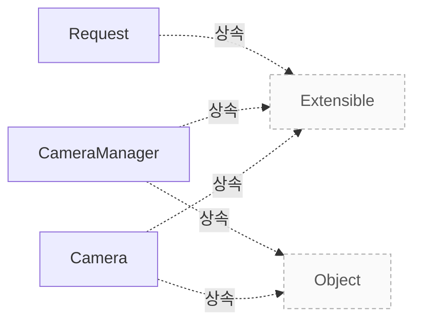

# 카메라와 요청 모델

**클래스의 책임, 요청과 버퍼의 수명, 상태 전이와 종료·동기화 계약을 코드 근거로 확인하세요.**

| 지금 확인할 내용 | 이동할 절 |
|---|---|
| 클래스별 책임 절을 확인합니다. | [클래스별 책임](#클래스별-책임) |
| 상태와 허용 호출 절을 확인합니다. | [상태와 허용 호출](#상태와-허용-호출) |
| 요청 생성과 완료 절을 확인합니다. | [요청 생성과 완료](#요청-생성과-완료) |
| 소유권과 재사용 절을 확인합니다. | [소유권과 재사용](#소유권과-재사용) |
| 오류와 종료 절을 확인합니다. | [오류와 종료](#오류와-종료) |
| 동시성과 실행 확인 절을 확인합니다. | [동시성과 실행 확인](#동시성과-실행-확인) |
| 클래스 관계 절을 확인합니다. | [클래스 관계](#클래스-관계) |
| 관련 클래스 절을 확인합니다. | [관련 클래스](#관련-클래스) |

## 클래스별 책임

CameraManager는 장치를 열거하고 파이프라인과 연결하여 애플리케이션에 카메라를 제공합니다. 동시에 한 인스턴스만 존재해야 하며, 카메라 참조를 모두 해제한 뒤 관리자를 정지해야 합니다. `src/libcamera/camera_manager.cpp:280`

Camera는 단일 이미지 소스의 스트림 구성과 캡처를 제어합니다. create()가 반환하는 shared_ptr로 수명을 관리하며 생성자와 소멸자는 비공개입니다. `src/libcamera/camera.cpp:758`

Request는 프레임별 버퍼와 컨트롤을 묶는 캡처 요청입니다. cookie는 완료 처리에서 외부 자원과 요청을 연결할 수 있도록 애플리케이션이 지정하는 값입니다. `src/libcamera/request.cpp:343`

## 상태와 허용 호출

일반적인 순서는 Available → acquire() → Acquired → configure() → Configured → start() → Running입니다. Configured에서는 재구성과 요청 생성이 가능하고, Running에서는 요청 생성과 큐잉이 가능합니다. `src/libcamera/camera.cpp:769`

Running에서 stop()을 호출하면 Stopping을 거쳐 Configured로 돌아갑니다. Acquired 또는 Configured에서 release()를 호출하면 Available로 돌아갑니다. 이 상태도에 없는 호출까지 금지된 것으로 해석하지 않습니다. `src/libcamera/camera.cpp:769`

start()는 Configured에서만 호출하며, 호출자가 다른 상태 변경 함수와 동기화해야 합니다. 상태 변경 함수 전반의 동기화를 Camera가 대신 보장하지 않습니다. `src/libcamera/camera.cpp:769`, `src/libcamera/camera.cpp:1383`

## 요청 생성과 완료

Configured 또는 Running 상태에서 createRequest()로 빈 요청을 만들고 addBuffer()로 스트림과 버퍼를 연결합니다. 요청에는 최소 하나의 캡처 버퍼가 있어야 합니다. `src/libcamera/camera.cpp:1243`, `src/libcamera/camera.cpp:1308`, `src/libcamera/request.cpp:442`

Running 상태에서 queueRequest()를 호출하여 제출합니다. 완료 시 requestCompleted 신호를 받으며, 요청 소유자인 호출자는 완료 핸들러에서 삭제하거나 reuse()로 초기화한 뒤 다시 사용할 수 있습니다. `src/libcamera/camera.cpp:1308`, `src/libcamera/camera.cpp:1243`

유효한 fence를 addBuffer()에 전달하면 성공한 경우에만 fence가 버퍼로 이동합니다. 모든 버퍼의 fence가 신호를 보내야 장치에 요청을 큐잉할 수 있습니다. `src/libcamera/request.cpp:442`

## 소유권과 재사용

createRequest()가 반환한 요청의 소유권은 호출자에게 있습니다. 요청을 완료 핸들러에서 삭제하거나 Request::reuse()로 초기화하여 재사용합니다. 이 근거만으로 프레임 버퍼 자체의 소유권 이전을 단정하지 않습니다. `src/libcamera/camera.cpp:1243`

reuse()는 요청 상태와 컨트롤·메타데이터를 초기화합니다. ReuseBuffers를 지정하면 기존 버퍼 연결을 재사용하고, 지정하지 않으면 버퍼 맵을 비웁니다. 새 요청 대신 재사용하는 경우 재큐잉 전에 호출합니다. `src/libcamera/request.cpp:376`

fence의 소유권은 addBuffer() 성공 시 버퍼로 이동합니다. 신호를 받지 못해 타임아웃된 fence는 버퍼에 남으므로, 다른 요청에 버퍼를 재사용하기 전에 releaseFence()로 꺼내야 합니다. 실패한 addBuffer() 호출은 전달된 fence를 변경하지 않습니다. `src/libcamera/request.cpp:442`

## 오류와 종료

queueRequest()는 연결이 끊긴 카메라에 -ENODEV, 실행 중이 아닌 카메라에 -EACCES, 다른 카메라의 요청에 -EXDEV를 반환합니다. 유효하지 않은 요청에는 -EINVAL, 처리할 버퍼 메모리가 부족하면 -ENOMEM을 반환한다고 API가 명시합니다. 빈 버퍼 요청은 큐잉하지 않습니다. `src/libcamera/camera.cpp:1308`

stop()은 대기 중인 요청을 오류 상태로 취소하여 동기적으로 완료합니다. 구현은 실행 중이 아니면 즉시 0을 반환하므로, 이 경로가 -EACCES를 반환한다고 해석하면 안 됩니다. `src/libcamera/camera.cpp:1431`

실행 중인 카메라는 CameraStopping으로 전환한 뒤 ConnectionTypeBlocking으로 PipelineHandler::stop을 호출합니다. 대기 요청이 없음을 확인하고 CameraConfigured로 돌아갑니다. 하드웨어별 자원 해제 완료는 별도의 실행 검증이 필요합니다. `src/libcamera/camera.cpp:1431`

## 동시성과 실행 확인

createRequest()와 queueRequest()는 API 주석에 threadsafe로 명시되어 있습니다. 허용 상태는 각각 Configured 또는 Running과 Running이며, 이 보장을 모든 Request 메서드로 확대하지 않습니다. `src/libcamera/camera.cpp:1243`, `src/libcamera/camera.cpp:1308`

start()와 stop()을 다른 상태 변경 함수와 동기화하는 책임은 호출자에게 있습니다. stop() 내부의 파이프라인 호출은 ConnectionTypeBlocking이며 비동기 호출로 설명하면 안 됩니다. `src/libcamera/camera.cpp:1383`, `src/libcamera/camera.cpp:1431`

확인 필요: 이 발췌만으로 requestCompleted 콜백의 실제 실행 스레드, 재진입 가능성, 하드웨어별 종료 시점은 확정하지 않습니다. 해당 연결 방식과 파이프라인 구현을 추가로 검토하고 실행으로 확인해야 합니다. `src/libcamera/camera.cpp:1308`, `src/libcamera/camera.cpp:1431`

<!-- sdd:class-diagram -->
## 클래스 관계

화살표의 글자는 추출한 관계를 나타내며, 점선은 상속입니다. 화살표는 참조 대상 또는 기반 클래스를 향합니다. 호출 순서를 뜻하지 않습니다.

<!-- /sdd:class-diagram -->

## 관련 클래스

| 클래스 | 선언 위치 | 상속 | 책임 (주석) |
|---|---|---|---|
| `libcamera::Camera` | `include/libcamera/camera.h:114` | `libcamera::Object`, `libcamera::Extensible` | 확인 필요 |
| `libcamera::CameraManager` | `include/libcamera/camera_manager.h:24` | `libcamera::Object`, `libcamera::Extensible` | 확인 필요 |
| `libcamera::Request` | `include/libcamera/request.h:29` | `libcamera::Extensible` | 확인 필요 |

??? note "근거와 검토 정보"
    - 근거 파일: `include/libcamera/camera.h`, `include/libcamera/camera_manager.h`, `include/libcamera/request.h`, `src/libcamera/camera.cpp`, `src/libcamera/camera_manager.cpp`, `src/libcamera/request.cpp`
    - 근거 수준: 코드 확인 (정적 분석, simple_compdb 구성, commit `279d355ef8`)
    - 자동 검사 (인용·문장 및 설정된 구조 검사): 통과
    - 검토: 2026-09-24 · ollama/qwen3.5:4b · 사람 검토 전

다음 단계: [Pipeline Handler](pipeline-handler.md)
