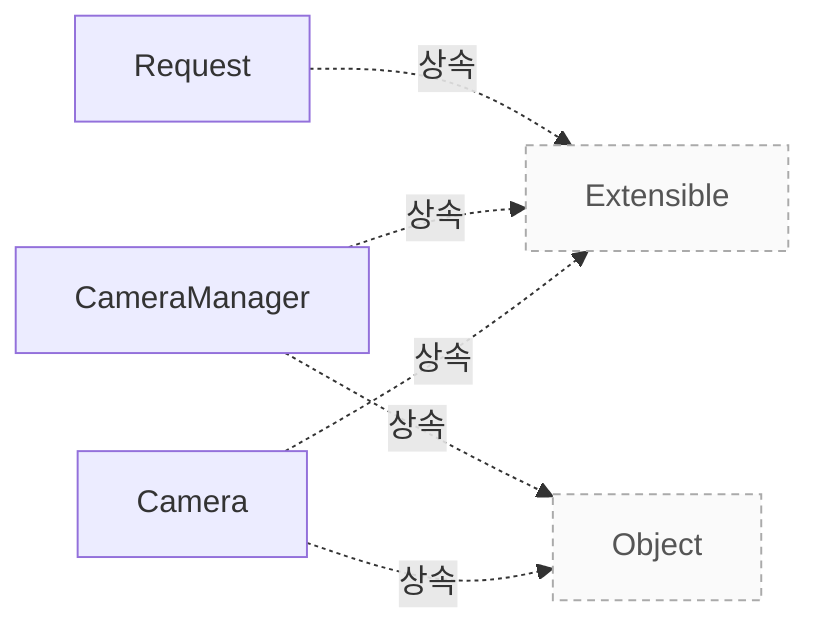

# 카메라와 요청 모델

**클래스의 책임, 요청과 버퍼의 수명, 상태 전이와 종료·동기화 계약을 코드 근거로 확인하세요.**


## 설계 항목과 근거

아래 항목은 소스에 연결된 설명의 작성 범위를 나타냅니다. 설명의 의미와 실제 실행에 대한 승인은 별도 검토가 필요합니다.

| 설계 질문 | 설명 위치 | 확인 범위 |
|---|---|---|
| CameraManager, Camera, Request의 책임과 객체 수명은 어떻게 나뉩니까? | [클래스별 책임](#클래스별-책임) | 코드 근거와 설명 연결 |
| 상태 전이와 허용 호출을 설명하고, 상태를 바꾸는 함수의 동기화 책임을 구분하세요. | [상태와 허용 호출](#상태와-허용-호출) | 코드 근거와 설명 연결 |
| 요청 생성, 버퍼 연결, 큐잉, 완료 통지의 순서와 제출 조건을 설명하세요. | [요청 생성과 완료](#요청-생성과-완료) | 코드 근거와 설명 연결 |
| 요청 소유권과 완료 뒤 재사용, ReuseBuffers, fence 이전 조건을 설명하세요. 근거에 없는 버퍼 소유권은 추정하지 마세요. | [소유권과 재사용](#소유권과-재사용) | 코드 근거와 설명 연결 |
| queueRequest의 오류 조건과 stop의 취소·완료·복귀 상태를 설명하세요. | [오류와 종료](#오류와-종료) | 코드 근거와 설명 연결 |
| threadsafe 보장, 호출자의 동기화 책임과 파이프라인의 완료 통지 계약을 구분하세요. 애플리케이션 콜백 전달 방식과 실기기 검증은 별도로 확인하세요. | [동시성과 실행 확인](#동시성과-실행-확인) | 코드 근거와 설명 연결 · 실행 확인 항목 별도 |

## 클래스별 책임

CameraManager는 장치를 열거하고 파이프라인과 연결하여 애플리케이션에 카메라를 제공합니다. 동시에 한 인스턴스만 존재해야 하며, 카메라 참조를 모두 해제한 뒤 관리자를 정지해야 합니다. `src/libcamera/camera_manager.cpp:280`

Camera는 단일 이미지 소스의 스트림 구성과 캡처를 제어합니다. create()가 반환하는 shared_ptr로 수명을 관리하며 생성자와 소멸자는 비공개입니다. `src/libcamera/camera.cpp:758`

Request는 프레임별 버퍼와 컨트롤을 묶는 캡처 요청입니다. cookie는 완료 처리에서 외부 자원과 요청을 연결할 수 있도록 애플리케이션이 지정하는 값입니다. `src/libcamera/request.cpp:343`

??? note "소스 근거: manager"
    `src/libcamera/camera_manager.cpp:280`에서 시작하는 발췌입니다. 종료 줄은 304이며, 아래 원문을 설명과 대조할 수 있습니다.
    
    SHA-256: `adcd6d49b0c989ec78a81cacece7f6c871a8e0ddf3aa52e42648fae2760a6e84`
    
    ```text
    \class CameraManager
     * \brief Provide access and manage all cameras in the system
     *
     * The camera manager is the entry point to libcamera. It enumerates devices,
     * associates them with pipeline managers, and provides access to the cameras
     * in the system to applications. The manager owns all Camera objects and
     * handles hot-plugging and hot-unplugging to manage the lifetime of cameras.
     *
     * To interact with libcamera, an application starts by creating a camera
     * manager instance. Only a single instance of the camera manager may exist at
     * a time. Attempting to create a second instance without first deleting the
     * existing instance results in undefined behaviour.
     *
     * The manager is initially stopped, and shall be started with start(). This
     * will enumerate all the cameras present in the system, which can then be
     * listed with list() and retrieved with get().
     *
     * Cameras are shared through std::shared_ptr<>, ensuring that a camera will
     * stay valid until the last reference is released without requiring any special
     * action from the application. Once the application has released all the
     * references it held to cameras, the camera manager can be stopped with
     * stop().
     */
    
    CameraManager *CameraManager::self_
    ```

??? note "소스 근거: camera"
    `src/libcamera/camera.cpp:758`에서 시작하는 발췌입니다. 종료 줄은 769이며, 아래 원문을 설명과 대조할 수 있습니다.
    
    SHA-256: `e77cee469b7c57430e4bd4b0f08493289c46b57549873521c476df388d591dc2`
    
    ```text
    The Camera class models a camera capable of producing one or more image
     * streams from a single image source. It provides the main interface to
     * configuring and controlling the device, and capturing image streams. It is
     * the central object exposed by libcamera.
     *
     * To support the central nature of Camera objects, libcamera manages the
     * lifetime of camera instances with std::shared_ptr<>. Instances shall be
     * created with the create() function which returns a shared pointer. The
     * Camera constructors and destructor are private, to prevent instances from
     * being constructed and destroyed manually.
     *
     * \section camera_operation
    ```

??? note "소스 근거: request"
    `src/libcamera/request.cpp:343`에서 시작하는 발췌입니다. 종료 줄은 360이며, 아래 원문을 설명과 대조할 수 있습니다.
    
    SHA-256: `948968e35cb0d98957bc63aa2d6b613d2a8203e66855db23974f035e9d679764`
    
    ```text
    \class Request
     * \brief A frame capture request
     *
     * A Request allows an application to associate buffers and controls on a
     * per-frame basis to be queued to the camera device for processing.
     */
    
    /**
     * \brief Create a capture request for a camera
     * \param[in] camera The camera that creates the request
     * \param[in] cookie Opaque cookie for application use
     *
     * The \a cookie is stored in the request and is accessible through the
     * cookie() function at any time. It is typically used by applications to map
     * the request to an external resource in the request completion handler, and is
     * completely opaque to libcamera.
     */
    Request::Request(Camera *camera, uint64_t cookie)
    ```

## 상태와 허용 호출

일반적인 순서는 Available → acquire() → Acquired → configure() → Configured → start() → Running입니다. Configured에서는 재구성과 요청 생성이 가능하고, Running에서는 요청 생성과 큐잉이 가능합니다. `src/libcamera/camera.cpp:769`

Running에서 stop()을 호출하면 Stopping을 거쳐 Configured로 돌아갑니다. Acquired 또는 Configured에서 release()를 호출하면 Available로 돌아갑니다. 현재 상태에서 허용되지 않은 연산의 동작은 정의되지 않으며, 상태도에 아예 없는 연산은 모든 상태에서 허용됩니다. `src/libcamera/camera.cpp:769`

start()는 Configured에서만 호출하며, 호출자가 다른 상태 변경 함수와 동기화해야 합니다. 상태 변경 함수 전반의 동기화를 Camera가 대신 보장하지 않습니다. `src/libcamera/camera.cpp:769`, `src/libcamera/camera.cpp:1383`

??? note "소스 근거: states"
    `src/libcamera/camera.cpp:769`에서 시작하는 발췌입니다. 종료 줄은 814이며, 아래 원문을 설명과 대조할 수 있습니다.
    
    SHA-256: `e85796df194551ecbd587ba1a7bb356a1409fa1d606762865e7eb989c92d2f72`
    
    ```text
    \section camera_operation Operating the Camera
     *
     * An application needs to perform a sequence of operations on a camera before
     * it is ready to process requests. The camera needs to be acquired and
     * configured to prepare the camera for capture. Once started the camera can
     * process requests until it is stopped. When an application is done with a
     * camera, the camera needs to be released.
     *
     * An application may start and stop a camera multiple times as long as it is
     * not released. The camera may also be reconfigured.
     *
     * Functions that affect the camera state as defined below are generally not
     * synchronized with each other by the Camera class. The caller is responsible
     * for ensuring their synchronization if necessary.
     *
     * \subsection Camera States
     *
     * To help manage the sequence of operations needed to control the camera a set
     * of states are defined. Each state describes which operations may be performed
     * on the camera. Performing an operation not allowed in the camera state
     * results in undefined behaviour. Operations not listed at all in the state
     * diagram are allowed in all states.
     *
     * \dot
     * digraph camera_state_machine {
     *   node [shape = doublecircle ]; Available;
     *   node [shape = circle ]; Acquired;
     *   node [shape = circle ]; Configured;
     *   node [shape = circle ]; Stopping;
     *   node [shape = circle ]; Running;
     *
     *   Available -> Available [label = "release()"];
     *   Available -> Acquired [label = "acquire()"];
     *
     *   Acquired -> Available [label = "release()"];
     *   Acquired -> Configured [label = "configure()"];
     *
     *   Configured -> Available [label = "release()"];
     *   Configured -> Configured [label = "configure(), createRequest()"];
     *   Configured -> Running [label = "start()"];
     *
     *   Running -> Stopping [label = "stop()"];
     *   Stopping -> Configured;
     *   Running -> Running [label = "createRequest(), queueRequest()"];
     * }
     * \enddot
    ```

??? note "소스 근거: start"
    `src/libcamera/camera.cpp:1383`에서 시작하는 발췌입니다. 종료 줄은 1400이며, 아래 원문을 설명과 대조할 수 있습니다.
    
    SHA-256: `e0abda64dc6b1bdd78d1326c8dd8651e842c03181dcf28e3b8b7eac1a4c70fcf`
    
    ```text
    \brief Start capture from camera
     * \param[in] controls Controls to be applied before starting the Camera
     *
     * Start the camera capture session, optionally providing a list of controls to
     * apply before starting. Once the camera is started the application can queue
     * requests to the camera to process and return to the application until the
     * capture session is terminated with \a stop().
     *
     * \context This function may only be called when the camera is in the
     * Configured state as defined in \ref camera_operation, and shall be
     * synchronized by the caller with other functions that affect the camera
     * state.
     *
     * \return 0 on success or a negative error code otherwise
     * \retval -ENODEV The camera has been disconnected from the system
     * \retval -EACCES The camera is not in a state where it can be started
     */
    int Camera::start(const ControlList *controls)
    ```

## 요청 생성과 완료

Configured 또는 Running 상태에서 createRequest()로 빈 요청을 만들고 addBuffer()로 스트림과 버퍼를 연결합니다. 요청에는 최소 하나의 캡처 버퍼가 있어야 합니다. `src/libcamera/camera.cpp:1243`, `src/libcamera/camera.cpp:1308`, `src/libcamera/request.cpp:442`

Running 상태에서 queueRequest()를 호출하여 제출합니다. 완료 시 requestCompleted 신호를 받으며, 요청 소유자인 호출자는 완료 핸들러에서 삭제하거나 reuse()로 초기화한 뒤 다시 사용할 수 있습니다. `src/libcamera/camera.cpp:1308`, `src/libcamera/camera.cpp:1243`

`queueRequest()`는 검사를 통과한 요청을 `ConnectionTypeQueued`로 PipelineHandler에 전달합니다. 반환값 0은 이 큐잉을 마쳤다는 뜻이며, 장치 제출이나 캡처 완료를 보장하지 않습니다. `src/libcamera/camera.cpp:1308`

유효한 fence를 addBuffer()에 전달하면 성공한 경우에만 fence가 버퍼로 이동합니다. 모든 버퍼의 fence가 신호를 보내야 장치에 요청을 큐잉할 수 있습니다. `src/libcamera/request.cpp:442`

??? note "소스 근거: create"
    `src/libcamera/camera.cpp:1243`에서 시작하는 발췌입니다. 종료 줄은 1263이며, 아래 원문을 설명과 대조할 수 있습니다.
    
    SHA-256: `9f251ecf5ba569606e9753d3619b88e1aef5a4ce15f816ae97efd283e34b823b`
    
    ```text
    \brief Create a request object for the camera
     * \param[in] cookie Opaque cookie for application use
     *
     * This function creates an empty request for the application to fill with
     * buffers and parameters, and queue for capture.
     *
     * The \a cookie is stored in the request and is accessible through the
     * Request::cookie() function at any time. It is typically used by applications
     * to map the request to an external resource in the request completion
     * handler, and is completely opaque to libcamera.
     *
     * The ownership of the returned request is passed to the caller, which is
     * responsible for deleting it. The request may be deleted in the completion
     * handler, or reused after resetting its state with Request::reuse().
     *
     * \context This function is \threadsafe. It may only be called when the camera
     * is in the Configured or Running state as defined in \ref camera_operation.
     *
     * \return A pointer to the newly created request, or nullptr on error
     */
    std::unique_ptr<Request> Camera::createRequest(uint64_t cookie)
    ```

??? note "소스 근거: queue"
    `src/libcamera/camera.cpp:1308`에서 시작하는 발췌입니다. 종료 줄은 1383이며, 아래 원문을 설명과 대조할 수 있습니다.
    
    SHA-256: `96db61baeb32065c966b20942f97518ddbd3a43b36b64e8083eb29a90ecb7f4b`
    
    ```text
    \brief Queue a request to the camera
     * \param[in] request The request to queue to the camera
     *
     * This function queues a \a request to the camera for capture.
     *
     * After allocating the request with createRequest(), the application shall
     * fill it with at least one capture buffer before queuing it. Requests that
     * contain no buffers are invalid and are rejected without being queued.
     *
     * Once the request has been queued, the camera will notify its completion
     * through the \ref requestCompleted signal.
     *
     * \context This function is \threadsafe. It may only be called when the camera
     * is in the Running state as defined in \ref camera_operation.
     *
     * \return 0 on success or a negative error code otherwise
     * \retval -ENODEV The camera has been disconnected from the system
     * \retval -EACCES The camera is not running so requests can't be queued
     * \retval -EXDEV The request does not belong to this camera
     * \retval -EINVAL The request is invalid
     * \retval -ENOMEM No buffer memory was available to handle the request
     */
    int Camera::queueRequest(Request *request)
    {
    	Private *const d = _d();
    
    	int ret = d->isAccessAllowed(Private::CameraRunning);
    	if (ret < 0)
    		return ret;
    
    	/* Requests can only be queued to the camera that created them. */
    	if (request->_d()->camera() != this) {
    		LOG(Camera, Error) << "Request was not created by this camera";
    		return -EXDEV;
    	}
    
    	if (request->status() != Request::RequestPending) {
    		LOG(Camera, Error) << request->toString() << " is not valid";
    		return -EINVAL;
    	}
    
    	/* Make sure the Request has a valid control list. */
    	if (request->controls().infoMap() != &controls()) {
    		LOG(Camera, Error) << "Overwriting Request::controls() is not allowed";
    		return -EINVAL;
    	}
    
    	/*
    	 * The camera state may change until the end of the function. No locking
    	 * is however needed as PipelineHandler::queueRequest() will handle
    	 * this.
    	 */
    
    	if (request->buffers().empty()) {
    		LOG(Camera, Error) << "Request contains no buffers";
    		return -EINVAL;
    	}
    
    	for (const auto &[stream, buffer] : request->buffers()) {
    		if (d->activeStreams_.find(stream) == d->activeStreams_.end()) {
    			LOG(Camera, Error) << "Invalid request";
    			return -EINVAL;
    		}
    	}
    
    	/* Pre-process AeEnable. */
    	patchControlList(request->controls());
    
    	d->pipe_->invokeMethod(&PipelineHandler::queueRequest,
    			       ConnectionTypeQueued, request);
    
    	return 0;
    }
    
    /**
     * \brief Start capture from camera
    ```

??? note "소스 근거: buffer"
    `src/libcamera/request.cpp:442`에서 시작하는 발췌입니다. 종료 줄은 475이며, 아래 원문을 설명과 대조할 수 있습니다.
    
    SHA-256: `65cd8b0501b7f6545dd10eaaec4a4fe46c52a096a3bbd94ea6b4813e4a670876`
    
    ```text
    \brief Add a FrameBuffer with its associated Stream to the Request
     * \param[in] stream The stream the buffer belongs to
     * \param[in] buffer The FrameBuffer to add to the request
     * \param[in] fence The optional fence
     *
     * A reference to the buffer is stored in the request. The caller is responsible
     * for ensuring that the buffer will remain valid until the request complete
     * callback is called.
     *
     * A request can only contain one buffer per stream. If a buffer has already
     * been added to the request for the same stream, this function returns -EEXIST.
     *
     * A Fence can be optionally associated with the \a buffer.
     *
     * When a valid Fence is provided to this function, \a fence is moved to \a
     * buffer and this Request will only be queued to the device once the
     * fences of all its buffers have been correctly signalled. Ownership of the
     * fence will only be taken in case of success, otherwise the fence will
     * be left unmodified.
     *
     * If the \a fence associated with \a buffer isn't signalled, the request will
     * fail after a timeout. The buffer will still contain the fence, which
     * applications must retrieve with FrameBuffer::releaseFence() before the buffer
     * can be reused in another request. Attempting to add a buffer that still
     * contains a fence to a request will result in this function returning -EEXIST.
     *
     * \sa FrameBuffer::releaseFence()
     *
     * \return 0 on success or a negative error code otherwise
     * \retval -EEXIST The request already contains a buffer for the stream
     *  or the buffer still references a fence
     * \retval -EINVAL The buffer does not reference a valid Stream
     */
    int Request::addBuffer(const Stream *stream, FrameBuffer *buffer,
    ```

## 소유권과 재사용

createRequest()가 반환한 요청의 소유권은 호출자에게 있습니다. 요청을 완료 핸들러에서 삭제하거나 Request::reuse()로 초기화하여 재사용합니다. `src/libcamera/camera.cpp:1243`

`addBuffer()`는 버퍼의 참조를 요청에 저장합니다. 호출자는 요청 완료 콜백이 호출될 때까지 해당 버퍼가 유효하도록 보장해야 합니다. 스트림 하나에 버퍼 하나만 연결할 수 있으며, 같은 스트림에 이미 버퍼가 있거나 버퍼에 fence가 남아 있으면 `-EEXIST`를 반환합니다. `src/libcamera/request.cpp:442`

reuse()는 요청 상태와 컨트롤·메타데이터를 초기화합니다. ReuseBuffers를 지정하면 기존 버퍼 연결을 재사용하고, 지정하지 않으면 버퍼 맵을 비웁니다. 새 요청 대신 재사용하는 경우 재큐잉 전에 호출합니다. `src/libcamera/request.cpp:376`

fence의 소유권은 addBuffer() 성공 시 버퍼로 이동합니다. 신호를 받지 못해 타임아웃된 fence는 버퍼에 남으므로, 다른 요청에 버퍼를 재사용하기 전에 releaseFence()로 꺼내야 합니다. 실패한 addBuffer() 호출은 전달된 fence를 변경하지 않습니다. `src/libcamera/request.cpp:442`

??? note "소스 근거: create"
    `src/libcamera/camera.cpp:1243`에서 시작하는 발췌입니다. 종료 줄은 1263이며, 아래 원문을 설명과 대조할 수 있습니다.
    
    SHA-256: `9f251ecf5ba569606e9753d3619b88e1aef5a4ce15f816ae97efd283e34b823b`
    
    ```text
    \brief Create a request object for the camera
     * \param[in] cookie Opaque cookie for application use
     *
     * This function creates an empty request for the application to fill with
     * buffers and parameters, and queue for capture.
     *
     * The \a cookie is stored in the request and is accessible through the
     * Request::cookie() function at any time. It is typically used by applications
     * to map the request to an external resource in the request completion
     * handler, and is completely opaque to libcamera.
     *
     * The ownership of the returned request is passed to the caller, which is
     * responsible for deleting it. The request may be deleted in the completion
     * handler, or reused after resetting its state with Request::reuse().
     *
     * \context This function is \threadsafe. It may only be called when the camera
     * is in the Configured or Running state as defined in \ref camera_operation.
     *
     * \return A pointer to the newly created request, or nullptr on error
     */
    std::unique_ptr<Request> Camera::createRequest(uint64_t cookie)
    ```

??? note "소스 근거: reuse"
    `src/libcamera/request.cpp:376`에서 시작하는 발췌입니다. 종료 줄은 407이며, 아래 원문을 설명과 대조할 수 있습니다.
    
    SHA-256: `22294a6809bd4c6655824af9603fb3879603cec256c6845e00d3d2a0e6bf7679`
    
    ```text
    \brief Reset the request for reuse
     * \param[in] flags Indicate whether or not to reuse the buffers
     *
     * Reset the status and controls associated with the request, to allow it to
     * be reused and requeued without destruction. This function shall be called
     * prior to queueing the request to the camera, in lieu of constructing a new
     * request. The application can reuse the buffers that were previously added
     * to the request via addBuffer() by setting \a flags to ReuseBuffers.
     */
    void Request::reuse(ReuseFlag flags)
    {
    	LIBCAMERA_TRACEPOINT(request_reuse, this);
    
    	_d()->reset();
    
    	if (flags & ReuseBuffers) {
    		for (const auto &[stream, buffer] : bufferMap_) {
    			buffer->_d()->setRequest(this);
    			_d()->pending_.insert(buffer);
    		}
    	} else {
    		bufferMap_.clear();
    	}
    
    	status_ = RequestPending;
    
    	controls_.clear();
    	_d()->metadata_.clear();
    }
    
    /**
     * \fn Request::controls()
    ```

??? note "소스 근거: buffer"
    `src/libcamera/request.cpp:442`에서 시작하는 발췌입니다. 종료 줄은 475이며, 아래 원문을 설명과 대조할 수 있습니다.
    
    SHA-256: `65cd8b0501b7f6545dd10eaaec4a4fe46c52a096a3bbd94ea6b4813e4a670876`
    
    ```text
    \brief Add a FrameBuffer with its associated Stream to the Request
     * \param[in] stream The stream the buffer belongs to
     * \param[in] buffer The FrameBuffer to add to the request
     * \param[in] fence The optional fence
     *
     * A reference to the buffer is stored in the request. The caller is responsible
     * for ensuring that the buffer will remain valid until the request complete
     * callback is called.
     *
     * A request can only contain one buffer per stream. If a buffer has already
     * been added to the request for the same stream, this function returns -EEXIST.
     *
     * A Fence can be optionally associated with the \a buffer.
     *
     * When a valid Fence is provided to this function, \a fence is moved to \a
     * buffer and this Request will only be queued to the device once the
     * fences of all its buffers have been correctly signalled. Ownership of the
     * fence will only be taken in case of success, otherwise the fence will
     * be left unmodified.
     *
     * If the \a fence associated with \a buffer isn't signalled, the request will
     * fail after a timeout. The buffer will still contain the fence, which
     * applications must retrieve with FrameBuffer::releaseFence() before the buffer
     * can be reused in another request. Attempting to add a buffer that still
     * contains a fence to a request will result in this function returning -EEXIST.
     *
     * \sa FrameBuffer::releaseFence()
     *
     * \return 0 on success or a negative error code otherwise
     * \retval -EEXIST The request already contains a buffer for the stream
     *  or the buffer still references a fence
     * \retval -EINVAL The buffer does not reference a valid Stream
     */
    int Request::addBuffer(const Stream *stream, FrameBuffer *buffer,
    ```

## 오류와 종료

queueRequest()는 연결이 끊긴 카메라에 -ENODEV, 실행 중이 아닌 카메라에 -EACCES, 다른 카메라의 요청에 -EXDEV를 반환합니다. 유효하지 않은 요청에는 -EINVAL, 처리할 버퍼 메모리가 부족하면 -ENOMEM을 반환한다고 API가 명시합니다. 빈 버퍼 요청은 큐잉하지 않습니다. `src/libcamera/camera.cpp:1308`

stop()은 대기 중인 요청을 오류 상태로 취소하여 동기적으로 완료합니다. 구현은 실행 중이 아니면 즉시 0을 반환하므로, 이 경로가 -EACCES를 반환한다고 해석하면 안 됩니다. `src/libcamera/camera.cpp:1431`

실행 중인 카메라는 CameraStopping으로 전환한 뒤 ConnectionTypeBlocking으로 PipelineHandler::stop을 호출합니다. 대기 요청이 없음을 확인하고 CameraConfigured로 돌아갑니다. 하드웨어별 자원 해제 완료는 별도의 실행 검증이 필요합니다. `src/libcamera/camera.cpp:1431`

??? note "소스 근거: queue"
    `src/libcamera/camera.cpp:1308`에서 시작하는 발췌입니다. 종료 줄은 1383이며, 아래 원문을 설명과 대조할 수 있습니다.
    
    SHA-256: `96db61baeb32065c966b20942f97518ddbd3a43b36b64e8083eb29a90ecb7f4b`
    
    ```text
    \brief Queue a request to the camera
     * \param[in] request The request to queue to the camera
     *
     * This function queues a \a request to the camera for capture.
     *
     * After allocating the request with createRequest(), the application shall
     * fill it with at least one capture buffer before queuing it. Requests that
     * contain no buffers are invalid and are rejected without being queued.
     *
     * Once the request has been queued, the camera will notify its completion
     * through the \ref requestCompleted signal.
     *
     * \context This function is \threadsafe. It may only be called when the camera
     * is in the Running state as defined in \ref camera_operation.
     *
     * \return 0 on success or a negative error code otherwise
     * \retval -ENODEV The camera has been disconnected from the system
     * \retval -EACCES The camera is not running so requests can't be queued
     * \retval -EXDEV The request does not belong to this camera
     * \retval -EINVAL The request is invalid
     * \retval -ENOMEM No buffer memory was available to handle the request
     */
    int Camera::queueRequest(Request *request)
    {
    	Private *const d = _d();
    
    	int ret = d->isAccessAllowed(Private::CameraRunning);
    	if (ret < 0)
    		return ret;
    
    	/* Requests can only be queued to the camera that created them. */
    	if (request->_d()->camera() != this) {
    		LOG(Camera, Error) << "Request was not created by this camera";
    		return -EXDEV;
    	}
    
    	if (request->status() != Request::RequestPending) {
    		LOG(Camera, Error) << request->toString() << " is not valid";
    		return -EINVAL;
    	}
    
    	/* Make sure the Request has a valid control list. */
    	if (request->controls().infoMap() != &controls()) {
    		LOG(Camera, Error) << "Overwriting Request::controls() is not allowed";
    		return -EINVAL;
    	}
    
    	/*
    	 * The camera state may change until the end of the function. No locking
    	 * is however needed as PipelineHandler::queueRequest() will handle
    	 * this.
    	 */
    
    	if (request->buffers().empty()) {
    		LOG(Camera, Error) << "Request contains no buffers";
    		return -EINVAL;
    	}
    
    	for (const auto &[stream, buffer] : request->buffers()) {
    		if (d->activeStreams_.find(stream) == d->activeStreams_.end()) {
    			LOG(Camera, Error) << "Invalid request";
    			return -EINVAL;
    		}
    	}
    
    	/* Pre-process AeEnable. */
    	patchControlList(request->controls());
    
    	d->pipe_->invokeMethod(&PipelineHandler::queueRequest,
    			       ConnectionTypeQueued, request);
    
    	return 0;
    }
    
    /**
     * \brief Start capture from camera
    ```

??? note "소스 근거: stop"
    `src/libcamera/camera.cpp:1431`에서 시작하는 발췌입니다. 종료 줄은 1475이며, 아래 원문을 설명과 대조할 수 있습니다.
    
    SHA-256: `0009c665993b995489738e48affc81643a7159d82b5326e5f182e30fe11e4901`
    
    ```text
    \brief Stop capture from camera
     *
     * This function stops capturing and processing requests immediately. All
     * pending requests are cancelled and complete synchronously in an error state.
     *
     * \context This function may be called in any camera state as defined in \ref
     * camera_operation, and shall be synchronized by the caller with other
     * functions that affect the camera state. If called when the camera isn't
     * running, it is a no-op.
     *
     * \return 0 on success or a negative error code otherwise
     * \retval -ENODEV The camera has been disconnected from the system
     * \retval -EACCES The camera is not running so can't be stopped
     */
    int Camera::stop()
    {
    	Private *const d = _d();
    
    	/*
    	 * \todo Make calling stop() when not in 'Running' part of the state
    	 * machine rather than take this shortcut
    	 */
    	if (!d->isRunning())
    		return 0;
    
    	int ret = d->isAccessAllowed(Private::CameraRunning);
    	if (ret < 0)
    		return ret;
    
    	LOG(Camera, Debug) << "Stopping capture";
    
    	d->setState(Private::CameraStopping);
    
    	d->pipe_->invokeMethod(&PipelineHandler::stop, ConnectionTypeBlocking,
    			       this);
    
    	ASSERT(!d->pipe_->hasPendingRequests(this));
    
    	d->setState(Private::CameraConfigured);
    
    	return 0;
    }
    
    /**
     * \brief Handle request completion and notify application
    ```

## 동시성과 실행 확인

createRequest()와 queueRequest()는 API 주석에 threadsafe로 명시되어 있습니다. 허용 상태는 각각 Configured 또는 Running과 Running이며, 이 보장을 모든 Request 메서드로 확대하지 않습니다. `src/libcamera/camera.cpp:1243`, `src/libcamera/camera.cpp:1308`

start()와 stop()을 다른 상태 변경 함수와 동기화하는 책임은 호출자에게 있습니다. stop() 내부의 파이프라인 호출은 ConnectionTypeBlocking이며 비동기 호출로 설명하면 안 됩니다. `src/libcamera/camera.cpp:1383`, `src/libcamera/camera.cpp:1431`

실행 확인 항목: 확인 필요: 이 발췌만으로 requestCompleted 콜백의 실제 실행 스레드, 재진입 가능성, 하드웨어별 종료 시점은 확정하지 않습니다. 해당 연결 방식과 파이프라인 구현을 추가로 검토하고 실행으로 확인해야 합니다. `src/libcamera/camera.cpp:1308`, `src/libcamera/camera.cpp:1431`

`PipelineHandler::completeRequest()`는 CameraManager 스레드에서 호출해야 합니다. 요청은 애플리케이션에 제출 순서대로 반환되며, 함수가 돌아온 뒤 파이프라인은 해당 요청에 접근해서는 안 됩니다. 이 호출 문맥을 모든 애플리케이션 콜백의 실행 스레드 보장으로 확대하지 않습니다. `src/libcamera/pipeline_handler.cpp:547`

??? note "소스 근거: create"
    `src/libcamera/camera.cpp:1243`에서 시작하는 발췌입니다. 종료 줄은 1263이며, 아래 원문을 설명과 대조할 수 있습니다.
    
    SHA-256: `9f251ecf5ba569606e9753d3619b88e1aef5a4ce15f816ae97efd283e34b823b`
    
    ```text
    \brief Create a request object for the camera
     * \param[in] cookie Opaque cookie for application use
     *
     * This function creates an empty request for the application to fill with
     * buffers and parameters, and queue for capture.
     *
     * The \a cookie is stored in the request and is accessible through the
     * Request::cookie() function at any time. It is typically used by applications
     * to map the request to an external resource in the request completion
     * handler, and is completely opaque to libcamera.
     *
     * The ownership of the returned request is passed to the caller, which is
     * responsible for deleting it. The request may be deleted in the completion
     * handler, or reused after resetting its state with Request::reuse().
     *
     * \context This function is \threadsafe. It may only be called when the camera
     * is in the Configured or Running state as defined in \ref camera_operation.
     *
     * \return A pointer to the newly created request, or nullptr on error
     */
    std::unique_ptr<Request> Camera::createRequest(uint64_t cookie)
    ```

??? note "소스 근거: queue"
    `src/libcamera/camera.cpp:1308`에서 시작하는 발췌입니다. 종료 줄은 1383이며, 아래 원문을 설명과 대조할 수 있습니다.
    
    SHA-256: `96db61baeb32065c966b20942f97518ddbd3a43b36b64e8083eb29a90ecb7f4b`
    
    ```text
    \brief Queue a request to the camera
     * \param[in] request The request to queue to the camera
     *
     * This function queues a \a request to the camera for capture.
     *
     * After allocating the request with createRequest(), the application shall
     * fill it with at least one capture buffer before queuing it. Requests that
     * contain no buffers are invalid and are rejected without being queued.
     *
     * Once the request has been queued, the camera will notify its completion
     * through the \ref requestCompleted signal.
     *
     * \context This function is \threadsafe. It may only be called when the camera
     * is in the Running state as defined in \ref camera_operation.
     *
     * \return 0 on success or a negative error code otherwise
     * \retval -ENODEV The camera has been disconnected from the system
     * \retval -EACCES The camera is not running so requests can't be queued
     * \retval -EXDEV The request does not belong to this camera
     * \retval -EINVAL The request is invalid
     * \retval -ENOMEM No buffer memory was available to handle the request
     */
    int Camera::queueRequest(Request *request)
    {
    	Private *const d = _d();
    
    	int ret = d->isAccessAllowed(Private::CameraRunning);
    	if (ret < 0)
    		return ret;
    
    	/* Requests can only be queued to the camera that created them. */
    	if (request->_d()->camera() != this) {
    		LOG(Camera, Error) << "Request was not created by this camera";
    		return -EXDEV;
    	}
    
    	if (request->status() != Request::RequestPending) {
    		LOG(Camera, Error) << request->toString() << " is not valid";
    		return -EINVAL;
    	}
    
    	/* Make sure the Request has a valid control list. */
    	if (request->controls().infoMap() != &controls()) {
    		LOG(Camera, Error) << "Overwriting Request::controls() is not allowed";
    		return -EINVAL;
    	}
    
    	/*
    	 * The camera state may change until the end of the function. No locking
    	 * is however needed as PipelineHandler::queueRequest() will handle
    	 * this.
    	 */
    
    	if (request->buffers().empty()) {
    		LOG(Camera, Error) << "Request contains no buffers";
    		return -EINVAL;
    	}
    
    	for (const auto &[stream, buffer] : request->buffers()) {
    		if (d->activeStreams_.find(stream) == d->activeStreams_.end()) {
    			LOG(Camera, Error) << "Invalid request";
    			return -EINVAL;
    		}
    	}
    
    	/* Pre-process AeEnable. */
    	patchControlList(request->controls());
    
    	d->pipe_->invokeMethod(&PipelineHandler::queueRequest,
    			       ConnectionTypeQueued, request);
    
    	return 0;
    }
    
    /**
     * \brief Start capture from camera
    ```

??? note "소스 근거: start"
    `src/libcamera/camera.cpp:1383`에서 시작하는 발췌입니다. 종료 줄은 1400이며, 아래 원문을 설명과 대조할 수 있습니다.
    
    SHA-256: `e0abda64dc6b1bdd78d1326c8dd8651e842c03181dcf28e3b8b7eac1a4c70fcf`
    
    ```text
    \brief Start capture from camera
     * \param[in] controls Controls to be applied before starting the Camera
     *
     * Start the camera capture session, optionally providing a list of controls to
     * apply before starting. Once the camera is started the application can queue
     * requests to the camera to process and return to the application until the
     * capture session is terminated with \a stop().
     *
     * \context This function may only be called when the camera is in the
     * Configured state as defined in \ref camera_operation, and shall be
     * synchronized by the caller with other functions that affect the camera
     * state.
     *
     * \return 0 on success or a negative error code otherwise
     * \retval -ENODEV The camera has been disconnected from the system
     * \retval -EACCES The camera is not in a state where it can be started
     */
    int Camera::start(const ControlList *controls)
    ```

??? note "소스 근거: stop"
    `src/libcamera/camera.cpp:1431`에서 시작하는 발췌입니다. 종료 줄은 1475이며, 아래 원문을 설명과 대조할 수 있습니다.
    
    SHA-256: `0009c665993b995489738e48affc81643a7159d82b5326e5f182e30fe11e4901`
    
    ```text
    \brief Stop capture from camera
     *
     * This function stops capturing and processing requests immediately. All
     * pending requests are cancelled and complete synchronously in an error state.
     *
     * \context This function may be called in any camera state as defined in \ref
     * camera_operation, and shall be synchronized by the caller with other
     * functions that affect the camera state. If called when the camera isn't
     * running, it is a no-op.
     *
     * \return 0 on success or a negative error code otherwise
     * \retval -ENODEV The camera has been disconnected from the system
     * \retval -EACCES The camera is not running so can't be stopped
     */
    int Camera::stop()
    {
    	Private *const d = _d();
    
    	/*
    	 * \todo Make calling stop() when not in 'Running' part of the state
    	 * machine rather than take this shortcut
    	 */
    	if (!d->isRunning())
    		return 0;
    
    	int ret = d->isAccessAllowed(Private::CameraRunning);
    	if (ret < 0)
    		return ret;
    
    	LOG(Camera, Debug) << "Stopping capture";
    
    	d->setState(Private::CameraStopping);
    
    	d->pipe_->invokeMethod(&PipelineHandler::stop, ConnectionTypeBlocking,
    			       this);
    
    	ASSERT(!d->pipe_->hasPendingRequests(this));
    
    	d->setState(Private::CameraConfigured);
    
    	return 0;
    }
    
    /**
     * \brief Handle request completion and notify application
    ```

??? note "소스 근거: completion"
    `src/libcamera/pipeline_handler.cpp:547`에서 시작하는 발췌입니다. 종료 줄은 620이며, 아래 원문을 설명과 대조할 수 있습니다.
    
    SHA-256: `514288cc958de9ff5fd19d46393cec3bb3088f4f08486528d4559071138638c9`
    
    ```text
    \brief Complete a buffer for a request
     * \param[in] request The request the buffer belongs to
     * \param[in] buffer The buffer that has completed
     *
     * This function shall be called by pipeline handlers to signal completion of
     * the \a buffer part of the \a request. It notifies applications of buffer
     * completion and updates the request's internal buffer tracking. The request
     * is not completed automatically when the last buffer completes to give
     * pipeline handlers a chance to perform any operation that may still be
     * needed. They shall complete requests explicitly with completeRequest().
     *
     * \context This function shall be called from the CameraManager thread.
     *
     * \return True if all buffers contained in the request have completed, false
     * otherwise
     */
    bool PipelineHandler::completeBuffer(Request *request, FrameBuffer *buffer)
    {
    	Camera *camera = request->_d()->camera();
    	camera->bufferCompleted.emit(request, buffer);
    	return request->_d()->completeBuffer(buffer);
    }
    
    /**
     * \brief Signal request completion
     * \param[in] request The request that has completed
     *
     * The pipeline handler shall call this function to notify the \a camera that
     * the request has completed. The request is no longer managed by the pipeline
     * handler and shall not be accessed once this function returns.
     *
     * This function ensures that requests will be returned to the application in
     * submission order, the pipeline handler may call it on any complete request
     * without any ordering constraint.
     *
     * \context This function shall be called from the CameraManager thread.
     */
    void PipelineHandler::completeRequest(Request *request)
    {
    	Camera *camera = request->_d()->camera();
    
    	request->_d()->complete();
    
    	Camera::Private *data = camera->_d();
    
    	while (!data->queuedRequests_.empty()) {
    		Request *req = data->queuedRequests_.front();
    		if (req->status() == Request::RequestPending)
    			break;
    
    		ASSERT(!req->hasPendingBuffers());
    		data->queuedRequests_.pop_front();
    		camera->requestComplete(req);
    	}
    
    	/* Allow any waiting requests to be queued to the pipeline. */
    	doQueueRequests(camera);
    }
    
    /**
     * \brief Cancel request and signal its completion
     * \param[in] request The request to cancel
     *
     * This function cancels and completes the request. The same rules as for
     * completeRequest() apply.
     */
    void PipelineHandler::cancelRequest(Request *request)
    {
    	request->_d()->cancel();
    	completeRequest(request);
    }
    
    /**
     * \brief Retrieve the absolute path to a platform configuration file
    ```


<!-- sdd:class-diagram -->
## 클래스 관계

화살표의 글자는 추출한 관계를 나타내며, 점선은 상속입니다. 화살표는 참조 대상 또는 기반 클래스를 향합니다. 호출 순서를 뜻하지 않습니다.


<!-- /sdd:class-diagram -->


## 관련 클래스

| 클래스 | 선언 위치 | 상속 | 책임 (주석) |
|---|---|---|---|
| `libcamera::Camera` | `include/libcamera/camera.h:114` | `libcamera::Object`, `libcamera::Extensible` | Camera device |
| `libcamera::CameraManager` | `include/libcamera/camera_manager.h:24` | `libcamera::Object`, `libcamera::Extensible` | Provide access and manage all cameras in the system |
| `libcamera::Request` | `include/libcamera/request.h:29` | `libcamera::Extensible` | A frame capture request |

??? note "근거와 검토 정보"
    - 생성 방식: 소스 발췌에 연결한 설계 설명
    - 검증 범위: 설정에 작성된 설명을 발췌 해시와 대조합니다. 해시 일치는 설명의 의미를 승인하지 않습니다.
    - 근거 파일: `include/libcamera/camera.h`, `include/libcamera/camera_manager.h`, `include/libcamera/request.h`, `src/libcamera/camera.cpp`, `src/libcamera/camera_manager.cpp`, `src/libcamera/pipeline_handler.cpp`, `src/libcamera/request.cpp`
    - 근거 수준: 코드 확인 (정적 분석, simple_compdb 구성, commit `279d355ef8`)
    - 자동 검사 (인용·문장 및 설정된 구조 검사): 통과
    - 검토 상태 기록일: 2026-09-26 · 사람 검토 전

다음 단계: [Pipeline Handler](pipeline-handler.md)
