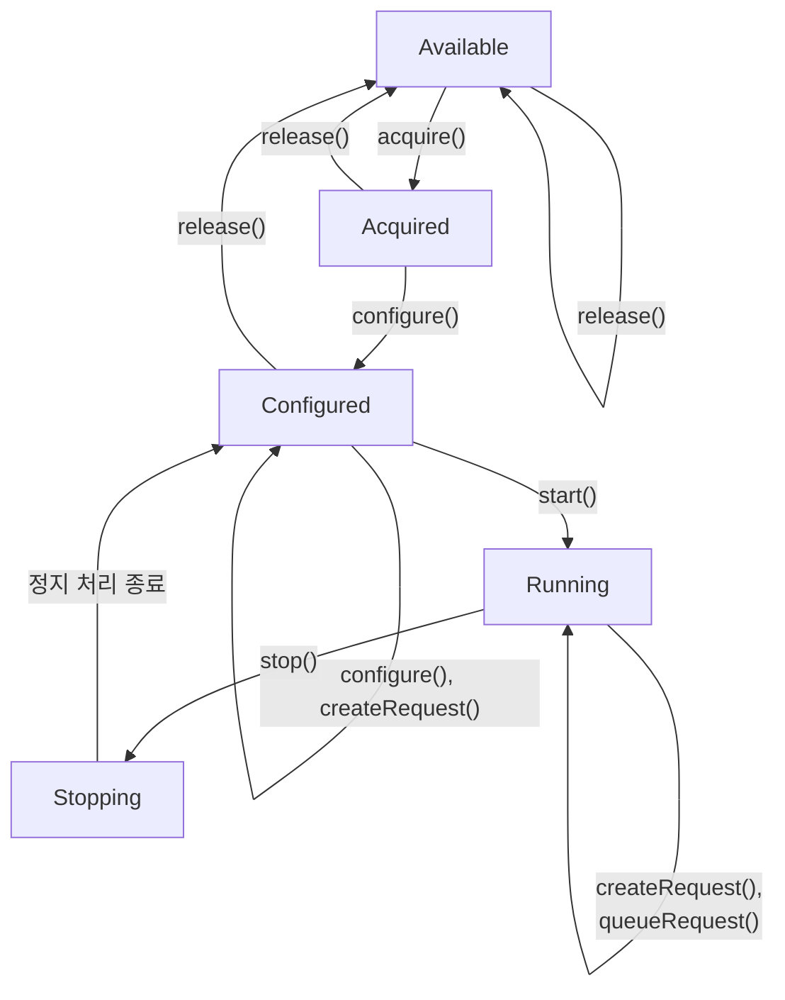
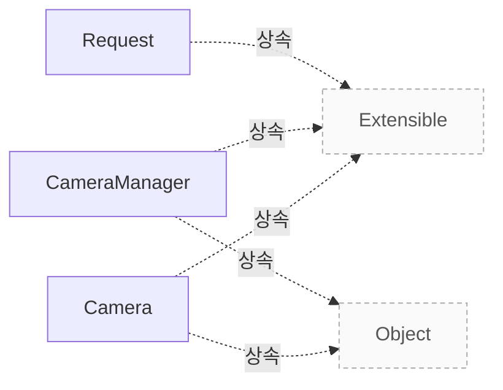

# 카메라와 요청 모델

**클래스의 책임, 요청과 버퍼의 수명, 상태 전이와 종료·동기화 계약을 코드 근거로 확인하세요.**

| 지금 확인할 내용 | 이동할 절 |
|---|---|
| <a id="요청-생성과-완료"></a>요청 생성과 완료의 조건과 근거를 대조하세요. | [요청 객체와 버퍼 수명](camera-requests.md#요청-생성과-완료) |
| <a id="소유권과-재사용"></a>소유권과 재사용의 조건과 근거를 대조하세요. | [요청 객체와 버퍼 수명](camera-requests.md#소유권과-재사용) |
| <a id="요청과-버퍼를-유지할-기간"></a>“요청과 버퍼를 유지할 기간” 그림을 확인하세요. | [요청 객체와 버퍼 수명](camera-requests.md#요청과-버퍼를-유지할-기간) |

## 클래스별 책임

`CameraManager`는 libcamera의 진입점으로, 시스템의 장치를 열거하고 애플리케이션에 카메라 접근을 제공하며 카메라 객체의 수명을 관리합니다. 한 번에 단일 `CameraManager` 인스턴스만 존재할 수 있으며, 기존 인스턴스를 삭제하기 전에 추가 인스턴스를 만들면 동작이 정의되지 않습니다. `src/libcamera/camera_manager.cpp:280`

`Camera` 클래스는 하나의 이미지 소스에서 하나 이상의 이미지 스트림을 생성하는 카메라를 모델링하며, 장치의 설정과 제어, 이미지 스트림 캡처를 위한 주요 인터페이스를 제공합니다. libcamera는 `std::shared_ptr<>`로 `Camera` 인스턴스의 수명을 관리합니다. 인스턴스는 `std::shared_ptr`을 반환하는 `create()` 함수로 생성해야 하며, `Camera`의 생성자와 소멸자는 비공개이므로 인스턴스를 수동으로 생성하거나 소멸하는 것을 막습니다. `Request`는 애플리케이션이 프레임마다 버퍼와 컨트롤을 연결해 장치 처리를 위해 큐에 넣을 수 있게 하는 프레임 캡처 요청 객체입니다. `src/libcamera/camera.cpp:758`, `src/libcamera/request.cpp:343`

`Request` 생성자에 전달한 `cookie`는 요청에 저장되는 애플리케이션용 불투명 값이며, `cookie()` 함수로 언제든지 읽을 수 있습니다. `src/libcamera/request.cpp:343`

근거 원문: [src/libcamera/camera_manager.cpp:280](#source-fbcf3effd2584b79) · [src/libcamera/camera.cpp:758](#source-6c066281dcce33d6) · [src/libcamera/request.cpp:343](#source-abce7dd469896527)

## 상태와 허용 호출

`Camera`의 상태 다이어그램에서 `acquire()`는 `Available` 상태를 `Acquired` 상태로 바꿉니다. `Acquired` 상태에서 `configure()`를 호출하면 `Configured` 상태로, `release()`를 호출하면 `Available` 상태로 전이합니다. 다이어그램에 나오지만 이 상태에서 전이가 없는 연산은 허용되지 않으며, 허용되지 않은 연산을 수행하면 정의되지 않은 동작이 발생합니다. 다이어그램에 전혀 나오지 않는 연산은 모든 상태에서 허용됩니다. `src/libcamera/camera.cpp:769`

<!-- sdd:visual:camera-states -->
### 카메라 상태와 허용 호출

성공한 상태 전이와 상태를 유지하는 호출을 구분하세요. 상태 변경 함수의 동기화는 호출자가 책임집니다.


```mermaid
flowchart TB
%% sdd:translations {"Acquired": "Acquired", "Available": "Available", "Configured": "Configured", "Running": "Running", "Stopping": "Stopping", "acquire()": "acquire()", "configure()": "configure()", "configure(), createRequest()": "configure(), createRequest()", "createRequest(), <br/>queueRequest()": "createRequest(), <br/>queueRequest()", "release()": "release()", "start()": "start()", "stop()": "stop()", "정지 처리 종료": "stop finished"}
  v_available["Available"]
  v_acquired["Acquired"]
  v_configured["Configured"]
  v_running["Running"]
  v_stopping["Stopping"]
  v_available -->|"release()"| v_available
  v_available -->|"acquire()"| v_acquired
  v_acquired -->|"release()"| v_available
  v_acquired -->|"configure()"| v_configured
  v_configured -->|"release()"| v_available
  v_configured -->|"configure(), createRequest()"| v_configured
  v_configured -->|"start()"| v_running
  v_running -->|"stop()"| v_stopping
  v_stopping -->|"정지 처리 종료"| v_configured
  v_running -->|"createRequest(), <br/>queueRequest()"| v_running
```

[Mermaid 원문](camera-model.camera-states.mmd)

??? note "그림 근거와 확인 범위"
    소스에 연결한 설계 해석입니다. 자동 연결 검사는 의미 승인이나 기기 실행 검증이 아닙니다.
    
    | 요소·전이 | 소스 근거 |
    |---|---|
    | Available | [src/libcamera/camera.cpp:769](#source-4b17a07667f3a55d) |
    | Acquired | [src/libcamera/camera.cpp:769](#source-4b17a07667f3a55d) |
    | Configured | [src/libcamera/camera.cpp:769](#source-4b17a07667f3a55d) |
    | Running | [src/libcamera/camera.cpp:769](#source-4b17a07667f3a55d) |
    | Stopping | [src/libcamera/camera.cpp:769](#source-4b17a07667f3a55d) |
    | release() | [src/libcamera/camera.cpp:769](#source-4b17a07667f3a55d) |
    | acquire() | [src/libcamera/camera.cpp:769](#source-4b17a07667f3a55d) |
    | release() | [src/libcamera/camera.cpp:769](#source-4b17a07667f3a55d) |
    | configure() | [src/libcamera/camera.cpp:769](#source-4b17a07667f3a55d) |
    | release() | [src/libcamera/camera.cpp:769](#source-4b17a07667f3a55d) |
    | configure(), createRequest() | [src/libcamera/camera.cpp:769](#source-4b17a07667f3a55d) |
    | start() | [src/libcamera/camera.cpp:769](#source-4b17a07667f3a55d) |
    | stop() | [src/libcamera/camera.cpp:769](#source-4b17a07667f3a55d) |
    | 정지 처리 종료 | [src/libcamera/camera.cpp:769](#source-4b17a07667f3a55d) |
    | createRequest(), queueRequest() | [src/libcamera/camera.cpp:769](#source-4b17a07667f3a55d) |
<!-- /sdd:visual:camera-states -->

`Camera::configure()`는 `d->isAccessAllowed(Private::CameraAcquired, Private::CameraConfigured)`가 음수이면 그 값을 반환하고, `config->validate()`가 `CameraConfiguration::Valid`가 아니면 `LOG(Camera, Error)`를 출력한 뒤 `-EINVAL`을 반환합니다. `pipe_->invokeMethod(&PipelineHandler::configure, ...)`가 0이 아닌 값을 반환하면 그 값을 그대로 반환하고, 설정 후 어떤 `cfg.stream()`이 null이면 `LOG(Camera, Fatal)`을 출력하고 `activeStreams_`를 비운 뒤 `return -EINVAL;`을 실행하는 분기가 있으며, `LOG` 문서에 따르면 Fatal은 메시지 출력 후 프로그램을 종료합니다. 모든 스트림 검사를 통과하면 `d->setState(Private::CameraConfigured)`로 상태를 `Configured`로 설정하고 `0`을 반환합니다. `src/libcamera/camera.cpp:1237`, `src/libcamera/base/log.cpp:1022`, `src/libcamera/camera.cpp:769`

상태 다이어그램에서 `Configured` 상태의 `start()`는 카메라를 `Running` 상태로 이동시키는 전이로 표시됩니다. 다이어그램은 `start()`의 성공과 실패를 구분하지 않으므로, 성공 조건은 이 소스만으로 확인할 수 없습니다. `src/libcamera/camera.cpp:769`

상태 다이어그램에서 `Running` 상태의 `stop()` 전이는 `Stopping` 상태로 이어집니다. 따라서 `Running` 상태의 카메라에 `stop()`을 호출하면 `Stopping` 상태에 진입합니다. 다이어그램상 `Stopping` 상태는 `Configured` 상태로 이어집니다. `src/libcamera/camera.cpp:769`

정지 처리가 끝난 뒤 카메라가 돌아가는 상태는 `Configured`입니다. 상태 다이어그램에서 `Stopping`에서 `Configured`로 가는 화살표가 이 복귀를 나타내며, 이 화살표에는 호출 이름이 표시되어 있지 않습니다. 따라서 이 인용만으로는 어떤 함수 호출이 이 복귀를 일으키는지 확인할 수 없습니다. `release()`는 `Available` 상태에서 호출하면 상태가 그대로 `Available`로 남고, `Acquired` 또는 `Configured` 상태에서 호출하면 상태가 `Available`로 바뀝니다. `src/libcamera/camera.cpp:769`

호출자는 카메라가 `Configured` 또는 `Running` 상태일 때에만 `createRequest`를 호출할 수 있습니다. 이 두 상태는 `camera_operation`에서 정의된 상태를 가리킵니다. `src/libcamera/camera.cpp:1258`

`Camera::queueRequest`는 카메라가 `camera_operation`에서 정의한 `Running` 상태일 때만 호출할 수 있습니다. 카메라가 실행 중이 아니면 `queueRequest`는 `-EACCES`를 반환하며, 요청은 큐에 들어가지 않습니다. 이 호출 조건은 `queueRequest`에 대한 설명이며, 다른 함수의 조건과 함께 묶어 해석하지 않습니다. `src/libcamera/camera.cpp:1320`

`Camera::start`는 카메라가 `Configured` 상태에 있을 때만 호출할 수 있습니다. `start`의 반환값 중 `-EACCES`는 카메라가 시작할 수 있는 상태가 아님을 나타냅니다. `Camera` 클래스는 아래에서 정의하는 카메라 상태에 영향을 주는 함수들을 일반적으로 서로 동기화하지 않습니다. 동기화가 필요한 경우 호출자가 그 동기화를 보장해야 합니다. `src/libcamera/camera.cpp:1383`, `src/libcamera/camera.cpp:780`, `src/libcamera/camera.cpp:769`

근거 원문: [src/libcamera/camera.cpp:769](#source-4b17a07667f3a55d) · [src/libcamera/camera.cpp:1383](#source-617d53c4c7de2c0c) · [src/libcamera/camera.cpp:1258](#source-8f791427a31c3313) · [src/libcamera/camera.cpp:1320](#source-e0caa8c16f728202) · [src/libcamera/camera.cpp:780](#source-cc6c66b57cf028e6) · [src/libcamera/camera.cpp:1237](#source-077fcae46087aee0) · [src/libcamera/base/log.cpp:1022](#source-47a6ef3943a7b53c)

## 오류와 종료

`Camera::queueRequest()`는 먼저 `d->isAccessAllowed(Private::CameraRunning)`를 호출합니다. 이 결과가 음수이면 `ret` 값을 그대로 반환하고, 음수가 아니면 다음 검사로 넘어갑니다. 주석에 나열된 `-ENOMEM`에 대응하는 반환 분기는 발췌 본문에서 보이지 않습니다. `src/libcamera/camera.cpp:1308`

`request->_d()->camera()`가 `this`와 다르면 `queueRequest()`는 LOG를 남기고 `-EXDEV`를 반환합니다. 주석대로 요청은 이를 생성한 카메라에만 큐잉할 수 있습니다. `request->status()`가 `Request::RequestPending`과 같지 않으면 LOG를 남기고 `-EINVAL`을 반환합니다. 이 검사는 controls 검사보다 먼저 수행됩니다. `src/libcamera/camera.cpp:1308`

`request->controls().infoMap()`이 `&controls()`와 다르면 LOG를 남기고 `-EINVAL`을 반환합니다. 로그 문구는 `Overwriting Request::controls() is not allowed`입니다. `request->buffers()`가 비어 있으면 `-EINVAL`을 반환하며, 이 검사는 스트림 검사보다 먼저 수행됩니다. 이어서 요청 버퍼의 각 `stream`이 `d->activeStreams_`에 없으면 `-EINVAL`을 반환합니다. `src/libcamera/camera.cpp:1308`

위 검사를 모두 통과하면 `patchControlList(request->controls())`로 AeEnable을 전처리한 뒤, `d->pipe_->invokeMethod(&PipelineHandler::queueRequest, ConnectionTypeQueued, request)`를 호출하고 0을 반환합니다. 촬영 완료는 주석에 따라 `requestCompleted` signal로 알려집니다. `src/libcamera/camera.cpp:1308`

`Camera::stop()`은 `d->isRunning()`이 거짓이면 상태를 바꾸지 않고 `0`을 반환합니다. 실행 중이면 `d->isAccessAllowed(Private::CameraRunning)`의 음수 결과를 그대로 반환합니다. 따라서 주석의 `-EACCES`와 달리 실행 중이 아닐 때는 오류가 아닌 `0`이 반환됩니다. `src/libcamera/camera.cpp:1431`

실행 중이면 `d->setState(Private::CameraStopping)`으로 상태를 바꾼 뒤 `d->pipe_->invokeMethod(&PipelineHandler::stop, ConnectionTypeBlocking, this)`를 호출합니다. 이어서 `ASSERT(!d->pipe_->hasPendingRequests(this))`로 대기 요청이 없음을 확인하고, `d->setState(Private::CameraConfigured)` 뒤 `0`을 반환합니다. API 주석은 대기 요청이 취소되어 오류 상태로 동기 완료된다고 설명하지만, 이 발췌 본문에는 취소 처리 코드가 보이지 않습니다. `src/libcamera/camera.cpp:1431`

근거 원문: [src/libcamera/camera.cpp:1308](#source-28d007de6ad1a8a5) · [src/libcamera/camera.cpp:1431](#source-e09324743def3f09)

## 동시성과 실행 확인

`Camera::createRequest()` 함수의 주석은 이 함수를 threadsafe로 명시합니다. 이 내용은 주석에 기술된 문서상의 보장입니다. 발췌된 원문에는 함수 본문이 없으므로 구현에서 이를 확인한 것은 아닙니다. `queueRequest`의 주석은 이 함수가 threadsafe하다고 명시합니다. `src/libcamera/camera.cpp:1243`, `src/libcamera/camera.cpp:1308`

`Camera::start`의 context 주석은 호출자가 카메라 상태에 영향을 주는 다른 함수와 동기화해야 한다고 명시합니다. `Camera::stop`의 context 주석도 같은 범위의 동기화 의무를 호출자에게 명시합니다. 따라서 호출자는 `start`와 `stop` 호출을 카메라 상태에 영향을 주는 다른 함수들과 동기화해야 합니다. `src/libcamera/camera.cpp:1383`, `src/libcamera/camera.cpp:1431`

`completeRequest()`를 호출하는 파이프라인 핸들러는 `CameraManager` 스레드에서 호출해야 합니다. 이 함수의 `\context` 항목은 호출 스레드를 `CameraManager` 스레드로 명시하며, 이는 호출하는 쪽이 지켜야 하는 조건입니다. 이 주석은 애플리케이션 콜백이 실행되는 스레드를 명시하지 않습니다. `Camera::requestComplete()`는 완료된 `request`를 `requestCompleted.emit(request)`에 넘겨 `requestCompleted` 신호를 발행합니다. `src/libcamera/pipeline_handler.cpp:547`, `src/libcamera/camera.cpp:1475`

근거 원문: [src/libcamera/camera.cpp:1243](#source-0ae00d77839f61cb) · [src/libcamera/camera.cpp:1308](#source-28d007de6ad1a8a5) · [src/libcamera/camera.cpp:1383](#source-617d53c4c7de2c0c) · [src/libcamera/camera.cpp:1431](#source-e09324743def3f09) · [src/libcamera/pipeline_handler.cpp:547](#source-01ad7c6605c3296a) · [src/libcamera/camera.cpp:1475](#source-8e6389a7d7864907)

## 연결 해제와 대기 요청

`Camera::Private::disconnect()`는 `state_`가 `CameraRunning`일 때만 `CameraConfigured`로 상태를 저장하고, 다른 상태에서는 이 저장을 생략합니다. 그와 별도로 `disconnected_`는 상태와 관계없이 항상 `true`로 설정됩니다. 주석에 따르면 이 처리의 목적은 카메라를 삭제하기 전에 애플리케이션이 자원을 해제하고 `release()`를 호출할 수 있도록 하는 것입니다. `src/libcamera/camera.cpp:690`

`Camera::Private::isAccessAllowed`의 두 오버로드는 `!allowDisconnected`와 `disconnected_`가 모두 참이면 상태를 확인하기 전에 `-ENODEV`를 반환합니다. 단일 `state` 오버로드는 `currentState`가 `state`와 같으면 `0`을, 범위 오버로드는 `currentState`가 `low`와 `high` 사이에 있으면 `0`을 반환합니다. 그 외의 경우에는 오류 로그를 출력한 뒤 `-EACCES`를 반환하며, 로그에서 `from`은 호출 함수 이름으로 `() requiring state` 앞에 출력됩니다. 로그의 `Camera in` 뒤 상태 이름은 두 오버로드 모두 `currentState`에서 가져오고, 요구 상태 이름은 단일 오버로드에서 `state`, 범위 오버로드에서 `low`와 `high`에서 가져옵니다. `src/libcamera/camera.cpp:690`

`Camera::disconnect()`는 `_d()->disconnect()`를 먼저 호출한 뒤 `disconnected.emit()`를 호출합니다. 두 호출은 소스에 적힌 순서대로 실행되므로, `disconnected` 시그널은 `_d()->disconnect()` 호출이 끝난 뒤에 방출됩니다. `src/libcamera/camera.cpp:944`

실행 확인 항목: `Camera::disconnect()`의 주석에는 "Deal with pending requests if the camera is disconnected in a running state."라는 TODO가 남아 있어, 실행 중 연결이 해제된 경우의 대기 요청 처리가 아직 TODO로 남아 있습니다. 발췌된 본문은 `LOG(Camera, Debug)`로 로그를 출력한 뒤 `_d()->disconnect()`를 호출하고 `disconnected.emit()`을 실행하며, 이 발췌에는 개별 요청을 취소하거나 완료하는 코드가 보이지 않습니다. 따라서 이 발췌만으로는 다른 함수의 취소·완료 동작이나 실제 장치의 결과를 확인할 수 없습니다. `src/libcamera/camera.cpp:944`

근거 원문: [src/libcamera/camera.cpp:690](#source-ac8ee83f828fe269) · [src/libcamera/camera.cpp:944](#source-2758e9ddd31ad41d)

??? note "설계 질문과 검증 범위"
    질문별 답변과 근거 연결을 검사했습니다. 의미와 실행 결과는 사람 검토가 필요합니다.
    
    | 설계 질문 | 설명 위치 | 확인 범위 |
    |---|---|---|
    | CameraManager, Camera, Request의 책임과 객체 수명은 어떻게 나뉩니까? | [클래스별 책임](#클래스별-책임) | 코드 근거와 설명 연결 |
    | 상태별 허용 호출과 동기화 책임은 어떻게 나뉩니까? | [상태와 허용 호출](#상태와-허용-호출) | 코드 근거와 설명 연결 |
    | queueRequest의 실패 조건과 stop의 취소·완료·반환 상태는 무엇입니까? | [오류와 종료](#오류와-종료) | 코드 근거와 설명 연결 |
    | threadsafe 보장, 호출자의 동기화 책임과 파이프라인의 완료 통지 계약을 구분하세요. 애플리케이션 콜백 전달 방식과 실기기 검증은 별도로 확인하세요. | [동시성과 실행 확인](#동시성과-실행-확인) | 코드 근거와 설명 연결 |
    | 카메라 연결이 끊어지면 상태·API 접근·대기 요청에 어떤 변화와 확인 한계가 있습니까? | [연결 해제와 대기 요청](#연결-해제와-대기-요청) | 코드 근거와 설명 연결 · 실행 확인 항목 별도 |

## 소스 근거

같은 발췌는 한 번만 싣습니다. 필요한 원문을 펼쳐 설명과 대조하세요.

<a id="source-fbcf3effd2584b79"></a>

??? note "소스 근거: src/libcamera/camera_manager.cpp:280"
    `src/libcamera/camera_manager.cpp:280`에서 시작하는 발췌입니다. 종료 줄은 304이며, 아래 원문을 설명과 대조할 수 있습니다.
    
    SHA-256: `adcd6d49b0c989ec78a81cacece7f6c871a8e0ddf3aa52e42648fae2760a6e84`
    
    ```text
    \class CameraManager
     * \brief Provide access and manage all cameras in the system
     *
     * The camera manager is the entry point to libcamera. It enumerates devices,
     * associates them with pipeline managers, and provides access to the cameras
     * in the system to applications. The manager owns all Camera objects and
     * handles hot-plugging and hot-unplugging to manage the lifetime of cameras.
     *
     * To interact with libcamera, an application starts by creating a camera
     * manager instance. Only a single instance of the camera manager may exist at
     * a time. Attempting to create a second instance without first deleting the
     * existing instance results in undefined behaviour.
     *
     * The manager is initially stopped, and shall be started with start(). This
     * will enumerate all the cameras present in the system, which can then be
     * listed with list() and retrieved with get().
     *
     * Cameras are shared through std::shared_ptr<>, ensuring that a camera will
     * stay valid until the last reference is released without requiring any special
     * action from the application. Once the application has released all the
     * references it held to cameras, the camera manager can be stopped with
     * stop().
     */
    
    CameraManager *CameraManager::self_
    ```

<a id="source-6c066281dcce33d6"></a>

??? note "소스 근거: src/libcamera/camera.cpp:758"
    `src/libcamera/camera.cpp:758`에서 시작하는 발췌입니다. 종료 줄은 769이며, 아래 원문을 설명과 대조할 수 있습니다.
    
    SHA-256: `e77cee469b7c57430e4bd4b0f08493289c46b57549873521c476df388d591dc2`
    
    ```text
    The Camera class models a camera capable of producing one or more image
     * streams from a single image source. It provides the main interface to
     * configuring and controlling the device, and capturing image streams. It is
     * the central object exposed by libcamera.
     *
     * To support the central nature of Camera objects, libcamera manages the
     * lifetime of camera instances with std::shared_ptr<>. Instances shall be
     * created with the create() function which returns a shared pointer. The
     * Camera constructors and destructor are private, to prevent instances from
     * being constructed and destroyed manually.
     *
     * \section camera_operation
    ```

<a id="source-abce7dd469896527"></a>

??? note "소스 근거: src/libcamera/request.cpp:343"
    `src/libcamera/request.cpp:343`에서 시작하는 발췌입니다. 종료 줄은 360이며, 아래 원문을 설명과 대조할 수 있습니다.
    
    SHA-256: `948968e35cb0d98957bc63aa2d6b613d2a8203e66855db23974f035e9d679764`
    
    ```text
    \class Request
     * \brief A frame capture request
     *
     * A Request allows an application to associate buffers and controls on a
     * per-frame basis to be queued to the camera device for processing.
     */
    
    /**
     * \brief Create a capture request for a camera
     * \param[in] camera The camera that creates the request
     * \param[in] cookie Opaque cookie for application use
     *
     * The \a cookie is stored in the request and is accessible through the
     * cookie() function at any time. It is typically used by applications to map
     * the request to an external resource in the request completion handler, and is
     * completely opaque to libcamera.
     */
    Request::Request(Camera *camera, uint64_t cookie)
    ```

<a id="source-4b17a07667f3a55d"></a>

??? note "소스 근거: src/libcamera/camera.cpp:769"
    `src/libcamera/camera.cpp:769`에서 시작하는 발췌입니다. 종료 줄은 814이며, 아래 원문을 설명과 대조할 수 있습니다.
    
    SHA-256: `e85796df194551ecbd587ba1a7bb356a1409fa1d606762865e7eb989c92d2f72`
    
    ```text
    \section camera_operation Operating the Camera
     *
     * An application needs to perform a sequence of operations on a camera before
     * it is ready to process requests. The camera needs to be acquired and
     * configured to prepare the camera for capture. Once started the camera can
     * process requests until it is stopped. When an application is done with a
     * camera, the camera needs to be released.
     *
     * An application may start and stop a camera multiple times as long as it is
     * not released. The camera may also be reconfigured.
     *
     * Functions that affect the camera state as defined below are generally not
     * synchronized with each other by the Camera class. The caller is responsible
     * for ensuring their synchronization if necessary.
     *
     * \subsection Camera States
     *
     * To help manage the sequence of operations needed to control the camera a set
     * of states are defined. Each state describes which operations may be performed
     * on the camera. Performing an operation not allowed in the camera state
     * results in undefined behaviour. Operations not listed at all in the state
     * diagram are allowed in all states.
     *
     * \dot
     * digraph camera_state_machine {
     *   node [shape = doublecircle ]; Available;
     *   node [shape = circle ]; Acquired;
     *   node [shape = circle ]; Configured;
     *   node [shape = circle ]; Stopping;
     *   node [shape = circle ]; Running;
     *
     *   Available -> Available [label = "release()"];
     *   Available -> Acquired [label = "acquire()"];
     *
     *   Acquired -> Available [label = "release()"];
     *   Acquired -> Configured [label = "configure()"];
     *
     *   Configured -> Available [label = "release()"];
     *   Configured -> Configured [label = "configure(), createRequest()"];
     *   Configured -> Running [label = "start()"];
     *
     *   Running -> Stopping [label = "stop()"];
     *   Stopping -> Configured;
     *   Running -> Running [label = "createRequest(), queueRequest()"];
     * }
     * \enddot
    ```

<a id="source-617d53c4c7de2c0c"></a>

??? note "소스 근거: src/libcamera/camera.cpp:1383"
    `src/libcamera/camera.cpp:1383`에서 시작하는 발췌입니다. 종료 줄은 1400이며, 아래 원문을 설명과 대조할 수 있습니다.
    
    SHA-256: `e0abda64dc6b1bdd78d1326c8dd8651e842c03181dcf28e3b8b7eac1a4c70fcf`
    
    ```text
    \brief Start capture from camera
     * \param[in] controls Controls to be applied before starting the Camera
     *
     * Start the camera capture session, optionally providing a list of controls to
     * apply before starting. Once the camera is started the application can queue
     * requests to the camera to process and return to the application until the
     * capture session is terminated with \a stop().
     *
     * \context This function may only be called when the camera is in the
     * Configured state as defined in \ref camera_operation, and shall be
     * synchronized by the caller with other functions that affect the camera
     * state.
     *
     * \return 0 on success or a negative error code otherwise
     * \retval -ENODEV The camera has been disconnected from the system
     * \retval -EACCES The camera is not in a state where it can be started
     */
    int Camera::start(const ControlList *controls)
    ```

<a id="source-8f791427a31c3313"></a>

??? note "소스 근거: src/libcamera/camera.cpp:1258"
    `src/libcamera/camera.cpp:1258`에서 시작하는 발췌입니다. 종료 줄은 1263이며, 아래 원문을 설명과 대조할 수 있습니다.
    
    SHA-256: `fd7dc6ea02f64424f17322fff027c34131ac5a3fb64d69d83aa6fa55ca9f826a`
    
    ```text
    \context This function is \threadsafe. It may only be called when the camera
     * is in the Configured or Running state as defined in \ref camera_operation.
     *
     * \return A pointer to the newly created request, or nullptr on error
     */
    std::unique_ptr<Request> Camera::createRequest(uint64_t cookie)
    ```

<a id="source-e0caa8c16f728202"></a>

??? note "소스 근거: src/libcamera/camera.cpp:1320"
    `src/libcamera/camera.cpp:1320`에서 시작하는 발췌입니다. 종료 줄은 1330이며, 아래 원문을 설명과 대조할 수 있습니다.
    
    SHA-256: `b9de90acc07617b489b367e116e41ecc8bc712180c6f445763b58658ff1bc649`
    
    ```text
    \context This function is \threadsafe. It may only be called when the camera
     * is in the Running state as defined in \ref camera_operation.
     *
     * \return 0 on success or a negative error code otherwise
     * \retval -ENODEV The camera has been disconnected from the system
     * \retval -EACCES The camera is not running so requests can't be queued
     * \retval -EXDEV The request does not belong to this camera
     * \retval -EINVAL The request is invalid
     * \retval -ENOMEM No buffer memory was available to handle the request
     */
    int Camera::queueRequest(Request *request)
    ```

<a id="source-cc6c66b57cf028e6"></a>

??? note "소스 근거: src/libcamera/camera.cpp:780"
    `src/libcamera/camera.cpp:780`에서 시작하는 발췌입니다. 종료 줄은 782이며, 아래 원문을 설명과 대조할 수 있습니다.
    
    SHA-256: `de3ba7a26c3bbaf6bbb33d1749b99829fdc58e13718068d149c849d0b2c43388`
    
    ```text
    Functions that affect the camera state as defined below are generally not
     * synchronized with each other by the Camera class. The caller is responsible
     * for ensuring their synchronization if necessary.
    ```

<a id="source-077fcae46087aee0"></a>

??? note "소스 근거: src/libcamera/camera.cpp:1237"
    `src/libcamera/camera.cpp:1237`에서 시작하는 발췌입니다. 종료 줄은 1239이며, 아래 원문을 설명과 대조할 수 있습니다.
    
    SHA-256: `c286717b62d3b69c9dd97f324bb16930edb27f32da54c40916bef758fbca20da`
    
    ```text
    d->setState(Private::CameraConfigured);
    
    	return 0;
    ```

<a id="source-47a6ef3943a7b53c"></a>

??? note "소스 근거: src/libcamera/base/log.cpp:1022"
    `src/libcamera/base/log.cpp:1022`에서 시작하는 발췌입니다. 종료 줄은 1060이며, 아래 원문을 설명과 대조할 수 있습니다.
    
    SHA-256: `52e64d292f59786541e66fe48f5bae65256bdced60c803aa76bf3637083b47b0`
    
    ```text
    \def LOG(category, severity)
     * \hideinitializer
     * \brief Log a message
     * \param[in] category Category (optional)
     * \param[in] severity Severity
     *
     * Return an std::ostream reference to which a message can be logged using the
     * iostream API. The \a category, if specified, sets the message category. When
     * absent the default category is used. The  \a severity controls whether the
     * message is printed or discarded, depending on the log level for the category.
     *
     * If the severity is set to Fatal, execution is aborted and the program
     * terminates immediately after printing the message.
     *
     * \warning Logging from the destructor of a global object, either directly or
     * indirectly, results in undefined behaviour.
     *
     * \todo Allow logging from destructors of global objects to the largest
     * possible extent
     */
    
    /**
     * \def ASSERT(condition)
     * \hideinitializer
     * \brief Abort program execution if assertion fails
     *
     * If \a condition is false, ASSERT() logs an error message with the Fatal log
     * level and aborts program execution.
     *
     * If the macro NDEBUG is defined before including log.h, ASSERT() generates no
     * code.
     *
     * Using conditions that have side effects with ASSERT() is not recommended, as
     * these effects would depend on whether NDEBUG is defined or not. Similarly,
     * ASSERT() should not be used to check for errors that can occur under normal
     * conditions as those checks would then be removed when compiling with NDEBUG.
     */
    
    } /* namespace libcamera */
    ```

<a id="source-28d007de6ad1a8a5"></a>

??? note "소스 근거: src/libcamera/camera.cpp:1308"
    `src/libcamera/camera.cpp:1308`에서 시작하는 발췌입니다. 종료 줄은 1383이며, 아래 원문을 설명과 대조할 수 있습니다.
    
    SHA-256: `96db61baeb32065c966b20942f97518ddbd3a43b36b64e8083eb29a90ecb7f4b`
    
    ```text
    \brief Queue a request to the camera
     * \param[in] request The request to queue to the camera
     *
     * This function queues a \a request to the camera for capture.
     *
     * After allocating the request with createRequest(), the application shall
     * fill it with at least one capture buffer before queuing it. Requests that
     * contain no buffers are invalid and are rejected without being queued.
     *
     * Once the request has been queued, the camera will notify its completion
     * through the \ref requestCompleted signal.
     *
     * \context This function is \threadsafe. It may only be called when the camera
     * is in the Running state as defined in \ref camera_operation.
     *
     * \return 0 on success or a negative error code otherwise
     * \retval -ENODEV The camera has been disconnected from the system
     * \retval -EACCES The camera is not running so requests can't be queued
     * \retval -EXDEV The request does not belong to this camera
     * \retval -EINVAL The request is invalid
     * \retval -ENOMEM No buffer memory was available to handle the request
     */
    int Camera::queueRequest(Request *request)
    {
    	Private *const d = _d();
    
    	int ret = d->isAccessAllowed(Private::CameraRunning);
    	if (ret < 0)
    		return ret;
    
    	/* Requests can only be queued to the camera that created them. */
    	if (request->_d()->camera() != this) {
    		LOG(Camera, Error) << "Request was not created by this camera";
    		return -EXDEV;
    	}
    
    	if (request->status() != Request::RequestPending) {
    		LOG(Camera, Error) << request->toString() << " is not valid";
    		return -EINVAL;
    	}
    
    	/* Make sure the Request has a valid control list. */
    	if (request->controls().infoMap() != &controls()) {
    		LOG(Camera, Error) << "Overwriting Request::controls() is not allowed";
    		return -EINVAL;
    	}
    
    	/*
    	 * The camera state may change until the end of the function. No locking
    	 * is however needed as PipelineHandler::queueRequest() will handle
    	 * this.
    	 */
    
    	if (request->buffers().empty()) {
    		LOG(Camera, Error) << "Request contains no buffers";
    		return -EINVAL;
    	}
    
    	for (const auto &[stream, buffer] : request->buffers()) {
    		if (d->activeStreams_.find(stream) == d->activeStreams_.end()) {
    			LOG(Camera, Error) << "Invalid request";
    			return -EINVAL;
    		}
    	}
    
    	/* Pre-process AeEnable. */
    	patchControlList(request->controls());
    
    	d->pipe_->invokeMethod(&PipelineHandler::queueRequest,
    			       ConnectionTypeQueued, request);
    
    	return 0;
    }
    
    /**
     * \brief Start capture from camera
    ```

<a id="source-e09324743def3f09"></a>

??? note "소스 근거: src/libcamera/camera.cpp:1431"
    `src/libcamera/camera.cpp:1431`에서 시작하는 발췌입니다. 종료 줄은 1475이며, 아래 원문을 설명과 대조할 수 있습니다.
    
    SHA-256: `0009c665993b995489738e48affc81643a7159d82b5326e5f182e30fe11e4901`
    
    ```text
    \brief Stop capture from camera
     *
     * This function stops capturing and processing requests immediately. All
     * pending requests are cancelled and complete synchronously in an error state.
     *
     * \context This function may be called in any camera state as defined in \ref
     * camera_operation, and shall be synchronized by the caller with other
     * functions that affect the camera state. If called when the camera isn't
     * running, it is a no-op.
     *
     * \return 0 on success or a negative error code otherwise
     * \retval -ENODEV The camera has been disconnected from the system
     * \retval -EACCES The camera is not running so can't be stopped
     */
    int Camera::stop()
    {
    	Private *const d = _d();
    
    	/*
    	 * \todo Make calling stop() when not in 'Running' part of the state
    	 * machine rather than take this shortcut
    	 */
    	if (!d->isRunning())
    		return 0;
    
    	int ret = d->isAccessAllowed(Private::CameraRunning);
    	if (ret < 0)
    		return ret;
    
    	LOG(Camera, Debug) << "Stopping capture";
    
    	d->setState(Private::CameraStopping);
    
    	d->pipe_->invokeMethod(&PipelineHandler::stop, ConnectionTypeBlocking,
    			       this);
    
    	ASSERT(!d->pipe_->hasPendingRequests(this));
    
    	d->setState(Private::CameraConfigured);
    
    	return 0;
    }
    
    /**
     * \brief Handle request completion and notify application
    ```

<a id="source-0ae00d77839f61cb"></a>

??? note "소스 근거: src/libcamera/camera.cpp:1243"
    `src/libcamera/camera.cpp:1243`에서 시작하는 발췌입니다. 종료 줄은 1263이며, 아래 원문을 설명과 대조할 수 있습니다.
    
    SHA-256: `9f251ecf5ba569606e9753d3619b88e1aef5a4ce15f816ae97efd283e34b823b`
    
    ```text
    \brief Create a request object for the camera
     * \param[in] cookie Opaque cookie for application use
     *
     * This function creates an empty request for the application to fill with
     * buffers and parameters, and queue for capture.
     *
     * The \a cookie is stored in the request and is accessible through the
     * Request::cookie() function at any time. It is typically used by applications
     * to map the request to an external resource in the request completion
     * handler, and is completely opaque to libcamera.
     *
     * The ownership of the returned request is passed to the caller, which is
     * responsible for deleting it. The request may be deleted in the completion
     * handler, or reused after resetting its state with Request::reuse().
     *
     * \context This function is \threadsafe. It may only be called when the camera
     * is in the Configured or Running state as defined in \ref camera_operation.
     *
     * \return A pointer to the newly created request, or nullptr on error
     */
    std::unique_ptr<Request> Camera::createRequest(uint64_t cookie)
    ```

<a id="source-01ad7c6605c3296a"></a>

??? note "소스 근거: src/libcamera/pipeline_handler.cpp:547"
    `src/libcamera/pipeline_handler.cpp:547`에서 시작하는 발췌입니다. 종료 줄은 620이며, 아래 원문을 설명과 대조할 수 있습니다.
    
    SHA-256: `514288cc958de9ff5fd19d46393cec3bb3088f4f08486528d4559071138638c9`
    
    ```text
    \brief Complete a buffer for a request
     * \param[in] request The request the buffer belongs to
     * \param[in] buffer The buffer that has completed
     *
     * This function shall be called by pipeline handlers to signal completion of
     * the \a buffer part of the \a request. It notifies applications of buffer
     * completion and updates the request's internal buffer tracking. The request
     * is not completed automatically when the last buffer completes to give
     * pipeline handlers a chance to perform any operation that may still be
     * needed. They shall complete requests explicitly with completeRequest().
     *
     * \context This function shall be called from the CameraManager thread.
     *
     * \return True if all buffers contained in the request have completed, false
     * otherwise
     */
    bool PipelineHandler::completeBuffer(Request *request, FrameBuffer *buffer)
    {
    	Camera *camera = request->_d()->camera();
    	camera->bufferCompleted.emit(request, buffer);
    	return request->_d()->completeBuffer(buffer);
    }
    
    /**
     * \brief Signal request completion
     * \param[in] request The request that has completed
     *
     * The pipeline handler shall call this function to notify the \a camera that
     * the request has completed. The request is no longer managed by the pipeline
     * handler and shall not be accessed once this function returns.
     *
     * This function ensures that requests will be returned to the application in
     * submission order, the pipeline handler may call it on any complete request
     * without any ordering constraint.
     *
     * \context This function shall be called from the CameraManager thread.
     */
    void PipelineHandler::completeRequest(Request *request)
    {
    	Camera *camera = request->_d()->camera();
    
    	request->_d()->complete();
    
    	Camera::Private *data = camera->_d();
    
    	while (!data->queuedRequests_.empty()) {
    		Request *req = data->queuedRequests_.front();
    		if (req->status() == Request::RequestPending)
    			break;
    
    		ASSERT(!req->hasPendingBuffers());
    		data->queuedRequests_.pop_front();
    		camera->requestComplete(req);
    	}
    
    	/* Allow any waiting requests to be queued to the pipeline. */
    	doQueueRequests(camera);
    }
    
    /**
     * \brief Cancel request and signal its completion
     * \param[in] request The request to cancel
     *
     * This function cancels and completes the request. The same rules as for
     * completeRequest() apply.
     */
    void PipelineHandler::cancelRequest(Request *request)
    {
    	request->_d()->cancel();
    	completeRequest(request);
    }
    
    /**
     * \brief Retrieve the absolute path to a platform configuration file
    ```

<a id="source-8e6389a7d7864907"></a>

??? note "소스 근거: src/libcamera/camera.cpp:1475"
    `src/libcamera/camera.cpp:1475`에서 시작하는 발췌입니다. 종료 줄은 1490이며, 아래 원문을 설명과 대조할 수 있습니다.
    
    SHA-256: `69fcc9cae7f7590799771bd304b13feeca21ebe9eed7032ea7562d3ab737db6e`
    
    ```text
    \brief Handle request completion and notify application
     * \param[in] request The request that has completed
     *
     * This function is called by the pipeline handler to notify the camera that
     * the request has completed. It emits the requestCompleted signal.
     */
    void Camera::requestComplete(Request *request)
    {
    	/* Disconnected cameras are still able to complete requests. */
    	if (_d()->isAccessAllowed(Private::CameraStopping, Private::CameraRunning,
    				  true))
    		LOG(Camera, Fatal) << "Trying to complete a request when stopped";
    
    	requestCompleted.emit(request);
    }
    
    ```

<a id="source-ac8ee83f828fe269"></a>

??? note "소스 근거: src/libcamera/camera.cpp:690"
    `src/libcamera/camera.cpp:690`에서 시작하는 발췌입니다. 종료 줄은 745이며, 아래 원문을 설명과 대조할 수 있습니다.
    
    SHA-256: `1e0ac0e45422136580c0722ca5a356f17a7c0b8ae18dbb64090f7734afdbfaae`
    
    ```text
    int Camera::Private::isAccessAllowed(State state, bool allowDisconnected,
    				     const char *from) const
    {
    	if (!allowDisconnected && disconnected_)
    		return -ENODEV;
    
    	State currentState = state_.load(std::memory_order_acquire);
    	if (currentState == state)
    		return 0;
    
    	ASSERT(static_cast<unsigned int>(state) < std::size(camera_state_names));
    
    	LOG(Camera, Error) << "Camera in " << camera_state_names[currentState]
    			   << " state trying " << from << "() requiring state "
    			   << camera_state_names[state];
    
    	return -EACCES;
    }
    
    int Camera::Private::isAccessAllowed(State low, State high,
    				     bool allowDisconnected,
    				     const char *from) const
    {
    	if (!allowDisconnected && disconnected_)
    		return -ENODEV;
    
    	State currentState = state_.load(std::memory_order_acquire);
    	if (currentState >= low && currentState <= high)
    		return 0;
    
    	ASSERT(static_cast<unsigned int>(low) < std::size(camera_state_names) &&
    	       static_cast<unsigned int>(high) < std::size(camera_state_names));
    
    	LOG(Camera, Error) << "Camera in " << camera_state_names[currentState]
    			   << " state trying " << from
    			   << "() requiring state between "
    			   << camera_state_names[low] << " and "
    			   << camera_state_names[high];
    
    	return -EACCES;
    }
    
    void Camera::Private::disconnect()
    {
    	/*
    	 * If the camera was running when the hardware was removed force the
    	 * state to Configured state to allow applications to free resources
    	 * and call release() before deleting the camera.
    	 */
    	if (state_.load(std::memory_order_acquire) == Private::CameraRunning)
    		state_.store(Private::CameraConfigured, std::memory_order_release);
    
    	disconnected_ = true;
    }
    
    void Camera::Private::setState(State state)
    ```

<a id="source-2758e9ddd31ad41d"></a>

??? note "소스 근거: src/libcamera/camera.cpp:944"
    `src/libcamera/camera.cpp:944`에서 시작하는 발췌입니다. 종료 줄은 963이며, 아래 원문을 설명과 대조할 수 있습니다.
    
    SHA-256: `cbc12aaba21898e519c8599faec5e998b408162912a507880b162ee6787cf8b0`
    
    ```text
    \brief Notify camera disconnection
     *
     * This function is used to notify the camera instance that the underlying
     * hardware has been unplugged. In response to the disconnection the camera
     * instance notifies the application by emitting the #disconnected signal, and
     * ensures that all new calls to the application-facing Camera API return an
     * error immediately.
     *
     * \todo Deal with pending requests if the camera is disconnected in a
     * running state.
     */
    void Camera::disconnect()
    {
    	LOG(Camera, Debug) << "Disconnecting camera " << id();
    
    	_d()->disconnect();
    	disconnected.emit();
    }
    
    int Camera::exportFrameBuffers(Stream *stream,
    ```


<!-- sdd:class-diagram -->
## 클래스 관계

화살표의 글자는 추출한 관계를 나타내며, 점선은 상속입니다. 화살표는 참조 대상 또는 기반 클래스를 향합니다. 호출 순서를 뜻하지 않습니다.


```mermaid
flowchart LR
  c0["Camera"]
  c1["CameraManager"]
  c2["Extensible"]:::context
  c3["Object"]:::context
  c4["Request"]
  c0 -.->|상속| c2
  c0 -.->|상속| c3
  c1 -.->|상속| c2
  c1 -.->|상속| c3
  c4 -.->|상속| c2
  classDef context fill:#fafafa,stroke:#aaa,stroke-dasharray:4 3,color:#555
```
<!-- /sdd:class-diagram -->


## 관련 클래스

| 클래스 | 선언 위치 | 상속 | 책임 (주석) |
|---|---|---|---|
| `libcamera::Camera` | `include/libcamera/camera.h:114` | `libcamera::Object`, `libcamera::Extensible` | Camera device |
| `libcamera::CameraManager` | `include/libcamera/camera_manager.h:24` | `libcamera::Object`, `libcamera::Extensible` | Provide access and manage all cameras in the system |
| `libcamera::Request` | `include/libcamera/request.h:29` | `libcamera::Extensible` | A frame capture request |

??? note "근거와 검토 정보"
    - 생성 방식: 추출 사실과 LLM 설명
    - 검증 범위: 표·그림은 facts로 만들고 설명은 LLM이 작성합니다. 인용·문장 및 설정된 구조 검사를 적용합니다.
    - 근거 파일: `include/libcamera/camera.h`, `include/libcamera/camera_manager.h`, `include/libcamera/request.h`, `src/libcamera/base/log.cpp`, `src/libcamera/camera.cpp`, `src/libcamera/camera_manager.cpp`, `src/libcamera/pipeline_handler.cpp`, `src/libcamera/request.cpp`
    - 근거 수준: 코드 확인 (정적 분석, simple_compdb 구성, commit `293d751a81`)
    - 자동 검사 (인용·문장 및 설정된 구조 검사): 통과
    - 검토 상태 기록일: 2026-10-31 · 사람 검토 전

다음 단계: [요청 객체와 버퍼 수명](camera-requests.md)
