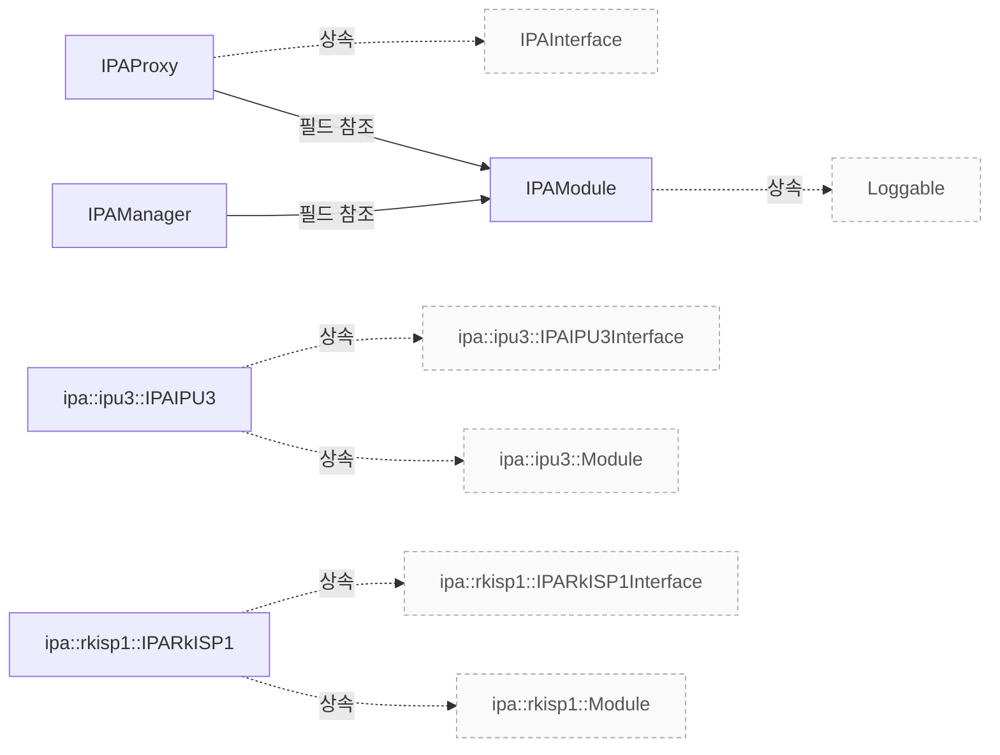

# IPA 관리와 구현 진입점

**IPA 관리자, 모듈, 프록시와 IPU3·RKISP1 구현의 근거 위치를 먼저 확인하세요.**

| 지금 확인할 내용 | 이동할 절 |
|---|---|
| 구조 설명 절을 확인합니다. | [구조 설명](#구조-설명) |
| 클래스 관계 절을 확인합니다. | [클래스 관계](#클래스-관계) |
| 관련 클래스 절을 확인합니다. | [관련 클래스](#관련-클래스) |

## 구조 설명

libcamera::IPAManager, libcamera::IPAModule, libcamera::IPAProxy 및 구체적인 IPA 구현 클래스는 각각 `include/libcamera/internal/ipa_manager.h:29`, `include/libcamera/internal/ipa_module.h:21`, `include/libcamera/internal/ipa_proxy.h:22` 및 `src/ipa/ipu3/ipu3.cpp:139`, `src/ipa/rkisp1/rkisp1.cpp:46` 에서 정의됩니다. IPAManager 는 CameraManager 와 연결되며, createIPA() 메서드를 통해 IPA 모듈을 생성합니다 `include/libcamera/internal/ipa_manager.h:36`. IPAModule 은 Loggable 를 상속받으며, load() 와 createInterface() 를 통해 구현 팩토리를 로드하고 인터페이스 인스턴스를 생성합니다 `src/libcamera/ipa_module.cpp:406`, `src/libcamera/ipa_module.cpp:451`. IPAProxy 는 IPAInterface 를 상속받아 ProxyState 와 연결되며, configurationFile() 와 resolvePath() 를 통해 설정 파일 경로를 관리합니다 `include/libcamera/internal/ipa_proxy.h:34`, `src/libcamera/ipa_proxy.cpp:174`, `src/libcamera/ipa_proxy.cpp:217`.

IPA 구현 클래스인 IPAIPU3 와 IPARkISP1 는 각각 init(), start(), stop() 및 configure() 를 통해 초기화, 시작, 종료 및 설정을 수행합니다 `src/ipa/ipu3/ipu3.cpp:218`, `src/ipa/ipu3/ipu3.cpp:277`, `src/ipa/ipu3/ipu3.cpp:291`, `src/ipa/ipu3/ipu3.cpp:380`. computeParams() 와 processStats() 는 프레임 처리를 위한 파라미터 계산 및 통계 처리를 담당하며, mapBuffers() 와 unmapBuffers() 는 버퍼 매핑을 관리합니다 `src/ipa/ipu3/ipu3.cpp:447`, `src/ipa/ipu3/ipu3.cpp:489`, `src/ipa/ipu3/ipu3.cpp:415`, `src/ipa/ipu3/ipu3.cpp:428`. IPAModule 과 IPAProxy 간의 경계는 명시적 호출 관계가 없으며, 실제 동작 시 추가 확인이 필요합니다. 스레드 및 콜백 순서는 설계 문서에 근거하지 않아 확인 필요 항목으로 남깁니다.

<!-- sdd:class-diagram -->
## 클래스 관계

화살표의 글자는 추출한 관계를 나타내며, 점선은 상속입니다. 화살표는 참조 대상 또는 기반 클래스를 향합니다. 호출 순서를 뜻하지 않습니다.

<!-- /sdd:class-diagram -->

## 관련 클래스

| 클래스 | 선언 위치 | 상속 | 책임 (주석) |
|---|---|---|---|
| `libcamera::IPAManager` | `include/libcamera/internal/ipa_manager.h:29` | – | 확인 필요 |
| `libcamera::IPAModule` | `include/libcamera/internal/ipa_module.h:21` | `libcamera::Loggable` | 확인 필요 |
| `libcamera::IPAProxy` | `include/libcamera/internal/ipa_proxy.h:22` | `libcamera::IPAInterface` | 확인 필요 |
| `libcamera::ipa::ipu3::IPAIPU3` | `src/ipa/ipu3/ipu3.cpp:139` | `libcamera::ipa::ipu3::IPAIPU3Interface`, `libcamera::ipa::ipu3::Module` | The IPU3 IPA implementation |
| `libcamera::ipa::rkisp1::IPARkISP1` | `src/ipa/rkisp1/rkisp1.cpp:46` | `libcamera::ipa::rkisp1::IPARkISP1Interface`, `libcamera::ipa::rkisp1::Module` | 확인 필요 |

??? note "근거와 검토 정보"
    - 근거 파일: `include/libcamera/internal/ipa_manager.h`, `include/libcamera/internal/ipa_module.h`, `include/libcamera/internal/ipa_proxy.h`, `src/ipa/ipu3/ipu3.cpp`, `src/ipa/rkisp1/rkisp1.cpp`, `src/libcamera/ipa_manager.cpp`, `src/libcamera/ipa_module.cpp`, `src/libcamera/ipa_proxy.cpp`
    - 근거 수준: 코드 확인 (정적 분석, simple_compdb 구성, commit `279d355ef8`)
    - 자동 검사 (인용·문장 및 설정된 구조 검사): 통과
    - 검토: 2026-09-21 · ollama/qwen3.5:4b · 사람 검토 전

다음 단계: [IPU3 LSC와 상태 연결](ipu3-lsc.md)
