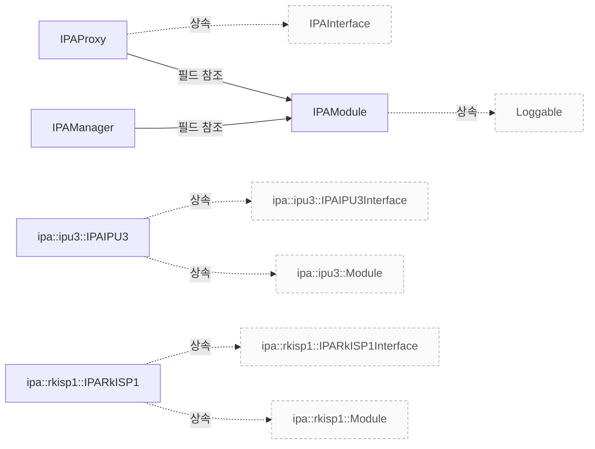

# IPA 관리와 구현 진입점

**IPA 모듈 선택, 스레드·프로세스 경계와 요청·결과 인터페이스를 구현 근거로 확인하세요.**


## 설계 항목과 근거

아래 항목은 소스에 연결된 설명의 작성 범위를 나타냅니다. 설명의 의미와 실제 실행에 대한 승인은 별도 검토가 필요합니다.

| 설계 질문 | 설명 위치 | 확인 범위 |
|---|---|---|
| 어떤 IPA 모듈과 실행 방식이 선택됩니까? | [모듈 탐색과 격리 조건](#모듈-탐색과-격리-조건) | 코드 근거와 설명 연결 |
| 동기 호출과 비동기 호출은 어디에서 실행됩니까? | [스레드와 프로세스 경계](#스레드와-프로세스-경계) | 코드 근거와 설명 연결 |
| 파이프라인과 알고리즘은 어떤 입력과 결과를 주고받습니까? | [프레임 입력과 결과 인터페이스](#프레임-입력과-결과-인터페이스) | 코드 근거와 설명 연결 · 실행 확인 항목 별도 |
| 인터페이스를 만들고 비동기 처리를 끝내는 계약은 무엇입니까? | [IPA 객체와 종료 순서](#ipa-객체와-종료-순서) | 코드 근거와 설명 연결 · 실행 확인 항목 별도 |
| 모듈 생성과 IPC 오류는 어떻게 관찰됩니까? | [생성과 IPC 실패](#생성과-ipc-실패) | 코드 근거와 설명 연결 · 실행 확인 항목 별도 |

## 모듈 탐색과 격리 조건

`IPAManager`는 설정의 모듈 경로, 설치 전 빌드 경로, 설치된 시스템 경로 순으로 IPA 후보를 찾습니다. `IPAModule::match()`는 이름의 일치와 최소·최대 버전을 포함하는 범위를 확인합니다. `src/libcamera/ipa_manager.cpp:107`, `src/libcamera/ipa_module.cpp:460`

현재 `createIPA<T>()` 구현은 서명 검증이 성공하면 `T::Threaded`, 실패하면 `T::Isolated`를 생성합니다. 공개 키 지원이 없거나 강제 격리 설정이 켜져 있거나 서명을 검증하지 못하면 격리 경로를 선택합니다. 라이선스 이름만으로 현재의 실행 방식을 판정하지 않습니다. `include/libcamera/internal/ipa_manager.h:35`, `src/libcamera/ipa_manager.cpp:289`

일치하는 모듈이 없거나 생성된 프록시의 `isValid()`가 false이면 `createIPA()`는 null을 반환합니다. 호출자는 프록시를 사용하기 전에 이 결과를 확인해야 합니다. `include/libcamera/internal/ipa_manager.h:35`

??? note "소스 근거: modules"
    `src/libcamera/ipa_manager.cpp:107`에서 시작하는 발췌입니다. 종료 줄은 162이며, 아래 원문을 설명과 대조할 수 있습니다.
    
    SHA-256: `ed1b15d5743b434eb29e34ba981de978ff4dd9bcb186859e4800931a525e766c`
    
    ```text
    IPAManager::IPAManager(const CameraManager &cm)
    	: cm_(cm)
    {
    	const GlobalConfiguration &configuration = cm._d()->configuration();
    
    #if HAVE_IPA_PUBKEY
    	if (!pubKey_.isValid())
    		LOG(IPAManager, Warning) << "Public key not valid";
    
    	forceIsolation_ = configuration.option<bool>({ "ipa", "force_isolation" })
    				       .value_or(false);
    #endif
    
    	unsigned int ipaCount = 0;
    
    	/* User-specified paths take precedence. */
    	const auto modulePaths =
    		configuration.listOption({ "ipa", "module_paths" })
    			.value_or(utils::defopt);
    	for (const auto &dir : modulePaths) {
    		if (dir.empty())
    			continue;
    
    		ipaCount += addDir(dir.c_str());
    	}
    
    	if (!modulePaths.empty() && !ipaCount)
    		LOG(IPAManager, Warning) << "No IPA found in '"
    					 << utils::join(modulePaths, ":")
    					 << "'";
    
    	/*
    	 * When libcamera is used before it is installed, load IPAs from the
    	 * same build directory as the libcamera library itself.
    	 */
    	std::string root = utils::libcameraBuildPath();
    	if (!root.empty()) {
    		std::string ipaBuildPath = root + "src/ipa";
    		constexpr int maxDepth = 2;
    
    		LOG(IPAManager, Info)
    			<< "libcamera is not installed. Adding '"
    			<< ipaBuildPath << "' to the IPA search path";
    
    		ipaCount += addDir(ipaBuildPath.c_str(), maxDepth);
    	}
    
    	/* Finally try to load IPAs from the installed system path. */
    	ipaCount += addDir(IPA_MODULE_DIR);
    
    	if (!ipaCount)
    		LOG(IPAManager, Warning)
    			<< "No IPA found in '" IPA_MODULE_DIR "'";
    }
    
    IPAManager::~IPAManager() = default;
    ```

??? note "소스 근거: match"
    `src/libcamera/ipa_module.cpp:460`에서 시작하는 발췌입니다. 종료 줄은 478이며, 아래 원문을 설명과 대조할 수 있습니다.
    
    SHA-256: `99940db9ea353ad0d8282b7c2148578f4c6054d785ef7aaf690d522b52bafb5b`
    
    ```text
    \brief Verify if the IPA module matches a given name
     * \param[in] name The IPA module name
     * \param[in] minVersion Minimum acceptable version of IPA module
     * \param[in] maxVersion Maximum acceptable version of IPA module
     *
     * This function checks if this IPA module matches the requested \a name
     * and the input version range.
     *
     * \return True if the IPA module matches, or false otherwise
     */
    bool IPAModule::match(const char *name, uint32_t minVersion,
    		      uint32_t maxVersion) const
    {
    	return info_.pipelineVersion >= minVersion &&
    	       info_.pipelineVersion <= maxVersion &&
    	       !strcmp(info_.name, name);
    }
    
    std::string IPAModule::logPrefix()
    ```

??? note "소스 근거: selection"
    `include/libcamera/internal/ipa_manager.h:35`에서 시작하는 발췌입니다. 종료 줄은 58이며, 아래 원문을 설명과 대조할 수 있습니다.
    
    SHA-256: `e0bd5192ea24a8b39d3df7b7b93c8b17614663a0144f6dd0741d410fa321d458`
    
    ```text
    template<typename T>
    	std::unique_ptr<T> createIPA(const char *name, uint32_t minVersion,
    				     uint32_t maxVersion)
    	{
    		IPAModule *m = module(name, minVersion, maxVersion);
    		if (!m)
    			return nullptr;
    
    		auto proxy = [&]() -> std::unique_ptr<T> {
    			if (isSignatureValid(m))
    				return std::make_unique<typename T::Threaded>(m, cm_);
    			else
    				return std::make_unique<typename T::Isolated>(m, cm_);
    		}();
    
    		if (!proxy->isValid()) {
    			LOG(IPAManager, Error) << "Failed to load proxy";
    			return nullptr;
    		}
    
    		return proxy;
    	}
    
    #if HAVE_IPA_PUBKEY
    ```

??? note "소스 근거: signature"
    `src/libcamera/ipa_manager.cpp:289`에서 시작하는 발췌입니다. 종료 줄은 319이며, 아래 원문을 설명과 대조할 수 있습니다.
    
    SHA-256: `f657ce54df77453510108b02060166edd7506c982d13d3e4868fadee4065a677`
    
    ```text
    bool IPAManager::isSignatureValid([[maybe_unused]] IPAModule *ipa) const
    {
    #if HAVE_IPA_PUBKEY
    	if (forceIsolation_) {
    		LOG(IPAManager, Debug)
    			<< "Isolation of IPA module " << ipa->path()
    			<< " forced through configuration";
    		return false;
    	}
    
    	File file{ ipa->path() };
    	if (!file.open(File::OpenModeFlag::ReadOnly))
    		return false;
    
    	std::span<uint8_t> data = file.map();
    	if (data.empty())
    		return false;
    
    	bool valid = pubKey_.verify(data, ipa->signature());
    
    	LOG(IPAManager, Debug)
    		<< "IPA module " << ipa->path() << " signature is "
    		<< (valid ? "valid" : "not valid");
    
    	return valid;
    #else
    	return false;
    #endif
    }
    
    } /* namespace libcamera */
    ```

## 스레드와 프로세스 경계

Threaded 프록시는 모듈을 적재하여 IPA 인터페이스를 만들고 소유합니다. `init()` 이후 ThreadProxy를 전용 스레드로 이동시키며, `start()`는 스레드를 시작하고 Blocking 연결로 호출합니다. 비동기 메서드는 Running 상태에서 Queued 연결로 전달하고, 나머지 동기 메서드는 생성 템플릿의 별도 분기에 따라 직접 호출합니다. `utils/codegen/ipc/generators/libcamera_templates/module_ipa_proxy.cpp.tmpl:48`

Isolated 프록시는 `resolvePath()`로 worker 실행 파일의 경로를 찾고 `IPCPipeUnixSocket`을 생성합니다. 소켓 생성과 `Process::start()`가 성공해야 연결 상태가 설정됩니다. 프로세스를 시작하는 곳은 IPC 파이프이며 `resolvePath()` 자체는 경로만 반환합니다. `utils/codegen/ipc/generators/libcamera_templates/module_ipa_proxy.cpp.tmpl:130`, `src/libcamera/ipa_proxy.cpp:204`, `src/libcamera/ipc_pipe_unixsocket.cpp:27`

Isolated 프록시의 메서드는 인자를 데이터와 파일 디스크립터로 직렬화하여 전달합니다. 인터페이스의 async 메서드는 `sendAsync()`, 동기 메서드는 `sendSync()`를 사용합니다. 동기 호출의 출력과 반환값은 응답에서 역직렬화합니다. `utils/codegen/ipc/generators/libcamera_templates/module_ipa_proxy.cpp.tmpl:130`

??? note "소스 근거: threaded"
    `utils/codegen/ipc/generators/libcamera_templates/module_ipa_proxy.cpp.tmpl:48`에서 시작하는 발췌입니다. 종료 줄은 128이며, 아래 원문을 설명과 대조할 수 있습니다.
    
    SHA-256: `af4b12c81ffee2e9979c01a7e7eb188f5568d258ba03e522b60a3608dc226abd`
    
    ```text
    {{proxy_name}}Threaded::{{proxy_name}}Threaded(IPAModule *ipam, const CameraManager &cm)
    	: {{proxy_name}}(ipam, cm), thread_("{{proxy_name}}")
    {
    	LOG(IPAProxy, Debug)
    		<< "initializing {{module_name}} proxy in thread: loading IPA from "
    		<< ipam->path();
    
    	if (!ipam->load())
    		return;
    
    	IPAInterface *ipai = ipam->createInterface();
    	if (!ipai) {
    		LOG(IPAProxy, Error)
    			<< "Failed to create IPA context for " << ipam->path();
    		return;
    	}
    
    	ipa_ = std::unique_ptr<{{interface_name}}>(static_cast<{{interface_name}} *>(ipai));
    	proxy_.setIPA(ipa_.get());
    
    
    	ipa_->{{method.mojom_name}}.connect(this, &{{proxy_name}}Threaded::{{method.mojom_name}}Handler);
    
    
    	valid_ = true;
    }
    
    {{proxy_name}}Threaded::~{{proxy_name}}Threaded() = default;
    
    
    {{proxy_funcs.func_sig(proxy_name + "Threaded", method)}}
    {
    
    	{{proxy_funcs.stop_thread_body()}}
    
    	{{ method|method_return_value + " _ret = " if method|method_return_value != "void" -}}
    	ipa_->{{method.mojom_name}}(
    	
    		{{param}}{{- ", " if not loop.last}}
    	
    );
    
    	proxy_.moveToThread(&thread_);
    
    	return {{ "_ret" if method|method_return_value != "void" }};
    
    	state_ = ProxyRunning;
    	thread_.start();
    
    	return proxy_.invokeMethod(&ThreadProxy::start, ConnectionTypeBlocking
    	{{- ", " if method|method_param_names}}
    	
    		{{param}}{{- ", " if not loop.last}}
    	
    );
    
    	return ipa_->{{method.mojom_name}}(
    	
    		{{param}}{{- ", " if not loop.last}}
    	
    );
    
    	ASSERT(state_ == ProxyRunning);
    	proxy_.invokeMethod(&ThreadProxy::{{method.mojom_name}}, ConnectionTypeQueued
    	
    		, {{param}}
    	
    );
    
    }
    
    
    
    {{proxy_funcs.func_sig(proxy_name + "Threaded", method, "Handler")}}
    {
    	ASSERT(state_ != ProxyStopped);
    	{{method.mojom_name}}.emit({{method.parameters|params_comma_sep}});
    }
    
    
    /* ========================================================================== */
    ```

??? note "소스 근거: isolated"
    `utils/codegen/ipc/generators/libcamera_templates/module_ipa_proxy.cpp.tmpl:130`에서 시작하는 발췌입니다. 종료 줄은 212이며, 아래 원문을 설명과 대조할 수 있습니다.
    
    SHA-256: `dd0ba6e352ffacd6c27c6ff5bb447af14838d75ca6aed8d056855ec442a97744`
    
    ```text
    {{proxy_name}}Isolated::{{proxy_name}}Isolated(IPAModule *ipam, const CameraManager &cm)
    	: {{proxy_name}}(ipam, cm),
    	  controlSerializer_(ControlSerializer::Role::Proxy), seq_(0)
    {
    	LOG(IPAProxy, Debug)
    		<< "initializing {{module_name}} proxy in isolation: loading IPA from "
    		<< ipam->path();
    
    	const std::string proxyWorkerPath = resolvePath("{{module_name}}_ipa_proxy");
    	if (proxyWorkerPath.empty()) {
    		LOG(IPAProxy, Error) << "Failed to get proxy worker path";
    		return;
    	}
    
    	auto ipc = std::make_unique<IPCPipeUnixSocket>(ipam->path().c_str(),
    						       proxyWorkerPath.c_str());
    	if (!ipc->isConnected()) {
    		LOG(IPAProxy, Error) << "Failed to create IPCPipe";
    		return;
    	}
    
    	ipc->recv.connect(this, &{{proxy_name}}Isolated::recvMessage);
    
    	ipc_ = std::move(ipc);
    	valid_ = true;
    }
    
    {{proxy_name}}Isolated::~{{proxy_name}}Isolated()
    {
    	if (ipc_) {
    		IPCMessage::Header header =
    			{ static_cast<uint32_t>({{cmd_enum_name}}::Exit), seq_++ };
    		IPCMessage msg(header);
    		ipc_->sendAsync(msg);
    	}
    }
    
    
    {{proxy_funcs.func_sig(proxy_name + "Isolated", method)}}
    {
    
    	controlSerializer_.reset();
    
    
    
    	IPCMessage::Header _header = { static_cast<uint32_t>({{cmd}}), seq_++ };
    	IPCMessage _ipcInputBuf(_header);
    
    	IPCMessage _ipcOutputBuf;
    
    
    {{proxy_funcs.serialize_call(method|method_param_inputs, '_ipcInputBuf.data()', '_ipcInputBuf.fds()')}}
    
    
    	int _ret = ipc_->sendAsync(_ipcInputBuf);
    
    	int _ret = ipc_->sendSync(_ipcInputBuf
    {{- ", &_ipcOutputBuf" if has_output -}}
    );
    
    	if (_ret < 0) {
    		LOG(IPAProxy, Error) << "Failed to call {{method.mojom_name}}: " << _ret;
    
    		return static_cast<{{method|method_return_value}}>(_ret);
    
    		return;
    
    	}
    
    	{{method|method_return_value}} _retValue = IPADataSerializer<{{method|method_return_value}}>::deserialize(_ipcOutputBuf.data(), 0);
    
    {{proxy_funcs.deserialize_call(method|method_param_outputs, '_ipcOutputBuf.data()', '_ipcOutputBuf.fds()', init_offset = method|method_return_value|byte_width|int)}}
    
    	return _retValue;
    
    
    {{proxy_funcs.deserialize_call(method|method_param_outputs, '_ipcOutputBuf.data()', '_ipcOutputBuf.fds()')}}
    
    }
    
    
    
    void {{proxy_name}}Isolated::recvMessage(
    ```

??? note "소스 근거: worker-path"
    `src/libcamera/ipa_proxy.cpp:204`에서 시작하는 발췌입니다. 종료 줄은 261이며, 아래 원문을 설명과 대조할 수 있습니다.
    
    SHA-256: `8cbcadf7036cdb391f4c48af8562cb637752242f9564f1118c949a62df9dbd77`
    
    ```text
    \brief Find a valid full path for a proxy worker for a given executable name
     * \param[in] file File name of proxy worker executable
     *
     * A proxy worker's executable could be found in either the global installation
     * directory, or in the paths specified by the environment variable
     * LIBCAMERA_IPA_PROXY_PATH. This function checks the global install directory
     * first, then LIBCAMERA_IPA_PROXY_PATH in order, and returns the full path to
     * the proxy worker executable that is specified by file. The proxy worker
     * executable shall have exec permission.
     *
     * \return The full path to the proxy worker executable, or an empty string if
     * no valid executable path
     */
    std::string IPAProxy::resolvePath(const std::string &file) const
    {
    	std::string proxyFile = "/" + file;
    
    	/* Try paths from the configuration first. */
    	for (const auto &dir : execPaths_) {
    		if (dir.empty())
    			continue;
    
    		std::string proxyPath = dir + proxyFile;
    		if (!access(proxyPath.c_str(), X_OK))
    			return proxyPath;
    	}
    
    	/*
    	 * When libcamera is used before it is installed, load proxy workers
    	 * from the same build directory as the libcamera directory itself.
    	 * This requires identifying the path of the libcamera.so, and
    	 * referencing a relative path for the proxy workers from that point.
    	 */
    	std::string root = utils::libcameraBuildPath();
    	if (!root.empty()) {
    		std::string ipaProxyDir = root + "src/libcamera/proxy/worker";
    
    		LOG(IPAProxy, Info)
    			<< "libcamera is not installed. Loading proxy workers from '"
    			<< ipaProxyDir << "'";
    
    		std::string proxyPath = ipaProxyDir + proxyFile;
    		if (!access(proxyPath.c_str(), X_OK))
    			return proxyPath;
    
    		return std::string();
    	}
    
    	/* Else try finding the exec target from the install directory. */
    	std::string proxyPath = std::string(IPA_PROXY_DIR) + proxyFile;
    	if (!access(proxyPath.c_str(), X_OK))
    		return proxyPath;
    
    	return std::string();
    }
    
    /**
     * \var IPAProxy::valid_
    ```

??? note "소스 근거: ipc"
    `src/libcamera/ipc_pipe_unixsocket.cpp:27`에서 시작하는 발췌입니다. 종료 줄은 144이며, 아래 원문을 설명과 대조할 수 있습니다.
    
    SHA-256: `0abe488ceae72cca0a5b96c7223ffc4cc412ab18f94765fd7f001dc450544f40`
    
    ```text
    IPCPipeUnixSocket::IPCPipeUnixSocket(const char *ipaModulePath,
    				     const char *ipaProxyWorkerPath)
    	: IPCPipe()
    {
    	socket_ = std::make_unique<IPCUnixSocket>();
    	UniqueFD fd = socket_->create();
    	if (!fd.isValid()) {
    		LOG(IPCPipe, Error) << "Failed to create socket";
    		return;
    	}
    	socket_->readyRead.connect(this, &IPCPipeUnixSocket::readyRead);
    
    	std::array args{ std::string(ipaModulePath), std::to_string(fd.get()) };
    	std::array fds{ fd.get() };
    
    	proc_ = std::make_unique<Process>();
    	int ret = proc_->start(ipaProxyWorkerPath, args, fds);
    	if (ret) {
    		LOG(IPCPipe, Error)
    			<< "Failed to start proxy worker process";
    		return;
    	}
    
    	connected_ = true;
    }
    
    IPCPipeUnixSocket::~IPCPipeUnixSocket()
    {
    }
    
    int IPCPipeUnixSocket::sendSync(const IPCMessage &in, IPCMessage *out)
    {
    	IPCUnixSocket::Payload response;
    
    	int ret = call(in.payload(), &response, in.header().cookie);
    	if (ret) {
    		LOG(IPCPipe, Error) << "Failed to call sync";
    		return ret;
    	}
    
    	if (out)
    		*out = IPCMessage(response);
    
    	return 0;
    }
    
    int IPCPipeUnixSocket::sendAsync(const IPCMessage &data)
    {
    	int ret = socket_->send(data.payload());
    	if (ret) {
    		LOG(IPCPipe, Error) << "Failed to call async";
    		return ret;
    	}
    
    	return 0;
    }
    
    void IPCPipeUnixSocket::readyRead()
    {
    	IPCUnixSocket::Payload payload;
    	int ret = socket_->receive(&payload);
    	if (ret) {
    		LOG(IPCPipe, Error) << "Receive message failed" << ret;
    		return;
    	}
    
    	/* \todo Use span to avoid the double copy when callData is found. */
    	if (payload.data.size() < sizeof(IPCMessage::Header)) {
    		LOG(IPCPipe, Error) << "Not enough data received";
    		return;
    	}
    
    	IPCMessage ipcMessage(payload);
    
    	auto callData = callData_.find(ipcMessage.header().cookie);
    	if (callData != callData_.end()) {
    		*callData->second.response = std::move(payload);
    		callData->second.done = true;
    		return;
    	}
    
    	/* Received unexpected data, this means it's a call from the IPA. */
    	recv.emit(ipcMessage);
    }
    
    int IPCPipeUnixSocket::call(const IPCUnixSocket::Payload &message,
    			    IPCUnixSocket::Payload *response, uint32_t cookie)
    {
    	Timer timeout;
    	int ret;
    
    	const auto result = callData_.insert({ cookie, { response, false } });
    	const auto &iter = result.first;
    
    	ret = socket_->send(message);
    	if (ret) {
    		callData_.erase(iter);
    		return ret;
    	}
    
    	/* \todo Make this less dangerous, see IPCPipe::sendSync() */
    	timeout.start(2000ms);
    	while (!iter->second.done) {
    		if (!timeout.isRunning()) {
    			LOG(IPCPipe, Error) << "Call timeout!";
    			callData_.erase(iter);
    			return -ETIMEDOUT;
    		}
    
    		Thread::current()->eventDispatcher()->processEvents();
    	}
    
    	callData_.erase(iter);
    
    	return 0;
    }
    
    } /* namespace libcamera */
    ```

## 프레임 입력과 결과 인터페이스

IPU3와 RKISP1 인터페이스는 `init()`·`configure()`에서 센서 정보와 컨트롤 구성을 받고 반환 코드와 IPA 컨트롤 정보를 돌려줍니다. `mapBuffers()`와 `unmapBuffers()`는 버퍼 목록과 ID를 전달하는 인터페이스입니다. `include/libcamera/ipa/ipu3.mojom:19`, `include/libcamera/ipa/rkisp1.mojom:17`

프레임별 `queueRequest()`·`computeParams()`·`processStats()`는 두 인터페이스 모두 async로 선언됩니다. 결과는 `paramsComputed`, `setSensorControls`, `metadataReady` 이벤트로 구분합니다. IPU3의 통계 입력에는 frameTimestamp가 있고 RKISP1의 파라미터 완료 이벤트에는 bytesused가 있으므로 두 인터페이스를 같은 인자 목록으로 취급하면 안 됩니다. `include/libcamera/ipa/ipu3.mojom:19`, `include/libcamera/ipa/rkisp1.mojom:17`

실행 확인 항목: 인터페이스 선언만으로 프레임별 이벤트 도착 순서, 버퍼의 실제 매핑 수명과 하드웨어 적용 시점을 확정할 수 없습니다. 해당 IPA 구현과 파이프라인의 신호 연결을 대조하여 실행을 확인해야 합니다. `include/libcamera/ipa/ipu3.mojom:19`, `include/libcamera/ipa/rkisp1.mojom:17`

??? note "소스 근거: ipu3-api"
    `include/libcamera/ipa/ipu3.mojom:19`에서 시작하는 발췌입니다. 종료 줄은 44이며, 아래 원문을 설명과 대조할 수 있습니다.
    
    SHA-256: `f1969299336634cdd04e42402648a452126032a25540ad5c78bd2c804362a381`
    
    ```text
    interface IPAIPU3Interface {
    	init(libcamera.IPASettings settings,
    	     libcamera.IPACameraSensorInfo sensorInfo,
    	     libcamera.ControlInfoMap sensorControls)
    		=> (int32 ret, libcamera.ControlInfoMap ipaControls);
    	start() => (int32 ret);
    	stop();
    
    	configure(IPAConfigInfo configInfo)
    		=> (int32 ret, libcamera.ControlInfoMap ipaControls);
    
    	mapBuffers(array<libcamera.IPABuffer> buffers);
    	unmapBuffers(array<uint32> ids);
    
    	[async] queueRequest(uint32 frame, libcamera.ControlList controls);
    	[async] computeParams(uint32 frame, uint32 bufferId);
    	[async] processStats(uint32 frame, int64 frameTimestamp,
    			     uint32 bufferId, libcamera.ControlList sensorControls);
    };
    
    interface IPAIPU3EventInterface {
    	setSensorControls(uint32 frame, libcamera.ControlList sensorControls,
    			  libcamera.ControlList lensControls);
    	paramsComputed(uint32 frame);
    	metadataReady(uint32 frame, libcamera.ControlList metadata);
    };
    ```

??? note "소스 근거: rkisp1-api"
    `include/libcamera/ipa/rkisp1.mojom:17`에서 시작하는 발췌입니다. 종료 줄은 43이며, 아래 원문을 설명과 대조할 수 있습니다.
    
    SHA-256: `32d657315ff8eac800254f0a5d39462d55bb4b0ef6ee5717930f3d3b8504162b`
    
    ```text
    interface IPARkISP1Interface {
    	init(libcamera.IPASettings settings,
    	     uint32 hwRevision, uint32 supportedBlocks,
    	     libcamera.IPACameraSensorInfo sensorInfo,
    	     libcamera.ControlInfoMap sensorControls)
    		=> (int32 ret, libcamera.ControlInfoMap ipaControls);
    	start() => (int32 ret);
    	stop();
    
    	configure(IPAConfigInfo configInfo,
    		  map<uint32, libcamera.IPAStream> streamConfig)
    		=> (int32 ret, libcamera.ControlInfoMap ipaControls);
    
    	mapBuffers(array<libcamera.IPABuffer> buffers);
    	unmapBuffers(array<uint32> ids);
    
    	[async] queueRequest(uint32 frame, libcamera.ControlList reqControls);
    	[async] computeParams(uint32 frame, uint32 bufferId);
    	[async] processStats(uint32 frame, uint32 bufferId,
    			     libcamera.ControlList sensorControls);
    };
    
    interface IPARkISP1EventInterface {
    	paramsComputed(uint32 frame, uint32 bytesused);
    	setSensorControls(uint32 frame, libcamera.ControlList sensorControls);
    	metadataReady(uint32 frame, libcamera.ControlList metadata);
    };
    ```

## IPA 객체와 종료 순서

`IPAModule::load()`는 공유 객체에서 `ipaCreate` 심볼을 찾습니다. 적재에 성공한 유효 모듈만 `createInterface()`로 인터페이스를 만들 수 있고, Threaded 프록시는 생성된 인터페이스를 unique_ptr로 소유합니다. `src/libcamera/ipa_module.cpp:390`, `utils/codegen/ipc/generators/libcamera_templates/module_ipa_proxy.cpp.tmpl:48`

Threaded 프록시의 `stop()`은 먼저 Stopping 상태의 재진입을 ASSERT로 검사합니다. 그 밖에 Running이 아니면 반환합니다. Running일 때는 Stopping으로 전환하고 Blocking 연결로 IPA stop을 호출한 다음 스레드의 exit·wait를 수행합니다. 대기 중인 InvokeMessage를 전달한 뒤 Stopped로 바꿉니다. `utils/codegen/ipc/generators/libcamera_templates/proxy_functions.tmpl:25`

Isolated 프록시의 소멸자는 IPC 연결이 있으면 Exit 메시지를 비동기로 보냅니다. 이 발췌만으로 worker 종료 확인이나 모든 자원 회수 완료를 보장하지는 않습니다. `utils/codegen/ipc/generators/libcamera_templates/module_ipa_proxy.cpp.tmpl:130`

실행 확인 항목: worker 종료 대기, 비정상 종료 후 복구와 신호 재진입은 Process·worker 구현 및 실제 실행에서 확인해야 합니다. `utils/codegen/ipc/generators/libcamera_templates/module_ipa_proxy.cpp.tmpl:130`, `utils/codegen/ipc/generators/libcamera_templates/proxy_functions.tmpl:25`

??? note "소스 근거: load"
    `src/libcamera/ipa_module.cpp:390`에서 시작하는 발췌입니다. 종료 줄은 460이며, 아래 원문을 설명과 대조할 수 있습니다.
    
    SHA-256: `a1e13344bfc27e191c6c24c682f3a088446d42c99b9497c6e831ab1b97b55619`
    
    ```text
    \brief Load the IPA implementation factory from the shared object
     *
     * The IPA module shared object implements an IPAInterface object to be used
     * by pipeline handlers. This function loads the factory function from the
     * shared object. Later, createInterface() can be called to instantiate the
     * IPAInterface.
     *
     * This function only needs to be called successfully once, after which
     * createInterface() can be called as many times as IPAInterface instances are
     * needed.
     *
     * Calling this function on an invalid module (as returned by isValid()) is
     * an error.
     *
     * \return True if load was successful, or already loaded, and false otherwise
     */
    bool IPAModule::load()
    {
    	if (!valid_)
    		return false;
    
    	if (loaded_)
    		return true;
    
    	dlHandle_ = dlopen(libPath_.c_str(), RTLD_LAZY);
    	if (!dlHandle_) {
    		LOG(IPAModule, Error)
    			<< "Failed to open IPA module shared object: "
    			<< dlerror();
    		return false;
    	}
    
    	void *symbol = dlsym(dlHandle_, "ipaCreate");
    	if (!symbol) {
    		LOG(IPAModule, Error)
    			<< "Failed to load ipaCreate() from IPA module shared object: "
    			<< dlerror();
    		dlclose(dlHandle_);
    		dlHandle_ = nullptr;
    		return false;
    	}
    
    	ipaCreate_ = reinterpret_cast<IPAIntfFactory>(symbol);
    
    	loaded_ = true;
    
    	return true;
    }
    
    /**
     * \brief Instantiate an IPA interface
     *
     * After loading the IPA module with load(), this function creates an instance
     * of the IPA module interface.
     *
     * Calling this function on a module that has not yet been loaded, or an
     * invalid module (as returned by load() and isValid(), respectively) is
     * an error.
     *
     * \return The IPA interface on success, or nullptr on error
     */
    IPAInterface *IPAModule::createInterface()
    {
    	if (!valid_ || !loaded_)
    		return nullptr;
    
    	return ipaCreate_();
    }
    
    /**
     * \brief Verify if the IPA module matches
    ```

??? note "소스 근거: threaded"
    `utils/codegen/ipc/generators/libcamera_templates/module_ipa_proxy.cpp.tmpl:48`에서 시작하는 발췌입니다. 종료 줄은 128이며, 아래 원문을 설명과 대조할 수 있습니다.
    
    SHA-256: `af4b12c81ffee2e9979c01a7e7eb188f5568d258ba03e522b60a3608dc226abd`
    
    ```text
    {{proxy_name}}Threaded::{{proxy_name}}Threaded(IPAModule *ipam, const CameraManager &cm)
    	: {{proxy_name}}(ipam, cm), thread_("{{proxy_name}}")
    {
    	LOG(IPAProxy, Debug)
    		<< "initializing {{module_name}} proxy in thread: loading IPA from "
    		<< ipam->path();
    
    	if (!ipam->load())
    		return;
    
    	IPAInterface *ipai = ipam->createInterface();
    	if (!ipai) {
    		LOG(IPAProxy, Error)
    			<< "Failed to create IPA context for " << ipam->path();
    		return;
    	}
    
    	ipa_ = std::unique_ptr<{{interface_name}}>(static_cast<{{interface_name}} *>(ipai));
    	proxy_.setIPA(ipa_.get());
    
    
    	ipa_->{{method.mojom_name}}.connect(this, &{{proxy_name}}Threaded::{{method.mojom_name}}Handler);
    
    
    	valid_ = true;
    }
    
    {{proxy_name}}Threaded::~{{proxy_name}}Threaded() = default;
    
    
    {{proxy_funcs.func_sig(proxy_name + "Threaded", method)}}
    {
    
    	{{proxy_funcs.stop_thread_body()}}
    
    	{{ method|method_return_value + " _ret = " if method|method_return_value != "void" -}}
    	ipa_->{{method.mojom_name}}(
    	
    		{{param}}{{- ", " if not loop.last}}
    	
    );
    
    	proxy_.moveToThread(&thread_);
    
    	return {{ "_ret" if method|method_return_value != "void" }};
    
    	state_ = ProxyRunning;
    	thread_.start();
    
    	return proxy_.invokeMethod(&ThreadProxy::start, ConnectionTypeBlocking
    	{{- ", " if method|method_param_names}}
    	
    		{{param}}{{- ", " if not loop.last}}
    	
    );
    
    	return ipa_->{{method.mojom_name}}(
    	
    		{{param}}{{- ", " if not loop.last}}
    	
    );
    
    	ASSERT(state_ == ProxyRunning);
    	proxy_.invokeMethod(&ThreadProxy::{{method.mojom_name}}, ConnectionTypeQueued
    	
    		, {{param}}
    	
    );
    
    }
    
    
    
    {{proxy_funcs.func_sig(proxy_name + "Threaded", method, "Handler")}}
    {
    	ASSERT(state_ != ProxyStopped);
    	{{method.mojom_name}}.emit({{method.parameters|params_comma_sep}});
    }
    
    
    /* ========================================================================== */
    ```

??? note "소스 근거: thread-stop"
    `utils/codegen/ipc/generators/libcamera_templates/proxy_functions.tmpl:25`에서 시작하는 발췌입니다. 종료 줄은 40이며, 아래 원문을 설명과 대조할 수 있습니다.
    
    SHA-256: `40789903a76fad82ef27bf4ecd2c79ed2c47d0e0ad9d6583fba12e9cf072884b`
    
    ```text
    
    	ASSERT(state_ != ProxyStopping);
    	if (state_ != ProxyRunning)
    		return;
    
    	state_ = ProxyStopping;
    
    	proxy_.invokeMethod(&ThreadProxy::stop, ConnectionTypeBlocking);
    
    	thread_.exit();
    	thread_.wait();
    
    	Thread::current()->dispatchMessages(Message::Type::InvokeMessage, this);
    
    	state_ = ProxyStopped;
    
    ```

??? note "소스 근거: isolated"
    `utils/codegen/ipc/generators/libcamera_templates/module_ipa_proxy.cpp.tmpl:130`에서 시작하는 발췌입니다. 종료 줄은 212이며, 아래 원문을 설명과 대조할 수 있습니다.
    
    SHA-256: `dd0ba6e352ffacd6c27c6ff5bb447af14838d75ca6aed8d056855ec442a97744`
    
    ```text
    {{proxy_name}}Isolated::{{proxy_name}}Isolated(IPAModule *ipam, const CameraManager &cm)
    	: {{proxy_name}}(ipam, cm),
    	  controlSerializer_(ControlSerializer::Role::Proxy), seq_(0)
    {
    	LOG(IPAProxy, Debug)
    		<< "initializing {{module_name}} proxy in isolation: loading IPA from "
    		<< ipam->path();
    
    	const std::string proxyWorkerPath = resolvePath("{{module_name}}_ipa_proxy");
    	if (proxyWorkerPath.empty()) {
    		LOG(IPAProxy, Error) << "Failed to get proxy worker path";
    		return;
    	}
    
    	auto ipc = std::make_unique<IPCPipeUnixSocket>(ipam->path().c_str(),
    						       proxyWorkerPath.c_str());
    	if (!ipc->isConnected()) {
    		LOG(IPAProxy, Error) << "Failed to create IPCPipe";
    		return;
    	}
    
    	ipc->recv.connect(this, &{{proxy_name}}Isolated::recvMessage);
    
    	ipc_ = std::move(ipc);
    	valid_ = true;
    }
    
    {{proxy_name}}Isolated::~{{proxy_name}}Isolated()
    {
    	if (ipc_) {
    		IPCMessage::Header header =
    			{ static_cast<uint32_t>({{cmd_enum_name}}::Exit), seq_++ };
    		IPCMessage msg(header);
    		ipc_->sendAsync(msg);
    	}
    }
    
    
    {{proxy_funcs.func_sig(proxy_name + "Isolated", method)}}
    {
    
    	controlSerializer_.reset();
    
    
    
    	IPCMessage::Header _header = { static_cast<uint32_t>({{cmd}}), seq_++ };
    	IPCMessage _ipcInputBuf(_header);
    
    	IPCMessage _ipcOutputBuf;
    
    
    {{proxy_funcs.serialize_call(method|method_param_inputs, '_ipcInputBuf.data()', '_ipcInputBuf.fds()')}}
    
    
    	int _ret = ipc_->sendAsync(_ipcInputBuf);
    
    	int _ret = ipc_->sendSync(_ipcInputBuf
    {{- ", &_ipcOutputBuf" if has_output -}}
    );
    
    	if (_ret < 0) {
    		LOG(IPAProxy, Error) << "Failed to call {{method.mojom_name}}: " << _ret;
    
    		return static_cast<{{method|method_return_value}}>(_ret);
    
    		return;
    
    	}
    
    	{{method|method_return_value}} _retValue = IPADataSerializer<{{method|method_return_value}}>::deserialize(_ipcOutputBuf.data(), 0);
    
    {{proxy_funcs.deserialize_call(method|method_param_outputs, '_ipcOutputBuf.data()', '_ipcOutputBuf.fds()', init_offset = method|method_return_value|byte_width|int)}}
    
    	return _retValue;
    
    
    {{proxy_funcs.deserialize_call(method|method_param_outputs, '_ipcOutputBuf.data()', '_ipcOutputBuf.fds()')}}
    
    }
    
    
    
    void {{proxy_name}}Isolated::recvMessage(
    ```

## 생성과 IPC 실패

모듈 적재는 유효하지 않은 모듈, `dlopen()` 실패 또는 `ipaCreate` 심볼 조회 실패에서 false를 반환합니다. Isolated 프록시는 worker 경로가 없거나 IPC 연결에 실패하면 valid 상태를 설정하지 않으며, 관리자는 유효하지 않은 프록시를 null로 반환합니다. `src/libcamera/ipa_module.cpp:390`, `utils/codegen/ipc/generators/libcamera_templates/module_ipa_proxy.cpp.tmpl:130`, `include/libcamera/internal/ipa_manager.h:35`

동기 IPC 호출은 응답을 기다리며 현재 스레드의 이벤트를 처리합니다. 2000ms 타임아웃이 끝나면 `-ETIMEDOUT`을 반환합니다. 전송 실패도 호출자에게 반환합니다. 생성 프록시는 반환값이 있는 메서드에는 오류를 반환하고 void 메서드에서는 로그를 남긴 뒤 반환합니다. `src/libcamera/ipc_pipe_unixsocket.cpp:27`, `utils/codegen/ipc/generators/libcamera_templates/module_ipa_proxy.cpp.tmpl:130`

실행 확인 항목: 이벤트 처리 중 재진입과 worker 장애 시 파이프라인의 요청 취소·재시작 정책은 별도의 구현 검토와 실행 검증이 필요합니다. `src/libcamera/ipc_pipe_unixsocket.cpp:27`, `utils/codegen/ipc/generators/libcamera_templates/module_ipa_proxy.cpp.tmpl:130`

??? note "소스 근거: selection"
    `include/libcamera/internal/ipa_manager.h:35`에서 시작하는 발췌입니다. 종료 줄은 58이며, 아래 원문을 설명과 대조할 수 있습니다.
    
    SHA-256: `e0bd5192ea24a8b39d3df7b7b93c8b17614663a0144f6dd0741d410fa321d458`
    
    ```text
    template<typename T>
    	std::unique_ptr<T> createIPA(const char *name, uint32_t minVersion,
    				     uint32_t maxVersion)
    	{
    		IPAModule *m = module(name, minVersion, maxVersion);
    		if (!m)
    			return nullptr;
    
    		auto proxy = [&]() -> std::unique_ptr<T> {
    			if (isSignatureValid(m))
    				return std::make_unique<typename T::Threaded>(m, cm_);
    			else
    				return std::make_unique<typename T::Isolated>(m, cm_);
    		}();
    
    		if (!proxy->isValid()) {
    			LOG(IPAManager, Error) << "Failed to load proxy";
    			return nullptr;
    		}
    
    		return proxy;
    	}
    
    #if HAVE_IPA_PUBKEY
    ```

??? note "소스 근거: load"
    `src/libcamera/ipa_module.cpp:390`에서 시작하는 발췌입니다. 종료 줄은 460이며, 아래 원문을 설명과 대조할 수 있습니다.
    
    SHA-256: `a1e13344bfc27e191c6c24c682f3a088446d42c99b9497c6e831ab1b97b55619`
    
    ```text
    \brief Load the IPA implementation factory from the shared object
     *
     * The IPA module shared object implements an IPAInterface object to be used
     * by pipeline handlers. This function loads the factory function from the
     * shared object. Later, createInterface() can be called to instantiate the
     * IPAInterface.
     *
     * This function only needs to be called successfully once, after which
     * createInterface() can be called as many times as IPAInterface instances are
     * needed.
     *
     * Calling this function on an invalid module (as returned by isValid()) is
     * an error.
     *
     * \return True if load was successful, or already loaded, and false otherwise
     */
    bool IPAModule::load()
    {
    	if (!valid_)
    		return false;
    
    	if (loaded_)
    		return true;
    
    	dlHandle_ = dlopen(libPath_.c_str(), RTLD_LAZY);
    	if (!dlHandle_) {
    		LOG(IPAModule, Error)
    			<< "Failed to open IPA module shared object: "
    			<< dlerror();
    		return false;
    	}
    
    	void *symbol = dlsym(dlHandle_, "ipaCreate");
    	if (!symbol) {
    		LOG(IPAModule, Error)
    			<< "Failed to load ipaCreate() from IPA module shared object: "
    			<< dlerror();
    		dlclose(dlHandle_);
    		dlHandle_ = nullptr;
    		return false;
    	}
    
    	ipaCreate_ = reinterpret_cast<IPAIntfFactory>(symbol);
    
    	loaded_ = true;
    
    	return true;
    }
    
    /**
     * \brief Instantiate an IPA interface
     *
     * After loading the IPA module with load(), this function creates an instance
     * of the IPA module interface.
     *
     * Calling this function on a module that has not yet been loaded, or an
     * invalid module (as returned by load() and isValid(), respectively) is
     * an error.
     *
     * \return The IPA interface on success, or nullptr on error
     */
    IPAInterface *IPAModule::createInterface()
    {
    	if (!valid_ || !loaded_)
    		return nullptr;
    
    	return ipaCreate_();
    }
    
    /**
     * \brief Verify if the IPA module matches
    ```

??? note "소스 근거: isolated"
    `utils/codegen/ipc/generators/libcamera_templates/module_ipa_proxy.cpp.tmpl:130`에서 시작하는 발췌입니다. 종료 줄은 212이며, 아래 원문을 설명과 대조할 수 있습니다.
    
    SHA-256: `dd0ba6e352ffacd6c27c6ff5bb447af14838d75ca6aed8d056855ec442a97744`
    
    ```text
    {{proxy_name}}Isolated::{{proxy_name}}Isolated(IPAModule *ipam, const CameraManager &cm)
    	: {{proxy_name}}(ipam, cm),
    	  controlSerializer_(ControlSerializer::Role::Proxy), seq_(0)
    {
    	LOG(IPAProxy, Debug)
    		<< "initializing {{module_name}} proxy in isolation: loading IPA from "
    		<< ipam->path();
    
    	const std::string proxyWorkerPath = resolvePath("{{module_name}}_ipa_proxy");
    	if (proxyWorkerPath.empty()) {
    		LOG(IPAProxy, Error) << "Failed to get proxy worker path";
    		return;
    	}
    
    	auto ipc = std::make_unique<IPCPipeUnixSocket>(ipam->path().c_str(),
    						       proxyWorkerPath.c_str());
    	if (!ipc->isConnected()) {
    		LOG(IPAProxy, Error) << "Failed to create IPCPipe";
    		return;
    	}
    
    	ipc->recv.connect(this, &{{proxy_name}}Isolated::recvMessage);
    
    	ipc_ = std::move(ipc);
    	valid_ = true;
    }
    
    {{proxy_name}}Isolated::~{{proxy_name}}Isolated()
    {
    	if (ipc_) {
    		IPCMessage::Header header =
    			{ static_cast<uint32_t>({{cmd_enum_name}}::Exit), seq_++ };
    		IPCMessage msg(header);
    		ipc_->sendAsync(msg);
    	}
    }
    
    
    {{proxy_funcs.func_sig(proxy_name + "Isolated", method)}}
    {
    
    	controlSerializer_.reset();
    
    
    
    	IPCMessage::Header _header = { static_cast<uint32_t>({{cmd}}), seq_++ };
    	IPCMessage _ipcInputBuf(_header);
    
    	IPCMessage _ipcOutputBuf;
    
    
    {{proxy_funcs.serialize_call(method|method_param_inputs, '_ipcInputBuf.data()', '_ipcInputBuf.fds()')}}
    
    
    	int _ret = ipc_->sendAsync(_ipcInputBuf);
    
    	int _ret = ipc_->sendSync(_ipcInputBuf
    {{- ", &_ipcOutputBuf" if has_output -}}
    );
    
    	if (_ret < 0) {
    		LOG(IPAProxy, Error) << "Failed to call {{method.mojom_name}}: " << _ret;
    
    		return static_cast<{{method|method_return_value}}>(_ret);
    
    		return;
    
    	}
    
    	{{method|method_return_value}} _retValue = IPADataSerializer<{{method|method_return_value}}>::deserialize(_ipcOutputBuf.data(), 0);
    
    {{proxy_funcs.deserialize_call(method|method_param_outputs, '_ipcOutputBuf.data()', '_ipcOutputBuf.fds()', init_offset = method|method_return_value|byte_width|int)}}
    
    	return _retValue;
    
    
    {{proxy_funcs.deserialize_call(method|method_param_outputs, '_ipcOutputBuf.data()', '_ipcOutputBuf.fds()')}}
    
    }
    
    
    
    void {{proxy_name}}Isolated::recvMessage(
    ```

??? note "소스 근거: ipc"
    `src/libcamera/ipc_pipe_unixsocket.cpp:27`에서 시작하는 발췌입니다. 종료 줄은 144이며, 아래 원문을 설명과 대조할 수 있습니다.
    
    SHA-256: `0abe488ceae72cca0a5b96c7223ffc4cc412ab18f94765fd7f001dc450544f40`
    
    ```text
    IPCPipeUnixSocket::IPCPipeUnixSocket(const char *ipaModulePath,
    				     const char *ipaProxyWorkerPath)
    	: IPCPipe()
    {
    	socket_ = std::make_unique<IPCUnixSocket>();
    	UniqueFD fd = socket_->create();
    	if (!fd.isValid()) {
    		LOG(IPCPipe, Error) << "Failed to create socket";
    		return;
    	}
    	socket_->readyRead.connect(this, &IPCPipeUnixSocket::readyRead);
    
    	std::array args{ std::string(ipaModulePath), std::to_string(fd.get()) };
    	std::array fds{ fd.get() };
    
    	proc_ = std::make_unique<Process>();
    	int ret = proc_->start(ipaProxyWorkerPath, args, fds);
    	if (ret) {
    		LOG(IPCPipe, Error)
    			<< "Failed to start proxy worker process";
    		return;
    	}
    
    	connected_ = true;
    }
    
    IPCPipeUnixSocket::~IPCPipeUnixSocket()
    {
    }
    
    int IPCPipeUnixSocket::sendSync(const IPCMessage &in, IPCMessage *out)
    {
    	IPCUnixSocket::Payload response;
    
    	int ret = call(in.payload(), &response, in.header().cookie);
    	if (ret) {
    		LOG(IPCPipe, Error) << "Failed to call sync";
    		return ret;
    	}
    
    	if (out)
    		*out = IPCMessage(response);
    
    	return 0;
    }
    
    int IPCPipeUnixSocket::sendAsync(const IPCMessage &data)
    {
    	int ret = socket_->send(data.payload());
    	if (ret) {
    		LOG(IPCPipe, Error) << "Failed to call async";
    		return ret;
    	}
    
    	return 0;
    }
    
    void IPCPipeUnixSocket::readyRead()
    {
    	IPCUnixSocket::Payload payload;
    	int ret = socket_->receive(&payload);
    	if (ret) {
    		LOG(IPCPipe, Error) << "Receive message failed" << ret;
    		return;
    	}
    
    	/* \todo Use span to avoid the double copy when callData is found. */
    	if (payload.data.size() < sizeof(IPCMessage::Header)) {
    		LOG(IPCPipe, Error) << "Not enough data received";
    		return;
    	}
    
    	IPCMessage ipcMessage(payload);
    
    	auto callData = callData_.find(ipcMessage.header().cookie);
    	if (callData != callData_.end()) {
    		*callData->second.response = std::move(payload);
    		callData->second.done = true;
    		return;
    	}
    
    	/* Received unexpected data, this means it's a call from the IPA. */
    	recv.emit(ipcMessage);
    }
    
    int IPCPipeUnixSocket::call(const IPCUnixSocket::Payload &message,
    			    IPCUnixSocket::Payload *response, uint32_t cookie)
    {
    	Timer timeout;
    	int ret;
    
    	const auto result = callData_.insert({ cookie, { response, false } });
    	const auto &iter = result.first;
    
    	ret = socket_->send(message);
    	if (ret) {
    		callData_.erase(iter);
    		return ret;
    	}
    
    	/* \todo Make this less dangerous, see IPCPipe::sendSync() */
    	timeout.start(2000ms);
    	while (!iter->second.done) {
    		if (!timeout.isRunning()) {
    			LOG(IPCPipe, Error) << "Call timeout!";
    			callData_.erase(iter);
    			return -ETIMEDOUT;
    		}
    
    		Thread::current()->eventDispatcher()->processEvents();
    	}
    
    	callData_.erase(iter);
    
    	return 0;
    }
    
    } /* namespace libcamera */
    ```


<!-- sdd:class-diagram -->
## 클래스 관계

화살표의 글자는 추출한 관계를 나타내며, 점선은 상속입니다. 화살표는 참조 대상 또는 기반 클래스를 향합니다. 호출 순서를 뜻하지 않습니다.


<!-- /sdd:class-diagram -->


## 관련 클래스

| 클래스 | 선언 위치 | 상속 | 책임 (주석) |
|---|---|---|---|
| `libcamera::IPAManager` | `include/libcamera/internal/ipa_manager.h:29` | – | Manager for IPA modules |
| `libcamera::IPAModule` | `include/libcamera/internal/ipa_module.h:21` | `libcamera::Loggable` | Wrapper around IPA module shared object |
| `libcamera::IPAProxy` | `include/libcamera/internal/ipa_proxy.h:22` | `libcamera::IPAInterface` | IPA Proxy |
| `libcamera::ipa::ipu3::IPAIPU3` | `src/ipa/ipu3/ipu3.cpp:139` | `libcamera::ipa::ipu3::IPAIPU3Interface`, `libcamera::ipa::ipu3::Module` | The IPU3 IPA implementation |
| `libcamera::ipa::rkisp1::IPARkISP1` | `src/ipa/rkisp1/rkisp1.cpp:46` | `libcamera::ipa::rkisp1::IPARkISP1Interface`, `libcamera::ipa::rkisp1::Module` | 확인 필요 |

??? note "근거와 검토 정보"
    - 생성 방식: 소스 발췌에 연결한 설계 설명
    - 검증 범위: 설정에 작성된 설명을 발췌 해시와 대조합니다. 해시 일치는 설명의 의미를 승인하지 않습니다.
    - 근거 파일: `include/libcamera/internal/ipa_manager.h`, `include/libcamera/internal/ipa_module.h`, `include/libcamera/internal/ipa_proxy.h`, `src/ipa/ipu3/ipu3.cpp`, `src/ipa/rkisp1/rkisp1.cpp`, `src/libcamera/ipa_manager.cpp`, `src/libcamera/ipa_module.cpp`, `src/libcamera/ipa_proxy.cpp`, `src/libcamera/ipc_pipe_unixsocket.cpp`
    - 근거 수준: 코드 확인 (정적 분석, simple_compdb 구성, commit `279d355ef8`)
    - 자동 검사 (인용·문장 및 설정된 구조 검사): 통과
    - 검토 상태 기록일: 2026-09-26 · 사람 검토 전

다음 단계: [IPU3 LSC와 상태 연결](ipu3-lsc.md)
