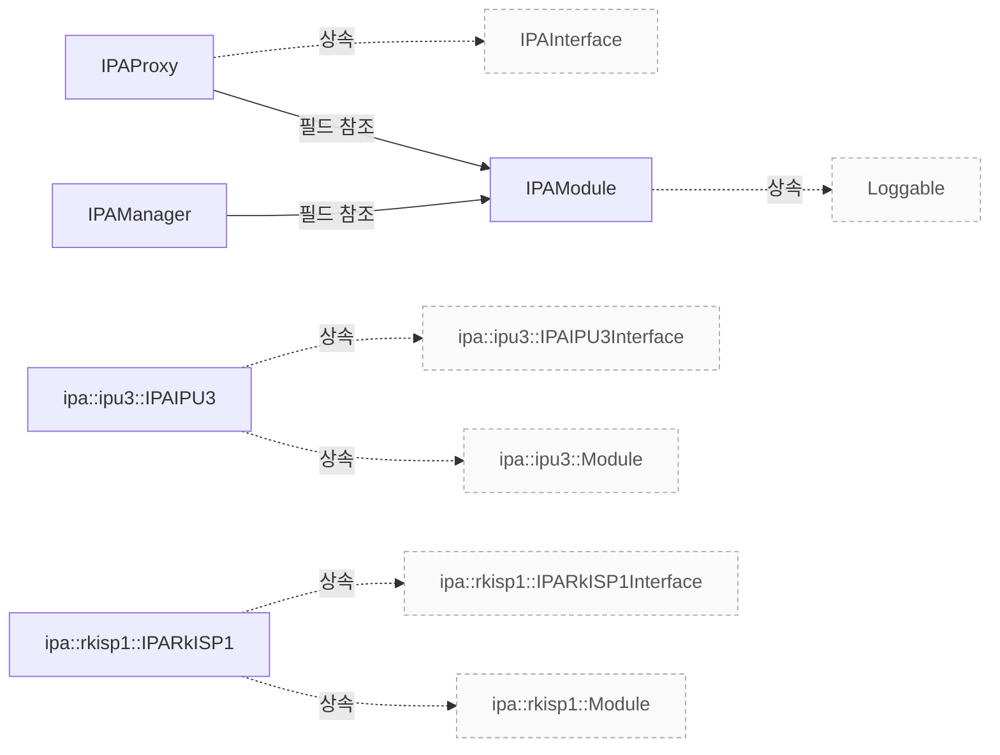

# IPA 관리와 구현 진입점

**IPA 관리자, 모듈, 프록시와 IPU3·RKISP1 구현의 근거 위치를 먼저 확인하세요.**

| 지금 확인할 내용 | 이동할 절 |
|---|---|
| 구조 설명 절을 확인합니다. | [구조 설명](#구조-설명) |
| 클래스 관계 절을 확인합니다. | [클래스 관계](#클래스-관계) |
| 관련 클래스 절을 확인합니다. | [관련 클래스](#관련-클래스) |

## 구조 설명

`libcamera::IPAManager`, `libcamera::IPAModule`, `libcamera::IPAProxy` 및 구체적인 IPA 구현 클래스인 `ipa::ipu3::IPAIPU3`와 `ipa::rkisp1::IPARkISP1`이 핵심 구성 요소입니다. `IPAManager`는 `CameraManager` 와 `IPAModule` 과의 관계를 정의하며, `createIPA()` 메서드를 통해 모듈 생성을 관리합니다 `include/libcamera/internal/ipa_manager.h:29`, `src/libcamera/ipa_manager.cpp:107`.

`IPAProxy` 는 `libcamera::IPAInterface` 를 상속받으며 `IPAModule` 과 연결되고, `resolvePath()` 와 같은 메서드를 통해 프로세스 경계를 확인해야 합니다 `include/libcamera/internal/ipa_proxy.h:22`, `src/libcamera/ipa_proxy.cpp:217`. 반면 `ipa::ipu3::IPAIPU3`와 `ipa::rkisp1::IPARkISP1`은 각각 해당 인터페이스를 상속받지만, 프록시와 알고리즘 사이의 추가 확인이 필요한 경계는 현재 문서에 명시되지 않았습니다.

<!-- sdd:class-diagram -->
## 클래스 관계

화살표의 글자는 추출한 관계를 나타내며, 점선은 상속입니다. 화살표는 참조 대상 또는 기반 클래스를 향합니다. 호출 순서를 뜻하지 않습니다.

<!-- /sdd:class-diagram -->

## 관련 클래스

| 클래스 | 선언 위치 | 상속 | 책임 (주석) |
|---|---|---|---|
| `libcamera::IPAManager` | `include/libcamera/internal/ipa_manager.h:29` | – | 확인 필요 |
| `libcamera::IPAModule` | `include/libcamera/internal/ipa_module.h:21` | `libcamera::Loggable` | 확인 필요 |
| `libcamera::IPAProxy` | `include/libcamera/internal/ipa_proxy.h:22` | `libcamera::IPAInterface` | 확인 필요 |
| `libcamera::ipa::ipu3::IPAIPU3` | `src/ipa/ipu3/ipu3.cpp:139` | `libcamera::ipa::ipu3::IPAIPU3Interface`, `libcamera::ipa::ipu3::Module` | The IPU3 IPA implementation |
| `libcamera::ipa::rkisp1::IPARkISP1` | `src/ipa/rkisp1/rkisp1.cpp:46` | `libcamera::ipa::rkisp1::IPARkISP1Interface`, `libcamera::ipa::rkisp1::Module` | 확인 필요 |

??? note "근거와 검토 정보"
    - 근거 파일: `include/libcamera/internal/ipa_manager.h`, `include/libcamera/internal/ipa_module.h`, `include/libcamera/internal/ipa_proxy.h`, `src/ipa/ipu3/ipu3.cpp`, `src/ipa/rkisp1/rkisp1.cpp`, `src/libcamera/ipa_manager.cpp`, `src/libcamera/ipa_module.cpp`, `src/libcamera/ipa_proxy.cpp`
    - 근거 수준: 코드 확인 (정적 분석, simple_compdb 구성, commit `279d355ef8`)
    - 자동 검사 (인용·문장 및 설정된 구조 검사): 실패 (추출 사실에서 확인되지 않는 한정 이름: ipa::ipu3::IPAIPU3; 추출 사실에서 확인되지 않는 한정 이름: ipa::rkisp1::IPARkISP1)
    - 검토: 2026-09-24 · ollama/qwen3.5:4b · 사람 검토 전

다음 단계: [IPU3 LSC와 상태 연결](ipu3-lsc.md)
