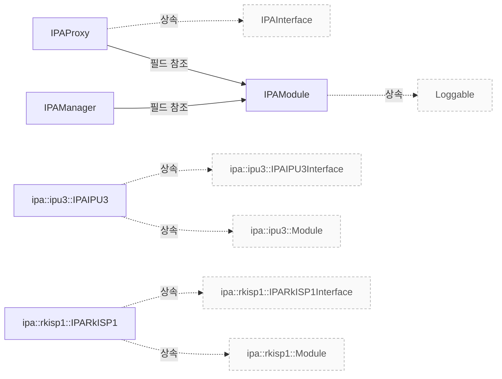

# IPA 관리와 구현 진입점

**IPA 모듈 선택, 스레드·프로세스 경계와 요청·결과 인터페이스를 구현 근거로 확인하세요.**

| 지금 확인할 내용 | 이동할 절 |
|---|---|
| 모듈 탐색과 격리 조건 절을 확인합니다. | [모듈 탐색과 격리 조건](#모듈-탐색과-격리-조건) |
| 스레드와 프로세스 경계 절을 확인합니다. | [스레드와 프로세스 경계](#스레드와-프로세스-경계) |
| 프레임 입력과 결과 인터페이스 절을 확인합니다. | [프레임 입력과 결과 인터페이스](#프레임-입력과-결과-인터페이스) |
| IPA 객체와 종료 순서 절을 확인합니다. | [IPA 객체와 종료 순서](#ipa-객체와-종료-순서) |
| 생성과 IPC 실패 절을 확인합니다. | [생성과 IPC 실패](#생성과-ipc-실패) |
| 보정 전 튜닝 파일 절을 확인합니다. | [보정 전 튜닝 파일](#보정-전-튜닝-파일) |

## 모듈 탐색과 격리 조건

`IPAManager`는 설정의 모듈 경로, 설치 전 빌드 경로, 설치된 시스템 경로 순으로 IPA 후보를 찾습니다. `IPAModule::match()`는 이름의 일치와 최소·최대 버전을 포함하는 범위를 확인합니다. `src/libcamera/ipa_manager.cpp:107`, `src/libcamera/ipa_module.cpp:460`

현재 `createIPA<T>()` 구현은 서명 검증이 성공하면 `T::Threaded`, 실패하면 `T::Isolated`를 생성합니다. 공개 키 지원이 없거나 강제 격리 설정이 켜져 있거나 서명을 검증하지 못하면 격리 경로를 선택합니다. 라이선스 이름만으로 현재의 실행 방식을 판정하지 않습니다. `include/libcamera/internal/ipa_manager.h:35`, `src/libcamera/ipa_manager.cpp:289`

일치하는 모듈이 없거나 생성된 프록시의 `isValid()`가 false이면 `createIPA()`는 null을 반환합니다. 호출자는 프록시를 사용하기 전에 이 결과를 확인해야 합니다. `include/libcamera/internal/ipa_manager.h:35`

근거 원문: [src/libcamera/ipa_manager.cpp:107](#source-7603cbafe8eef490) · [src/libcamera/ipa_module.cpp:460](#source-6e1525c1fc1aa55e) · [include/libcamera/internal/ipa_manager.h:35](#source-2a1bbbc8623a516f) · [src/libcamera/ipa_manager.cpp:289](#source-532f8ffa194bd319)

## 스레드와 프로세스 경계

Threaded 프록시는 모듈을 적재하여 IPA 인터페이스를 만들고 소유합니다. `init()` 이후 ThreadProxy를 전용 스레드로 이동시키며, `start()`는 스레드를 시작하고 Blocking 연결로 호출합니다. 비동기 메서드는 Running 상태에서 Queued 연결로 전달하고, 나머지 동기 메서드는 생성 템플릿의 별도 분기에 따라 직접 호출합니다. `utils/codegen/ipc/generators/libcamera_templates/module_ipa_proxy.cpp.tmpl:48`

Isolated 프록시는 `resolvePath()`로 worker 실행 파일의 경로를 찾고 `IPCPipeUnixSocket`을 생성합니다. 소켓 생성과 `Process::start()`가 성공해야 연결 상태가 설정됩니다. 프로세스를 시작하는 곳은 IPC 파이프이며 `resolvePath()` 자체는 경로만 반환합니다. `utils/codegen/ipc/generators/libcamera_templates/module_ipa_proxy.cpp.tmpl:130`, `src/libcamera/ipa_proxy.cpp:204`, `src/libcamera/ipc_pipe_unixsocket.cpp:27`

Isolated 프록시의 메서드는 인자를 데이터와 파일 디스크립터로 직렬화하여 전달합니다. 인터페이스의 async 메서드는 `sendAsync()`, 동기 메서드는 `sendSync()`를 사용합니다. 동기 호출의 출력과 반환값은 응답에서 역직렬화합니다. `utils/codegen/ipc/generators/libcamera_templates/module_ipa_proxy.cpp.tmpl:130`

근거 원문: [utils/codegen/ipc/generators/libcamera_templates/module_ipa_proxy.cpp.tmpl:48](#source-c7fd6e52f2c537b5) · [utils/codegen/ipc/generators/libcamera_templates/module_ipa_proxy.cpp.tmpl:130](#source-9ff6047b0a70ce66) · [src/libcamera/ipa_proxy.cpp:204](#source-59a673fb7c43c0e0) · [src/libcamera/ipc_pipe_unixsocket.cpp:27](#source-f0268126d3f8c2bc)

## 프레임 입력과 결과 인터페이스

IPU3와 RKISP1 인터페이스는 `init()`·`configure()`에서 센서 정보와 컨트롤 구성을 받고 반환 코드와 IPA 컨트롤 정보를 돌려줍니다. `mapBuffers()`와 `unmapBuffers()`는 버퍼 목록과 ID를 전달하는 인터페이스입니다. `include/libcamera/ipa/ipu3.mojom:19`, `include/libcamera/ipa/rkisp1.mojom:17`

프레임별 `queueRequest()`·`computeParams()`·`processStats()`는 두 인터페이스 모두 async로 선언됩니다. 결과는 `paramsComputed`, `setSensorControls`, `metadataReady` 이벤트로 구분합니다. IPU3의 통계 입력에는 frameTimestamp가 있고 RKISP1의 파라미터 완료 이벤트에는 bytesused가 있으므로 두 인터페이스를 같은 인자 목록으로 취급하면 안 됩니다. `include/libcamera/ipa/ipu3.mojom:19`, `include/libcamera/ipa/rkisp1.mojom:17`

실행 확인 항목: 인터페이스 선언만으로 프레임별 이벤트 도착 순서, 버퍼의 실제 매핑 수명과 하드웨어 적용 시점을 확정할 수 없습니다. 해당 IPA 구현과 파이프라인의 신호 연결을 대조하여 실행을 확인해야 합니다. `include/libcamera/ipa/ipu3.mojom:19`, `include/libcamera/ipa/rkisp1.mojom:17`

근거 원문: [include/libcamera/ipa/ipu3.mojom:19](#source-5a4a0da4800968a4) · [include/libcamera/ipa/rkisp1.mojom:17](#source-7a01de2477d6466e)

## IPA 객체와 종료 순서

`IPAModule::load()`는 공유 객체에서 `ipaCreate` 심볼을 찾습니다. 적재에 성공한 유효 모듈만 `createInterface()`로 인터페이스를 만들 수 있고, Threaded 프록시는 생성된 인터페이스를 unique_ptr로 소유합니다. `src/libcamera/ipa_module.cpp:390`, `utils/codegen/ipc/generators/libcamera_templates/module_ipa_proxy.cpp.tmpl:48`

Threaded 프록시의 `stop()`은 먼저 Stopping 상태의 재진입을 ASSERT로 검사합니다. 그 밖에 Running이 아니면 반환합니다. Running일 때는 Stopping으로 전환하고 Blocking 연결로 IPA stop을 호출한 다음 스레드의 exit·wait를 수행합니다. 대기 중인 InvokeMessage를 전달한 뒤 Stopped로 바꿉니다. `utils/codegen/ipc/generators/libcamera_templates/proxy_functions.tmpl:25`

Isolated 프록시의 소멸자는 IPC 연결이 있으면 Exit 메시지를 비동기로 보냅니다. 이 발췌만으로 worker 종료 확인이나 모든 자원 회수 완료를 보장하지는 않습니다. `utils/codegen/ipc/generators/libcamera_templates/module_ipa_proxy.cpp.tmpl:130`

실행 확인 항목: worker 종료 대기, 비정상 종료 후 복구와 신호 재진입은 Process·worker 구현 및 실제 실행에서 확인해야 합니다. `utils/codegen/ipc/generators/libcamera_templates/module_ipa_proxy.cpp.tmpl:130`, `utils/codegen/ipc/generators/libcamera_templates/proxy_functions.tmpl:25`

근거 원문: [src/libcamera/ipa_module.cpp:390](#source-fadefbb962b2fc44) · [utils/codegen/ipc/generators/libcamera_templates/module_ipa_proxy.cpp.tmpl:48](#source-c7fd6e52f2c537b5) · [utils/codegen/ipc/generators/libcamera_templates/proxy_functions.tmpl:25](#source-eb8f57d7452822da) · [utils/codegen/ipc/generators/libcamera_templates/module_ipa_proxy.cpp.tmpl:130](#source-9ff6047b0a70ce66)

## 생성과 IPC 실패

모듈 적재는 유효하지 않은 모듈, `dlopen()` 실패 또는 `ipaCreate` 심볼 조회 실패에서 false를 반환합니다. Isolated 프록시는 worker 경로가 없거나 IPC 연결에 실패하면 valid 상태를 설정하지 않으며, 관리자는 유효하지 않은 프록시를 null로 반환합니다. `src/libcamera/ipa_module.cpp:390`, `utils/codegen/ipc/generators/libcamera_templates/module_ipa_proxy.cpp.tmpl:130`, `include/libcamera/internal/ipa_manager.h:35`

동기 IPC 호출은 응답을 기다리며 현재 스레드의 이벤트를 처리합니다. 2000ms 타임아웃이 끝나면 `-ETIMEDOUT`을 반환합니다. 전송 실패도 호출자에게 반환합니다. 생성 프록시는 반환값이 있는 메서드에는 오류를 반환하고 void 메서드에서는 로그를 남긴 뒤 반환합니다. `src/libcamera/ipc_pipe_unixsocket.cpp:27`, `utils/codegen/ipc/generators/libcamera_templates/module_ipa_proxy.cpp.tmpl:130`

실행 확인 항목: 이벤트 처리 중 재진입과 worker 장애 시 파이프라인의 요청 취소·재시작 정책은 별도의 구현 검토와 실행 검증이 필요합니다. `src/libcamera/ipc_pipe_unixsocket.cpp:27`, `utils/codegen/ipc/generators/libcamera_templates/module_ipa_proxy.cpp.tmpl:130`

근거 원문: [include/libcamera/internal/ipa_manager.h:35](#source-2a1bbbc8623a516f) · [src/libcamera/ipa_module.cpp:390](#source-fadefbb962b2fc44) · [utils/codegen/ipc/generators/libcamera_templates/module_ipa_proxy.cpp.tmpl:130](#source-9ff6047b0a70ce66) · [src/libcamera/ipc_pipe_unixsocket.cpp:27](#source-f0268126d3f8c2bc)

## 보정 전 튜닝 파일

rkisp1과 mali-c55 파이프라인은 센서 모델 이름에 `.yaml`을 붙인 튜닝 파일을 먼저 찾고, 대체 파일로 `uncalibrated.yaml`을 넘깁니다. `IPAProxy::configurationFile()`은 첫 이름의 파일을 찾지 못하면 대체 이름으로 같은 탐색을 반복하고 경고 로그를 남깁니다. `src/libcamera/pipeline/rkisp1/rkisp1.cpp:406`, `src/libcamera/pipeline/mali-c55/mali-c55.cpp:468`, `src/libcamera/ipa_proxy.cpp:174`

rkisp1의 `uncalibrated.yaml`은 `algorithms` 목록에 Agc, Awb, BlackLevelCorrection, Ccm, GammaOutCorrection을 올립니다. mali-c55의 `uncalibrated.yaml`은 Agc, Awb, BlackLevelCorrection, Ccm을 올립니다. 두 파일 모두 알고리즘 항목에 매개변수를 적지 않습니다. `src/ipa/rkisp1/data/uncalibrated.yaml:1`, `src/ipa/mali-c55/data/uncalibrated.yaml:1`

실행 확인 항목: 매개변수가 없을 때 각 알고리즘이 쓰는 기본값과, 보정하지 않은 센서에서 얻는 화질은 각 알고리즘 구현과 실제 촬영으로 확인해야 합니다. `src/ipa/rkisp1/data/uncalibrated.yaml:1`, `src/ipa/mali-c55/data/uncalibrated.yaml:1`

근거 원문: [src/libcamera/pipeline/rkisp1/rkisp1.cpp:406](#source-a117437c7ec61db3) · [src/libcamera/pipeline/mali-c55/mali-c55.cpp:468](#source-efc0c3fc5cf7acef) · [src/libcamera/ipa_proxy.cpp:174](#source-4000376c954f5327) · [src/ipa/rkisp1/data/uncalibrated.yaml:1](#source-c3d57577d02a4dc3) · [src/ipa/mali-c55/data/uncalibrated.yaml:1](#source-9146c9052851a10f)

## 소프트웨어 ISP 셰이더의 렌즈 음영 보정

소프트웨어 ISP의 두 bayer 프래그먼트 셰이더는 `APPLY_LSC`가 정의되어 컴파일될 때만 `lsc_tex` 텍스처를 선언하고 렌즈 음영 보정을 적용합니다. 보정은 블랙 레벨을 뺀 직후, AWB 게인을 곱하기 전에 RGB 값에 텍스처의 RGB 값을 곱하는 방식입니다. `src/libcamera/shaders/bayer_1x_packed.frag:1`, `src/libcamera/shaders/bayer_unpacked.frag:1`

`bayer_1x_packed.frag`의 주석은 텍스처 값이 UQ<2, 6> 형식이므로 4.0을 곱해 원래의 부동소수점 값으로 되돌린다고 설명합니다. 텍스처 좌표는 packed 셰이더가 `textureOut`을, unpacked 셰이더가 `center.xy`를 씁니다. `src/libcamera/shaders/bayer_1x_packed.frag:1`, `src/libcamera/shaders/bayer_unpacked.frag:1`

소프트웨어 ISP IPA 인터페이스의 `init()`는 `ret`과 `ipaControls` 외에 `ccmEnabled`와 `lscEnabled` 두 플래그를 결과로 돌려줍니다. `include/libcamera/ipa/softisp.mojom:1`

실행 확인 항목: `lscEnabled` 값이 셰이더의 `APPLY_LSC` 컴파일로 이어지는 경로, `lsc_tex`에 올리는 표와 색온도에 따른 표 선택은 디베이어 구현과 IPA에서 확인해야 하며 이 발췌로는 확인할 수 없습니다. `src/libcamera/shaders/bayer_1x_packed.frag:1`, `src/libcamera/shaders/bayer_unpacked.frag:1`, `include/libcamera/ipa/softisp.mojom:1`

근거 원문: [src/libcamera/shaders/bayer_1x_packed.frag:1](#source-411c929d335b5652) · [src/libcamera/shaders/bayer_unpacked.frag:1](#source-ca9e8dcf4c2797f8) · [include/libcamera/ipa/softisp.mojom:1](#source-df8e8976167a0311)

??? note "설계 질문과 검증 범위"
    질문별 답변과 근거 연결을 검사했습니다. 의미와 실행 결과는 사람 검토가 필요합니다.
    
    | 설계 질문 | 설명 위치 | 확인 범위 |
    |---|---|---|
    | 어떤 IPA 모듈과 실행 방식이 선택됩니까? | [모듈 탐색과 격리 조건](#모듈-탐색과-격리-조건) | 코드 근거와 설명 연결 |
    | 동기 호출과 비동기 호출은 어디에서 실행됩니까? | [스레드와 프로세스 경계](#스레드와-프로세스-경계) | 코드 근거와 설명 연결 |
    | 파이프라인과 알고리즘은 어떤 입력과 결과를 주고받습니까? | [프레임 입력과 결과 인터페이스](#프레임-입력과-결과-인터페이스) | 코드 근거와 설명 연결 · 실행 확인 항목 별도 |
    | 인터페이스를 만들고 비동기 처리를 끝내는 계약은 무엇입니까? | [IPA 객체와 종료 순서](#ipa-객체와-종료-순서) | 코드 근거와 설명 연결 · 실행 확인 항목 별도 |
    | 모듈 생성과 IPC 오류는 어떻게 관찰됩니까? | [생성과 IPC 실패](#생성과-ipc-실패) | 코드 근거와 설명 연결 · 실행 확인 항목 별도 |
    | 센서별 튜닝 파일이 없으면 어떤 파일과 알고리즘이 쓰입니까? | [보정 전 튜닝 파일](#보정-전-튜닝-파일) | 코드 근거와 설명 연결 · 실행 확인 항목 별도 |
    | 소프트웨어 ISP의 GPU 셰이더는 렌즈 음영 보정을 어느 단계에 적용합니까? | [소프트웨어 ISP 셰이더의 렌즈 음영 보정](#소프트웨어-isp-셰이더의-렌즈-음영-보정) | 코드 근거와 설명 연결 · 실행 확인 항목 별도 |

## 소스 근거

같은 발췌는 한 번만 싣습니다. 필요한 원문을 펼쳐 설명과 대조하세요.

<a id="source-7603cbafe8eef490"></a>

??? note "소스 근거: src/libcamera/ipa_manager.cpp:107"
    `src/libcamera/ipa_manager.cpp:107`에서 시작하는 발췌입니다. 종료 줄은 162이며, 아래 원문을 설명과 대조할 수 있습니다.
    
    SHA-256: `ed1b15d5743b434eb29e34ba981de978ff4dd9bcb186859e4800931a525e766c`
    
    ```text
    IPAManager::IPAManager(const CameraManager &cm)
    	: cm_(cm)
    {
    	const GlobalConfiguration &configuration = cm._d()->configuration();
    
    #if HAVE_IPA_PUBKEY
    	if (!pubKey_.isValid())
    		LOG(IPAManager, Warning) << "Public key not valid";
    
    	forceIsolation_ = configuration.option<bool>({ "ipa", "force_isolation" })
    				       .value_or(false);
    #endif
    
    	unsigned int ipaCount = 0;
    
    	/* User-specified paths take precedence. */
    	const auto modulePaths =
    		configuration.listOption({ "ipa", "module_paths" })
    			.value_or(utils::defopt);
    	for (const auto &dir : modulePaths) {
    		if (dir.empty())
    			continue;
    
    		ipaCount += addDir(dir.c_str());
    	}
    
    	if (!modulePaths.empty() && !ipaCount)
    		LOG(IPAManager, Warning) << "No IPA found in '"
    					 << utils::join(modulePaths, ":")
    					 << "'";
    
    	/*
    	 * When libcamera is used before it is installed, load IPAs from the
    	 * same build directory as the libcamera library itself.
    	 */
    	std::string root = utils::libcameraBuildPath();
    	if (!root.empty()) {
    		std::string ipaBuildPath = root + "src/ipa";
    		constexpr int maxDepth = 2;
    
    		LOG(IPAManager, Info)
    			<< "libcamera is not installed. Adding '"
    			<< ipaBuildPath << "' to the IPA search path";
    
    		ipaCount += addDir(ipaBuildPath.c_str(), maxDepth);
    	}
    
    	/* Finally try to load IPAs from the installed system path. */
    	ipaCount += addDir(IPA_MODULE_DIR);
    
    	if (!ipaCount)
    		LOG(IPAManager, Warning)
    			<< "No IPA found in '" IPA_MODULE_DIR "'";
    }
    
    IPAManager::~IPAManager() = default;
    ```

<a id="source-6e1525c1fc1aa55e"></a>

??? note "소스 근거: src/libcamera/ipa_module.cpp:460"
    `src/libcamera/ipa_module.cpp:460`에서 시작하는 발췌입니다. 종료 줄은 478이며, 아래 원문을 설명과 대조할 수 있습니다.
    
    SHA-256: `99940db9ea353ad0d8282b7c2148578f4c6054d785ef7aaf690d522b52bafb5b`
    
    ```text
    \brief Verify if the IPA module matches a given name
     * \param[in] name The IPA module name
     * \param[in] minVersion Minimum acceptable version of IPA module
     * \param[in] maxVersion Maximum acceptable version of IPA module
     *
     * This function checks if this IPA module matches the requested \a name
     * and the input version range.
     *
     * \return True if the IPA module matches, or false otherwise
     */
    bool IPAModule::match(const char *name, uint32_t minVersion,
    		      uint32_t maxVersion) const
    {
    	return info_.pipelineVersion >= minVersion &&
    	       info_.pipelineVersion <= maxVersion &&
    	       !strcmp(info_.name, name);
    }
    
    std::string IPAModule::logPrefix()
    ```

<a id="source-2a1bbbc8623a516f"></a>

??? note "소스 근거: include/libcamera/internal/ipa_manager.h:35"
    `include/libcamera/internal/ipa_manager.h:35`에서 시작하는 발췌입니다. 종료 줄은 58이며, 아래 원문을 설명과 대조할 수 있습니다.
    
    SHA-256: `e0bd5192ea24a8b39d3df7b7b93c8b17614663a0144f6dd0741d410fa321d458`
    
    ```text
    template<typename T>
    	std::unique_ptr<T> createIPA(const char *name, uint32_t minVersion,
    				     uint32_t maxVersion)
    	{
    		IPAModule *m = module(name, minVersion, maxVersion);
    		if (!m)
    			return nullptr;
    
    		auto proxy = [&]() -> std::unique_ptr<T> {
    			if (isSignatureValid(m))
    				return std::make_unique<typename T::Threaded>(m, cm_);
    			else
    				return std::make_unique<typename T::Isolated>(m, cm_);
    		}();
    
    		if (!proxy->isValid()) {
    			LOG(IPAManager, Error) << "Failed to load proxy";
    			return nullptr;
    		}
    
    		return proxy;
    	}
    
    #if HAVE_IPA_PUBKEY
    ```

<a id="source-532f8ffa194bd319"></a>

??? note "소스 근거: src/libcamera/ipa_manager.cpp:289"
    `src/libcamera/ipa_manager.cpp:289`에서 시작하는 발췌입니다. 종료 줄은 319이며, 아래 원문을 설명과 대조할 수 있습니다.
    
    SHA-256: `f657ce54df77453510108b02060166edd7506c982d13d3e4868fadee4065a677`
    
    ```text
    bool IPAManager::isSignatureValid([[maybe_unused]] IPAModule *ipa) const
    {
    #if HAVE_IPA_PUBKEY
    	if (forceIsolation_) {
    		LOG(IPAManager, Debug)
    			<< "Isolation of IPA module " << ipa->path()
    			<< " forced through configuration";
    		return false;
    	}
    
    	File file{ ipa->path() };
    	if (!file.open(File::OpenModeFlag::ReadOnly))
    		return false;
    
    	std::span<uint8_t> data = file.map();
    	if (data.empty())
    		return false;
    
    	bool valid = pubKey_.verify(data, ipa->signature());
    
    	LOG(IPAManager, Debug)
    		<< "IPA module " << ipa->path() << " signature is "
    		<< (valid ? "valid" : "not valid");
    
    	return valid;
    #else
    	return false;
    #endif
    }
    
    } /* namespace libcamera */
    ```

<a id="source-c7fd6e52f2c537b5"></a>

??? note "소스 근거: utils/codegen/ipc/generators/libcamera_templates/module_ipa_proxy.cpp.tmpl:48"
    `utils/codegen/ipc/generators/libcamera_templates/module_ipa_proxy.cpp.tmpl:48`에서 시작하는 발췌입니다. 종료 줄은 128이며, 아래 원문을 설명과 대조할 수 있습니다.
    
    SHA-256: `af4b12c81ffee2e9979c01a7e7eb188f5568d258ba03e522b60a3608dc226abd`
    
    ```text
    {{proxy_name}}Threaded::{{proxy_name}}Threaded(IPAModule *ipam, const CameraManager &cm)
    	: {{proxy_name}}(ipam, cm), thread_("{{proxy_name}}")
    {
    	LOG(IPAProxy, Debug)
    		<< "initializing {{module_name}} proxy in thread: loading IPA from "
    		<< ipam->path();
    
    	if (!ipam->load())
    		return;
    
    	IPAInterface *ipai = ipam->createInterface();
    	if (!ipai) {
    		LOG(IPAProxy, Error)
    			<< "Failed to create IPA context for " << ipam->path();
    		return;
    	}
    
    	ipa_ = std::unique_ptr<{{interface_name}}>(static_cast<{{interface_name}} *>(ipai));
    	proxy_.setIPA(ipa_.get());
    
    
    	ipa_->{{method.mojom_name}}.connect(this, &{{proxy_name}}Threaded::{{method.mojom_name}}Handler);
    
    
    	valid_ = true;
    }
    
    {{proxy_name}}Threaded::~{{proxy_name}}Threaded() = default;
    
    
    {{proxy_funcs.func_sig(proxy_name + "Threaded", method)}}
    {
    
    	{{proxy_funcs.stop_thread_body()}}
    
    	{{ method|method_return_value + " _ret = " if method|method_return_value != "void" -}}
    	ipa_->{{method.mojom_name}}(
    	
    		{{param}}{{- ", " if not loop.last}}
    	
    );
    
    	proxy_.moveToThread(&thread_);
    
    	return {{ "_ret" if method|method_return_value != "void" }};
    
    	state_ = ProxyRunning;
    	thread_.start();
    
    	return proxy_.invokeMethod(&ThreadProxy::start, ConnectionTypeBlocking
    	{{- ", " if method|method_param_names}}
    	
    		{{param}}{{- ", " if not loop.last}}
    	
    );
    
    	return ipa_->{{method.mojom_name}}(
    	
    		{{param}}{{- ", " if not loop.last}}
    	
    );
    
    	ASSERT(state_ == ProxyRunning);
    	proxy_.invokeMethod(&ThreadProxy::{{method.mojom_name}}, ConnectionTypeQueued
    	
    		, {{param}}
    	
    );
    
    }
    
    
    
    {{proxy_funcs.func_sig(proxy_name + "Threaded", method, "Handler")}}
    {
    	ASSERT(state_ != ProxyStopped);
    	{{method.mojom_name}}.emit({{method.parameters|params_comma_sep}});
    }
    
    
    /* ========================================================================== */
    ```

<a id="source-9ff6047b0a70ce66"></a>

??? note "소스 근거: utils/codegen/ipc/generators/libcamera_templates/module_ipa_proxy.cpp.tmpl:130"
    `utils/codegen/ipc/generators/libcamera_templates/module_ipa_proxy.cpp.tmpl:130`에서 시작하는 발췌입니다. 종료 줄은 212이며, 아래 원문을 설명과 대조할 수 있습니다.
    
    SHA-256: `dd0ba6e352ffacd6c27c6ff5bb447af14838d75ca6aed8d056855ec442a97744`
    
    ```text
    {{proxy_name}}Isolated::{{proxy_name}}Isolated(IPAModule *ipam, const CameraManager &cm)
    	: {{proxy_name}}(ipam, cm),
    	  controlSerializer_(ControlSerializer::Role::Proxy), seq_(0)
    {
    	LOG(IPAProxy, Debug)
    		<< "initializing {{module_name}} proxy in isolation: loading IPA from "
    		<< ipam->path();
    
    	const std::string proxyWorkerPath = resolvePath("{{module_name}}_ipa_proxy");
    	if (proxyWorkerPath.empty()) {
    		LOG(IPAProxy, Error) << "Failed to get proxy worker path";
    		return;
    	}
    
    	auto ipc = std::make_unique<IPCPipeUnixSocket>(ipam->path().c_str(),
    						       proxyWorkerPath.c_str());
    	if (!ipc->isConnected()) {
    		LOG(IPAProxy, Error) << "Failed to create IPCPipe";
    		return;
    	}
    
    	ipc->recv.connect(this, &{{proxy_name}}Isolated::recvMessage);
    
    	ipc_ = std::move(ipc);
    	valid_ = true;
    }
    
    {{proxy_name}}Isolated::~{{proxy_name}}Isolated()
    {
    	if (ipc_) {
    		IPCMessage::Header header =
    			{ static_cast<uint32_t>({{cmd_enum_name}}::Exit), seq_++ };
    		IPCMessage msg(header);
    		ipc_->sendAsync(msg);
    	}
    }
    
    
    {{proxy_funcs.func_sig(proxy_name + "Isolated", method)}}
    {
    
    	controlSerializer_.reset();
    
    
    
    	IPCMessage::Header _header = { static_cast<uint32_t>({{cmd}}), seq_++ };
    	IPCMessage _ipcInputBuf(_header);
    
    	IPCMessage _ipcOutputBuf;
    
    
    {{proxy_funcs.serialize_call(method|method_param_inputs, '_ipcInputBuf.data()', '_ipcInputBuf.fds()')}}
    
    
    	int _ret = ipc_->sendAsync(_ipcInputBuf);
    
    	int _ret = ipc_->sendSync(_ipcInputBuf
    {{- ", &_ipcOutputBuf" if has_output -}}
    );
    
    	if (_ret < 0) {
    		LOG(IPAProxy, Error) << "Failed to call {{method.mojom_name}}: " << _ret;
    
    		return static_cast<{{method|method_return_value}}>(_ret);
    
    		return;
    
    	}
    
    	{{method|method_return_value}} _retValue = IPADataSerializer<{{method|method_return_value}}>::deserialize(_ipcOutputBuf.data(), 0);
    
    {{proxy_funcs.deserialize_call(method|method_param_outputs, '_ipcOutputBuf.data()', '_ipcOutputBuf.fds()', init_offset = method|method_return_value|byte_width|int)}}
    
    	return _retValue;
    
    
    {{proxy_funcs.deserialize_call(method|method_param_outputs, '_ipcOutputBuf.data()', '_ipcOutputBuf.fds()')}}
    
    }
    
    
    
    void {{proxy_name}}Isolated::recvMessage(
    ```

<a id="source-59a673fb7c43c0e0"></a>

??? note "소스 근거: src/libcamera/ipa_proxy.cpp:204"
    `src/libcamera/ipa_proxy.cpp:204`에서 시작하는 발췌입니다. 종료 줄은 261이며, 아래 원문을 설명과 대조할 수 있습니다.
    
    SHA-256: `8cbcadf7036cdb391f4c48af8562cb637752242f9564f1118c949a62df9dbd77`
    
    ```text
    \brief Find a valid full path for a proxy worker for a given executable name
     * \param[in] file File name of proxy worker executable
     *
     * A proxy worker's executable could be found in either the global installation
     * directory, or in the paths specified by the environment variable
     * LIBCAMERA_IPA_PROXY_PATH. This function checks the global install directory
     * first, then LIBCAMERA_IPA_PROXY_PATH in order, and returns the full path to
     * the proxy worker executable that is specified by file. The proxy worker
     * executable shall have exec permission.
     *
     * \return The full path to the proxy worker executable, or an empty string if
     * no valid executable path
     */
    std::string IPAProxy::resolvePath(const std::string &file) const
    {
    	std::string proxyFile = "/" + file;
    
    	/* Try paths from the configuration first. */
    	for (const auto &dir : execPaths_) {
    		if (dir.empty())
    			continue;
    
    		std::string proxyPath = dir + proxyFile;
    		if (!access(proxyPath.c_str(), X_OK))
    			return proxyPath;
    	}
    
    	/*
    	 * When libcamera is used before it is installed, load proxy workers
    	 * from the same build directory as the libcamera directory itself.
    	 * This requires identifying the path of the libcamera.so, and
    	 * referencing a relative path for the proxy workers from that point.
    	 */
    	std::string root = utils::libcameraBuildPath();
    	if (!root.empty()) {
    		std::string ipaProxyDir = root + "src/libcamera/proxy/worker";
    
    		LOG(IPAProxy, Info)
    			<< "libcamera is not installed. Loading proxy workers from '"
    			<< ipaProxyDir << "'";
    
    		std::string proxyPath = ipaProxyDir + proxyFile;
    		if (!access(proxyPath.c_str(), X_OK))
    			return proxyPath;
    
    		return std::string();
    	}
    
    	/* Else try finding the exec target from the install directory. */
    	std::string proxyPath = std::string(IPA_PROXY_DIR) + proxyFile;
    	if (!access(proxyPath.c_str(), X_OK))
    		return proxyPath;
    
    	return std::string();
    }
    
    /**
     * \var IPAProxy::valid_
    ```

<a id="source-f0268126d3f8c2bc"></a>

??? note "소스 근거: src/libcamera/ipc_pipe_unixsocket.cpp:27"
    `src/libcamera/ipc_pipe_unixsocket.cpp:27`에서 시작하는 발췌입니다. 종료 줄은 144이며, 아래 원문을 설명과 대조할 수 있습니다.
    
    SHA-256: `0abe488ceae72cca0a5b96c7223ffc4cc412ab18f94765fd7f001dc450544f40`
    
    ```text
    IPCPipeUnixSocket::IPCPipeUnixSocket(const char *ipaModulePath,
    				     const char *ipaProxyWorkerPath)
    	: IPCPipe()
    {
    	socket_ = std::make_unique<IPCUnixSocket>();
    	UniqueFD fd = socket_->create();
    	if (!fd.isValid()) {
    		LOG(IPCPipe, Error) << "Failed to create socket";
    		return;
    	}
    	socket_->readyRead.connect(this, &IPCPipeUnixSocket::readyRead);
    
    	std::array args{ std::string(ipaModulePath), std::to_string(fd.get()) };
    	std::array fds{ fd.get() };
    
    	proc_ = std::make_unique<Process>();
    	int ret = proc_->start(ipaProxyWorkerPath, args, fds);
    	if (ret) {
    		LOG(IPCPipe, Error)
    			<< "Failed to start proxy worker process";
    		return;
    	}
    
    	connected_ = true;
    }
    
    IPCPipeUnixSocket::~IPCPipeUnixSocket()
    {
    }
    
    int IPCPipeUnixSocket::sendSync(const IPCMessage &in, IPCMessage *out)
    {
    	IPCUnixSocket::Payload response;
    
    	int ret = call(in.payload(), &response, in.header().cookie);
    	if (ret) {
    		LOG(IPCPipe, Error) << "Failed to call sync";
    		return ret;
    	}
    
    	if (out)
    		*out = IPCMessage(response);
    
    	return 0;
    }
    
    int IPCPipeUnixSocket::sendAsync(const IPCMessage &data)
    {
    	int ret = socket_->send(data.payload());
    	if (ret) {
    		LOG(IPCPipe, Error) << "Failed to call async";
    		return ret;
    	}
    
    	return 0;
    }
    
    void IPCPipeUnixSocket::readyRead()
    {
    	IPCUnixSocket::Payload payload;
    	int ret = socket_->receive(&payload);
    	if (ret) {
    		LOG(IPCPipe, Error) << "Receive message failed" << ret;
    		return;
    	}
    
    	/* \todo Use span to avoid the double copy when callData is found. */
    	if (payload.data.size() < sizeof(IPCMessage::Header)) {
    		LOG(IPCPipe, Error) << "Not enough data received";
    		return;
    	}
    
    	IPCMessage ipcMessage(payload);
    
    	auto callData = callData_.find(ipcMessage.header().cookie);
    	if (callData != callData_.end()) {
    		*callData->second.response = std::move(payload);
    		callData->second.done = true;
    		return;
    	}
    
    	/* Received unexpected data, this means it's a call from the IPA. */
    	recv.emit(ipcMessage);
    }
    
    int IPCPipeUnixSocket::call(const IPCUnixSocket::Payload &message,
    			    IPCUnixSocket::Payload *response, uint32_t cookie)
    {
    	Timer timeout;
    	int ret;
    
    	const auto result = callData_.insert({ cookie, { response, false } });
    	const auto &iter = result.first;
    
    	ret = socket_->send(message);
    	if (ret) {
    		callData_.erase(iter);
    		return ret;
    	}
    
    	/* \todo Make this less dangerous, see IPCPipe::sendSync() */
    	timeout.start(2000ms);
    	while (!iter->second.done) {
    		if (!timeout.isRunning()) {
    			LOG(IPCPipe, Error) << "Call timeout!";
    			callData_.erase(iter);
    			return -ETIMEDOUT;
    		}
    
    		Thread::current()->eventDispatcher()->processEvents();
    	}
    
    	callData_.erase(iter);
    
    	return 0;
    }
    
    } /* namespace libcamera */
    ```

<a id="source-5a4a0da4800968a4"></a>

??? note "소스 근거: include/libcamera/ipa/ipu3.mojom:19"
    `include/libcamera/ipa/ipu3.mojom:19`에서 시작하는 발췌입니다. 종료 줄은 44이며, 아래 원문을 설명과 대조할 수 있습니다.
    
    SHA-256: `f1969299336634cdd04e42402648a452126032a25540ad5c78bd2c804362a381`
    
    ```text
    interface IPAIPU3Interface {
    	init(libcamera.IPASettings settings,
    	     libcamera.IPACameraSensorInfo sensorInfo,
    	     libcamera.ControlInfoMap sensorControls)
    		=> (int32 ret, libcamera.ControlInfoMap ipaControls);
    	start() => (int32 ret);
    	stop();
    
    	configure(IPAConfigInfo configInfo)
    		=> (int32 ret, libcamera.ControlInfoMap ipaControls);
    
    	mapBuffers(array<libcamera.IPABuffer> buffers);
    	unmapBuffers(array<uint32> ids);
    
    	[async] queueRequest(uint32 frame, libcamera.ControlList controls);
    	[async] computeParams(uint32 frame, uint32 bufferId);
    	[async] processStats(uint32 frame, int64 frameTimestamp,
    			     uint32 bufferId, libcamera.ControlList sensorControls);
    };
    
    interface IPAIPU3EventInterface {
    	setSensorControls(uint32 frame, libcamera.ControlList sensorControls,
    			  libcamera.ControlList lensControls);
    	paramsComputed(uint32 frame);
    	metadataReady(uint32 frame, libcamera.ControlList metadata);
    };
    ```

<a id="source-7a01de2477d6466e"></a>

??? note "소스 근거: include/libcamera/ipa/rkisp1.mojom:17"
    `include/libcamera/ipa/rkisp1.mojom:17`에서 시작하는 발췌입니다. 종료 줄은 43이며, 아래 원문을 설명과 대조할 수 있습니다.
    
    SHA-256: `32d657315ff8eac800254f0a5d39462d55bb4b0ef6ee5717930f3d3b8504162b`
    
    ```text
    interface IPARkISP1Interface {
    	init(libcamera.IPASettings settings,
    	     uint32 hwRevision, uint32 supportedBlocks,
    	     libcamera.IPACameraSensorInfo sensorInfo,
    	     libcamera.ControlInfoMap sensorControls)
    		=> (int32 ret, libcamera.ControlInfoMap ipaControls);
    	start() => (int32 ret);
    	stop();
    
    	configure(IPAConfigInfo configInfo,
    		  map<uint32, libcamera.IPAStream> streamConfig)
    		=> (int32 ret, libcamera.ControlInfoMap ipaControls);
    
    	mapBuffers(array<libcamera.IPABuffer> buffers);
    	unmapBuffers(array<uint32> ids);
    
    	[async] queueRequest(uint32 frame, libcamera.ControlList reqControls);
    	[async] computeParams(uint32 frame, uint32 bufferId);
    	[async] processStats(uint32 frame, uint32 bufferId,
    			     libcamera.ControlList sensorControls);
    };
    
    interface IPARkISP1EventInterface {
    	paramsComputed(uint32 frame, uint32 bytesused);
    	setSensorControls(uint32 frame, libcamera.ControlList sensorControls);
    	metadataReady(uint32 frame, libcamera.ControlList metadata);
    };
    ```

<a id="source-fadefbb962b2fc44"></a>

??? note "소스 근거: src/libcamera/ipa_module.cpp:390"
    `src/libcamera/ipa_module.cpp:390`에서 시작하는 발췌입니다. 종료 줄은 460이며, 아래 원문을 설명과 대조할 수 있습니다.
    
    SHA-256: `a1e13344bfc27e191c6c24c682f3a088446d42c99b9497c6e831ab1b97b55619`
    
    ```text
    \brief Load the IPA implementation factory from the shared object
     *
     * The IPA module shared object implements an IPAInterface object to be used
     * by pipeline handlers. This function loads the factory function from the
     * shared object. Later, createInterface() can be called to instantiate the
     * IPAInterface.
     *
     * This function only needs to be called successfully once, after which
     * createInterface() can be called as many times as IPAInterface instances are
     * needed.
     *
     * Calling this function on an invalid module (as returned by isValid()) is
     * an error.
     *
     * \return True if load was successful, or already loaded, and false otherwise
     */
    bool IPAModule::load()
    {
    	if (!valid_)
    		return false;
    
    	if (loaded_)
    		return true;
    
    	dlHandle_ = dlopen(libPath_.c_str(), RTLD_LAZY);
    	if (!dlHandle_) {
    		LOG(IPAModule, Error)
    			<< "Failed to open IPA module shared object: "
    			<< dlerror();
    		return false;
    	}
    
    	void *symbol = dlsym(dlHandle_, "ipaCreate");
    	if (!symbol) {
    		LOG(IPAModule, Error)
    			<< "Failed to load ipaCreate() from IPA module shared object: "
    			<< dlerror();
    		dlclose(dlHandle_);
    		dlHandle_ = nullptr;
    		return false;
    	}
    
    	ipaCreate_ = reinterpret_cast<IPAIntfFactory>(symbol);
    
    	loaded_ = true;
    
    	return true;
    }
    
    /**
     * \brief Instantiate an IPA interface
     *
     * After loading the IPA module with load(), this function creates an instance
     * of the IPA module interface.
     *
     * Calling this function on a module that has not yet been loaded, or an
     * invalid module (as returned by load() and isValid(), respectively) is
     * an error.
     *
     * \return The IPA interface on success, or nullptr on error
     */
    IPAInterface *IPAModule::createInterface()
    {
    	if (!valid_ || !loaded_)
    		return nullptr;
    
    	return ipaCreate_();
    }
    
    /**
     * \brief Verify if the IPA module matches
    ```

<a id="source-eb8f57d7452822da"></a>

??? note "소스 근거: utils/codegen/ipc/generators/libcamera_templates/proxy_functions.tmpl:25"
    `utils/codegen/ipc/generators/libcamera_templates/proxy_functions.tmpl:25`에서 시작하는 발췌입니다. 종료 줄은 40이며, 아래 원문을 설명과 대조할 수 있습니다.
    
    SHA-256: `40789903a76fad82ef27bf4ecd2c79ed2c47d0e0ad9d6583fba12e9cf072884b`
    
    ```text
    
    	ASSERT(state_ != ProxyStopping);
    	if (state_ != ProxyRunning)
    		return;
    
    	state_ = ProxyStopping;
    
    	proxy_.invokeMethod(&ThreadProxy::stop, ConnectionTypeBlocking);
    
    	thread_.exit();
    	thread_.wait();
    
    	Thread::current()->dispatchMessages(Message::Type::InvokeMessage, this);
    
    	state_ = ProxyStopped;
    
    ```

<a id="source-a117437c7ec61db3"></a>

??? note "소스 근거: src/libcamera/pipeline/rkisp1/rkisp1.cpp:406"
    `src/libcamera/pipeline/rkisp1/rkisp1.cpp:406`에서 시작하는 발췌입니다. 종료 줄은 408이며, 아래 원문을 설명과 대조할 수 있습니다.
    
    SHA-256: `5085c39368b264636b7bc7386979e019ea9cd60621335cc42d1e3ad28d810c6c`
    
    ```text
    /* The IPA tuning file is made from the sensor name. */
    	std::string ipaTuningFile =
    		ipa_->configurationFile(sensor_->model() + ".yaml", "uncalibrated.yaml");
    ```

<a id="source-efc0c3fc5cf7acef"></a>

??? note "소스 근거: src/libcamera/pipeline/mali-c55/mali-c55.cpp:468"
    `src/libcamera/pipeline/mali-c55/mali-c55.cpp:468`에서 시작하는 발췌입니다. 종료 줄은 469이며, 아래 원문을 설명과 대조할 수 있습니다.
    
    SHA-256: `226c3c21c4b760c25b2a3323369bce67c92f92db80b9fcef19589a44af6eaa2a`
    
    ```text
    std::string ipaTuningFile = ipa_->configurationFile(sensor()->model() + ".yaml",
    							    "uncalibrated.yaml");
    ```

<a id="source-4000376c954f5327"></a>

??? note "소스 근거: src/libcamera/ipa_proxy.cpp:174"
    `src/libcamera/ipa_proxy.cpp:174`에서 시작하는 발췌입니다. 종료 줄은 199이며, 아래 원문을 설명과 대조할 수 있습니다.
    
    SHA-256: `6c48d1f3994c22addbc1b338c87cf7b166f9fee0f9223ecf718a254be0aa93a8`
    
    ```text
    std::string IPAProxy::configurationFile(const std::string &name,
    					const std::string &fallbackName) const
    {
    	/*
    	 * The IPA module name can be used as-is to build directory names as it
    	 * has been validated when loading the module.
    	 */
    	const std::string ipaName = ipam_->info().name;
    	std::string confPath = ipaConfigurationFile(ipaName, name, configPaths_);
    	if (!confPath.empty()) {
    		LOG(IPAProxy, Info) << "Using tuning file " << confPath;
    		return confPath;
    	}
    
    	if (fallbackName.empty()) {
    		LOG(IPAProxy, Error)
    			<< "Configuration file '" << name
    			<< "' not found for IPA module '" << ipaName << "'";
    		return std::string();
    	}
    
    	confPath = ipaConfigurationFile(ipaName, fallbackName, configPaths_);
    	LOG(IPAProxy, Warning)
    		<< "Configuration file '" << name
    		<< "' not found for IPA module '" << ipaName
    		<< "', falling back to '" << confPath << "'";
    ```

<a id="source-c3d57577d02a4dc3"></a>

??? note "소스 근거: src/ipa/rkisp1/data/uncalibrated.yaml:1"
    `src/ipa/rkisp1/data/uncalibrated.yaml:1`에서 시작하는 발췌입니다. 종료 줄은 11이며, 아래 원문을 설명과 대조할 수 있습니다.
    
    SHA-256: `f3e8a3a6257b7fb82f16cf5c8239901d57bcc15023908c8994dcac3714e9e648`
    
    ```text
    # SPDX-License-Identifier: CC0-1.0
    %YAML 1.1
    ---
    version: 1
    algorithms:
      - Agc:
      - Awb:
      - BlackLevelCorrection:
      - Ccm:
      - GammaOutCorrection:
    ...
    ```

<a id="source-9146c9052851a10f"></a>

??? note "소스 근거: src/ipa/mali-c55/data/uncalibrated.yaml:1"
    `src/ipa/mali-c55/data/uncalibrated.yaml:1`에서 시작하는 발췌입니다. 종료 줄은 10이며, 아래 원문을 설명과 대조할 수 있습니다.
    
    SHA-256: `532d8234c4d0a6d5429c8a8f8df85d151b0701e965fb7372abc71fe70d2bed82`
    
    ```text
    # SPDX-License-Identifier: CC0-1.0
    %YAML 1.1
    ---
    version: 1
    algorithms:
      - Agc:
      - Awb:
      - BlackLevelCorrection:
      - Ccm:
    ...
    ```

<a id="source-411c929d335b5652"></a>

??? note "소스 근거: src/libcamera/shaders/bayer_1x_packed.frag:1"
    `src/libcamera/shaders/bayer_1x_packed.frag:1`에서 시작하는 발췌입니다. 종료 줄은 270이며, 아래 원문을 설명과 대조할 수 있습니다.
    
    SHA-256: `df7b18b27b09dcf85bb35de49ff65c23e5e628bbf2050d30ad648d5ea5ea814c`
    
    ```text
    /* SPDX-License-Identifier: BSD-2-Clause */
    /*
     * Based on the code from http://jgt.akpeters.com/papers/McGuire08/
     *
     * Efficient, High-Quality Bayer Demosaic Filtering on GPUs
     *
     * Morgan McGuire
     *
     * This paper appears in issue Volume 13, Number 4.
     * ---------------------------------------------------------
     * Copyright (c) 2008, Morgan McGuire. All rights reserved.
     *
     *
     * Modified by Linaro Ltd for 10/12-bit packed vs 8-bit raw Bayer format,
     * and for simpler demosaic algorithm.
     * Copyright (C) 2020, Linaro
     *
     * bayer_1x_packed.frag - Fragment shader code for raw Bayer 10-bit and 12-bit
     * packed formats
     */
    
    #ifdef GL_ES
    precision highp float;
    #endif
    
    /*
     * These constants are used to select the bytes containing the HS part of
     * the pixel value:
     * BPP - bytes per pixel,
     * THRESHOLD_L = fract(BPP) * 0.5 + 0.02
     * THRESHOLD_H = 1.0 - fract(BPP) * 1.5 + 0.02
     * Let X is the x coordinate in the texture measured in bytes (so that the
     * range is from 0 to (stride_-1)) aligned on the nearest pixel.
     * E.g. for RAW10P:
     * -------------+-------------------+-------------------+--
     *  pixel No    |  0   1    2   3   |  4   5    6   7   | ...
     * -------------+-------------------+-------------------+--
     *  byte offset | 0   1   2   3   4 | 5   6   7   8   9 | ...
     * -------------+-------------------+-------------------+--
     *      X       | 0.0 1.25 2.5 3.75 | 5.0 6.25 7.5 8.75 | ...
     * -------------+-------------------+-------------------+--
     * If fract(X) < THRESHOLD_L then the previous byte contains the LS
     * bits of the pixel values and needs to be skipped.
     * If fract(X) > THRESHOLD_H then the next byte contains the LS bits
     * of the pixel values and needs to be skipped.
     */
    #if defined(RAW10P)
    #define BPP		1.25
    #define THRESHOLD_L	0.14
    #define THRESHOLD_H	0.64
    #elif defined(RAW12P)
    #define BPP		1.5
    #define THRESHOLD_L	0.27
    #define THRESHOLD_H	0.27
    #else
    #error Invalid raw format
    #endif
    
    
    varying vec2 textureOut;
    
    /* the texture size in pixels */
    uniform vec2 tex_size;
    uniform vec2 tex_step;
    uniform vec2 tex_bayer_first_red;
    
    uniform sampler2D tex_y;
    uniform vec3 awb;
    uniform mat3 ccm;
    uniform vec3 blacklevel;
    uniform float gamma;
    uniform float contrastExp;
    
    #if defined(APPLY_LSC)
    uniform sampler2D lsc_tex;
    #endif
    
    float apply_contrast(float value)
    {
    	// Apply simple S-curve
    	if (value < 0.5)
    		return 0.5 * pow(value / 0.5, contrastExp);
    	else
    		return 1.0 - 0.5 * pow((1.0 - value) / 0.5, contrastExp);
    }
    
    void main(void)
    {
    	vec3 rgb;
    
    	/*
    	 * center_bytes holds the coordinates of the MS byte of the pixel
    	 * being sampled on the [0, stride-1/height-1] range.
    	 * center_pixel holds the coordinates of the pixel being sampled
    	 * on the [0, width/height-1] range.
    	 */
    	vec2 center_bytes;
    	vec2 center_pixel;
    
    	/*
    	 * x- and y-positions of the adjacent pixels on the [0, 1] range.
    	 */
    	vec2 xcoords;
    	vec2 ycoords;
    
    	/*
    	 * The coordinates passed to the shader in textureOut may point
    	 * to a place in between the pixels if the texture format doesn't
    	 * match the image format. In particular, MIPI packed raw Bayer
    	 * formats don't have a matching texture format.
    	 * In this case align the coordinates to the left nearest pixel
    	 * by hand.
    	 */
    	center_pixel = floor(textureOut * tex_size);
    	center_bytes.y = center_pixel.y;
    
    	/*
    	 * Add a small number (a few mantissa's LSBs) to avoid float
    	 * representation issues. Maybe paranoic.
    	 */
    	center_bytes.x = BPP * center_pixel.x + 0.02;
    
    	float fract_x = fract(center_bytes.x);
    
    	/*
    	 * The below floor() call ensures that center_bytes.x points
    	 * at one of the bytes representing the 8 higher bits of
    	 * the pixel value, not at the byte containing the LS bits
    	 * of the group of the pixels.
    	 */
    	center_bytes.x = floor(center_bytes.x);
    	center_bytes *= tex_step;
    
    	xcoords = center_bytes.x + vec2(-tex_step.x, tex_step.x);
    	ycoords = center_bytes.y + vec2(-tex_step.y, tex_step.y);
    
    	/*
    	 * If xcoords[0] points at the byte containing the LS bits
    	 * of the previous group of the pixels, move xcoords[0] one
    	 * byte back.
    	 */
    	xcoords[0] += (fract_x < THRESHOLD_L) ? -tex_step.x : 0.0;
    
    	/*
    	 * If xcoords[1] points at the byte containing the LS bits
    	 * of the current group of the pixels, move xcoords[1] one
    	 * byte forward.
    	 */
    	xcoords[1] += (fract_x > THRESHOLD_H) ? tex_step.x : 0.0;
    
    	vec2 alternate = mod(center_pixel.xy + tex_bayer_first_red, 2.0);
    	bool even_col = alternate.x < 1.0;
    	bool even_row = alternate.y < 1.0;
    
    	/*
    	 * We need to sample the central pixel and the ones with offset
    	 * of -1 to +1 pixel in both X and Y directions. Let's name these
    	 * pixels as below, where C is the central pixel:
    	 *
    	 *   +----+----+----+----+
    	 *   | \ x|    |    |    |
    	 *   |y \ | -1 |  0 | +1 |
    	 *   +----+----+----+----+
    	 *   | +1 | D2 | A1 | D3 |
    	 *   +----+----+----+----+
    	 *   |  0 | B0 |  C | B1 |
    	 *   +----+----+----+----+
    	 *   | -1 | D0 | A0 | D1 |
    	 *   +----+----+----+----+
    	 *
    	 * In the below equations (0,-1).r means "r component of the texel
    	 * shifted by -tex_step.y from the center_bytes one" etc.
    	 *
    	 * In the even row / even column (EE) case the colour values are:
    	 *   R = C = (0,0).r,
    	 *   G = (A0 + A1 + B0 + B1) / 4.0 =
    	 *       ( (0,-1).r + (0,1).r + (-1,0).r + (1,0).r ) / 4.0,
    	 *   B = (D0 + D1 + D2 + D3) / 4.0 =
    	 *       ( (-1,-1).r + (1,-1).r + (-1,1).r + (1,1).r ) / 4.0
    	 *
    	 * For even row / odd column (EO):
    	 *   R = (B0 + B1) / 2.0 = ( (-1,0).r + (1,0).r ) / 2.0,
    	 *   G = C = (0,0).r,
    	 *   B = (A0 + A1) / 2.0 = ( (0,-1).r + (0,1).r ) / 2.0
    	 *
    	 * For odd row / even column (OE):
    	 *   R = (A0 + A1) / 2.0 = ( (0,-1).r + (0,1).r ) / 2.0,
    	 *   G = C = (0,0).r,
    	 *   B = (B0 + B1) / 2.0 = ( (-1,0).r + (1,0).r ) / 2.0
    	 *
    	 * For odd row / odd column (OO):
    	 *   R = (D0 + D1 + D2 + D3) / 4.0 =
    	 *       ( (-1,-1).r + (1,-1).r + (-1,1).r + (1,1).r ) / 4.0,
    	 *   G = (A0 + A1 + B0 + B1) / 4.0 =
    	 *       ( (0,-1).r + (0,1).r + (-1,0).r + (1,0).r ) / 4.0,
    	 *   B = C = (0,0).r
    	 */
    
    	/*
    	 * Fetch the values and precalculate the terms:
    	 *   patterns.x = (A0 + A1) / 2.0
    	 *   patterns.y = (B0 + B1) / 2.0
    	 *   patterns.z = (A0 + A1 + B0 + B1) / 4.0
    	 *   patterns.w = (D0 + D1 + D2 + D3) / 4.0
    	 */
    	#define fetch(x, y) texture2D(tex_y, vec2(x, y)).r
    
    	float C = texture2D(tex_y, center_bytes).r;
    	vec4 patterns = vec4(
    		fetch(center_bytes.x, ycoords[0]),	/* A0: (0,-1) */
    		fetch(xcoords[0], center_bytes.y),	/* B0: (-1,0) */
    		fetch(xcoords[0], ycoords[0]),		/* D0: (-1,-1) */
    		fetch(xcoords[1], ycoords[0]));		/* D1: (1,-1) */
    	vec4 temp = vec4(
    		fetch(center_bytes.x, ycoords[1]),	/* A1: (0,1) */
    		fetch(xcoords[1], center_bytes.y),	/* B1: (1,0) */
    		fetch(xcoords[1], ycoords[1]),		/* D3: (1,1) */
    		fetch(xcoords[0], ycoords[1]));		/* D2: (-1,1) */
    	patterns = (patterns + temp) * 0.5;
    		/* .x = (A0 + A1) / 2.0, .y = (B0 + B1) / 2.0 */
    		/* .z = (D0 + D3) / 2.0, .w = (D1 + D2) / 2.0 */
    	patterns.w = (patterns.z + patterns.w) * 0.5;
    	patterns.z = (patterns.x + patterns.y) * 0.5;
    
    	rgb = even_col ?
    		(even_row ?
    			vec3(C, patterns.zw) :
    			vec3(patterns.x, C, patterns.y)) :
    		(even_row ?
    			vec3(patterns.y, C, patterns.x) :
    			vec3(patterns.wz, C));
    
    	/*
    	 * \todo: Black level normalising, AWB and digital gain could be
    	 * reworked into a single multiplication.
    	 */
    	rgb = (rgb - blacklevel) / (1.0 - blacklevel);
    
    #if defined(APPLY_LSC)
            /* Multiple by 4.0 for UQ<2, 6> -> float conversion:
             * texture2D(...) = original_float * 2^6 (quantization) * 1/2^8 (texture byte to float)
             * => original_float = texture2D(...) / 2^6 * 2^8 = texture2D(...) * 2^2
             */
            rgb = rgb * (texture2D(lsc_tex, textureOut).rgb * 4.0);
    #endif
    
    	/* Apply AWB gains, and saturate each channel at sensor range */
    	rgb = clamp(rgb * awb, vec3(0.0), vec3(1.0));
    
    	/* Colour Correction Matrix */
    	rgb = ccm * rgb;
    
    	/*
    	 * Contrast
    	 * contrastExp 0..2 contrast to 0..infinity; avoid actual infinity at tan(pi/2)
    	 */
    	rgb = clamp(rgb, 0.0, 1.0);
    	rgb.r = apply_contrast(rgb.r);
    	rgb.g = apply_contrast(rgb.g);
    	rgb.b = apply_contrast(rgb.b);
    
    	/* Apply gamma after colour correction */
    	rgb = pow(rgb, vec3(gamma));
    
    #if defined (SWAP_BLUE)
    	gl_FragColor = vec4(rgb.bgr, 1.0);
    #else
    	gl_FragColor = vec4(rgb, 1.0);
    #endif
    }
    ```

<a id="source-ca9e8dcf4c2797f8"></a>

??? note "소스 근거: src/libcamera/shaders/bayer_unpacked.frag:1"
    `src/libcamera/shaders/bayer_unpacked.frag:1`에서 시작하는 발췌입니다. 종료 줄은 169이며, 아래 원문을 설명과 대조할 수 있습니다.
    
    SHA-256: `d9a997545388c652dc1c3939d88c0cad5df251642b1775f7cc62e4388c7986bf`
    
    ```text
    /* SPDX-License-Identifier: BSD-2-Clause */
    /*
    From http://jgt.akpeters.com/papers/McGuire08/
    
    Efficient, High-Quality Bayer Demosaic Filtering on GPUs
    
    Morgan McGuire
    
    This paper appears in issue Volume 13, Number 4.
    ---------------------------------------------------------
    Copyright (c) 2008, Morgan McGuire. All rights reserved.
    
    Modified by Linaro Ltd to integrate it into libcamera.
    Copyright (C) 2021, Linaro
    */
    
    //Pixel Shader
    #ifdef GL_ES
    precision highp float;
    #endif
    
    /** Monochrome RGBA or GL_LUMINANCE Bayer encoded texture.*/
    uniform sampler2D       tex_y;
    varying vec4            center;
    varying vec4            yCoord;
    varying vec4            xCoord;
    uniform vec3            awb;
    uniform mat3            ccm;
    uniform vec3            blacklevel;
    uniform float           gamma;
    uniform float           contrastExp;
    
    #if defined(APPLY_LSC)
    uniform sampler2D lsc_tex;
    #endif
    
    float apply_contrast(float value)
    {
        // Apply simple S-curve
        if (value < 0.5)
            return 0.5 * pow(value / 0.5, contrastExp);
        else
            return 1.0 - 0.5 * pow((1.0 - value) / 0.5, contrastExp);
    }
    
    void main(void) {
        vec3 rgb;
    
        #if defined(RAW10P)
        #define pixel(p) p.r / 4.0 + p.g * 64.0
        #define fetch(x, y) pixel(texture2D(tex_y, vec2(x, y)))
        #elif defined(RAW12P)
        #define pixel(p) p.r / 16.0 + p.g * 16.0
        #define fetch(x, y) pixel(texture2D(tex_y, vec2(x, y)))
        #else
        #define fetch(x, y) texture2D(tex_y, vec2(x, y)).r
        #endif
    
        float C = fetch(center.x, center.y); // ( 0, 0)
        const vec4 kC = vec4( 4.0,  6.0,  5.0,  5.0) / 8.0;
    
        // Determine which of four types of pixels we are on.
        vec2 alternate = mod(floor(center.zw), 2.0);
    
        vec4 Dvec = vec4(
            fetch(xCoord[1], yCoord[1]),  // (-1,-1)
            fetch(xCoord[1], yCoord[2]),  // (-1, 1)
            fetch(xCoord[2], yCoord[1]),  // ( 1,-1)
            fetch(xCoord[2], yCoord[2])); // ( 1, 1)
    
        vec4 PATTERN = (kC.xyz * C).xyzz;
    
        // Can also be a dot product with (1,1,1,1) on hardware where that is
        // specially optimized.
        // Equivalent to: D = Dvec[0] + Dvec[1] + Dvec[2] + Dvec[3];
        Dvec.xy += Dvec.zw;
        Dvec.x  += Dvec.y;
    
        vec4 value = vec4(
            fetch(center.x, yCoord[0]),   // ( 0,-2)
            fetch(center.x, yCoord[1]),   // ( 0,-1)
            fetch(xCoord[0], center.y),   // (-2, 0)
            fetch(xCoord[1], center.y));  // (-1, 0)
    
        vec4 temp = vec4(
            fetch(center.x, yCoord[3]),   // ( 0, 2)
            fetch(center.x, yCoord[2]),   // ( 0, 1)
            fetch(xCoord[3], center.y),   // ( 2, 0)
            fetch(xCoord[2], center.y));  // ( 1, 0)
    
        // Even the simplest compilers should be able to constant-fold these to
        // avoid the division.
        // Note that on scalar processors these constants force computation of some
        // identical products twice.
        const vec4 kA = vec4(-1.0, -1.5,  0.5, -1.0) / 8.0;
        const vec4 kB = vec4( 2.0,  0.0,  0.0,  4.0) / 8.0;
        const vec4 kD = vec4( 0.0,  2.0, -1.0, -1.0) / 8.0;
    
        // Conserve constant registers and take advantage of free swizzle on load
        #define kE (kA.xywz)
        #define kF (kB.xywz)
    
        value += temp;
    
        // There are five filter patterns (identity, cross, checker,
        // theta, phi).  Precompute the terms from all of them and then
        // use swizzles to assign to color channels.
        //
        // Channel   Matches
        //   x       cross   (e.g., EE G)
        //   y       checker (e.g., EE B)
        //   z       theta   (e.g., EO R)
        //   w       phi     (e.g., EO R)
        #define A (value[0])
        #define B (value[1])
        #define D (Dvec.x)
        #define E (value[2])
        #define F (value[3])
    
        // Avoid zero elements. On a scalar processor this saves two MADDs
        // and it has no effect on a vector processor.
        PATTERN.yzw += (kD.yz * D).xyy;
    
        PATTERN += (kA.xyz * A).xyzx + (kE.xyw * E).xyxz;
        PATTERN.xw  += kB.xw * B;
        PATTERN.xz  += kF.xz * F;
    
        rgb =  (alternate.y == 0.0) ?
            ((alternate.x == 0.0) ?
                vec3(C, PATTERN.xy) :
                vec3(PATTERN.z, C, PATTERN.w)) :
            ((alternate.x == 0.0) ?
                vec3(PATTERN.w, C, PATTERN.z) :
                vec3(PATTERN.yx, C));
    
        /*
         * \todo: Black level normalising, AWB and digital gain could be
         * reworked into a single multiplication.
         */
        rgb = (rgb - blacklevel) / (1.0 - blacklevel);
    
    #if defined(APPLY_LSC)
        /* Multiple by 4.0 for UQ<2, 6> -> float conversion */
        rgb = rgb * (texture2D(lsc_tex, center.xy).rgb * 4.0);
    #endif
    
        /* Apply AWB gains, and saturate each channel at sensor range */
        rgb = clamp(rgb * awb, vec3(0.0), vec3(1.0));
    
        /* Colour Correction Matrix */
        rgb = ccm * rgb;
    
        /*
         * Contrast
         */
        rgb = clamp(rgb, 0.0, 1.0);
        rgb.r = apply_contrast(rgb.r);
        rgb.g = apply_contrast(rgb.g);
        rgb.b = apply_contrast(rgb.b);
    
        /* Apply gamma after colour correction */
        rgb = pow(rgb, vec3(gamma));
    
    #if defined (SWAP_BLUE)
        gl_FragColor = vec4(rgb.bgr, 1.0);
    #else
        gl_FragColor = vec4(rgb, 1.0);
    #endif
    }
    ```

<a id="source-df8e8976167a0311"></a>

??? note "소스 근거: include/libcamera/ipa/softisp.mojom:1"
    `include/libcamera/ipa/softisp.mojom:1`에서 시작하는 발췌입니다. 종료 줄은 40이며, 아래 원문을 설명과 대조할 수 있습니다.
    
    SHA-256: `dedbfb928f4f1cdb8e174d8104cb8cbd575fd543e9b620240984c3af4cddecdb`
    
    ```text
    /* SPDX-License-Identifier: LGPL-2.1-or-later */
    
    /*
     * \todo Document the interface and remove the related EXCLUDE_PATTERNS entry.
     */
    
    module ipa.softisp;
    
    import "include/libcamera/ipa/core.mojom";
    
    struct IPAConfigInfo {
    	libcamera.ControlInfoMap sensorControls;
    };
    
    interface IPASoftIspInterface {
    	init(libcamera.IPASettings settings,
    	     libcamera.SharedFD fdStats,
    	     libcamera.SharedFD fdParams,
    	     libcamera.IPACameraSensorInfo sensorInfo,
    	     libcamera.ControlInfoMap sensorControls)
    		=> (int32 ret,
    		    libcamera.ControlInfoMap ipaControls,
    		    bool ccmEnabled, bool lscEnabled);
    	start() => (int32 ret);
    	stop();
    	configure(IPAConfigInfo configInfo)
    		=> (int32 ret, libcamera.ControlInfoMap ipaControls);
    
    	[async] queueRequest(uint32 frame, libcamera.ControlList sensorControls);
    	[async] computeParams(uint32 frame);
    	[async] processStats(uint32 frame,
    			     uint32 bufferId,
    			     libcamera.ControlList sensorControls);
    };
    
    interface IPASoftIspEventInterface {
    	setSensorControls(libcamera.ControlList sensorControls);
    	paramsComputed(uint32 frame);
    	metadataReady(uint32 frame, libcamera.ControlList metadata);
    };
    ```


<!-- sdd:class-diagram -->
## 클래스 관계

화살표의 글자는 추출한 관계를 나타내며, 점선은 상속입니다. 화살표는 참조 대상 또는 기반 클래스를 향합니다. 호출 순서를 뜻하지 않습니다.


```mermaid
flowchart LR
  c0["IPAInterface"]:::context
  c1["IPAManager"]
  c2["IPAModule"]
  c3["IPAProxy"]
  c4["Loggable"]:::context
  c5["ipa::ipu3::IPAIPU3"]
  c6["ipa::ipu3::IPAIPU3Interface"]:::context
  c7["ipa::ipu3::Module"]:::context
  c8["ipa::rkisp1::IPARkISP1"]
  c9["ipa::rkisp1::IPARkISP1Interface"]:::context
  c10["ipa::rkisp1::Module"]:::context
  c1 -->|필드 참조| c2
  c2 -.->|상속| c4
  c3 -.->|상속| c0
  c3 -->|필드 참조| c2
  c5 -.->|상속| c6
  c5 -.->|상속| c7
  c8 -.->|상속| c9
  c8 -.->|상속| c10
  classDef context fill:#fafafa,stroke:#aaa,stroke-dasharray:4 3,color:#555
```
<!-- /sdd:class-diagram -->


## 관련 클래스

| 클래스 | 선언 위치 | 상속 | 책임 (주석) |
|---|---|---|---|
| `libcamera::IPAManager` | `include/libcamera/internal/ipa_manager.h:29` | – | Manager for IPA modules |
| `libcamera::IPAModule` | `include/libcamera/internal/ipa_module.h:21` | `libcamera::Loggable` | Wrapper around IPA module shared object |
| `libcamera::IPAProxy` | `include/libcamera/internal/ipa_proxy.h:22` | `libcamera::IPAInterface` | IPA Proxy |
| `libcamera::ipa::ipu3::IPAIPU3` | `src/ipa/ipu3/ipu3.cpp:139` | `libcamera::ipa::ipu3::IPAIPU3Interface`, `libcamera::ipa::ipu3::Module` | The IPU3 IPA implementation |
| `libcamera::ipa::rkisp1::IPARkISP1` | `src/ipa/rkisp1/rkisp1.cpp:46` | `libcamera::ipa::rkisp1::IPARkISP1Interface`, `libcamera::ipa::rkisp1::Module` | 확인 필요 |

??? note "근거와 검토 정보"
    - 생성 방식: 소스 발췌에 연결한 설계 설명
    - 검증 범위: 설정에 작성된 설명을 발췌 해시와 대조합니다. 해시 일치는 설명의 의미를 승인하지 않습니다.
    - 근거 파일: `include/libcamera/internal/ipa_manager.h`, `include/libcamera/internal/ipa_module.h`, `include/libcamera/internal/ipa_proxy.h`, `src/ipa/ipu3/ipu3.cpp`, `src/ipa/rkisp1/rkisp1.cpp`, `src/libcamera/ipa_manager.cpp`, `src/libcamera/ipa_module.cpp`, `src/libcamera/ipa_proxy.cpp`, `src/libcamera/ipc_pipe_unixsocket.cpp`, `src/libcamera/pipeline/mali-c55/mali-c55.cpp`, `src/libcamera/pipeline/rkisp1/rkisp1.cpp`, `utils/codegen/ipc/generators/libcamera_templates/module_ipa_proxy.cpp.tmpl`, `utils/codegen/ipc/generators/libcamera_templates/proxy_functions.tmpl`
    - 근거 수준: 코드 확인 (정적 분석, simple_compdb 구성, commit `2c4b67c079`)
    - 자동 검사 (인용·문장 및 설정된 구조 검사): 통과
    - 검토 상태 기록일: 2026-10-24 · 사람 검토 전

다음 단계: [IPU3 LSC와 상태 연결](ipu3-lsc.md)
