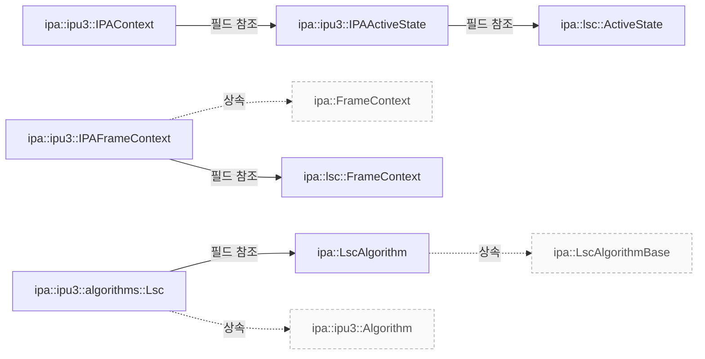

# IPU3 LSC의 설정과 프레임 처리

**LSC를 수정할 때는 초기 그리드 설정, 요청별 활성화 상태, 색온도에 따른 파라미터 갱신 조건을 차례로 확인하세요.**

| 지금 확인할 내용 | 이동할 절 |
|---|---|
| 빌드와 상태 연결 절을 확인합니다. | [빌드와 상태 연결](#빌드와-상태-연결) |
| 초기화와 크롭 설정 절을 확인합니다. | [초기화와 크롭 설정](#초기화와-크롭-설정) |
| 첫 프레임과 요청별 제어 절을 확인합니다. | [첫 프레임과 요청별 제어](#첫-프레임과-요청별-제어) |
| 파라미터 갱신 조건 절을 확인합니다. | [파라미터 갱신 조건](#파라미터-갱신-조건) |
| 메타데이터와 확인 범위 절을 확인합니다. | [메타데이터와 확인 범위](#메타데이터와-확인-범위) |
| 클래스 관계 절을 확인합니다. | [클래스 관계](#클래스-관계) |
| 관련 클래스 절을 확인합니다. | [관련 클래스](#관련-클래스) |

## 빌드와 상태 연결

IPU3 알고리즘 빌드 목록에는 lsc.cpp가 포함됩니다. 이 목록에 있다는 사실만으로 실행 중인 카메라에서 LSC가 활성화됐다고 판단할 수는 없습니다. `src/ipa/ipu3/algorithms/meson.build:3`

IPAContext는 공유 activeState와 프레임 컨텍스트 큐를 보유합니다. IPAActiveState의 lsc 필드와 IPAFrameContext의 lsc 필드가 각각 공유 상태와 프레임별 상태를 연결합니다. `src/ipa/ipu3/ipa_context.h:32`

## 초기화와 크롭 설정

init()는 센서 activeAreaSize를 기준으로 그리드를 계산합니다. 가로 73개와 세로 56개라는 셀 수 상한에 맞춰 필요한 셀 크기를 계산하고, 이를 2의 거듭제곱으로 올림한 뒤 실제 셀 수와 블록 크기를 정합니다. `src/ipa/ipu3/algorithms/lsc.cpp:31`

튜닝 데이터의 type이 polynomial인지 저장한 뒤, r·gr·gb·b 성분과 샘플 수 및 센서 크기를 공통 LSC 알고리즘의 init()에 전달합니다. 반환값은 호출자에게 그대로 반환합니다. `src/ipa/ipu3/algorithms/lsc.cpp:31`

configure()는 analogCrop의 너비와 높이를 저장합니다. 각 축의 샘플 위치를 0부터 1까지 생성하고, 크롭 영역 및 공유 LSC 상태와 함께 공통 알고리즘의 configure()에 전달합니다. 이 코드는 샘플 수가 1일 때의 나눗셈을 별도로 처리하지 않으므로 지원 센서 크기의 경계 조건은 추가 검증이 필요합니다. `src/ipa/ipu3/algorithms/lsc.cpp:31`

## 첫 프레임과 요청별 제어

frame이 0이고 요청에 LensShadingCorrectionEnable 제어가 없으면 프레임의 enabled와 update를 true로 설정합니다. 소스 주석은 공통 알고리즘이 알리는 기본값과 IPU3 드라이버의 기본 비활성 상태를 맞추기 위한 처리라고 설명합니다. `src/ipa/ipu3/algorithms/lsc.cpp:121`

이후 공유 LSC 상태, 현재 프레임의 LSC 상태와 요청 controls를 공통 알고리즘의 queueRequest()에 전달합니다. 여기서 설명하는 것은 IPU3 래퍼의 전달 동작이며, 모든 제어 값의 처리 규칙이나 콜백 실행 스레드까지 확인한 것은 아닙니다. `src/ipa/ipu3/algorithms/lsc.cpp:121`

## 파라미터 갱신 조건

prepare()는 현재 프레임 AWB의 색온도를 읽어 10 단위로 반올림합니다. update가 false일 때만 다음 생략 조건을 검사합니다. 비활성 상태이면 바로 반환하고, 활성 상태에서도 직전 적용 색온도와의 차이가 5 미만이거나 양자화된 값이 같으면 갱신을 생략합니다. update가 true이면 이 생략 조건들을 적용하지 않습니다. `src/ipa/ipu3/algorithms/lsc.cpp:142`, `src/ipa/ipu3/algorithms/lsc.cpp:31`

갱신 경로에서는 use.acc_shd를 1로 설정하고 shd_enable에 현재 활성 상태를 기록합니다. update가 true이고 enabled가 false인 경우에도 이 플래그를 기록한 뒤 반환하므로, 단순히 비활성 상태의 모든 호출을 생략하는 것은 아닙니다. `src/ipa/ipu3/algorithms/lsc.cpp:142`

활성 상태에서는 그리드와 크롭 오프셋을 설정하고, 양자화한 색온도로 interpolateComponents()를 호출합니다. 반환된 r·gr·gb·b 배열을 LUT에 복사한 뒤 마지막으로 적용한 색온도 두 값을 저장합니다. 실제 하드웨어의 적용 시점과 LUT 분할 경계의 적합성은 기기에서 별도로 검증해야 합니다. `src/ipa/ipu3/algorithms/lsc.cpp:142`

## 메타데이터와 확인 범위

IPU3의 process()는 프레임 LSC 상태와 출력 metadata를 공통 알고리즘의 process()에 전달합니다. 이 래퍼는 전달받은 통계를 직접 읽지 않습니다. 파일 끝에서는 Lsc라는 이름으로 알고리즘을 등록합니다. `src/ipa/ipu3/algorithms/lsc.cpp:282`

이 문서는 고정된 libcamera 커밋의 구현을 설명합니다. 센서별 화질, 실행 스레드, 실제 프레임의 파라미터 적용 시점과 사내 Camera HAL 동작을 검증한 결과는 아닙니다. `src/ipa/ipu3/algorithms/lsc.cpp:282`

<!-- sdd:class-diagram -->
## 클래스 관계

화살표의 글자는 추출한 관계를 나타내며, 점선은 상속입니다. 화살표는 참조 대상 또는 기반 클래스를 향합니다. 호출 순서를 뜻하지 않습니다.

<!-- /sdd:class-diagram -->

## 관련 클래스

| 클래스 | 선언 위치 | 상속 | 책임 (주석) |
|---|---|---|---|
| `libcamera::ipa::LscAlgorithm` | `src/ipa/libipa/lsc.h:78` | `libcamera::ipa::LscAlgorithmBase` | 확인 필요 |
| `libcamera::ipa::ipu3::IPAActiveState` | `src/ipa/ipu3/ipa_context.h:46` | – | 확인 필요 |
| `libcamera::ipa::ipu3::IPAContext` | `src/ipa/ipu3/ipa_context.h:73` | – | 확인 필요 |
| `libcamera::ipa::ipu3::IPAFrameContext` | `src/ipa/ipu3/ipa_context.h:60` | `libcamera::ipa::FrameContext` | 확인 필요 |
| `libcamera::ipa::ipu3::algorithms::Lsc` | `src/ipa/ipu3/algorithms/lsc.h:21` | `libcamera::ipa::ipu3::Algorithm` | 확인 필요 |
| `libcamera::ipa::lsc::ActiveState` | `src/ipa/libipa/lsc.h:27` | – | 확인 필요 |
| `libcamera::ipa::lsc::FrameContext` | `src/ipa/libipa/lsc.h:31` | – | 확인 필요 |

??? note "근거와 검토 정보"
    - 근거 파일: `src/ipa/ipu3/algorithms/lsc.cpp`, `src/ipa/ipu3/algorithms/lsc.h`, `src/ipa/ipu3/ipa_context.h`, `src/ipa/libipa/lsc.h`
    - 근거 수준: 코드 확인 (정적 분석, simple_compdb 구성, commit `279d355ef8`)
    - 자동 검사 (인용·문장 및 설정된 구조 검사): 통과
    - 검토: 2026-09-24 · ollama/qwen3.5:4b · 사람 검토 전

다음 단계: [시스템 개요](overview.md)
