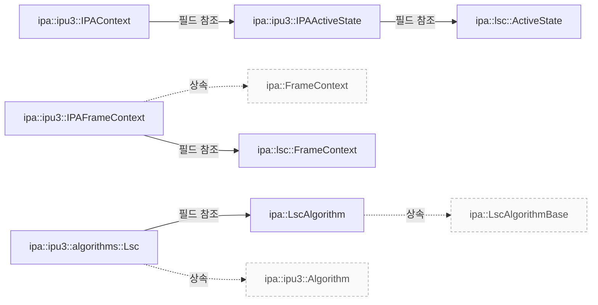

# IPU3 LSC의 설정과 프레임 처리

**LSC를 수정할 때는 초기 그리드 설정, 요청별 활성화 상태, 색온도에 따른 파라미터 갱신 조건을 차례로 확인하세요.**


## 설계 항목과 근거

아래 항목은 소스에 연결된 설명의 작성 범위를 나타냅니다. 설명의 의미와 실제 실행에 대한 승인은 별도 검토가 필요합니다.

| 설계 질문 | 설명 위치 | 확인 범위 |
|---|---|---|
| LSC 구현 파일과 공유 상태 및 프레임별 상태는 어떻게 연결됩니까? | [빌드와 상태 연결](#빌드와-상태-연결) | 코드 근거와 설명 연결 |
| 센서 크기에서 그리드를 만들고 크롭 설정을 전달하는 과정을 설명하세요. | [초기화와 크롭 설정](#초기화와-크롭-설정) | 코드 근거와 설명 연결 |
| 첫 프레임의 기본 활성화 처리와 공통 알고리즘으로 넘기는 데이터를 설명하세요. | [첫 프레임과 요청별 제어](#첫-프레임과-요청별-제어) | 코드 근거와 설명 연결 |
| 색온도 변경에 따른 생략 조건과 커널에 전달하는 파라미터를 설명하세요. | [파라미터 갱신 조건](#파라미터-갱신-조건) | 코드 근거와 설명 연결 |
| 프레임 처리 결과를 전달하는 경계와 미검증 사항을 설명하세요. | [메타데이터와 확인 범위](#메타데이터와-확인-범위) | 코드 근거와 설명 연결 |

## 빌드와 상태 연결

IPU3 알고리즘 빌드 목록에는 lsc.cpp가 포함됩니다. 이 목록에 있다는 사실만으로 실행 중인 카메라에서 LSC가 활성화됐다고 판단할 수는 없습니다. `src/ipa/ipu3/algorithms/meson.build:3`

IPAContext는 공유 activeState와 프레임 컨텍스트 큐를 보유합니다. IPAActiveState의 lsc 필드와 IPAFrameContext의 lsc 필드가 각각 공유 상태와 프레임별 상태를 연결합니다. `src/ipa/ipu3/ipa_context.h:32`

??? note "소스 근거: build"
    `src/ipa/ipu3/algorithms/meson.build:3`에서 시작하는 발췌입니다. 종료 줄은 11이며, 아래 원문을 설명과 대조할 수 있습니다.
    
    SHA-256: `5b34e175668b4fedb33a633567f049c2738f6368c3b4d8ac26d069e77add82c9`
    
    ```text
    ipu3_ipa_algorithms = files([
        'af.cpp',
        'agc.cpp',
        'awb.cpp',
        'blc.cpp',
        'ccm.cpp',
        'lsc.cpp',
        'tone_mapping.cpp',
    ])
    ```

??? note "소스 근거: context"
    `src/ipa/ipu3/ipa_context.h:32`에서 시작하는 발췌입니다. 종료 줄은 91이며, 아래 원문을 설명과 대조할 수 있습니다.
    
    SHA-256: `e373aff7c5b5e5f034637b3d9030b0fdef974614261025791afd6e3146b1108d`
    
    ```text
    struct IPASessionConfiguration {
    	struct {
    		ipu3_uapi_grid_config bdsGrid;
    		Size bdsOutputSize;
    		uint32_t stride;
    	} grid;
    
    	struct {
    		ipu3_uapi_grid_config afGrid;
    	} af;
    
    	agc::Session agc;
    };
    
    struct IPAActiveState {
    	struct {
    		uint32_t focus;
    		double maxVariance;
    		bool stable;
    	} af;
    
    	agc::ActiveState agc;
    	ipa::awb::ActiveState awb;
    	ipa::ccm::ActiveState ccm;
    	ipa::gamma::ActiveState gamma;
    	ipa::lsc::ActiveState lsc;
    };
    
    struct IPAFrameContext : public FrameContext {
    	struct {
    		uint32_t exposure;
    		double gain;
    	} sensor;
    
    	agc::FrameContext agc;
    	ipa::awb::FrameContext awb;
    	ipa::ccm::FrameContext ccm;
    	ipa::gamma::FrameContext gamma;
    	ipa::lsc::FrameContext lsc;
    };
    
    struct IPAContext {
    	IPAContext(unsigned int frameContextSize)
    		: frameContexts(frameContextSize)
    	{
    	}
    
    	IPASessionConfiguration configuration;
    	IPACameraSensorInfo sensorInfo;
    	ControlInfoMap sensorControls;
    	IPAActiveState activeState;
    
    	FCQueue<IPAFrameContext> frameContexts;
    
    	std::unique_ptr<CameraSensorHelper> camHelper;
    
    	ControlInfoMap::Map ctrlMap;
    };
    
    } /* namespace ipa::ipu3 */
    ```

## 초기화와 크롭 설정

init()는 센서 activeAreaSize를 기준으로 그리드를 계산합니다. 가로 73개와 세로 56개라는 셀 수 상한에 맞춰 필요한 셀 크기를 계산하고, 이를 2의 거듭제곱으로 올림한 뒤 실제 셀 수와 블록 크기를 정합니다. `src/ipa/ipu3/algorithms/lsc.cpp:31`

튜닝 데이터의 type이 polynomial인지 저장한 뒤, r·gr·gb·b 성분과 샘플 수 및 센서 크기를 공통 LSC 알고리즘의 init()에 전달합니다. 반환값은 호출자에게 그대로 반환합니다. `src/ipa/ipu3/algorithms/lsc.cpp:31`

configure()는 analogCrop의 너비와 높이를 저장합니다. 각 축의 샘플 위치를 0부터 1까지 생성하고, 크롭 영역 및 공유 LSC 상태와 함께 공통 알고리즘의 configure()에 전달합니다. 이 코드는 샘플 수가 1일 때의 나눗셈을 별도로 처리하지 않으므로 지원 센서 크기의 경계 조건은 추가 검증이 필요합니다. `src/ipa/ipu3/algorithms/lsc.cpp:31`

??? note "소스 근거: setup"
    `src/ipa/ipu3/algorithms/lsc.cpp:31`에서 시작하는 발췌입니다. 종료 줄은 121이며, 아래 원문을 설명과 대조할 수 있습니다.
    
    SHA-256: `943557ac46750b8b53d8280921b313e4331e786e8ff88766abb0fe02959d2f63`
    
    ```text
    static constexpr unsigned int kMaxNumHCells = 73;
    static constexpr unsigned int kMaxNumVCells = 56;
    static constexpr int kColourTemperatureQuantization = 10;
    
    /**
     * \copydoc libcamera::ipa::Algorithm::init
     */
    int Lsc::init(IPAContext &context, const ValueNode &tuningData)
    {
    	/*
    	 * The IPU3 lens shading block expects a table of data that isn't of a
    	 * fixed size, but rather is configurable based on 4 parameters:
    	 *
    	 * block_width_log2:	The log2 of the horizontal pixel count per cell
    	 * block_height_log2:	The log2 of the vertical pixel count per cell
    	 * width:		The number of horizontal cells
    	 * height:		The number of vertical cells
    	 *
    	 * The constructed grid should be capable of covering the image, but
    	 * ideally won't extend past the edges of the image. Fixing either set
    	 * of parameters for the algorithm as a whole is likely to result in
    	 * suboptimal situations for some sensors, so let's determine them
    	 * programmatically instead.
    	 *
    	 * What we want is the densest possible grid that ideally doesn't extend
    	 * past the edges of the image at all. The maximum grid size is 73x56,
    	 * which gives us the lower bounds on cell size. Unfortunately we can
    	 * only specify sizes in powers of two, which can have the effect of
    	 * making the grid much more coarse. For example for a 2592x1944 input
    	 * image, 2592 / 73 = 35.5...which means we need to set blockWidthLog2
    	 * to 6 (I.E. 64) and have just 40.5 (or rather 41) cells horizontally.
    	 */
    	sensorWidth_ = context.sensorInfo.activeAreaSize.width;
    	sensorHeight_ = context.sensorInfo.activeAreaSize.height;
    
    	unsigned int cellWidth = (sensorWidth_ + kMaxNumHCells - 1) / kMaxNumHCells;
    	unsigned int cellHeight = (sensorHeight_ + kMaxNumVCells - 1) / kMaxNumVCells;
    
    	unsigned int minCellWidth = std::bit_ceil(cellWidth);
    	unsigned int minCellHeight = std::bit_ceil(cellHeight);
    
    	numHCells_ = (sensorWidth_ + minCellWidth - 1) / minCellWidth;
    	numVCells_ = (sensorHeight_ + minCellHeight - 1) / minCellHeight;
    
    	blockWidthLog2_ = std::bit_width(minCellWidth) - 1;
    	blockHeightLog2_ = std::bit_width(minCellHeight) - 1;
    
    	LOG(IPU3Lsc, Debug) << "Calculated Grid configuration: "
    			    << numHCells_ << "x" << numVCells_ << " cells of "
    			    << minCellWidth << "x" << minCellHeight << " pixels";
    
    	/*
    	 * We need to know if we're running the polynomial algorithm or not as
    	 * things will behave slightly differently.
    	 */
    	polynomial_ = tuningData["type"].get<std::string>() == "polynomial";
    
    	return lscAlgo_.init(tuningData, context.ctrlMap,
    			     { .keys = { "r", "gr", "gb", "b" },
    			       .numHSamples = numHCells_,
    			       .numVSamples = numVCells_,
    			       .sensorSize = context.sensorInfo.activeAreaSize });
    }
    
    std::vector<double> Lsc::calculatePositions(unsigned int dimension)
    {
    	std::vector<double> positions(dimension);
    	for (double i = 0.0; i < dimension; i++)
    		positions[i] = i / (dimension - 1);
    
    	return positions;
    }
    
    /**
     * \copydoc libcamera::ipa::Algorithm::configure
     */
    int Lsc::configure(IPAContext &context, const IPAConfigInfo &configInfo)
    {
    	cropWidth_ = configInfo.sensorInfo.analogCrop.width;
    	cropHeight_ = configInfo.sensorInfo.analogCrop.height;
    	std::vector<double> xPos = calculatePositions(numHCells_);
    	std::vector<double> yPos = calculatePositions(numVCells_);
    
    	return lscAlgo_.configure(context.activeState.lsc,
    				  configInfo.sensorInfo.analogCrop, xPos, yPos);
    }
    
    /**
     * \copydoc libcamera::ipa::Algorithm::queueRequest
     */
    void Lsc::queueRequest(
    ```

## 첫 프레임과 요청별 제어

frame이 0이고 요청에 LensShadingCorrectionEnable 제어가 없으면 프레임의 enabled와 update를 true로 설정합니다. 소스 주석은 공통 알고리즘이 알리는 기본값과 IPU3 드라이버의 기본 비활성 상태를 맞추기 위한 처리라고 설명합니다. `src/ipa/ipu3/algorithms/lsc.cpp:121`

이후 공유 LSC 상태, 현재 프레임의 LSC 상태와 요청 controls를 공통 알고리즘의 queueRequest()에 전달합니다. 여기서 설명하는 것은 IPU3 래퍼의 전달 동작이며, 모든 제어 값의 처리 규칙이나 콜백 실행 스레드까지 확인한 것은 아닙니다. `src/ipa/ipu3/algorithms/lsc.cpp:121`

??? note "소스 근거: request"
    `src/ipa/ipu3/algorithms/lsc.cpp:121`에서 시작하는 발췌입니다. 종료 줄은 142이며, 아래 원문을 설명과 대조할 수 있습니다.
    
    SHA-256: `550c83f35d2a4d5218ac10731fe8650d8446e262841f2dd80a54e9238c7da287`
    
    ```text
    void Lsc::queueRequest(IPAContext &context, const uint32_t frame,
    		       IPAFrameContext &frameContext,
    		       const ControlList &controls)
    {
    	/*
    	 * The base algorithm defines the LensShadingCorrectionEnable control
    	 * with a default value of true, but actually the IPU3 driver defaults
    	 * it to off. If this is the first frame, check for the control, but if
    	 * there isn't one, force it on to fulfil the advertised default.
    	 */
    	if (frame == 0) {
    		const auto &lscEnable = controls.get(controls::LensShadingCorrectionEnable);
    		if (!lscEnable) {
    			frameContext.lsc.enabled = true;
    			frameContext.lsc.update = true;
    		}
    	}
    
    	lscAlgo_.queueRequest(context.activeState.lsc, frameContext.lsc, controls);
    }
    
    static unsigned int quantize(
    ```

## 파라미터 갱신 조건

prepare()는 현재 프레임 AWB의 색온도를 읽어 10 단위로 반올림합니다. update가 false일 때만 다음 생략 조건을 검사합니다. 비활성 상태이면 바로 반환하고, 활성 상태에서도 직전 적용 색온도와의 차이가 5 미만이거나 양자화된 값이 같으면 갱신을 생략합니다. update가 true이면 이 생략 조건들을 적용하지 않습니다. `src/ipa/ipu3/algorithms/lsc.cpp:142`, `src/ipa/ipu3/algorithms/lsc.cpp:31`

갱신 경로에서는 use.acc_shd를 1로 설정하고 shd_enable에 현재 활성 상태를 기록합니다. update가 true이고 enabled가 false인 경우에도 이 플래그를 기록한 뒤 반환하므로, 단순히 비활성 상태의 모든 호출을 생략하는 것은 아닙니다. `src/ipa/ipu3/algorithms/lsc.cpp:142`

활성 상태에서는 그리드와 크롭 오프셋을 설정하고, 양자화한 색온도로 interpolateComponents()를 호출합니다. 반환된 r·gr·gb·b 배열을 LUT에 복사한 뒤 마지막으로 적용한 색온도 두 값을 저장합니다. 실제 하드웨어의 적용 시점과 LUT 분할 경계의 적합성은 기기에서 별도로 검증해야 합니다. `src/ipa/ipu3/algorithms/lsc.cpp:142`

??? note "소스 근거: prepare"
    `src/ipa/ipu3/algorithms/lsc.cpp:142`에서 시작하는 발췌입니다. 종료 줄은 282이며, 아래 원문을 설명과 대조할 수 있습니다.
    
    SHA-256: `1d11fc7397b377f682d4fab45d12dd20480e554176aae94ba2708a5f8f747268`
    
    ```text
    static unsigned int quantize(unsigned int value, unsigned int step)
    {
    	return std::lround(value / static_cast<double>(step)) * step;
    }
    
    /**
     * \copydoc libcamera::ipa::Algorithm::prepare
     */
    void Lsc::prepare([[maybe_unused]] IPAContext &context, [[maybe_unused]] const uint32_t frame,
    		  IPAFrameContext &frameContext, ipu3_uapi_params *params)
    {
    	uint32_t ct = frameContext.awb.colourTemperature;
    	unsigned int quantizedCt = quantize(ct, kColourTemperatureQuantization);
    
    	if (!frameContext.lsc.update) {
    		if (!frameContext.lsc.enabled)
    			return;
    
    		/*
    		 * Add a threshold so that oscillations around a quantization
    		 * step don't lead to constant changes.
    		 */
    		if (utils::abs_diff(ct, lastAppliedCt_) < kColourTemperatureQuantization / 2)
    			return;
    
    		if (quantizedCt == lastAppliedQuantizedCt_)
    			return;
    	}
    
    	/*
    	 * This flag tells the kernel driver that it should read the LSC params
    	 * passed from userspace instead of using its cached copy.
    	 */
    	params->use.acc_shd = 1;
    
    	/*
    	 * Pass the enabled flag. If we're not enabled, we can then just bail
    	 * out.
    	 */
    	ipu3_uapi_shd_config_static *config = &params->acc_param.shd.shd;
    	config->general.shd_enable = frameContext.lsc.enabled;
    
    	if (!frameContext.lsc.enabled)
    		return;
    
    	config->grid.width = numHCells_;
    	config->grid.height = numVCells_;
    	config->grid.block_width_log2 = blockWidthLog2_;
    	config->grid.block_height_log2 = blockHeightLog2_;
    	config->grid.grid_height_per_slice = IPU3_UAPI_SHD_MAX_CELLS_PER_SET / numHCells_;
    
    	/*
    	 * The IPU3's documentation describes the x_start and y_start members
    	 * as follows:
    	 *
    	 * "[X/Y] value of top left corner of sensor relative to ROI
    	 * s13, [-4096, 0], default 0, only negative values."
    	 *
    	 * I interpret that as allowing us to configure the cropped rectangle
    	 * relative to the full grid. That's useful if we're running the tabular
    	 * algorithm, which would otherwise apply the full grid inappropriately.
    	 * If we're running the polynomial one though the calculated grid is
    	 * probably more appropriate than a coarse application of the full grid
    	 * so let's tell the hardware not to bother correcting in that case.
    	 */
    	if (polynomial_) {
    		config->grid.x_start = 0;
    		config->grid.y_start = 0;
    	} else {
    		config->grid.x_start = (cropWidth_ - sensorWidth_) / 2;
    		config->grid.y_start = (cropHeight_ - sensorHeight_) / 2;
    	}
    
    	/* No idea what this is, but the docs say it should be set as so */
    	config->general.init_set_vrt_offst_ul =
    		config->grid.y_start >> (config->grid.block_height_log2 %
    					 config->grid.grid_height_per_slice);
    
    	/*
    	 * Values in the LUT cease taking effect at 4096, and a value of 0.0 is
    	 * "no correction" rather than black. The gain factor is described by
    	 * the documentation like so:
    	 *
    	 * "Shift calculated anti shading value. Precision u2. 0x0 - gain factor
    	 * [1, 5], means no shift interpolated value. 0x1 - gain factor [1, 9],
    	 * means shift interpolated by 1. 0x2 - gain factor [1, 17], means shift
    	 * interpolated by 2."
    	 *
    	 * The simplest interpretation for those pieces of information is I
    	 * think that the LUT stores 12-bit Q numbers who's represented values
    	 * depend on the gain_factor setting like so:
    	 *
    	 * 0: UQ<2, 10> representing values in range [0, 4)
    	 * 1: UQ<3, 9> representing values in range [0, 8)
    	 * 2: UQ<4, 8> representing values in range [0, 16)
    	 *
    	 * And that a base gain of 1.0 is added to those configured values. As a
    	 * gain of more than 5.0 is fairly unlikely, let's fix gain_factor to 0
    	 * for now and revisit if needed.
    	 */
    	config->general.gain_factor = 0;
    
    	/*
    	 * Disable the black level settings here - we do that through another
    	 * parameters block.
    	 */
    	config->black_level.bl_r = 0;
    	config->black_level.bl_gr = 0;
    	config->black_level.bl_gb = 0;
    	config->black_level.bl_b = 0;
    
    	ipu3_uapi_shd_lut *lut = &params->acc_param.shd.shd_lut;
    
    	const auto &set = lscAlgo_.interpolateComponents(quantizedCt);
    
    	unsigned int totalCells = numHCells_ * numVCells_;
    	unsigned int cellsPerSet = numHCells_ * config->grid.grid_height_per_slice;
    	unsigned int numSets = (numHCells_ + config->grid.grid_height_per_slice - 1) /
    			       config->grid.grid_height_per_slice;
    	unsigned int i = 0;
    
    	for (unsigned int s = 0; s < numSets; s++) {
    		for (unsigned int c = 0; c < cellsPerSet && i < totalCells; c++, i++) {
    			lut->sets[s].r_and_gr[c].r = set.at("r")[i];
    			lut->sets[s].r_and_gr[c].gr = set.at("gr")[i];
    			lut->sets[s].gb_and_b[c].gb = set.at("gb")[i];
    			lut->sets[s].gb_and_b[c].b = set.at("b")[i];
    		}
    	}
    
    	lastAppliedCt_ = ct;
    	lastAppliedQuantizedCt_ = quantizedCt;
    	LOG(IPU3Lsc, Debug)
    		<< "ct is " << ct << ", quantized to "
    		<< quantizedCt;
    }
    
    /**
     * \copydoc libcamera::ipa::Algorithm::process
     */
    void Lsc::process(
    ```

??? note "소스 근거: constants"
    `src/ipa/ipu3/algorithms/lsc.cpp:31`에서 시작하는 발췌입니다. 종료 줄은 38이며, 아래 원문을 설명과 대조할 수 있습니다.
    
    SHA-256: `7807718b4ae9327f1ca428627d2b00f59ba38ced03261465ee8c79312ea27833`
    
    ```text
    static constexpr unsigned int kMaxNumHCells = 73;
    static constexpr unsigned int kMaxNumVCells = 56;
    static constexpr int kColourTemperatureQuantization = 10;
    
    /**
     * \copydoc libcamera::ipa::Algorithm::init
     */
    int Lsc::init(
    ```

## 메타데이터와 확인 범위

IPU3의 process()는 프레임 LSC 상태와 출력 metadata를 공통 알고리즘의 process()에 전달합니다. 이 래퍼는 전달받은 통계를 직접 읽지 않습니다. 파일 끝에서는 Lsc라는 이름으로 알고리즘을 등록합니다. `src/ipa/ipu3/algorithms/lsc.cpp:282`

이 문서는 고정된 libcamera 커밋의 구현을 설명합니다. 센서별 화질, 실행 스레드, 실제 프레임의 파라미터 적용 시점과 사내 Camera HAL 동작을 검증한 결과는 아닙니다. `src/ipa/ipu3/algorithms/lsc.cpp:282`

??? note "소스 근거: process"
    `src/ipa/ipu3/algorithms/lsc.cpp:282`에서 시작하는 발췌입니다. 종료 줄은 291이며, 아래 원문을 설명과 대조할 수 있습니다.
    
    SHA-256: `e1411dc6710e62f774ea84588792a3f6fd547beb3442bc7cc49495eb19dff05e`
    
    ```text
    void Lsc::process([[maybe_unused]] IPAContext &context,
    		  [[maybe_unused]] const uint32_t frame,
    		  IPAFrameContext &frameContext,
    		  [[maybe_unused]] const ipu3_uapi_stats_3a *stats,
    		  ControlList &metadata)
    {
    	lscAlgo_.process(frameContext.lsc, metadata);
    }
    
    REGISTER_IPA_ALGORITHM(Lsc, "Lsc")
    ```


<!-- sdd:class-diagram -->
## 클래스 관계

화살표의 글자는 추출한 관계를 나타내며, 점선은 상속입니다. 화살표는 참조 대상 또는 기반 클래스를 향합니다. 호출 순서를 뜻하지 않습니다.


<!-- /sdd:class-diagram -->


## 관련 클래스

| 클래스 | 선언 위치 | 상속 | 책임 (주석) |
|---|---|---|---|
| `libcamera::ipa::LscAlgorithm` | `src/ipa/libipa/lsc.h:78` | `libcamera::ipa::LscAlgorithmBase` | libIPA LSC algorithm implementation |
| `libcamera::ipa::ipu3::IPAActiveState` | `src/ipa/ipu3/ipa_context.h:46` | – | The active state of the IPA algorithms |
| `libcamera::ipa::ipu3::IPAContext` | `src/ipa/ipu3/ipa_context.h:73` | – | Global IPA context data shared between all algorithms |
| `libcamera::ipa::ipu3::IPAFrameContext` | `src/ipa/ipu3/ipa_context.h:60` | `libcamera::ipa::FrameContext` | IPU3-specific FrameContext |
| `libcamera::ipa::ipu3::algorithms::Lsc` | `src/ipa/ipu3/algorithms/lsc.h:21` | `libcamera::ipa::ipu3::Algorithm` | IPU3 Lens Shading Correction algorithm |
| `libcamera::ipa::lsc::ActiveState` | `src/ipa/libipa/lsc.h:27` | – | 확인 필요 |
| `libcamera::ipa::lsc::FrameContext` | `src/ipa/libipa/lsc.h:31` | – | 확인 필요 |

??? note "근거와 검토 정보"
    - 생성 방식: 소스 발췌에 연결한 설계 설명
    - 검증 범위: 설정에 작성된 설명을 발췌 해시와 대조합니다. 해시 일치는 설명의 의미를 승인하지 않습니다.
    - 근거 파일: `src/ipa/ipu3/algorithms/lsc.cpp`, `src/ipa/ipu3/algorithms/lsc.h`, `src/ipa/ipu3/ipa_context.h`, `src/ipa/libipa/lsc.h`
    - 근거 수준: 코드 확인 (정적 분석, simple_compdb 구성, commit `279d355ef8`)
    - 자동 검사 (인용·문장 및 설정된 구조 검사): 통과
    - 검토 상태 기록일: 2026-09-26 · 사람 검토 전

다음 단계: [시스템 개요](overview.md)
