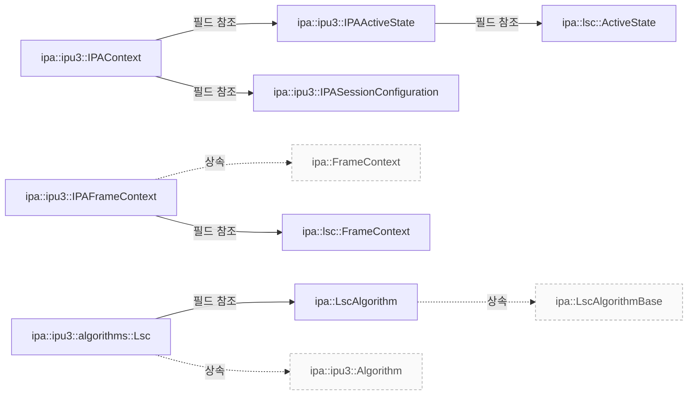

# IPU3 LSC와 상태 연결

**현재 커밋의 LSC 구현과 IPU3 상태 연결을 확인하세요.**

| 지금 확인할 내용 | 이동할 절 |
|---|---|
| 구조 설명 절을 확인합니다. | [구조 설명](#구조-설명) |
| 클래스 관계 절을 확인합니다. | [클래스 관계](#클래스-관계) |
| 관련 자유 함수 절을 확인합니다. | [관련 자유 함수](#관련-자유-함수) |
| 관련 클래스 절을 확인합니다. | [관련 클래스](#관련-클래스) |

## 구조 설명

`libcamera::ipa::LscAlgorithm`의 추출된 직접 기반 클래스는 `libcamera::ipa::LscAlgorithmBase`입니다. `src/ipa/libipa/lsc.h:78`

`libcamera::ipa::ipu3::IPAActiveState`에는 추출된 직접 기반 클래스가 없습니다. `libcamera::ipa::lsc::ActiveState`에 대한 필드 참조 관계가 추출되었습니다. `src/ipa/ipu3/ipa_context.h:46`

`libcamera::ipa::ipu3::IPAContext`에는 추출된 직접 기반 클래스가 없습니다. `libcamera::ipa::ipu3::IPAActiveState`에 대한 필드 참조 관계가 추출되었습니다. `libcamera::ipa::ipu3::IPASessionConfiguration`에 대한 필드 참조 관계가 추출되었습니다. `src/ipa/ipu3/ipa_context.h:73`

`libcamera::ipa::ipu3::IPAFrameContext`의 추출된 직접 기반 클래스는 `libcamera::ipa::FrameContext`입니다. `libcamera::ipa::lsc::FrameContext`에 대한 필드 참조 관계가 추출되었습니다. `src/ipa/ipu3/ipa_context.h:60`

`libcamera::ipa::ipu3::IPASessionConfiguration`에는 추출된 직접 기반 클래스가 없습니다. `src/ipa/ipu3/ipa_context.h:32`

`libcamera::ipa::ipu3::algorithms::Lsc`의 추출된 직접 기반 클래스는 `libcamera::ipa::ipu3::Algorithm`입니다. `libcamera::ipa::LscAlgorithm`에 대한 필드 참조 관계가 추출되었습니다. `src/ipa/ipu3/algorithms/lsc.h:21`

`libcamera::ipa::lsc::ActiveState`에는 추출된 직접 기반 클래스가 없습니다. `src/ipa/libipa/lsc.h:27`

`libcamera::ipa::lsc::FrameContext`에는 추출된 직접 기반 클래스가 없습니다. `src/ipa/libipa/lsc.h:31`

<!-- sdd:class-diagram -->
## 클래스 관계

화살표의 글자는 추출한 관계를 나타내며, 점선은 상속입니다. 화살표는 참조 대상 또는 기반 클래스를 향합니다. 호출 순서를 뜻하지 않습니다.

<!-- /sdd:class-diagram -->

## 관련 자유 함수

| 함수 | 위치 | 설명 |
|---|---|---|
| `libcamera::ipa::ipu3::algorithms::logCategoryIPU3Lsc()` | `src/ipa/ipu3/algorithms/lsc.cpp:29` | IPU3 Lens Shading Correction algorithm |
| `libcamera::ipa::ipu3::algorithms::quantize()` | `src/ipa/ipu3/algorithms/lsc.cpp:142` | 확인 필요 |

## 관련 클래스

| 클래스 | 선언 위치 | 상속 | 책임 (주석) |
|---|---|---|---|
| `libcamera::ipa::LscAlgorithm` | `src/ipa/libipa/lsc.h:78` | `libcamera::ipa::LscAlgorithmBase` | libIPA LSC algorithm implementation |
| `libcamera::ipa::ipu3::IPAActiveState` | `src/ipa/ipu3/ipa_context.h:46` | – | The active state of the IPA algorithms |
| `libcamera::ipa::ipu3::IPAContext` | `src/ipa/ipu3/ipa_context.h:73` | – | Global IPA context data shared between all algorithms |
| `libcamera::ipa::ipu3::IPAFrameContext` | `src/ipa/ipu3/ipa_context.h:60` | `libcamera::ipa::FrameContext` | IPU3-specific FrameContext |
| `libcamera::ipa::ipu3::IPASessionConfiguration` | `src/ipa/ipu3/ipa_context.h:32` | – | Session configuration for the IPA module |
| `libcamera::ipa::ipu3::algorithms::Lsc` | `src/ipa/ipu3/algorithms/lsc.h:21` | `libcamera::ipa::ipu3::Algorithm` | IPU3 Lens Shading Correction algorithm |
| `libcamera::ipa::lsc::ActiveState` | `src/ipa/libipa/lsc.h:27` | – | 확인 필요 |
| `libcamera::ipa::lsc::FrameContext` | `src/ipa/libipa/lsc.h:31` | – | 확인 필요 |

??? note "근거와 검토 정보"
    - 근거 파일: `src/ipa/ipu3/algorithms/lsc.cpp`, `src/ipa/ipu3/algorithms/lsc.h`, `src/ipa/ipu3/ipa_context.h`, `src/ipa/libipa/lsc.h`
    - 근거 수준: 코드 확인 (정적 분석, simple_compdb 구성, commit `279d355ef8`)
    - 자동 검사 (인용·문장 및 설정된 구조 검사): 통과
    - 검토: 2026-09-24 · ollama/qwen3.5:4b · 사람 검토 전

다음 단계: [IPU3 LSC의 설정과 프레임 처리](ipu3-lsc-flow.md)
