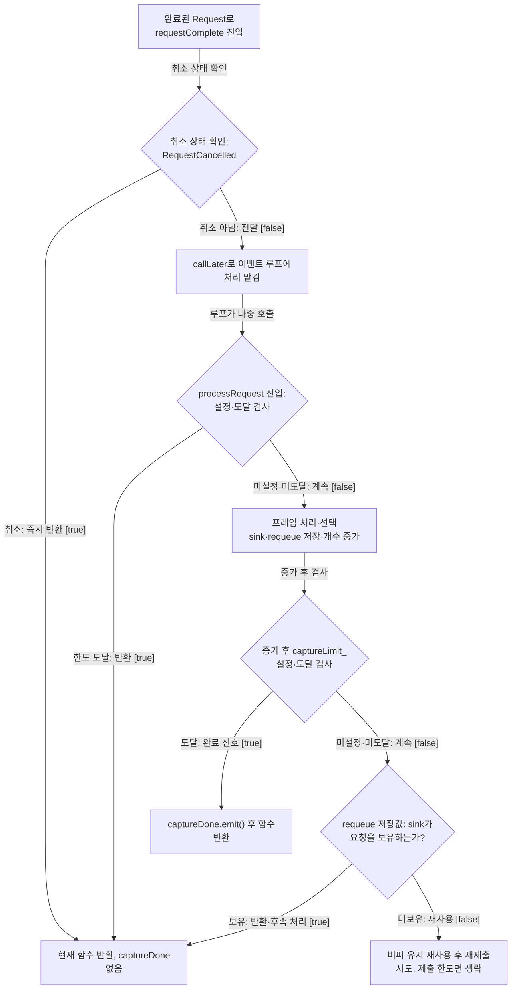
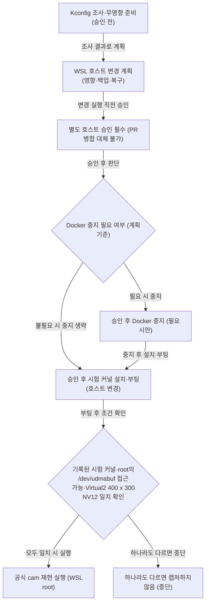

# WSL 공식 cam 가상 캡처 확인

**가상 캡처가 막힌 지점부터 확인하고, 완료 알림이 프레임 처리로 이어지는 경로를 따라가세요.**

| 지금 확인할 내용 | 이동할 절 |
|---|---|
| 이번 기준 재현에서 기본 WSL 커널은 DMA-BUF 할당기를 노출하지 않아 공식 cam이 버퍼를 할당하지 못했습니다. | [할당기를 준비하자 공식 cam 캡처가 완료됐습니다](#할당기를-준비하자-공식-cam-캡처가-완료됐습니다) |
| 기준 소스에서 확인한 공식 libcamera의 virtual 기능은 실제 센서 대신 가짜 외부 카메라용 프레임을 공급하며, 그 프레임은 소프트웨어가 만든 테스트 패턴이거나 설정한 .jpg 이미지 파일입니다. | [가상 파이프라인이 영상을 만들고 요청 완료를 알립니다](#가상-파이프라인이-영상을-만들고-요청-완료를-알립니다) |
| 완료 알림(`requestComplete`)은 프레임 후속 처리(`processRequest`)와 다른 단계입니다. | [cam이 완료 알림을 받아 이벤트 루프에서 프레임을 처리합니다.](#cam이-완료-알림을-받아-이벤트-루프에서-프레임을-처리합니다) |
| 개발자는 선택한 커널의 Kconfig와 의존 심볼을 조사합니다. | [지원 커널과 장치 접근을 확인한 뒤 재현합니다](#지원-커널과-장치-접근을-확인한-뒤-재현합니다) |

## 할당기를 준비하자 공식 cam 캡처가 완료됐습니다

**가상 시험 구성입니다. 실제 제품의 지원·성능 주장으로 사용하지 마세요.**

이번 기준 재현에서 기본 WSL 커널은 DMA-BUF 할당기를 노출하지 않아 공식 cam이 버퍼를 할당하지 못했습니다. `product-evidence/libcamera-official-cam-trial/reproduction-procedure.txt:1`, `product-evidence/libcamera-official-cam-trial/official-cam-reader.txt:1`

소스 293d751a를 수정하지 않은 공식 cam이 WSL2 시험 커널에서 Virtual2 400x300 NV12 가상 카메라 구성으로 세 개의 독립 프로세스에서 각각 실행되었습니다. 각 실행에서 3프레임 정상 완료와 udmabuf 할당 성공이 관측되었고, 별도 DMA-BUF 프로브의 CPU 접근 성공은 이 cam 할당 관찰과 구분되어 기록되었습니다. 시험은 기본 커널로 원복된 상태로 마쳐져, 현재 상태에서는 이 구성을 그대로 재실행할 수 없습니다. `product-evidence/libcamera-official-cam-trial/official-cam-reader.txt:1`, `product-evidence/libcamera-official-cam-trial/reproduction-procedure.txt:1`

근거 원문: [product-evidence/libcamera-official-cam-trial/execution-contract.txt:1](#source-6722470b9620a771) · [product-evidence/libcamera-official-cam-trial/official-cam-reader.txt:1](#source-d84e6ca3abcfec11) · [product-evidence/libcamera-official-cam-trial/reproduction-procedure.txt:1](#source-10812730226e86cc)

## 가상 파이프라인이 영상을 만들고 요청 완료를 알립니다

기준 소스에서 확인한 공식 libcamera의 virtual 기능은 실제 센서 대신 가짜 외부 카메라용 프레임을 공급하며, 그 프레임은 소프트웨어가 만든 테스트 패턴이거나 설정한 .jpg 이미지 파일입니다. 제공된 Virtual2 설정은 400x300 해상도에 대각선 줄무늬인 lines 테스트 패턴을 씁니다. `src/libcamera/pipeline/virtual/README.md:3`, `src/libcamera/pipeline/virtual/data/virtual.yaml:28`

<!-- sdd:visual:virtual-frame-path -->
### 패턴 생성에서 cam의 완료 알림까지


```mermaid
flowchart TB
%% sdd:translations {"CPU 쓰기 동기화 범위 안에서 <br/>쓰기 가능한 DMA-BUF 매핑": "Writable DMA-BUF map within <br/>CPU write sync", "CPU가 줄무늬 템플릿을 <br/>NV12로 변환해 매핑 버퍼에 <br/>쓰기 시도": "CPU tries NV12 conversion <br/>to mapped buffer", "Virtual2 NV12 변환 반환값이 <br/>0이 아닌가?": "Is Virtual2 NV12 conversion <br/>result non-zero?", "cam이 virtual <br/>파이프라인으로 DMA-BUF 버퍼 <br/>확보": "cam gets DMA-BUF via <br/>virtual pipeline", "false(0): FrameSuccess 유지 <br/>[false]": "false (0): FrameSuccess <br/>kept [false]", "false: 미완료 버퍼 남음 <br/>[false]": "false: some buffers still <br/>pending [false]", "true(0 아님): FrameError <br/>설정 [true]": "true (non-zero): FrameError <br/>set [true]", "true(모든 버퍼 완료) [true]": "true (all buffers done) <br/>[true]", "같은 CPU 쓰기 동기화 범위 안": "Same CPU write sync scope", "버퍼 붙은 요청을 검사 후 <br/>대기 목록에 추가": "Check buffered request; add <br/>to waiting list", "변환 반환값으로 프레임 결과 <br/>판정": "Conversion ret decides <br/>generateFrame result", "연결된 핸들러가 신호를 받음": "Connected handler receives <br/>the signal", "요청의 모든 버퍼가 <br/>완료됐는가? (completeBuffer)": "All request buffers done? <br/>(completeBuffer)", "이번 핸들러 호출만 끝남, <br/>요청은 아직 미완료": "This handler call ends; <br/>request incomplete", "전달 뒤 프레임 처리에서 <br/>쓰기 매핑": "After handoff, frame <br/>processing maps buffer", "제출 순서대로 cam 콜백에 <br/>통지": "Notify cam callback in <br/>submission order", "제출 순서대로 통지, 앞 <br/>미완료 요청이면 보류": "In submission order; held <br/>if earlier pending", "준비 뒤 버퍼 붙은 요청 제출": "After prep, submit request <br/>with buffers", "준비된 요청을 가상 장치 <br/>전달 경로로 넘김": "Prepared request moves to <br/>virtual handoff", "준비된 요청을 가상 장치에 <br/>비동기로 전달": "Prepared request handed to <br/>device async", "프레임 상태와 관계없이 버퍼 <br/>완료 신호 발송": "Buffer-done signal for <br/>either frame status", "현재 요청을 완료로 표시하는 <br/>단계": "Marks the current request <br/>as complete"}
  v_n0["cam이 virtual <br/>파이프라인으로 DMA-BUF 버퍼 <br/>확보"]
  v_n1["버퍼 붙은 요청을 검사 후 <br/>대기 목록에 추가"]
  v_n2["준비된 요청을 가상 장치에 <br/>비동기로 전달"]
  v_n3["CPU 쓰기 동기화 범위 안에서 <br/>쓰기 가능한 DMA-BUF 매핑"]
  v_n4["CPU가 줄무늬 템플릿을 <br/>NV12로 변환해 매핑 버퍼에 <br/>쓰기 시도"]
  v_n5{"Virtual2 NV12 변환 반환값이 <br/>0이 아닌가?"}
  v_n6["프레임 상태와 관계없이 버퍼 <br/>완료 신호 발송"]
  v_n7{"요청의 모든 버퍼가 <br/>완료됐는가? (completeBuffer)"}
  v_n8["현재 요청을 완료로 표시하는 <br/>단계"]
  v_n9["제출 순서대로 cam 콜백에 <br/>통지"]
  v_n10["이번 핸들러 호출만 끝남, <br/>요청은 아직 미완료"]
  v_n0 -->|"준비 뒤 버퍼 붙은 요청 제출"| v_n1
  v_n1 -->|"준비된 요청을 가상 장치 <br/>전달 경로로 넘김"| v_n2
  v_n2 -->|"전달 뒤 프레임 처리에서 <br/>쓰기 매핑"| v_n3
  v_n3 -->|"같은 CPU 쓰기 동기화 범위 안"| v_n4
  v_n4 -->|"변환 반환값으로 프레임 결과 <br/>판정"| v_n5
  v_n5 -->|"true(0 아님): FrameError <br/>설정 [true]"| v_n6
  v_n5 -->|"false(0): FrameSuccess 유지 <br/>[false]"| v_n6
  v_n6 -->|"연결된 핸들러가 신호를 받음"| v_n7
  v_n7 -->|"true(모든 버퍼 완료) [true]"| v_n8
  v_n7 -->|"false: 미완료 버퍼 남음 <br/>[false]"| v_n10
  v_n8 -->|"제출 순서대로 통지, 앞 <br/>미완료 요청이면 보류"| v_n9
```

[Mermaid 원문](official-cam-validation.virtual-frame-path.mmd)

??? note "그림 근거와 확인 범위"
    선택한 NV12 가상 캡처에서 실제 버퍼 준비와 요청 전달, CPU 패턴 쓰기, 버퍼·요청 완료 및 cam 콜백은 어떻게 연결됩니까?
    
    소스에 연결한 설계 해석입니다. 자동 연결 검사는 의미 승인이나 기기 실행 검증이 아닙니다.
    
    LLM 그림 초안 · 사람 검토 전
    
    작성 모델: `cli/claude/claude-haiku-5-5`
    
    | 요소·전이 | 소스 근거 |
    |---|---|
    | cam이 virtual 파이프라인으로 DMA-BUF 버퍼 확보 | [src/libcamera/pipeline/virtual/virtual.cpp:356](#source-1868fec3abf482b8) · [src/libcamera/camera.cpp:963](#source-80fd4657ae4c65d1) |
    | 버퍼 붙은 요청을 검사 후 대기 목록에 추가 | [src/libcamera/camera.cpp:1330](#source-d6d48aa78159fb58) · [src/libcamera/pipeline_handler.cpp:435](#source-4fe013027055fa2d) · [src/libcamera/pipeline_handler.cpp:469](#source-5e575d092c08b32d) |
    | 준비된 요청을 가상 장치에 비동기로 전달 | [src/libcamera/pipeline/virtual/virtual.cpp:412](#source-1c0d5dcdba46688e) · [src/libcamera/pipeline_handler.cpp:469](#source-5e575d092c08b32d) |
    | CPU 쓰기 동기화 범위 안에서 쓰기 가능한 DMA-BUF 매핑 | [src/libcamera/pipeline/virtual/test_pattern_generator.cpp:47](#source-fa5429fa2c62882d) |
    | CPU가 줄무늬 템플릿을 NV12로 변환해 매핑 버퍼에 쓰기 시도 | [src/libcamera/pipeline/virtual/test_pattern_generator.cpp:47](#source-fa5429fa2c62882d) |
    | Virtual2 NV12 변환 반환값이 0이 아닌가? | [src/libcamera/pipeline/virtual/virtual.cpp:138](#source-995da70adf556e1f) · [src/libcamera/pipeline/virtual/test_pattern_generator.cpp:47](#source-fa5429fa2c62882d) |
    | 프레임 상태와 관계없이 버퍼 완료 신호 발송 | [src/libcamera/pipeline/virtual/virtual.cpp:138](#source-995da70adf556e1f) · [src/libcamera/pipeline/virtual/virtual.cpp:515](#source-ab86b02a265cd2b8) · [src/libcamera/pipeline/virtual/virtual.cpp:373](#source-4726a7d0b3f38c49) |
    | 요청의 모든 버퍼가 완료됐는가? (completeBuffer) | [src/libcamera/pipeline/virtual/virtual.cpp:515](#source-ab86b02a265cd2b8) · [src/libcamera/pipeline_handler.cpp:563](#source-7cb889331b58a531) |
    | 현재 요청을 완료로 표시하는 단계 | [src/libcamera/pipeline/virtual/virtual.cpp:515](#source-ab86b02a265cd2b8) · [src/libcamera/pipeline_handler.cpp:563](#source-7cb889331b58a531) · [src/libcamera/pipeline_handler.cpp:435](#source-4fe013027055fa2d) |
    | 제출 순서대로 cam 콜백에 통지 | [src/libcamera/camera.cpp:1481](#source-655b027df7d08524) · [src/apps/cam/camera_session.cpp:296](#source-b74ded27aa23baee) |
    | 이번 핸들러 호출만 끝남, 요청은 아직 미완료 | [src/libcamera/pipeline/virtual/virtual.cpp:515](#source-ab86b02a265cd2b8) · [src/libcamera/pipeline/virtual/virtual.cpp:373](#source-4726a7d0b3f38c49) |
    | 준비 뒤 버퍼 붙은 요청 제출 | [src/libcamera/camera.cpp:963](#source-80fd4657ae4c65d1) · [src/libcamera/framebuffer_allocator.cpp:86](#source-e91194807faa9e0c) · [src/apps/cam/camera_session.cpp:356](#source-4175eaf02282069c) |
    | 준비된 요청을 가상 장치 전달 경로로 넘김 | [src/libcamera/pipeline/virtual/virtual.cpp:412](#source-1c0d5dcdba46688e) · [src/libcamera/pipeline_handler.cpp:469](#source-5e575d092c08b32d) |
    | 전달 뒤 프레임 처리에서 쓰기 매핑 | [src/libcamera/pipeline/virtual/virtual.cpp:412](#source-1c0d5dcdba46688e) · [src/libcamera/pipeline/virtual/test_pattern_generator.cpp:47](#source-fa5429fa2c62882d) |
    | 같은 CPU 쓰기 동기화 범위 안 | [src/libcamera/pipeline/virtual/test_pattern_generator.cpp:47](#source-fa5429fa2c62882d) |
    | 변환 반환값으로 프레임 결과 판정 | [src/libcamera/pipeline/virtual/test_pattern_generator.cpp:47](#source-fa5429fa2c62882d) |
    | true(0 아님): FrameError 설정 · streamConfig.frameGenerator-&gt;generateFrame( stream-&gt;configuration(), buffer) [true] | [src/libcamera/pipeline/virtual/virtual.cpp:138](#source-995da70adf556e1f) |
    | false(0): FrameSuccess 유지 · streamConfig.frameGenerator-&gt;generateFrame( stream-&gt;configuration(), buffer) [false] | [src/libcamera/pipeline/virtual/virtual.cpp:138](#source-995da70adf556e1f) |
    | 연결된 핸들러가 신호를 받음 | [src/libcamera/pipeline/virtual/virtual.cpp:515](#source-ab86b02a265cd2b8) · [src/libcamera/pipeline/virtual/virtual.cpp:373](#source-4726a7d0b3f38c49) |
    | true(모든 버퍼 완료) · completeBuffer(request, buffer) [true] | [src/libcamera/pipeline/virtual/virtual.cpp:515](#source-ab86b02a265cd2b8) · [src/libcamera/pipeline_handler.cpp:563](#source-7cb889331b58a531) |
    | false: 미완료 버퍼 남음 · completeBuffer(request, buffer) [false] | [src/libcamera/pipeline/virtual/virtual.cpp:515](#source-ab86b02a265cd2b8) |
    | 제출 순서대로 통지, 앞 미완료 요청이면 보류 | [src/libcamera/pipeline_handler.cpp:563](#source-7cb889331b58a531) · [src/libcamera/camera.cpp:1481](#source-655b027df7d08524) |
<!-- /sdd:visual:virtual-frame-path -->

가상 영상도 실제 버퍼가 필요하며, `Camera::exportFrameBuffers`를 거쳐 `PipelineHandlerVirtual::exportFrameBuffers`가 DMA-BUF 버퍼를 할당하고 cam은 이를 `Request`에 붙입니다. 선택한 NV12 경로에서 `TestPatternGenerator::generateFrame`은 쓰기 방향 `DmaSyncer`와 쓰기 매핑을 사용합니다. 그 뒤 CPU가 패턴을 NV12로 변환해 버퍼에 씁니다. `src/libcamera/pipeline/virtual/virtual.cpp:356`, `src/libcamera/framebuffer_allocator.cpp:86`, `src/libcamera/camera.cpp:963`, `src/apps/cam/camera_session.cpp:356`, `src/libcamera/pipeline/virtual/test_pattern_generator.cpp:47`

가상 카메라 요청은 `queueRequestDevice`에서 비동기로 전달되며, `VirtualCameraData::processRequest`가 목표 시각까지 기다린 뒤 패턴 작성을 시도합니다. 패턴 생성이 실패하면 버퍼의 프레임 메타데이터 상태에 FrameError가 기록되며, 버퍼 완료 신호만으로 성공을 단정하지 않습니다. `completeBuffer`가 요청의 모든 버퍼 완료 여부를 나타내는 불리언으로 true를 반환할 때만 `completeRequest`를 호출하며, 통지 순서가 된 완료 요청은 `requestCompleted` 신호에 연결된 cam 콜백으로 전달됩니다. 앞선 요청이 아직 미완료이면 뒤 요청의 통지는 보류되며, 이는 가상 영상 경로의 소프트웨어 처리이므로 물리 센서·ISP·하드웨어 DMA 검증이나 정확한 실행 시각·성능 보장을 뜻하지 않습니다. `src/libcamera/pipeline/virtual/virtual.cpp:412`, `src/libcamera/pipeline/virtual/virtual.cpp:138`, `src/libcamera/pipeline/virtual/virtual.cpp:515`, `src/libcamera/pipeline_handler.cpp:563`, `src/libcamera/camera.cpp:1481`, `src/apps/cam/camera_session.cpp:296`

근거 원문: [src/libcamera/pipeline/virtual/README.md:3](#source-4f7002340059b1cf) · [src/libcamera/pipeline/virtual/data/virtual.yaml:28](#source-9858e22e2225cc10) · [src/libcamera/pipeline/virtual/virtual.cpp:356](#source-1868fec3abf482b8) · [src/libcamera/pipeline/virtual/virtual.cpp:412](#source-1c0d5dcdba46688e) · [src/libcamera/pipeline/virtual/virtual.cpp:138](#source-995da70adf556e1f) · [src/libcamera/pipeline/virtual/test_pattern_generator.cpp:47](#source-fa5429fa2c62882d) · [src/libcamera/pipeline/virtual/virtual.cpp:515](#source-ab86b02a265cd2b8) · [src/libcamera/pipeline_handler.cpp:469](#source-5e575d092c08b32d) · [src/libcamera/pipeline_handler.cpp:563](#source-7cb889331b58a531) · [src/libcamera/camera.cpp:1481](#source-655b027df7d08524) · [src/apps/cam/camera_session.cpp:356](#source-4175eaf02282069c) · [src/apps/cam/camera_session.cpp:296](#source-b74ded27aa23baee) · [src/libcamera/framebuffer_allocator.cpp:86](#source-e91194807faa9e0c) · [src/libcamera/camera.cpp:963](#source-80fd4657ae4c65d1) · [src/libcamera/camera.cpp:1330](#source-d6d48aa78159fb58) · [src/libcamera/pipeline/virtual/virtual.cpp:373](#source-4726a7d0b3f38c49) · [src/libcamera/pipeline_handler.cpp:435](#source-4fe013027055fa2d)

## cam이 완료 알림을 받아 이벤트 루프에서 프레임을 처리합니다.

**가상 시험 구성입니다. 실제 제품의 지원·성능 주장으로 사용하지 마세요.**

완료 알림(`requestComplete`)은 프레임 후속 처리(`processRequest`)와 다른 단계입니다. `requestComplete`는 요청 상태가 `Request::RequestCancelled`이면 바로 반환하고, 그 밖에는 `callLater`로 `processRequest`를 이벤트 루프에 미룹니다. 주석은 이 지연이 카메라 매니저 스레드를 막지 않기 위한 것이라고 밝힙니다. `src/apps/cam/camera_session.cpp:458`

<!-- sdd:visual:completion-flow -->
### 완료 알림에서 후속 처리까지


```mermaid
flowchart TB
%% sdd:translations {"callLater로 이벤트 루프에 <br/>처리 맡김": "Defer processing to event <br/>loop via callLater", "captureDone.emit() 후 함수 <br/>반환": "Emit captureDone; return <br/>from this function", "processRequest 진입: <br/>설정·도달 검사": "processRequest entry: limit <br/>set and reached?", "requeue 저장값: sink가 <br/>요청을 보유하는가?": "Saved requeue: does sink <br/>hold the request?", "도달: 완료 신호 [true]": "Reached: emit captureDone <br/>[true]", "루프가 나중 호출": "Event loop calls it later", "미보유: 재사용 [false]": "Not held: reuse, resubmit <br/>[false]", "미설정·미도달: 계속 [false]": "Unset or not reached: go on <br/>[false]", "버퍼 유지 재사용 후 재제출 <br/>시도, 제출 한도면 생략": "Reuse keeping buffers; <br/>resubmit; skipped at submit <br/>limit", "보유: 반환·후속 처리 [true]": "Held: return; handled later <br/>[true]", "완료된 Request로 <br/>requestComplete 진입": "Enter requestComplete with <br/>the completed Request", "증가 후 captureLimit_ <br/>설정·도달 검사": "After increment: <br/>captureLimit_ set and <br/>reached?", "증가 후 검사": "Check after increment", "취소 상태 확인": "Check cancel state", "취소 상태 확인: <br/>RequestCancelled": "Check cancel state: <br/>RequestCancelled", "취소 아님: 전달 [false]": "Not cancelled: defer [false]", "취소: 즉시 반환 [true]": "Cancelled: return now [true]", "프레임 처리·선택 <br/>sink·requeue 저장·개수 증가": "Frame work; optional sink, <br/>requeue saved; <br/>captureCount_++", "한도 도달: 반환 [true]": "Limit reached: return [true]", "현재 함수 반환, captureDone <br/>없음": "Return from this function; <br/>no captureDone"}
  v_n0["완료된 Request로 <br/>requestComplete 진입"]
  v_n1{"취소 상태 확인: <br/>RequestCancelled"}
  v_n2["현재 함수 반환, captureDone <br/>없음"]
  v_n3["callLater로 이벤트 루프에 <br/>처리 맡김"]
  v_n4{"processRequest 진입: <br/>설정·도달 검사"}
  v_n5["프레임 처리·선택 <br/>sink·requeue 저장·개수 증가"]
  v_n6{"증가 후 captureLimit_ <br/>설정·도달 검사"}
  v_n7["captureDone.emit() 후 함수 <br/>반환"]
  v_n8{"requeue 저장값: sink가 <br/>요청을 보유하는가?"}
  v_n9["버퍼 유지 재사용 후 재제출 <br/>시도, 제출 한도면 생략"]
  v_n0 -->|"취소 상태 확인"| v_n1
  v_n1 -->|"취소: 즉시 반환 [true]"| v_n2
  v_n1 -->|"취소 아님: 전달 [false]"| v_n3
  v_n3 -->|"루프가 나중 호출"| v_n4
  v_n4 -->|"한도 도달: 반환 [true]"| v_n2
  v_n4 -->|"미설정·미도달: 계속 [false]"| v_n5
  v_n5 -->|"증가 후 검사"| v_n6
  v_n6 -->|"도달: 완료 신호 [true]"| v_n7
  v_n6 -->|"미설정·미도달: 계속 [false]"| v_n8
  v_n8 -->|"보유: 반환·후속 처리 [true]"| v_n2
  v_n8 -->|"미보유: 재사용 [false]"| v_n9
```

[Mermaid 원문](official-cam-validation.completion-flow.mmd)

??? note "그림 근거와 확인 범위"
    취소 반환, 이벤트 루프 전달, 진입 한도 검사, 프레임 처리·증가 뒤 완료 신호 또는 재큐까지는 어떻게 이어집니까?
    
    소스에 연결한 설계 해석입니다. 자동 연결 검사는 의미 승인이나 기기 실행 검증이 아닙니다.
    
    LLM 그림 초안 · 사람 검토 전
    
    작성 모델: `cli/claude/claude-haiku-5-5`
    
    | 요소·전이 | 소스 근거 |
    |---|---|
    | 완료된 Request로 requestComplete 진입 | [src/apps/cam/camera_session.cpp:458](#source-6b5bd0b09b7f63ff) |
    | 취소 상태 확인: RequestCancelled | [src/apps/cam/camera_session.cpp:458](#source-6b5bd0b09b7f63ff) |
    | 현재 함수 반환, captureDone 없음 | [src/apps/cam/camera_session.cpp:458](#source-6b5bd0b09b7f63ff) |
    | callLater로 이벤트 루프에 처리 맡김 | [src/apps/cam/camera_session.cpp:458](#source-6b5bd0b09b7f63ff) |
    | processRequest 진입: 설정·도달 검사 | [src/apps/cam/camera_session.cpp:458](#source-6b5bd0b09b7f63ff) |
    | 프레임 처리·선택 sink·requeue 저장·개수 증가 | [src/apps/cam/camera_session.cpp:458](#source-6b5bd0b09b7f63ff) |
    | 증가 후 captureLimit_ 설정·도달 검사 | [src/apps/cam/camera_session.cpp:458](#source-6b5bd0b09b7f63ff) |
    | captureDone.emit() 후 함수 반환 | [src/apps/cam/camera_session.cpp:458](#source-6b5bd0b09b7f63ff) |
    | requeue 저장값: sink가 요청을 보유하는가? | [src/apps/cam/camera_session.cpp:458](#source-6b5bd0b09b7f63ff) |
    | 버퍼 유지 재사용 후 재제출 시도, 제출 한도면 생략 | [src/apps/cam/camera_session.cpp:458](#source-6b5bd0b09b7f63ff) · [src/apps/cam/camera_session.cpp:444](#source-bc965624cfbc157e) |
    | 취소 상태 확인 | [src/apps/cam/camera_session.cpp:458](#source-6b5bd0b09b7f63ff) |
    | 취소: 즉시 반환 · request-&gt;status() == Request::RequestCancelled [true] | [src/apps/cam/camera_session.cpp:458](#source-6b5bd0b09b7f63ff) |
    | 취소 아님: 전달 · request-&gt;status() == Request::RequestCancelled [false] | [src/apps/cam/camera_session.cpp:458](#source-6b5bd0b09b7f63ff) |
    | 루프가 나중 호출 | [src/apps/cam/camera_session.cpp:458](#source-6b5bd0b09b7f63ff) |
    | 한도 도달: 반환 · captureLimit_ &amp;&amp; captureCount_ &gt;= captureLimit_ [true] | [src/apps/cam/camera_session.cpp:458](#source-6b5bd0b09b7f63ff) |
    | 미설정·미도달: 계속 · captureLimit_ &amp;&amp; captureCount_ &gt;= captureLimit_ [false] | [src/apps/cam/camera_session.cpp:458](#source-6b5bd0b09b7f63ff) |
    | 증가 후 검사 | [src/apps/cam/camera_session.cpp:458](#source-6b5bd0b09b7f63ff) |
    | 도달: 완료 신호 · captureLimit_ &amp;&amp; captureCount_ &gt;= captureLimit_ [true] | [src/apps/cam/camera_session.cpp:458](#source-6b5bd0b09b7f63ff) |
    | 미설정·미도달: 계속 · captureLimit_ &amp;&amp; captureCount_ &gt;= captureLimit_ [false] | [src/apps/cam/camera_session.cpp:458](#source-6b5bd0b09b7f63ff) |
    | 보유: 반환·후속 처리 · !requeue [true] | [src/apps/cam/camera_session.cpp:458](#source-6b5bd0b09b7f63ff) |
    | 미보유: 재사용 · !requeue [false] | [src/apps/cam/camera_session.cpp:458](#source-6b5bd0b09b7f63ff) |
<!-- /sdd:visual:completion-flow -->

`CameraSession::processRequest`는 처리한 프레임 수 `captureCount_`를 설정된 한도 `captureLimit_`와 비교해, 한도가 있고 이미 도달했으면 신호를 다시 내지 않고 바로 반환합니다. 그 외에는 싱크가 있을 때만 싱크 처리를 수행하고, 프레임 정보 출력과 `captureCount_` 증가는 싱크 유무와 관계없이 진행합니다. 증가한 `captureCount_`가 한도에 도달하면 캡처 종료 신호 `captureDone`을 내고 반환하며, 이는 요청 완료 알림과 다른 신호입니다. `src/apps/cam/camera_session.cpp:458`

처리 종료 조건이 아니면(한도 미설정 포함) `processRequest`에서 싱크가 요청을 보유할 때는 재제출을 나중 완료 처리로 미룹니다. 싱크가 요청을 보유하지 않으면 `request->reuse(Request::ReuseBuffers)`로 버퍼를 유지해 요청을 재사용한 뒤 `queueRequest`로 재제출을 시도합니다. `CameraSession::queueRequest`는 처리 개수 `captureCount_`가 아니라 제출 개수 `queueCount_`를 같은 `captureLimit_` 한도와 비교하며, 제출 개수가 이미 한도에 도달했으면 실제 큐잉 없이 0을 반환합니다. `src/apps/cam/camera_session.cpp:458`, `src/apps/cam/camera_session.cpp:444`

이번 실행에서는 콜백(`requestComplete`)과 후속 처리(`processRequest`)가 서로 다른 스레드에서 관측되었지만, 이것이 모든 실행의 스레드 배치를 보장하지는 않습니다. `requestComplete`의 취소 분기(`Request::RequestCancelled`)는 소스에 존재하지만, 이번 실행에서는 동적으로 시험하지 않았습니다. `src/apps/cam/camera_session.cpp:458`, `product-evidence/libcamera-official-cam-trial/official-cam-reader.txt:1`

근거 원문: [src/apps/cam/camera_session.cpp:458](#source-6b5bd0b09b7f63ff) · [src/apps/cam/camera_session.cpp:444](#source-bc965624cfbc157e) · [product-evidence/libcamera-official-cam-trial/execution-contract.txt:1](#source-6722470b9620a771) · [product-evidence/libcamera-official-cam-trial/official-cam-reader.txt:1](#source-d84e6ca3abcfec11) · [product-evidence/libcamera-official-cam-trial/reproduction-procedure.txt:1](#source-10812730226e86cc)

## 지원 커널과 장치 접근을 확인한 뒤 재현합니다

**가상 시험 구성입니다. 실제 제품의 지원·성능 주장으로 사용하지 마세요.**

1. 개발자는 선택한 커널의 Kconfig와 의존 심볼을 조사합니다. 개발자는 호스트 상태를 바꾸지 않고, 기존 WSL/Docker에 영향을 주지 않는 조사를 우선합니다. `product-evidence/libcamera-official-cam-trial/reproduction-procedure.txt:1`, `product-evidence/libcamera-official-cam-trial/execution-contract.txt:1`

2. 개발자는 선택한 커널에서 실제로 사용할 수 있는 모듈을 직접 조사합니다. UDMABUF는 모듈이 아니므로, 해당 커널 설정에서 활성화된 경우에만 내장된 상태로 확인합니다. 기존 WSL에 배포판을 추가하는 것만으로는 공유 커널이 격리되지 않습니다. `product-evidence/libcamera-official-cam-trial/execution-contract.txt:1`, `product-evidence/libcamera-official-cam-trial/reproduction-procedure.txt:1`

3. 개발자는 커널 설정, 의존성, 실제 사용 가능한 모듈과 할당기 후보를 조사한 결과에 맞춰 DMA-BUF 할당기를 하나 선택합니다. 이 문서에 기록된 실행을 그대로 재현하려면 `udmabuf` 조건을 충족해야 합니다. 다른 할당기를 선택한 시험은 이 기록된 절차의 동일 조건 재현과 구분됩니다. `product-evidence/libcamera-official-cam-trial/reproduction-procedure.txt:1`

4. 공유 커널·모듈·`.wslconfig` 변경이나 배포판·VM 종료가 필요하면 영향, 백업 경로, 복구 계획을 작성하고 호스트 변경을 실행하기 직전에 별도 승인을 받습니다. PR 병합이나 Pages 배포 승인은 이 호스트 변경 승인을 대신하지 않습니다. Docker는 승인된 계획이 중지를 요구하는 경우에만 중지합니다. `product-evidence/libcamera-official-cam-trial/execution-contract.txt:1`, `product-evidence/libcamera-official-cam-trial/reproduction-procedure.txt:1`

5. 개발자는 승인된 호스트 변경 계획에 따라 기록된 시험 커널 `6.18.33.2-microsoft-standard-WSL2-issue211`을 설치하고 부팅합니다. `product-evidence/libcamera-official-cam-trial/reproduction-procedure.txt:1`

6. 개발자는 실행 전에 기록된 시험 조건과 실제 상태를 대조합니다. 실행 중인 커널 버전을 `6.18.33.2-microsoft-standard-WSL2-issue211`과 대조하고, root 자식 컨텍스트에서 `/dev/udmabuf`를 열 수 있는 권한을 기록된 상태와 대조하며, 카메라 구성을 `Virtual2`, 400x300, NV12와 대조합니다. 세 조건이 모두 맞아야 하며, 하나라도 다르면 캡처하지 않습니다. `product-evidence/libcamera-official-cam-trial/reproduction-procedure.txt:1`

7. 실행 조건이 맞으면 개발자는 연결된 재현 안내에 따라 관찰 도구로 수정하지 않은 공식 cam 디버그 빌드를 실행합니다. `product-evidence/libcamera-official-cam-trial/reproduction-procedure.txt:1`

<!-- sdd:visual:reproduction-flow -->
### 환경 확인에서 재현 실행까지


```mermaid
flowchart TB
%% sdd:translations {"Docker 중지 필요 여부 (계획 <br/>기준)": "Decide whether Docker stop <br/>is needed per plan", "Kconfig 조사·무영향 준비 <br/>(승인 전)": "Survey Kconfig; no-impact <br/>prep before approval", "WSL 호스트 변경 계획 <br/>(영향·백업·복구)": "WSL host change plan: <br/>impact, backup, recovery", "공식 cam 재현 실행 (WSL <br/>root)": "Run official cam <br/>reproduction (WSL root)", "기록된 시험 커널·root의 <br/>/dev/udmabuf 접근 <br/>가능·Virtual2 400 x 300 <br/>NV12 일치 확인": "Recorded test kernel, root <br/>/dev/udmabuf access, <br/>Virtual2 400 x 300 NV12", "모두 일치 시 실행": "Run cam only when all match", "변경 실행 직전 승인": "Approval just before host <br/>change", "별도 호스트 승인 필수 (PR <br/>병합 대체 불가)": "Separate host approval <br/>required; PR merge cannot <br/>replace", "부팅 후 조건 확인": "Check conditions after boot", "불필요 시 중지 생략": "If not needed, skip stop", "승인 후 Docker 중지 (필요 <br/>시만)": "After approval, stop Docker <br/>if needed", "승인 후 시험 커널 설치·부팅 <br/>(호스트 변경)": "After approval, <br/>install/boot test kernel <br/>(host change)", "승인 후 판단": "After approval, decide", "조사 결과로 계획": "Plan host change from survey", "중지 후 설치·부팅": "After stop, install and boot", "필요 시 중지": "If needed, stop Docker", "하나라도 다르면 중단": "If any differs, stop capture", "하나라도 다르면 캡처하지 <br/>않음 (중단)": "If any differs, do not <br/>capture; stop"}
  v_kconfig_survey["Kconfig 조사·무영향 준비 <br/>(승인 전)"]
  v_wsl_plan["WSL 호스트 변경 계획 <br/>(영향·백업·복구)"]
  v_host_approval["별도 호스트 승인 필수 (PR <br/>병합 대체 불가)"]
  v_docker_decide{"Docker 중지 필요 여부 (계획 <br/>기준)"}
  v_docker_stop["승인 후 Docker 중지 (필요 <br/>시만)"]
  v_kernel_prep["승인 후 시험 커널 설치·부팅 <br/>(호스트 변경)"]
  v_device_verify{"기록된 시험 커널·root의 <br/>/dev/udmabuf 접근 <br/>가능·Virtual2 400 x 300 <br/>NV12 일치 확인"}
  v_run_cam["공식 cam 재현 실행 (WSL <br/>root)"]
  v_mismatch_stop["하나라도 다르면 캡처하지 <br/>않음 (중단)"]
  v_kconfig_survey -->|"조사 결과로 계획"| v_wsl_plan
  v_wsl_plan -->|"변경 실행 직전 승인"| v_host_approval
  v_host_approval -->|"승인 후 판단"| v_docker_decide
  v_docker_decide -->|"필요 시 중지"| v_docker_stop
  v_docker_decide -->|"불필요 시 중지 생략"| v_kernel_prep
  v_docker_stop -->|"중지 후 설치·부팅"| v_kernel_prep
  v_kernel_prep -->|"부팅 후 조건 확인"| v_device_verify
  v_device_verify -->|"모두 일치 시 실행"| v_run_cam
  v_device_verify -->|"하나라도 다르면 중단"| v_mismatch_stop
```

[Mermaid 원문](official-cam-validation.reproduction-flow.mmd)

??? note "그림 근거와 확인 범위"
    기록된 재현 절차에서 현재 환경 조사, 필요한 공유 호스트 변경의 별도 승인, 지원 커널 부팅과 장치 접근 확인, 공식 cam 재현 실행은 어떤 준비 순서로 이어집니까?
    
    소스에 연결한 설계 해석입니다. 자동 연결 검사는 의미 승인이나 기기 실행 검증이 아닙니다.
    
    LLM 그림 초안 · 사람 검토 전
    
    작성 모델: `cli/claude/claude-haiku-5-5`
    
    | 요소·전이 | 소스 근거 |
    |---|---|
    | Kconfig 조사·무영향 준비 (승인 전) | [product-evidence/libcamera-official-cam-trial/execution-contract.txt:1](#source-6722470b9620a771) · [product-evidence/libcamera-official-cam-trial/reproduction-procedure.txt:1](#source-10812730226e86cc) |
    | WSL 호스트 변경 계획 (영향·백업·복구) | [product-evidence/libcamera-official-cam-trial/reproduction-procedure.txt:1](#source-10812730226e86cc) · [product-evidence/libcamera-official-cam-trial/execution-contract.txt:1](#source-6722470b9620a771) |
    | 별도 호스트 승인 필수 (PR 병합 대체 불가) | [product-evidence/libcamera-official-cam-trial/execution-contract.txt:1](#source-6722470b9620a771) · [product-evidence/libcamera-official-cam-trial/reproduction-procedure.txt:1](#source-10812730226e86cc) |
    | Docker 중지 필요 여부 (계획 기준) | [product-evidence/libcamera-official-cam-trial/reproduction-procedure.txt:1](#source-10812730226e86cc) |
    | 승인 후 Docker 중지 (필요 시만) | [product-evidence/libcamera-official-cam-trial/reproduction-procedure.txt:1](#source-10812730226e86cc) |
    | 승인 후 시험 커널 설치·부팅 (호스트 변경) | [product-evidence/libcamera-official-cam-trial/reproduction-procedure.txt:1](#source-10812730226e86cc) |
    | 기록된 시험 커널·root의 /dev/udmabuf 접근 가능·Virtual2 400 x 300 NV12 일치 확인 | [product-evidence/libcamera-official-cam-trial/reproduction-procedure.txt:1](#source-10812730226e86cc) |
    | 공식 cam 재현 실행 (WSL root) | [product-evidence/libcamera-official-cam-trial/reproduction-procedure.txt:1](#source-10812730226e86cc) |
    | 하나라도 다르면 캡처하지 않음 (중단) | [product-evidence/libcamera-official-cam-trial/reproduction-procedure.txt:1](#source-10812730226e86cc) |
    | 조사 결과로 계획 | [product-evidence/libcamera-official-cam-trial/execution-contract.txt:1](#source-6722470b9620a771) · [product-evidence/libcamera-official-cam-trial/reproduction-procedure.txt:1](#source-10812730226e86cc) |
    | 변경 실행 직전 승인 | [product-evidence/libcamera-official-cam-trial/reproduction-procedure.txt:1](#source-10812730226e86cc) · [product-evidence/libcamera-official-cam-trial/execution-contract.txt:1](#source-6722470b9620a771) |
    | 승인 후 판단 | [product-evidence/libcamera-official-cam-trial/reproduction-procedure.txt:1](#source-10812730226e86cc) |
    | 필요 시 중지 | [product-evidence/libcamera-official-cam-trial/reproduction-procedure.txt:1](#source-10812730226e86cc) |
    | 불필요 시 중지 생략 | [product-evidence/libcamera-official-cam-trial/reproduction-procedure.txt:1](#source-10812730226e86cc) |
    | 중지 후 설치·부팅 | [product-evidence/libcamera-official-cam-trial/reproduction-procedure.txt:1](#source-10812730226e86cc) |
    | 부팅 후 조건 확인 | [product-evidence/libcamera-official-cam-trial/reproduction-procedure.txt:1](#source-10812730226e86cc) |
    | 모두 일치 시 실행 | [product-evidence/libcamera-official-cam-trial/reproduction-procedure.txt:1](#source-10812730226e86cc) |
    | 하나라도 다르면 중단 | [product-evidence/libcamera-official-cam-trial/reproduction-procedure.txt:1](#source-10812730226e86cc) |
<!-- /sdd:visual:reproduction-flow -->

실행 확인 항목: 이 결과는 시뮬레이션으로 구성된 WSL2 가상 카메라 시험 범위에만 적용됩니다. 물리 DMA, 물리 카메라, 제품 앱, 사내 HAL은 미검증이며, GDB는 타이밍에 영향을 주므로 콜백 반환 명령과 성능을 검증하지 않았습니다. `product-evidence/libcamera-official-cam-trial/reproduction-procedure.txt:1`, `product-evidence/libcamera-official-cam-trial/official-cam-reader.txt:1`

근거 원문: [product-evidence/libcamera-official-cam-trial/execution-contract.txt:1](#source-6722470b9620a771) · [product-evidence/libcamera-official-cam-trial/official-cam-reader.txt:1](#source-d84e6ca3abcfec11) · [product-evidence/libcamera-official-cam-trial/reproduction-procedure.txt:1](#source-10812730226e86cc)

??? note "설계 질문과 검증 범위"
    질문별 답변과 근거 연결을 검사했습니다. 의미와 실행 결과는 사람 검토가 필요합니다.
    
    | 설계 질문 | 설명 위치 | 확인 범위 |
    |---|---|---|
    | 무엇이 캡처를 막았고, 어떤 조건에서 공식 cam 캡처가 성공했으며, 현재 바로 재실행할 수 있습니까? | [할당기를 준비하자 공식 cam 캡처가 완료됐습니다](#할당기를-준비하자-공식-cam-캡처가-완료됐습니다) | 코드 근거와 설명 연결 |
    | 센서 없이 가상 캡처가 가능한 이유와, Virtual2의 줄무늬 영상이 실제 DMA-BUF·요청·완료 알림 경로를 거쳐 cam에 전달되는 원리는 무엇입니까? | [가상 파이프라인이 영상을 만들고 요청 완료를 알립니다](#가상-파이프라인이-영상을-만들고-요청-완료를-알립니다) | 코드 근거와 설명 연결 |
    | 완료 알림을 받은 함수가 왜 후속 처리를 이벤트 루프로 미루며, 정상 요청과 취소 요청은 어떻게 나뉩니까? | [cam이 완료 알림을 받아 이벤트 루프에서 프레임을 처리합니다.](#cam이-완료-알림을-받아-이벤트-루프에서-프레임을-처리합니다) | 코드 근거와 설명 연결 |
    | 개발자는 캡처 전에 어떤 환경·권한·소스 조건을 확인하고, 어느 절차로 재현하며, 결과를 어디까지 적용할 수 있습니까? | [지원 커널과 장치 접근을 확인한 뒤 재현합니다](#지원-커널과-장치-접근을-확인한-뒤-재현합니다) | 코드 근거와 설명 연결 · 실행 확인 항목 별도 |

## 소스 근거

같은 발췌는 한 번만 싣습니다. 필요한 원문을 펼쳐 설명과 대조하세요.

<a id="source-6722470b9620a771"></a>

??? note "제품 자료: product-evidence/libcamera-official-cam-trial/execution-contract.txt:1"
    소스와 별도로 제공된 자료입니다. 제공자·버전·적용 범위를 아래 기록에서 확인하세요. 자동 검사는 사람 승인이 아닙니다.
    
    `product-evidence/libcamera-official-cam-trial/execution-contract.txt:1`에서 시작하는 발췌입니다. 종료 줄은 9이며, 아래 원문을 설명과 대조할 수 있습니다.
    
    SHA-256: `fe1292511ffbf64b3e2aaee046d28048675c0283b82187cfa421e0431c834e0d`
    
    ```text
    {
      "url": "https://github.com/TTolsun/camera-hal-sdd-generator/issues/211",
      "updated_at": "2026-10-31T06:00:33Z",
      "verbatim_contract_lines": [
        "1. 선택한 커널의 Kconfig·의존성·실제 사용 가능한 모듈·할당기 후보를 조사하고 하나를 선택합니다. 기존 WSL에 새 배포판을 추가하는 것만으로 커널이 격리된다고 취급하지 않습니다.",
        "2. 기존 WSL/Docker에 영향을 주지 않는 시험 환경을 우선합니다. 현재 호스트의 공유 커널·모듈·.wslconfig를 변경하거나 배포판/VM을 종료해야 하면 영향과 복구 절차를 먼저 구체화하고 실행 직전에 별도 승인을 받습니다. 기존 PR 병합·Pages 배포 승인을 이런 호스트 변경의 승인으로 확대하지 않습니다."
      ]
    }
    
    ```
    
    ```json
    {
      "type": "project-document",
      "supplier": "GitHub issue211 execution contract, verbatim selected lines",
      "version": "2026-10-31T06:00:33Z",
      "date": "2026-10-31",
      "valid_until": "2026-10-31",
      "product": "libcamera-official-cam-trial",
      "release": "293d751a814e0d4c34e85ad457ccd9d5eefd1a61",
      "configuration": "wsl2-virtual2-official-cam-udmabuf",
      "feature": "wsl-virtual-capture",
      "conditions": [
        "Source 293d751a814e0d4c34e85ad457ccd9d5eefd1a61",
        "WSL2 custom UDMABUF kernel, root child, Virtual2 400x300 NV12",
        "GDB observation; no timing/return/physical/internal HAL qualification"
      ],
      "sha256": "fe1292511ffbf64b3e2aaee046d28048675c0283b82187cfa421e0431c834e0d"
    }
    ```

<a id="source-d84e6ca3abcfec11"></a>

??? note "제품 자료: product-evidence/libcamera-official-cam-trial/official-cam-reader.txt:1"
    소스와 별도로 제공된 자료입니다. 제공자·버전·적용 범위를 아래 기록에서 확인하세요. 자동 검사는 사람 승인이 아닙니다.
    
    `product-evidence/libcamera-official-cam-trial/official-cam-reader.txt:1`에서 시작하는 발췌입니다. 종료 줄은 249이며, 아래 원문을 설명과 대조할 수 있습니다.
    
    SHA-256: `6ad6510d9624cd8075ccdc0a4622214c441afc5a778a2e577b4c7a76bf10efc0`
    
    ```text
    {
      "schema": 1,
      "source_commit": "293d751a814e0d4c34e85ad457ccd9d5eefd1a61",
      "camera": "Virtual2",
      "applied_configuration": "(0) 400x300-NV12/SMPTE170M",
      "status": "observed-wsl-virtual-only",
      "kernel": "6.18.33.2-microsoft-standard-WSL2-issue211",
      "results": [
        {
          "completed_frames": 3,
          "cancelled_callbacks": 0,
          "observed_tids": [
            434,
            437
          ],
          "successful_buffer_sequences": [
            0,
            1,
            2
          ],
          "pid": 434,
          "allocations": 4
        },
        {
          "completed_frames": 3,
          "cancelled_callbacks": 0,
          "observed_tids": [
            449,
            452
          ],
          "successful_buffer_sequences": [
            0,
            1,
            2
          ],
          "pid": 449,
          "allocations": 4
        },
        {
          "completed_frames": 3,
          "cancelled_callbacks": 0,
          "observed_tids": [
            464,
            467
          ],
          "successful_buffer_sequences": [
            0,
            1,
            2
          ],
          "pid": 464,
          "allocations": 4
        }
      ],
      "source_unmodified": true,
      "allocator": "udmabuf built-in, /dev/udmabuf root-only; permissions unchanged",
      "run_threads": [
        {
          "pid": 434,
          "callbacks": [
            437
          ],
          "processed": [
            434
          ]
        },
        {
          "pid": 449,
          "callbacks": [
            452
          ],
          "processed": [
            449
          ]
        },
        {
          "pid": 464,
          "callbacks": [
            467
          ],
          "processed": [
            464
          ]
        }
      ],
      "inferior_exit_codes": [
        0,
        0,
        0
      ],
      "processed_sequences": [
        [
          0,
          1,
          2
        ],
        [
          0,
          1,
          2
        ],
        [
          0,
          1,
          2
        ]
      ],
      "dma_probe_events": [
        {
          "event": "provider-open",
          "provider": "/dev/udmabuf",
          "result": 3,
          "errno": 0
        },
        {
          "event": "allocate",
          "result": 5,
          "errno": 0,
          "backing_fd": 4,
          "dmabuf_fd": 5,
          "size": 4096
        },
        {
          "event": "mmap",
          "result": 0,
          "errno": 0
        },
        {
          "event": "sync-start",
          "result": 0,
          "errno": 0,
          "flags": 3,
          "retry": false
        },
        {
          "event": "cpu-access",
          "result": 0,
          "errno": 0,
          "bytes": 4096,
          "checksum": 522240
        },
        {
          "event": "sync-end",
          "result": 0,
          "errno": 0,
          "flags": 7,
          "retry": false
        },
        {
          "event": "munmap",
          "result": 0,
          "errno": 0
        },
        {
          "event": "close-dmabuf",
          "result": 0,
          "errno": 0
        },
        {
          "event": "close-backing",
          "result": 0,
          "errno": 0
        },
        {
          "event": "close-provider",
          "result": 0,
          "errno": 0
        }
      ],
      "pretrial_kernel": "6.18.33.2-microsoft-standard-WSL2",
      "pretrial_udmabuf": false,
      "pretrial_dmabuf_heaps": false,
      "pretrial_provider_devices_present": false,
      "kernel_trial_authorized_by_user": true,
      "restored_kernel": "6.18.33.2-microsoft-standard-WSL2",
      "restored_wslconfig_exists": false,
      "matching_modules_installed": false,
      "docker_during_trial": "stopped",
      "unprivileged_run": {
        "status": "failed",
        "errno": 13
      },
      "observation_limits": [
        "GDB breakpoints affect timing",
        "No callback-return instruction observation",
        "Cancellation branch not dynamically exercised; observed count 0 is not forced"
      ],
      "physical_dma": "not-validated",
      "physical_camera": "not-run",
      "production_application": "not-run",
      "internal_hal": "not-run",
      "human_review": "pending",
      "raw_evidence": "https://github.com/TTolsun/camera-hal-sdd-generator/tree/main/examples/libcamera/validation/issue211/runs/20261031-wsl-cam-3",
      "official_allocator_observations": [
        {
          "pid": 434,
          "successful_allocations": 4,
          "providers": [
            "/dev/udmabuf"
          ],
          "exporters": [
            "udmabuf"
          ],
          "raw_sha256": "bfc0215112bb3a7e30cf66e2ce016dbcc3bd1ad7f7d3ba79d14c868d29417bd2"
        },
        {
          "pid": 449,
          "successful_allocations": 4,
          "providers": [
            "/dev/udmabuf"
          ],
          "exporters": [
            "udmabuf"
          ],
          "raw_sha256": "0529146d43e1f826240fa9790545e81b69b274dca8173d9da598add516320727"
        },
        {
          "pid": 464,
          "successful_allocations": 4,
          "providers": [
            "/dev/udmabuf"
          ],
          "exporters": [
            "udmabuf"
          ],
          "raw_sha256": "38433db15aa2928b1e6fe0f54293fd3b4ee34eb1b9b9d5e5b10526c89605d46a"
        }
      ],
      "baseline_capture": {
        "inferior_exit": {
          "exit_code": 1,
          "observation_failures": []
        },
        "errors": [
          "[0:07:17.247127806] [20972] ERROR DmaBufAllocator dma_buf_allocator.cpp:119 Could not open any dma-buf provider",
          "[0:07:17.258236285] [20972] ERROR DmaBufAllocator dma_buf_allocator.cpp:119 Could not open any dma-buf provider",
          "Can't allocate buffers"
        ],
        "stdout_sha256": "2432d60d69ed6e496a45df1c3edac64e9296b1c77f5054a60aa9d40a75ae5bd1",
        "stderr_sha256": "cdcfbb0f7b1d46f55b30b94e7a1de119dfcfb7ab937fbb18cda4be9397e8e32a",
        "raw_url": "https://github.com/TTolsun/camera-hal-sdd-generator/tree/580df5156da7066a60e16ff9b656253b1c17f0c0/examples/libcamera/validation/issue211/runs/20261031-runtime-negative/official-cam-debugger-before"
      },
      "source_measurement": {
        "sha256": "6724319768e46327e26f324d536ccaf22e9b71852e055a7b3c91318f0c11a7f1",
        "url": "https://github.com/TTolsun/libcamera-sdd/blob/d36affef9b3a741581d1c5f0f4cd68425c5dbe15/publication/issue211/config/product-evidence/official-cam-observation.json",
        "operation": "Exact projection of named original fields, no new runtime execution"
      }
    }
    
    ```
    
    ```json
    {
      "type": "measurement",
      "supplier": "Source-pinned official cam trial; raw events, GDB, syscall and cleanup records",
      "version": "6724319768e46327e26f324d536ccaf22e9b71852e055a7b3c91318f0c11a7f1",
      "date": "2026-10-31",
      "valid_until": "2026-10-31",
      "product": "libcamera-official-cam-trial",
      "release": "293d751a814e0d4c34e85ad457ccd9d5eefd1a61",
      "configuration": "wsl2-virtual2-official-cam-udmabuf",
      "feature": "wsl-virtual-capture",
      "conditions": [
        "Source 293d751a814e0d4c34e85ad457ccd9d5eefd1a61",
        "WSL2 custom UDMABUF kernel, root child, Virtual2 400x300 NV12",
        "GDB observation; no timing/return/physical/internal HAL qualification"
      ],
      "sha256": "6ad6510d9624cd8075ccdc0a4622214c441afc5a778a2e577b4c7a76bf10efc0"
    }
    ```

<a id="source-10812730226e86cc"></a>

??? note "제품 자료: product-evidence/libcamera-official-cam-trial/reproduction-procedure.txt:1"
    소스와 별도로 제공된 자료입니다. 제공자·버전·적용 범위를 아래 기록에서 확인하세요. 자동 검사는 사람 승인이 아닙니다.
    
    `product-evidence/libcamera-official-cam-trial/reproduction-procedure.txt:1`에서 시작하는 발췌입니다. 종료 줄은 38이며, 아래 원문을 설명과 대조할 수 있습니다.
    
    SHA-256: `93f4c8ea45fc873453b7739b88105877f6b1bc60ed7f3f6a280b15d8b131a9a7`
    
    ````text
    # 공식 cam WSL 가상 카메라 검증
    
    ## 결론과 다음 행동
    
    먼저 아래 준비 1번부터 시작합니다. 호스트 승인 전에는 Docker를 중지하거나 WSL을 종료하지 않습니다.
    
    ## 관측된 결과
    
    소스 `293d751a814e0d4c34e85ad457ccd9d5eefd1a61`을 수정하지 않은 디버그 빌드의 공식 cam은 시험 커널 `6.18.33.2-microsoft-standard-WSL2-issue211`의 WSL `Virtual2` 카메라(400x300 NV12)에서 프레임 3개를 처리했습니다. 실행 세 개(PID 434, 449, 464)는 모두 request와 sequence 0~2에서 status 1, buffer_status 0을 기록했습니다.
    
    세 기록은 PID, request, sequence로 묶어 status를 비교합니다. 콜백 TID(437, 452, 467)와 처리 TID(434, 449, 464)는 실행마다 달랐으므로 같아야 하는 키가 아니라 속성으로 기록합니다.
    
    DMA 프로브는 `/dev/udmabuf` 열기, 4096바이트 할당, mmap, RW START(flags 3), CPU 접근, RW END(flags 7), munmap과 닫기를 모두 errno 0으로 마쳤습니다. 0.5초 시간 초과 시험은 시간 초과(exit 1)로 끝났고, 정리 반환 코드는 모두 0이었습니다. 반환 코드 0은 정리가 성공했다는 뜻이며, 정리 이벤트가 0개라는 뜻이 아닙니다. 없는 provider는 errno 2, 지원하지 않는 ioctl은 errno 25로 실패했습니다.
    
    `cancelled_callbacks` 0은 세 실행 모두에서 관측된 값입니다. 다만 취소 분기를 동적으로 실행한 결과가 아니며, 0으로 강제한 값도 아닙니다.
    
    ## 범위와 한계
    
    이 결과는 `simulation=true`로 로드된 가상 파이프라인 시뮬레이션 구성의 WSL 가상 카메라 범위에만 해당합니다. 시험 커널에서 성공했다고 해서 복구된 기본 커널(`6.18.33.2-microsoft-standard-WSL2`)이 지원한다는 뜻은 아닙니다. 기본 커널은 allocator를 노출하지 않았습니다. 시험 커널에서는 udmabuf이 내장이었고, 일치하는 모듈은 설치하지 않았습니다.
    
    권한 없는 실행의 errno 13은 이번 시험 커널 실행에만 해당하며, 앞으로 모든 권한 없는 실행을 뜻하지 않습니다. `/dev/udmabuf` 권한은 root 전용 그대로 두었습니다. 복구 후 커널은 기본 커널로 돌아왔고 `.wslconfig`는 존재하지 않습니다.
    
    GDB 중단점은 타이밍에 영향을 주므로 콜백 반환이나 타이밍·성능을 확정하는 증거가 아닙니다. 물리 DMA, 물리 카메라, 제품 앱, 사내 HAL은 검증하지 않았고, 사람 검토는 pending 상태입니다.
    
    ## 실행 전 준비
    
    1. 호스트 상태를 바꾸지 않고 커널을 조사합니다. 커널 태그 `linux-msft-wsl-6.18.33.2`(commit `c21a03b2943d147c280bdf32530d4fe6badfd6bd`, 이미지 SHA-256 `cf23bf492a00a5c7517e221b0d8f742ea3cffa9351823191a5ba5c476ba15460`)의 `CONFIG_UDMABUF`, `CONFIG_DMA_SHARED_BUFFER`, `CONFIG_MEMFD_CREATE`(또는 `CONFIG_COMPILE_TEST`), `CONFIG_MMU`, 할당기 후보 `CONFIG_DMABUF_HEAPS`를 확인합니다. `CONFIG_UDMABUF`는 bool이므로 모듈이 아니라 내장 여부만 확인하고, 실제 사용 가능한 모듈과 할당기 후보를 조사한 뒤 사용할 할당기를 하나 선택합니다. `CONFIG_UDMABUF`는 테스트·디버그 용도의 기능이며, 잘못 사용하면 사용자 공간에서 커널 드라이버를 교착시킬 수 있으므로 시험 환경 밖에서 사용하지 않습니다. 기존 WSL에 배포판을 추가하는 것만으로 커널이 격리된다고 보지 않습니다. 커널 빌드 예시는 [prepare_kernel.sh](../validation/issue211/prepare_kernel.sh)이며, 실행 전 태그와 출력 위치를 확인합니다. 이 예시와 [prepare_runtime.sh](../validation/issue211/prepare_runtime.sh)는 기록된 예시이므로 로컬 경로와 설정을 현재 환경에서 다시 확인해야 하며, 실행 전 각 스크립트의 실제 동작과 입력을 직접 읽어 확인합니다. 이 예시들은 커널을 설치하거나 부팅하지 않으며, 설치와 부팅은 2단계 계획과 승인 뒤에만 수행합니다.
    2. 기존 WSL·Docker에 영향을 주지 않는 시험 환경을 먼저 검토합니다. 공유 커널 모듈 변경, 공유 커널 재부팅, `.wslconfig` 변경, 배포판 또는 VM 종료, Docker 중지가 필요하면 영향, 정확한 백업 경로, 부팅할 커널과 이미지 SHA-256, 부팅 절차, 복구 절차를 포함한 호스트 변경 계획을 작성합니다. 복구 기준은 이번 시험 복구 후 확인된 기본 커널 `6.18.33.2-microsoft-standard-WSL2`와 `.wslconfig` 부재 상태입니다. 이 계획은 PR 병합·Pages 배포 승인으로 대신하지 않으며, 실행 직전에 별도 호스트 승인을 받습니다. 승인 전에는 Docker를 중지하거나 WSL을 종료하지 않습니다.
    3. 호스트 승인 후 승인된 계획의 각 단계를 하나씩 수행합니다. 계획이 Docker 중지를 요구하는 환경이면 승인 후 Docker를 중지하고, 그 다음에 공유 커널을 재부팅합니다. Docker 중지가 필요 없으면 이 단계를 생략합니다. 커널 준비는 영향 없는 단계부터 진행하며, 준비 절차는 1단계 예시와 2단계 계획을 따릅니다. 선택한 커널과 할당기가 실제로 요구하는 모듈은 1단계에서 확인해 계획에 포함합니다. 이번 기록된 시험에서 일치하는 모듈을 설치하지 않은 것은 그 시험의 사실이며, 이후 모든 준비를 금지하지 않습니다. `kernel_trial.py`는 자동으로 실행하지 않습니다.
    4. 실행 중인 커널이 `6.18.33.2-microsoft-standard-WSL2-issue211`인지, root가 `/dev/udmabuf`을 열 수 있는지 확인합니다. 하나라도 다르면 캡처하지 않습니다.
    5. WSL root 자식 컨텍스트에서 아래 명령을 실행합니다. `<new-evidence-directory>`는 존재하지 않는 경로여야 하며, 명령이 이 경로를 새로 만듭니다. 미리 빈 디렉터리를 만들지 않습니다. `<private-extracted-tools-prefix>`는 `usr/bin/gdb`와 `usr/share/gdb`를 포함하는 디렉터리입니다. `<compiled-dmabuf-probe>`는 `dmabuf_probe.c`를 `gcc -std=c11 -Wall -Wextra -Werror -O0 -g`로 컴파일한 결과입니다. `<unmodified-source-at-293d751a>`, `<its-debug-meson-build>`, `<private-extracted-tools-prefix>`, `<compiled-dmabuf-probe>`의 실제 경로는 현재 환경에서 확인해 채웁니다. [prepare_runtime.sh](../validation/issue211/prepare_runtime.sh) 예시가 가리키는 산출 위치는 참고만 하며, 실행 전 실제 존재와 293d751a 고정 여부를 확인합니다.
    
    ```
    PYTHONPATH=<generator>/src python3 <generator>/examples/libcamera/runtime/run_cam.py --source <unmodified-source-at-293d751a> --build <its-debug-meson-build> --tools <private-extracted-tools-prefix> --probe <compiled-dmabuf-probe> --out <new-evidence-directory>
    ```
    
    CPU 전용 과거 프로브는 [README.md](README.md)를, 원본 관측 기록은 [observation.json](../validation/issue211/runs/20261031-wsl-cam-3/observation.json)을 참고합니다.
    
    ````
    
    ```json
    {
      "type": "project-document",
      "supplier": "Source-pinned official cam trial; raw events, GDB, syscall and cleanup records",
      "version": "580df5156da7066a60e16ff9b656253b1c17f0c0",
      "date": "2026-10-31",
      "valid_until": "2026-10-31",
      "product": "libcamera-official-cam-trial",
      "release": "293d751a814e0d4c34e85ad457ccd9d5eefd1a61",
      "configuration": "wsl2-virtual2-official-cam-udmabuf",
      "feature": "wsl-virtual-capture",
      "conditions": [
        "Source 293d751a814e0d4c34e85ad457ccd9d5eefd1a61",
        "WSL2 custom UDMABUF kernel, root child, Virtual2 400x300 NV12",
        "GDB observation; no timing/return/physical/internal HAL qualification"
      ],
      "sha256": "93f4c8ea45fc873453b7739b88105877f6b1bc60ed7f3f6a280b15d8b131a9a7"
    }
    ```

<a id="source-4f7002340059b1cf"></a>

??? note "소스 근거: src/libcamera/pipeline/virtual/README.md:3"
    `src/libcamera/pipeline/virtual/README.md:3`에서 시작하는 발췌입니다. 종료 줄은 47이며, 아래 원문을 설명과 대조할 수 있습니다.
    
    SHA-256: `a5bd122270c864d666142a7027e54f0948d458545dd452fbfe97b87e7d66565c`
    
    ```text
    # Virtual Pipeline Handler
    
    Virtual pipeline handler emulates fake external camera(s) for testing.
    
    ## Parse config file and register cameras
    
    - A sample config file is located at `src/libcamera/pipeline/virtual/data/virtual.yaml`.
    - If libcamera is installed, the config file should be installed at
      `share/libcamera/pipeline/virtual/virtual.yaml`.
    
    ### Config File Format
    
    The config file contains the information about cameras' properties to register.
    The config file should be a yaml file with dictionary of the cameraIds
    associated with their properties as top level. The default value will be applied
    when any property is empty.
    
    Each camera block is a dictionary, containing the following keys:
    - `supported_formats` (list of `VirtualCameraData::Resolution`, optional):
      List of supported resolution and frame rates of the emulated camera
        - `width` (`unsigned int`, default=1920): Width of the window resolution.
          This needs to be even.
        - `height` (`unsigned int`, default=1080): Height of the window resolution.
        - `frame_rates` (list of `int`, default=`[30,60]` ): Range of the frame
          rate (per second). If the list contains one value, it's the lower bound
          and the upper bound. If the list contains two values, the first is the
          lower bound and the second is the upper bound. No other number of values
          is allowed.
    - `test_pattern` (`string`): Which test pattern to use as frames. The options
      are "bars", "lines". Cannot be set with `frames`.
      - The test patterns are "bars" which means color bars, and "lines" which means
        diagonal lines.
    - `frames` (dictionary):
      - `path` (`string`): Path to an image, or path to a directory of a series of
        images. Cannot be set with `test_pattern`.
        - The path to an image has ".jpg" extension.
        - The path to a directory ends with "/". The name of the images in the
          directory are "{n}.jpg" with {n} is the sequence of images starting with 0.
    - `location` (`string`, default="front"): The location of the camera. Support
      "Front", "Back", and "External".
    - `model` (`string`, default="Unknown"): The model name of the camera.
    
    Check `data/virtual.yaml` as the sample config file.
    
    ### Implementation
    ```

<a id="source-9858e22e2225cc10"></a>

??? note "소스 근거: src/libcamera/pipeline/virtual/data/virtual.yaml:28"
    `src/libcamera/pipeline/virtual/data/virtual.yaml:28`에서 시작하는 발췌입니다. 종료 줄은 32이며, 아래 원문을 설명과 대조할 수 있습니다.
    
    SHA-256: `b9a78428bbde1f8b2a7ae34fc352cf6576ca0f24ee5d0ba7a94a0b790bfd2dc3`
    
    ```text
    "Virtual2":
      supported_formats:
      - width: 400
        height: 300
      test_pattern: "lines"
    ```

<a id="source-1868fec3abf482b8"></a>

??? note "소스 근거: src/libcamera/pipeline/virtual/virtual.cpp:356"
    `src/libcamera/pipeline/virtual/virtual.cpp:356`에서 시작하는 발췌입니다. 종료 줄은 373이며, 아래 원문을 설명과 대조할 수 있습니다.
    
    SHA-256: `17db9f86c10efedebf2b21298865cea7070c1c384427e7a2e386899273d07f86`
    
    ```text
    int PipelineHandlerVirtual::exportFrameBuffers([[maybe_unused]] Camera *camera,
    					       Stream *stream,
    					       std::vector<std::unique_ptr<FrameBuffer>> *buffers)
    {
    	if (!dmaBufAllocator_.isValid())
    		return -ENOBUFS;
    
    	const StreamConfiguration &config = stream->configuration();
    	const PixelFormatInfo &info = PixelFormatInfo::info(config.pixelFormat);
    
    	std::vector<unsigned int> planeSizes;
    	for (size_t i = 0; i < info.numPlanes(); ++i)
    		planeSizes.push_back(info.planeSize(config.size, i));
    
    	return dmaBufAllocator_.exportBuffers(config.bufferCount, planeSizes, buffers);
    }
    
    int PipelineHandlerVirtual::start(
    ```

<a id="source-1c0d5dcdba46688e"></a>

??? note "소스 근거: src/libcamera/pipeline/virtual/virtual.cpp:412"
    `src/libcamera/pipeline/virtual/virtual.cpp:412`에서 시작하는 발췌입니다. 종료 줄은 438이며, 아래 원문을 설명과 대조할 수 있습니다.
    
    SHA-256: `8e757a1e7d0904f9affb3c2ba07e42c9f40b5bcd029d7dd834f853192c9192bc`
    
    ```text
    int PipelineHandlerVirtual::queueRequestDevice(Camera *camera, Request *request)
    {
    	VirtualCameraData *data = cameraData(camera);
    
    	data->processControls(request->controls());
    
    	/*
    	 * TODO: Skip frames if we can't keep up with the maximum frame
    	 * duration.
    	 */
    	data->targetTimestamp_ = std::max(
    		currentTimestamp(),
    		data->targetTimestamp_ + data->targetFrameDuration_ * 1000);
    
    	request->_d()->metadata().set(controls::SensorTimestamp,
    				      data->targetTimestamp_);
    	request->_d()->metadata().set(controls::FrameDuration,
    				      data->targetFrameDuration_);
    
    	data->invokeMethod(&VirtualCameraData::processRequest,
    			   ConnectionTypeQueued, request,
    			   data->targetTimestamp_);
    
    	return 0;
    }
    
    bool PipelineHandlerVirtual::match(
    ```

<a id="source-995da70adf556e1f"></a>

??? note "소스 근거: src/libcamera/pipeline/virtual/virtual.cpp:138"
    `src/libcamera/pipeline/virtual/virtual.cpp:138`에서 시작하는 발췌입니다. 종료 줄은 175이며, 아래 원문을 설명과 대조할 수 있습니다.
    
    SHA-256: `3aa1f6c1a27781a50ede523a3aa971590d1a2a0fdc4d8730ec320bd03d5586df`
    
    ```text
    void VirtualCameraData::processRequest(Request *request,
    				       uint64_t targetTimestamp)
    {
    	const auto targetTime = std::chrono::steady_clock::time_point{
    		std::chrono::nanoseconds(targetTimestamp)
    	};
    	std::this_thread::sleep_until(targetTime);
    
    	for (const auto &[stream, buffer] : request->buffers()) {
    		bool found = false;
    		/* map buffer and fill test patterns */
    		for (auto &streamConfig : streamConfigs_) {
    			if (stream == &streamConfig.stream) {
    				FrameMetadata &fmd = buffer->_d()->metadata();
    
    				fmd.status = FrameMetadata::Status::FrameSuccess;
    				fmd.sequence = streamConfig.seq++;
    				fmd.timestamp = targetTimestamp;
    
    				std::span<const FrameBuffer::Plane> planes = buffer->planes();
    				for (const auto [i, p] : utils::enumerate(planes))
    					fmd.planes()[i].bytesused = p.length;
    
    				found = true;
    
    				if (streamConfig.frameGenerator->generateFrame(
    					    stream->configuration(), buffer))
    					fmd.status = FrameMetadata::Status::FrameError;
    
    				bufferCompleted.emit(buffer);
    				break;
    			}
    		}
    		ASSERT(found);
    	}
    }
    
    void VirtualCameraData::processControls(
    ```

<a id="source-fa5429fa2c62882d"></a>

??? note "소스 근거: src/libcamera/pipeline/virtual/test_pattern_generator.cpp:47"
    `src/libcamera/pipeline/virtual/test_pattern_generator.cpp:47`에서 시작하는 발췌입니다. 종료 줄은 108이며, 아래 원문을 설명과 대조할 수 있습니다.
    
    SHA-256: `738b0b9f5b7bfe29a00c643ec5f51174b012a5798ed3bf0c7e0e2b7f8bdc1243`
    
    ```text
    int TestPatternGenerator::generateFrame(const StreamConfiguration &cfg,
    					const FrameBuffer *buffer)
    {
    	/*
    	 * \todo Assume all planes are contiguous and mapped at different
    	 * offsets on the same fd. This holds true as long as the implementation
    	 * of DmaBufAllocator only allocates contiguous planes. If this will
    	 * change or a different allocator will be used then we need to create
    	 * one dma syncer for each non-contiguous plane.
    	 */
    	DmaSyncer outDmaSyncer(buffer->planes()[0].fd,
    			       DmaSyncer::SyncType::Write);
    	MappedFrameBuffer mappedFrameBuffer(buffer,
    					    MappedFrameBuffer::MapFlag::Write);
    
    	const auto &planes = mappedFrameBuffer.planes();
    	const Size &size = cfg.size;
    	const PixelFormatInfo &info = PixelFormatInfo::info(cfg.pixelFormat);
    
    	rotateLeft1Column<kARGBSize>(size, template_.get());
    
    	int ret;
    
    	/* Convert the template_ to the frame buffer */
    	switch (cfg.pixelFormat) {
    	case formats::NV12:
    		ret = libyuv::ARGBToNV12(template_.get(),
    					 size.width * kARGBSize,
    					 planes[0].data(), info.stride(size.width, 0),
    					 planes[1].data(), info.stride(size.width, 1),
    					 size.width, size.height);
    		break;
    
    	case formats::YUV420:
    		ret = libyuv::ARGBToI420(template_.get(),
    					 size.width * kARGBSize,
    					 planes[0].data(), info.stride(size.width, 0),
    					 planes[1].data(), info.stride(size.width, 1),
    					 planes[2].data(), info.stride(size.width, 2),
    					 size.width, size.height);
    		break;
    
    	case formats::ABGR8888:
    	case formats::XBGR8888:
    		ret = libyuv::ARGBCopy(template_.get(),
    				       size.width * kARGBSize,
    				       planes[0].data(), info.stride(size.width, 0),
    				       size.width, size.height);
    		break;
    
    	default:
    		LOG(Virtual, Error) << "Unsupported format";
    		return -1;
    	}
    
    	if (ret != 0)
    		LOG(Virtual, Error) << "Conversion failed with " << ret;
    
    	return ret;
    }
    
    void ColorBarsGenerator::configure(
    ```

<a id="source-ab86b02a265cd2b8"></a>

??? note "소스 근거: src/libcamera/pipeline/virtual/virtual.cpp:515"
    `src/libcamera/pipeline/virtual/virtual.cpp:515`에서 시작하는 발췌입니다. 종료 줄은 523이며, 아래 원문을 설명과 대조할 수 있습니다.
    
    SHA-256: `28644312a9d533446fd2224c0294814b45f335d63f67b78e19dff31eae9537da`
    
    ```text
    void PipelineHandlerVirtual::bufferCompleted(FrameBuffer *buffer)
    {
    	Request *request = buffer->request();
    
    	if (completeBuffer(request, buffer))
    		completeRequest(request);
    }
    
    REGISTER_PIPELINE_HANDLER
    ```

<a id="source-5e575d092c08b32d"></a>

??? note "소스 근거: src/libcamera/pipeline_handler.cpp:469"
    `src/libcamera/pipeline_handler.cpp:469`에서 시작하는 발췌입니다. 종료 줄은 530이며, 아래 원문을 설명과 대조할 수 있습니다.
    
    SHA-256: `cb607d060ba4eb069998bde3ed10bd4cdec9a7315e40b4b5da7ba877b5f98678`
    
    ```text
    void PipelineHandler::queueRequest(Request *request)
    {
    	LIBCAMERA_TRACEPOINT(request_queue, request);
    
    	Camera *camera = request->_d()->camera();
    	Camera::Private *data = camera->_d();
    	data->waitingRequests_.push(request);
    
    	request->_d()->prepare(300ms);
    }
    
    /**
     * \brief Queue one requests to the device
     */
    void PipelineHandler::doQueueRequest(Request *request)
    {
    	LIBCAMERA_TRACEPOINT(request_device_queue, request);
    
    	Camera *camera = request->_d()->camera();
    	Camera::Private *data = camera->_d();
    	data->queuedRequests_.push_back(request);
    
    	request->_d()->sequence_ = data->requestSequence_++;
    
    	if (request->_d()->cancelled_) {
    		completeRequest(request);
    		return;
    	}
    
    	int ret = queueRequestDevice(camera, request);
    	if (ret)
    		cancelRequest(request);
    }
    
    /**
     * \brief Queue prepared requests to the device
     *
     * Iterate the list of waiting requests and queue them to the device one
     * by one if they have been prepared.
     */
    void PipelineHandler::doQueueRequests(Camera *camera)
    {
    	Camera::Private *data = camera->_d();
    	while (!data->waitingRequests_.empty()) {
    		if (data->queuedRequests_.size() == maxQueuedRequestsDevice_)
    			break;
    
    		Request *request = data->waitingRequests_.front();
    		if (!request->_d()->prepared_)
    			break;
    
    		/*
    		 * Pop the request first, in case doQueueRequests() is called
    		 * recursively from within doQueueRequest()
    		 */
    		data->waitingRequests_.pop();
    		doQueueRequest(request);
    	}
    }
    
    /**
     * \fn PipelineHandler::queueRequestDevice()
    ```

<a id="source-7cb889331b58a531"></a>

??? note "소스 근거: src/libcamera/pipeline_handler.cpp:563"
    `src/libcamera/pipeline_handler.cpp:563`에서 시작하는 발췌입니다. 종료 줄은 613이며, 아래 원문을 설명과 대조할 수 있습니다.
    
    SHA-256: `eae578aef59d31f488400f7739ce0af433b2a47d857efdca754584f4b850b637`
    
    ```text
    bool PipelineHandler::completeBuffer(Request *request, FrameBuffer *buffer)
    {
    	Camera *camera = request->_d()->camera();
    	camera->bufferCompleted.emit(request, buffer);
    	return request->_d()->completeBuffer(buffer);
    }
    
    /**
     * \brief Signal request completion
     * \param[in] request The request that has completed
     *
     * The pipeline handler shall call this function to notify the \a camera that
     * the request has completed. The request is no longer managed by the pipeline
     * handler and shall not be accessed once this function returns.
     *
     * This function ensures that requests will be returned to the application in
     * submission order, the pipeline handler may call it on any complete request
     * without any ordering constraint.
     *
     * \context This function shall be called from the CameraManager thread.
     */
    void PipelineHandler::completeRequest(Request *request)
    {
    	Camera *camera = request->_d()->camera();
    
    	request->_d()->complete();
    
    	Camera::Private *data = camera->_d();
    
    	while (!data->queuedRequests_.empty()) {
    		Request *req = data->queuedRequests_.front();
    		if (req->status() == Request::RequestPending)
    			break;
    
    		ASSERT(!req->hasPendingBuffers());
    		data->queuedRequests_.pop_front();
    		camera->requestComplete(req);
    	}
    
    	/* Allow any waiting requests to be queued to the pipeline. */
    	doQueueRequests(camera);
    }
    
    /**
     * \brief Cancel request and signal its completion
     * \param[in] request The request to cancel
     *
     * This function cancels and completes the request. The same rules as for
     * completeRequest() apply.
     */
    void PipelineHandler::cancelRequest(
    ```

<a id="source-655b027df7d08524"></a>

??? note "소스 근거: src/libcamera/camera.cpp:1481"
    `src/libcamera/camera.cpp:1481`에서 시작하는 발췌입니다. 종료 줄은 1491이며, 아래 원문을 설명과 대조할 수 있습니다.
    
    SHA-256: `aadfd6b4fdf910083a3d97fb11c623145f71553c9240f8e882d619fce61c43bb`
    
    ```text
    void Camera::requestComplete(Request *request)
    {
    	/* Disconnected cameras are still able to complete requests. */
    	if (_d()->isAccessAllowed(Private::CameraStopping, Private::CameraRunning,
    				  true))
    		LOG(Camera, Fatal) << "Trying to complete a request when stopped";
    
    	requestCompleted.emit(request);
    }
    
    } /* namespace libcamera */
    ```

<a id="source-4175eaf02282069c"></a>

??? note "소스 근거: src/apps/cam/camera_session.cpp:356"
    `src/apps/cam/camera_session.cpp:356`에서 시작하는 발췌입니다. 종료 줄은 458이며, 아래 원문을 설명과 대조할 수 있습니다.
    
    SHA-256: `37ab5790b8eb30e2c5c484e7a3e86f59ec2a4927dcbf8c1b2aa8ffd9ba5af417`
    
    ```text
    int CameraSession::startCapture()
    {
    	int ret;
    
    	/* Identify the stream with the least number of buffers. */
    	unsigned int nbuffers = UINT_MAX;
    	for (StreamConfiguration &cfg : *config_) {
    		ret = allocator_->allocate(cfg.stream());
    		if (ret < 0) {
    			std::cerr << "Can't allocate buffers" << std::endl;
    			return -ENOMEM;
    		}
    
    		unsigned int allocated = allocator_->buffers(cfg.stream()).size();
    		nbuffers = std::min(nbuffers, allocated);
    	}
    
    	/*
    	 * TODO: make cam tool smarter to support still capture by for
    	 * example pushing a button. For now run all streams all the time.
    	 */
    
    	for (unsigned int i = 0; i < nbuffers; i++) {
    		std::unique_ptr<Request> request = camera_->createRequest();
    		if (!request) {
    			std::cerr << "Can't create request" << std::endl;
    			return -ENOMEM;
    		}
    
    		for (StreamConfiguration &cfg : *config_) {
    			Stream *stream = cfg.stream();
    			const std::vector<std::unique_ptr<FrameBuffer>> &buffers =
    				allocator_->buffers(stream);
    			const std::unique_ptr<FrameBuffer> &buffer = buffers[i];
    
    			ret = request->addBuffer(stream, buffer.get());
    			if (ret < 0) {
    				std::cerr << "Can't set buffer for request"
    					  << std::endl;
    				return ret;
    			}
    
    			if (sink_)
    				sink_->mapBuffer(buffer.get());
    		}
    
    		requests_.push_back(std::move(request));
    	}
    
    	if (sink_) {
    		ret = sink_->start();
    		if (ret) {
    			std::cout << "Failed to start frame sink" << std::endl;
    			return ret;
    		}
    	}
    
    	ret = camera_->start();
    	if (ret) {
    		std::cout << "Failed to start capture" << std::endl;
    		if (sink_)
    			sink_->stop();
    		return ret;
    	}
    
    	for (std::unique_ptr<Request> &request : requests_) {
    		ret = queueRequest(request.get());
    		if (ret < 0) {
    			std::cerr << "Can't queue request" << std::endl;
    			camera_->stop();
    			if (sink_)
    				sink_->stop();
    			return ret;
    		}
    	}
    
    	if (captureLimit_)
    		std::cout << "cam" << cameraIndex_
    			  << ": Capture " << captureLimit_ << " frames"
    			  << std::endl;
    	else
    		std::cout << "cam" << cameraIndex_
    			  << ": Capture until user interrupts by SIGINT"
    			  << std::endl;
    
    	return 0;
    }
    
    int CameraSession::queueRequest(Request *request)
    {
    	if (captureLimit_ && queueCount_ >= captureLimit_)
    		return 0;
    
    	if (script_)
    		request->controls().merge(script_->frameControls(queueCount_),
    					  ControlList::MergePolicy::OverwriteExisting);
    
    	queueCount_++;
    
    	return camera_->queueRequest(request);
    }
    
    void CameraSession::requestComplete(
    ```

<a id="source-b74ded27aa23baee"></a>

??? note "소스 근거: src/apps/cam/camera_session.cpp:296"
    `src/apps/cam/camera_session.cpp:296`에서 시작하는 발췌입니다. 종료 줄은 298이며, 아래 원문을 설명과 대조할 수 있습니다.
    
    SHA-256: `837c0da1b2fd6f71aaabdb090306d3deda89c0fae6de39e91393d1111748e1b7`
    
    ```text
    	camera_->requestCompleted.connect(this, &CameraSession::requestComplete);
    
    #ifdef HAVE_KMS
    ```

<a id="source-e91194807faa9e0c"></a>

??? note "소스 근거: src/libcamera/framebuffer_allocator.cpp:86"
    `src/libcamera/framebuffer_allocator.cpp:86`에서 시작하는 발췌입니다. 종료 줄은 119이며, 아래 원문을 설명과 대조할 수 있습니다.
    
    SHA-256: `860da864490293ef6a9228ca9babb066369470fecf3936e4b0807c8e43364403`
    
    ```text
    int FrameBufferAllocator::allocate(Stream *stream)
    {
    	const auto &[it, inserted] = buffers_.try_emplace(stream);
    
    	if (!inserted) {
    		LOG(Allocator, Error) << "Buffers already allocated for stream";
    		return -EBUSY;
    	}
    
    	int ret = camera_->exportFrameBuffers(stream, &it->second);
    	if (ret == -EINVAL)
    		LOG(Allocator, Error)
    			<< "Stream is not part of " << camera_->id()
    			<< " active configuration";
    
    	if (ret < 0)
    		buffers_.erase(it);
    
    	return ret;
    }
    
    /**
     * \brief Free buffers previously allocated for a \a stream
     * \param[in] stream The stream
     *
     * Free buffers allocated with allocate().
     *
     * This invalidates the buffers returned by buffers().
     *
     * \return 0 on success or a negative error code otherwise
     * \retval -EACCES The camera is not in a state where buffers can be freed
     * \retval -EINVAL The allocator do not handle the \a stream
     */
    int FrameBufferAllocator::free(
    ```

<a id="source-80fd4657ae4c65d1"></a>

??? note "소스 근거: src/libcamera/camera.cpp:963"
    `src/libcamera/camera.cpp:963`에서 시작하는 발췌입니다. 종료 줄은 1007이며, 아래 원문을 설명과 대조할 수 있습니다.
    
    SHA-256: `bfd7aa3f1785e3d1dbc4c8507aafbb7c799371e924ec743523f6078a3c37640f`
    
    ```text
    int Camera::exportFrameBuffers(Stream *stream,
    			       std::vector<std::unique_ptr<FrameBuffer>> *buffers)
    {
    	Private *const d = _d();
    
    	int ret = d->isAccessAllowed(Private::CameraConfigured);
    	if (ret < 0)
    		return ret;
    
    	if (streams().find(stream) == streams().end())
    		return -EINVAL;
    
    	if (d->activeStreams_.find(stream) == d->activeStreams_.end())
    		return -EINVAL;
    
    	return d->pipe_->invokeMethod(&PipelineHandler::exportFrameBuffers,
    				      ConnectionTypeBlocking, this, stream,
    				      buffers);
    }
    
    /**
     * \brief Acquire the camera device for exclusive access
     *
     * After opening the device with open(), exclusive access must be obtained
     * before performing operations that change the device state. This function is
     * not blocking, if the device has already been acquired (by the same or another
     * process) the -EBUSY error code is returned.
     *
     * Acquiring a camera may limit usage of any other camera(s) provided by the
     * same pipeline handler to the same instance of libcamera. The limit is in
     * effect until all cameras from the pipeline handler are released. Other
     * instances of libcamera can still list and examine the cameras but will fail
     * if they attempt to acquire() any of them.
     *
     * Once exclusive access isn't needed anymore, the device should be released
     * with a call to the release() function.
     *
     * \context This function is \threadsafe. It may only be called when the camera
     * is in the Available state as defined in \ref camera_operation.
     *
     * \return 0 on success or a negative error code otherwise
     * \retval -ENODEV The camera has been disconnected from the system
     * \retval -EBUSY The camera is not free and can't be acquired by the caller
     */
    int Camera::acquire(
    ```

<a id="source-d6d48aa78159fb58"></a>

??? note "소스 근거: src/libcamera/camera.cpp:1330"
    `src/libcamera/camera.cpp:1330`에서 시작하는 발췌입니다. 종료 줄은 1400이며, 아래 원문을 설명과 대조할 수 있습니다.
    
    SHA-256: `886535d24df67a4b6f18fd5ed7b1db02e74e189ebfcb7ddd396eb86cf30980ef`
    
    ```text
    int Camera::queueRequest(Request *request)
    {
    	Private *const d = _d();
    
    	int ret = d->isAccessAllowed(Private::CameraRunning);
    	if (ret < 0)
    		return ret;
    
    	/* Requests can only be queued to the camera that created them. */
    	if (request->_d()->camera() != this) {
    		LOG(Camera, Error) << "Request was not created by this camera";
    		return -EXDEV;
    	}
    
    	if (request->status() != Request::RequestPending) {
    		LOG(Camera, Error) << request->toString() << " is not valid";
    		return -EINVAL;
    	}
    
    	/* Make sure the Request has a valid control list. */
    	if (request->controls().infoMap() != &controls()) {
    		LOG(Camera, Error) << "Overwriting Request::controls() is not allowed";
    		return -EINVAL;
    	}
    
    	/*
    	 * The camera state may change until the end of the function. No locking
    	 * is however needed as PipelineHandler::queueRequest() will handle
    	 * this.
    	 */
    
    	if (request->buffers().empty()) {
    		LOG(Camera, Error) << "Request contains no buffers";
    		return -EINVAL;
    	}
    
    	for (const auto &[stream, buffer] : request->buffers()) {
    		if (d->activeStreams_.find(stream) == d->activeStreams_.end()) {
    			LOG(Camera, Error) << "Invalid request";
    			return -EINVAL;
    		}
    	}
    
    	/* Pre-process AeEnable. */
    	patchControlList(request->controls());
    
    	d->pipe_->invokeMethod(&PipelineHandler::queueRequest,
    			       ConnectionTypeQueued, request);
    
    	return 0;
    }
    
    /**
     * \brief Start capture from camera
     * \param[in] controls Controls to be applied before starting the Camera
     *
     * Start the camera capture session, optionally providing a list of controls to
     * apply before starting. Once the camera is started the application can queue
     * requests to the camera to process and return to the application until the
     * capture session is terminated with \a stop().
     *
     * \context This function may only be called when the camera is in the
     * Configured state as defined in \ref camera_operation, and shall be
     * synchronized by the caller with other functions that affect the camera
     * state.
     *
     * \return 0 on success or a negative error code otherwise
     * \retval -ENODEV The camera has been disconnected from the system
     * \retval -EACCES The camera is not in a state where it can be started
     */
    int Camera::start(
    ```

<a id="source-4726a7d0b3f38c49"></a>

??? note "소스 근거: src/libcamera/pipeline/virtual/virtual.cpp:373"
    `src/libcamera/pipeline/virtual/virtual.cpp:373`에서 시작하는 발췌입니다. 종료 줄은 395이며, 아래 원문을 설명과 대조할 수 있습니다.
    
    SHA-256: `a874aaf3a8902d67c4b8bfe9166ff2783f4dc95ba98b2ce2e72b454de78b7a2b`
    
    ```text
    int PipelineHandlerVirtual::start(Camera *camera, const ControlList *controls)
    {
    	VirtualCameraData *data = cameraData(camera);
    
    	/* By default target the highest frame rate allowed by the config. */
    	data->targetFrameDuration_ = data->config_.frameDurationLimits[0];
    	ASSERT(data->targetFrameDuration_ > 0);
    
    	if (controls)
    		data->processControls(*controls);
    
    	data->targetTimestamp_ = 0;
    
    	for (auto &s : data->streamConfigs_)
    		s.seq = 0;
    
    	data->bufferCompleted.connect(this, &PipelineHandlerVirtual::bufferCompleted);
    	data->start();
    
    	return 0;
    }
    
    void PipelineHandlerVirtual::stopDevice(
    ```

<a id="source-4fe013027055fa2d"></a>

??? note "소스 근거: src/libcamera/pipeline_handler.cpp:435"
    `src/libcamera/pipeline_handler.cpp:435`에서 시작하는 발췌입니다. 종료 줄은 469이며, 아래 원문을 설명과 대조할 수 있습니다.
    
    SHA-256: `e26bfa8d7aabb043998df27778cce4f5a3724b9130695499701db24012fa111d`
    
    ```text
    void PipelineHandler::registerRequest(Request *request)
    {
    	/*
    	 * Connect the request prepared signal to notify the pipeline handler
    	 * when a request is ready to be processed.
    	 */
    	request->_d()->prepared.connect(this, [this, request]() {
    		doQueueRequests(request->_d()->camera());
    	});
    }
    
    /**
     * \fn PipelineHandler::queueRequest()
     * \brief Queue a request
     * \param[in] request The request to queue
     *
     * This function queues a capture request to the pipeline handler for
     * processing. The request is first added to the internal list of waiting
     * requests which have to be prepared to make sure they are ready for being
     * queued to the pipeline handler.
     *
     * The queue of waiting requests is iterated and up to \a
     * maxQueuedRequestsDevice_ prepared requests are passed to the pipeline handler
     * in the same order they have been queued by calling this function.
     *
     * If a Request fails during the preparation phase or if the pipeline handler
     * fails in queuing the request to the hardware the request is cancelled.
     *
     * Keeping track of queued requests ensures automatic completion of all requests
     * when the pipeline handler is stopped with stop(). Request completion shall be
     * signalled by the pipeline handler using the completeRequest() function.
     *
     * \context This function is called from the CameraManager thread.
     */
    void PipelineHandler::queueRequest(
    ```

<a id="source-6b5bd0b09b7f63ff"></a>

??? note "소스 근거: src/apps/cam/camera_session.cpp:458"
    `src/apps/cam/camera_session.cpp:458`에서 시작하는 발췌입니다. 종료 줄은 552이며, 아래 원문을 설명과 대조할 수 있습니다.
    
    SHA-256: `1cc65de3cbc313bb70f938f939d3d99420f17526290c216b538bbf117adbfd6d`
    
    ```text
    void CameraSession::requestComplete(Request *request)
    {
    	if (request->status() == Request::RequestCancelled)
    		return;
    
    	/*
    	 * Defer processing of the completed request to the event loop, to avoid
    	 * blocking the camera manager thread.
    	 */
    	EventLoop::instance()->callLater([this, request]() { processRequest(request); });
    }
    
    void CameraSession::processRequest(Request *request)
    {
    	/*
    	 * If we've reached the capture limit, we're done. This doesn't
    	 * duplicate the check below that emits the captureDone signal, as this
    	 * function will be called for each request still in flight after the
    	 * capture limit is reached and we don't want to emit the signal every
    	 * single time.
    	 */
    	if (captureLimit_ && captureCount_ >= captureLimit_)
    		return;
    
    	const Request::BufferMap &buffers = request->buffers();
    
    	/*
    	 * Compute the frame rate. The timestamp is arbitrarily retrieved from
    	 * the first buffer, as all buffers should have matching timestamps.
    	 */
    	uint64_t ts = buffers.begin()->second->metadata().timestamp;
    	double fps = ts - last_;
    	fps = last_ != 0 && fps ? 1000000000.0 / fps : 0.0;
    	last_ = ts;
    
    	bool requeue = true;
    
    	std::stringstream info;
    	info << ts / 1000000000 << "."
    	     << std::setw(6) << std::setfill('0') << ts / 1000 % 1000000
    	     << " (" << std::fixed << std::setprecision(2) << fps << " fps)";
    
    	for (const auto &[stream, buffer] : buffers) {
    		const FrameMetadata &metadata = buffer->metadata();
    
    		info << " " << streamNames_[stream]
    		     << " seq: " << std::setw(6) << std::setfill('0') << metadata.sequence
    		     << " bytesused: ";
    
    		unsigned int nplane = 0;
    		for (const FrameMetadata::Plane &plane : metadata.planes()) {
    			info << plane.bytesused;
    			if (++nplane < metadata.planes().size())
    				info << "/";
    		}
    	}
    
    	if (sink_) {
    		if (!sink_->processRequest(request))
    			requeue = false;
    	}
    
    	std::cout << info.str() << std::endl;
    
    	if (printMetadata_) {
    		const ControlList &requestMetadata = request->metadata();
    		for (const auto &[key, value] : requestMetadata) {
    			const ControlId *id = controls::controls.at(key);
    			std::cout << "\t" << id->name() << " = "
    				  << value.toString() << std::endl;
    		}
    	}
    
    	/*
    	 * Notify the user that capture is complete if the limit has just been
    	 * reached.
    	 */
    	captureCount_++;
    	if (captureLimit_ && captureCount_ >= captureLimit_) {
    		captureDone.emit();
    		return;
    	}
    
    	/*
    	 * If the frame sink holds on the request, we'll requeue it later in the
    	 * complete handler.
    	 */
    	if (!requeue)
    		return;
    
    	request->reuse(Request::ReuseBuffers);
    	queueRequest(request);
    }
    
    void CameraSession::sinkRelease(Request *request)
    ```

<a id="source-bc965624cfbc157e"></a>

??? note "소스 근거: src/apps/cam/camera_session.cpp:444"
    `src/apps/cam/camera_session.cpp:444`에서 시작하는 발췌입니다. 종료 줄은 458이며, 아래 원문을 설명과 대조할 수 있습니다.
    
    SHA-256: `1e0c758f1f31a09a5f212f7cfc6f11637a365912ec73efa9e59f0bf32a97a220`
    
    ```text
    int CameraSession::queueRequest(Request *request)
    {
    	if (captureLimit_ && queueCount_ >= captureLimit_)
    		return 0;
    
    	if (script_)
    		request->controls().merge(script_->frameControls(queueCount_),
    					  ControlList::MergePolicy::OverwriteExisting);
    
    	queueCount_++;
    
    	return camera_->queueRequest(request);
    }
    
    void CameraSession::requestComplete(Request *request)
    ```

??? note "근거와 검토 정보"
    - 생성 방식: 추출 사실과 LLM 설명
    - 검증 범위: 표·그림은 facts로 만들고 설명은 LLM이 작성합니다. 인용·문장 및 설정된 구조 검사를 적용합니다.
    - 근거 파일: `product-evidence/libcamera-official-cam-trial/execution-contract.txt`, `product-evidence/libcamera-official-cam-trial/official-cam-reader.txt`, `product-evidence/libcamera-official-cam-trial/reproduction-procedure.txt`, `src/apps/cam/camera_session.cpp`, `src/libcamera/camera.cpp`, `src/libcamera/framebuffer_allocator.cpp`, `src/libcamera/pipeline/virtual/README.md`, `src/libcamera/pipeline/virtual/data/virtual.yaml`, `src/libcamera/pipeline/virtual/test_pattern_generator.cpp`, `src/libcamera/pipeline/virtual/virtual.cpp`, `src/libcamera/pipeline_handler.cpp`
    - 근거 수준: 코드 확인 (정적 분석, simple_compdb 구성, commit `293d751a81`)
    - 자동 검사 (인용·문장 및 설정된 구조 검사): 통과
    - 검토 상태 기록일: 2026-11-03 · 사람 검토 전

다음 단계: [공식 cam 재현 절차](https://github.com/TTolsun/camera-hal-sdd-generator/blob/main/examples/libcamera/runtime/OFFICIAL_CAM.md)
