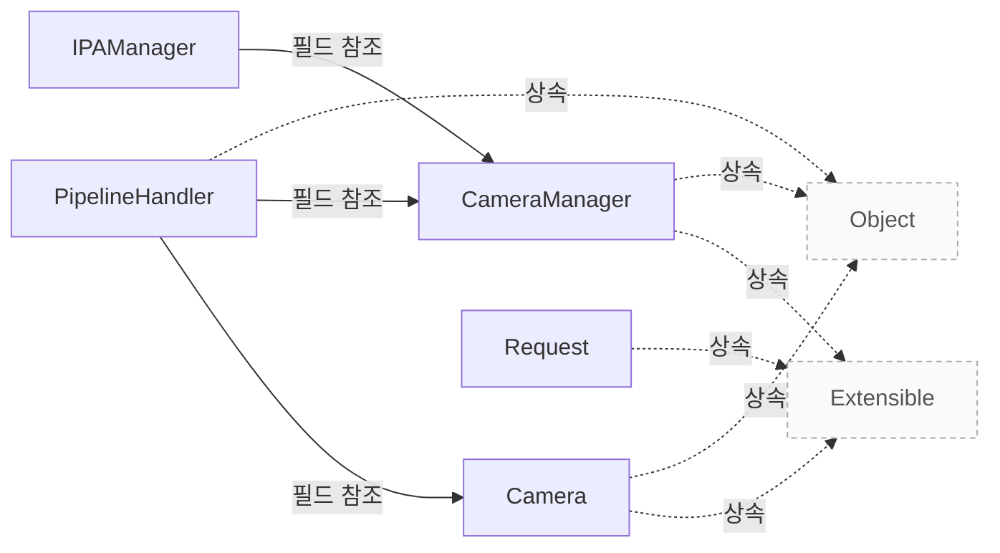

# 시스템 개요

**수정할 코드가 어느 패키지에 있는지 아래 표에서 먼저 찾으세요.**

| 지금 확인할 내용 | 이동할 절 |
|---|---|
| 수정할 패키지를 찾습니다. | [패키지별 역할](#패키지별-역할) |
| 패키지 사이의 의존 방향을 확인합니다. | [패키지 사이의 의존](#패키지-사이의-의존) |
| 요청이 처리되는 순서를 처음 봅니다. | [코드를 처음 읽는 순서](#코드를-처음-읽는-순서) |
| 클래스 단위 책임을 확인합니다. | [카메라와 요청 모델](camera-model.md) |

## 구조 설명

`include/libcamera`, `src/libcamera`, `src/apps/common` 등의 패키지에서 클래스를 정의하고, `include/libcamera/internal`과 `src/ipa/*` 패키지에서 구체적인 구현을 담당합니다. `libcamera::Camera`의 `create()` 정의를 먼저 확인합니다 `src/libcamera/camera.cpp:860`. `libcamera::CameraManager`의 `start()` 호출은 `src/libcamera/camera_manager.cpp:338`에 있으며, 이는 카메라를 시작하기 전에 필요한 초기화를 수행합니다.

각 패키지는 특정 역할을 담당하며, `include/libcamera/internal`은 120 개의 클래스로 가장 많은 구현을 포함하고 있습니다. `libcamera::IPAManager`의 `createIPA()`는 `include/libcamera/internal/ipa_manager.h:36`에 정의되어 있으며, IPA 모듈을 생성하는 데 사용됩니다. `PipelineHandler`의 `acquireMediaDevice()`는 `src/libcamera/pipeline_handler.cpp:136`에서 매칭된 미디어 장치를 찾습니다.

상속과 필드 참조 관계는 `include/libcamera/internal`이 `include/libcamera/base`를 13 번 상속하고 32 번 필드를 참조합니다. `src/ipa/rkisp1`은 `src/ipa/libipa`를 9 번 상속하고 19 번 필드를 참조하며, 하드웨어 설정을 관리합니다. `PipelineHandler`는 `Camera`와 `CameraManager`에 연관되어 있으며, 이 관계는 `include/libcamera/internal/pipeline_handler.h:34`에서 확인할 수 있습니다.

`Camera::queueRequest()` 시나리오의 호출 경로는 `Camera::createRequest()`를 거쳐 `PipelineHandler`로 이어집니다. `libcamera::Request`의 `addBuffer()`는 `src/libcamera/request.cpp:475`에서 프레임 버퍼를 추가하며, 이는 요청에 데이터를 포함시킵니다. `PipelineHandler`의 `configure()`는 `include/libcamera/internal/pipeline_handler.h:51`에서 카메라 설정을 적용합니다.

스레드, 프로세스 경계, 콜백 순서, 설계 의도는 근거가 부족하여 명시하지 않습니다. 메서드 목록은 호출 순서나 내부 호출 관계의 근거가 아닙니다.

<!-- sdd:class-diagram -->
## 클래스 관계

화살표의 글자는 추출한 관계를 나타내며, 점선은 상속입니다. 화살표는 참조 대상 또는 기반 클래스를 향합니다. 호출 순서를 뜻하지 않습니다.

<!-- /sdd:class-diagram -->

## 패키지별 역할

| 패키지 | 클래스 수 | 대표 클래스 |
|---|---|---|
| `include/libcamera` | 46 | `libcamera::CameraManager`, `libcamera::LoggingTarget`, `libcamera::Point`, `libcamera::Size`, `libcamera::SizeRange` |
| `include/libcamera/base` | 54 | `libcamera::ConnectionType`, `libcamera::BoundMethodPackBase`, `libcamera::BoundMethodPack`, `libcamera::BoundMethodBase`, `libcamera::BoundMethodArgs` |
| `include/libcamera/internal` | 120 | `libcamera::ControlSerializer`, `libcamera::ControlSerializer::Role`, `libcamera::ValueNode`, `libcamera::ValueNode::Value`, `libcamera::ValueNode::Iterator` |
| `include/libcamera/ipa` | 7 | `libcamera::IPAInterface`, `libcamera::IPAModuleInfo`, `libcamera::ipa_controls_id_map_type`, `libcamera::ipa_controls_header`, `libcamera::ipa_control_value_entry` |
| `src/apps/common` | 14 | `Image`, `Image::MapMode`, `OptionArgument`, `OptionType`, `OptionsBase` |
| `src/gstreamer` | 25 | `GstLibcameraSrcClass`, `libcamera::GstCameraControls`, `GLibLocker`, `GLibRecLocker`, `GstLibcameraProviderClass` |
| `src/ipa/ipu3` | 21 | `libcamera::ipa::ipu3::IPASessionConfiguration`, `libcamera::ipa::ipu3::IPAActiveState`, `libcamera::ipa::ipu3::IPAFrameContext`, `libcamera::ipa::ipu3::IPAContext`, `libcamera::ipa::ipu3::IPAIPU3` |
| `src/ipa/libipa` | 112 | `libcamera::ipa::CameraSensorHelper`, `libcamera::ipa::CameraSensorHelper::AnalogueGainLinear`, `libcamera::ipa::CameraSensorHelper::AnalogueGainExp`, `libcamera::ipa::CameraSensorHelperFactoryBase`, `libcamera::ipa::CameraSensorHelperFactory` |
| `src/ipa/rkisp1` | 47 | `libcamera::ipa::rkisp1::IPAHwSettings`, `libcamera::ipa::rkisp1::RKISP1AwbSession`, `libcamera::ipa::rkisp1::IPASessionConfiguration`, `libcamera::ipa::rkisp1::IPASessionConfiguration::Agc`, `libcamera::ipa::rkisp1::IPAActiveState` |
| `src/libcamera` | 11 | `libcamera::BayerFormatComparator`, `libcamera::Formats`, `libcamera::DmaBufAllocatorInfo`, `libcamera::EnvironmentProcessor`, `libcamera::EnvironmentFixedProcessor` |
| `src/libcamera/base` | 6 | `libcamera::LogOutput`, `libcamera::Logger`, `libcamera::MessageQueue`, `libcamera::ThreadData`, `libcamera::ThreadMain` |
| `src/libcamera/pipeline` | 22 | `libcamera::CIO2Device`, `libcamera::IPU3Frames`, `libcamera::IPU3Frames::Info`, `libcamera::ImgUDevice`, `libcamera::ImgUDevice::PipeConfig` |
| `src/libcamera/sensor` | 4 | `libcamera::CameraSensorLegacy`, `libcamera::CameraSensorRaw`, `libcamera::CameraSensorRaw::Streams` |
| `src/v4l2` | 6 | `V4L2Camera`, `V4L2Camera::Buffer`, `V4L2CameraFile`, `V4L2CameraProxy`, `V4L2CompatManager` |

## 패키지 사이의 의존

| 방향 | 상속 | 필드 참조 |
|---|---|---|
| `include/libcamera/internal` → `include/libcamera/base` | 13 | 32 |
| `include/libcamera/internal` → `include/libcamera` | 1 | 41 |
| `src/libcamera/pipeline` → `include/libcamera` | 3 | 26 |
| `src/ipa/rkisp1` → `src/ipa/libipa` | 9 | 19 |
| `src/libcamera/pipeline` → `include/libcamera/internal` | 6 | 21 |
| `src/ipa/ipu3` → `src/ipa/libipa` | 3 | 18 |
| `src/gstreamer` → `include/libcamera` | 0 | 15 |
| `src/libcamera/sensor` → `include/libcamera/internal` | 2 | 11 |
| `include/libcamera` → `include/libcamera/base` | 6 | 5 |
| `src/libcamera/base` → `include/libcamera/base` | 1 | 9 |
| `src/libcamera/sensor` → `include/libcamera` | 0 | 10 |
| `src/ipa/libipa` → `include/libcamera/base` | 1 | 8 |
| `src/v4l2` → `include/libcamera` | 0 | 8 |
| `src/ipa/libipa` → `include/libcamera` | 0 | 6 |
| `src/ipa/ipu3` → `include/libcamera` | 0 | 4 |
| `src/ipa/ipu3` → `include/libcamera/internal` | 0 | 4 |
| `src/ipa/libipa` → `include/libcamera/internal` | 0 | 4 |
| `src/ipa/rkisp1` → `include/libcamera` | 0 | 4 |
| `src/ipa/rkisp1` → `include/libcamera/internal` | 0 | 3 |
| `src/libcamera/pipeline` → `include/libcamera/base` | 0 | 3 |

관계가 많은 순으로 20 개만 실었습니다. 나머지 8 개 방향은 `facts.json` 의 `relations` 에 있습니다.

## 코드를 처음 읽는 순서

1. `src/libcamera/camera.cpp` 에서 `isAccessAllowed()` 부분을 읽습니다.
2. `src/libcamera/request.cpp` 에서 `operator<<()` 부분을 읽습니다.
3. `src/libcamera/controls.cpp` 에서 `find()` 부분을 읽습니다.

이 순서는 `요청 제출 (Camera::queueRequest)` 시나리오의 호출 경로에서 만들었습니다. 자세한 흐름은 시나리오 문서 [요청 제출 (Camera::queueRequest)](scenarios/queue_request.md) 에서 확인하세요.

로깅과 접근자 호출 49 개는 `hide` 규칙에 따라 이 순서에서 뺐습니다.

??? note "근거와 검토 정보"
    - 근거 파일: `include/libcamera/base/backtrace.h`, `include/libcamera/base/bound_method.h`, `include/libcamera/base/class.h`, `include/libcamera/base/event_dispatcher.h`, `include/libcamera/base/event_dispatcher_poll.h`, `include/libcamera/base/event_notifier.h`, `include/libcamera/base/file.h`, `include/libcamera/base/flags.h`, `include/libcamera/base/log.h`, `include/libcamera/base/memfd.h`, `include/libcamera/base/message.h`, `include/libcamera/base/mutex.h`, `include/libcamera/base/object.h`, `include/libcamera/base/semaphore.h`, `include/libcamera/base/shared_fd.h`, `include/libcamera/base/signal.h`, `include/libcamera/base/thread.h`, `include/libcamera/base/timer.h`, `include/libcamera/base/unique_fd.h`, `include/libcamera/base/utils.h`, `include/libcamera/camera.h`, `include/libcamera/camera_manager.h`, `include/libcamera/color_space.h`, `include/libcamera/controls.h`, `include/libcamera/fence.h`, `include/libcamera/framebuffer.h`, `include/libcamera/framebuffer_allocator.h`, `include/libcamera/geometry.h`, `include/libcamera/internal/bayer_format.h`, `include/libcamera/internal/byte_stream_buffer.h`, `include/libcamera/internal/camera.h`, `include/libcamera/internal/camera_controls.h`, `include/libcamera/internal/camera_lens.h`, `include/libcamera/internal/camera_manager.h`, `include/libcamera/internal/camera_sensor.h`, `include/libcamera/internal/camera_sensor_properties.h`, `include/libcamera/internal/clock_recovery.h`, `include/libcamera/internal/control_serializer.h`, `include/libcamera/internal/control_validator.h`, `include/libcamera/internal/converter.h`, `include/libcamera/internal/converter/converter_dw100.h`, `include/libcamera/internal/converter/converter_dw100_vertexmap.h`, `include/libcamera/internal/converter/converter_v4l2_m2m.h`, `include/libcamera/internal/debug_controls.h`, `include/libcamera/internal/delayed_controls.h`, `include/libcamera/internal/device_enumerator.h`, `include/libcamera/internal/device_enumerator_sysfs.h`, `include/libcamera/internal/device_enumerator_udev.h`, `include/libcamera/internal/dma_buf_allocator.h`, `include/libcamera/internal/formats.h`, `include/libcamera/internal/framebuffer.h`, `include/libcamera/internal/global_configuration.h`, `include/libcamera/internal/ipa_data_serializer.h`, `include/libcamera/internal/ipa_manager.h`, `include/libcamera/internal/ipa_module.h`, `include/libcamera/internal/ipa_proxy.h`, `include/libcamera/internal/ipc_pipe.h`, `include/libcamera/internal/ipc_pipe_unixsocket.h`, `include/libcamera/internal/ipc_unixsocket.h`, `include/libcamera/internal/mapped_framebuffer.h`, `include/libcamera/internal/matrix.h`, `include/libcamera/internal/media_device.h`, `include/libcamera/internal/media_object.h`, `include/libcamera/internal/media_pipeline.h`, `include/libcamera/internal/pipeline_handler.h`, `include/libcamera/internal/process.h`, `include/libcamera/internal/pub_key.h`, `include/libcamera/internal/request.h`, `include/libcamera/internal/shared_mem_object.h`, `include/libcamera/internal/v4l2_device.h`, `include/libcamera/internal/v4l2_pixelformat.h`, `include/libcamera/internal/v4l2_request.h`, `include/libcamera/internal/v4l2_subdevice.h`, `include/libcamera/internal/v4l2_videodevice.h`, `include/libcamera/internal/value_node.h`, `include/libcamera/internal/vector.h`, `include/libcamera/internal/yaml_parser.h`, `include/libcamera/ipa/ipa_controls.h`, `include/libcamera/ipa/ipa_interface.h`, `include/libcamera/ipa/ipa_module_info.h`, `include/libcamera/logging.h`, `include/libcamera/orientation.h`, `include/libcamera/pixel_format.h`, `include/libcamera/request.h`, `include/libcamera/stream.h`, `include/libcamera/transform.h`, `src/apps/common/image.h`, `src/apps/common/options.cpp`, `src/apps/common/options.h`, `src/apps/common/ppm_writer.h`, `src/apps/common/stream_options.h`, `src/gstreamer/gstlibcamera-controls.h`, `src/gstreamer/gstlibcamera-utils.cpp`, `src/gstreamer/gstlibcamera-utils.h`, `src/gstreamer/gstlibcameraallocator.cpp`, `src/gstreamer/gstlibcameraallocator.h`, `src/gstreamer/gstlibcamerapad.cpp`, `src/gstreamer/gstlibcamerapad.h`, `src/gstreamer/gstlibcamerapool.cpp`, `src/gstreamer/gstlibcamerapool.h`, `src/gstreamer/gstlibcameraprovider.cpp`, `src/gstreamer/gstlibcameraprovider.h`, `src/gstreamer/gstlibcamerasrc.cpp`, `src/gstreamer/gstlibcamerasrc.h`, `src/ipa/ipu3/algorithms/af.h`, `src/ipa/ipu3/algorithms/agc.cpp`, `src/ipa/ipu3/algorithms/agc.h`, `src/ipa/ipu3/algorithms/awb.cpp`, `src/ipa/ipu3/algorithms/awb.h`, `src/ipa/ipu3/algorithms/blc.h`, `src/ipa/ipu3/algorithms/ccm.h`, `src/ipa/ipu3/algorithms/lsc.h`, `src/ipa/ipu3/algorithms/tone_mapping.h`, `src/ipa/ipu3/ipa_context.h`, `src/ipa/ipu3/ipu3.cpp`, `src/ipa/libipa/agc.h`, `src/ipa/libipa/agc_mean_luminance.h`, `src/ipa/libipa/agc_msv.h`, `src/ipa/libipa/algorithm.h`, `src/ipa/libipa/awb.h`, `src/ipa/libipa/awb_bayes.cpp`, `src/ipa/libipa/awb_bayes.h`, `src/ipa/libipa/awb_grey.h`, `src/ipa/libipa/camera_sensor_helper.cpp`, `src/ipa/libipa/camera_sensor_helper.h`, `src/ipa/libipa/ccm.h`, `src/ipa/libipa/exposure_mode_helper.h`, `src/ipa/libipa/fc_queue.h`, `src/ipa/libipa/fixedpoint.h`, `src/ipa/libipa/gamma.h`, `src/ipa/libipa/histogram.h`, `src/ipa/libipa/interpolator.h`, `src/ipa/libipa/lsc.h`, `src/ipa/libipa/lsc_base.h`, `src/ipa/libipa/lsc_polynomial.h`, `src/ipa/libipa/lsc_table.h`, `src/ipa/libipa/lux.h`, `src/ipa/libipa/module.h`, `src/ipa/libipa/pwl.h`, `src/ipa/libipa/quantized.h`, `src/ipa/libipa/v4l2_params.h`, `src/ipa/libipa/v4l2_stats.h`, `src/ipa/rkisp1/algorithms/agc.cpp`, `src/ipa/rkisp1/algorithms/agc.h`, `src/ipa/rkisp1/algorithms/algorithm.h`, `src/ipa/rkisp1/algorithms/awb.cpp`, `src/ipa/rkisp1/algorithms/awb.h`, `src/ipa/rkisp1/algorithms/blc.h`, `src/ipa/rkisp1/algorithms/ccm.h`, `src/ipa/rkisp1/algorithms/compress.h`, `src/ipa/rkisp1/algorithms/cproc.h`, `src/ipa/rkisp1/algorithms/dpcc.h`, `src/ipa/rkisp1/algorithms/dpf.h`, `src/ipa/rkisp1/algorithms/filter.h`, `src/ipa/rkisp1/algorithms/goc.h`, `src/ipa/rkisp1/algorithms/gsl.h`, `src/ipa/rkisp1/algorithms/lsc.h`, `src/ipa/rkisp1/algorithms/lux.h`, `src/ipa/rkisp1/algorithms/wdr.h`, `src/ipa/rkisp1/ipa_context.h`, `src/ipa/rkisp1/params.cpp`, `src/ipa/rkisp1/params.h`, `src/ipa/rkisp1/rkisp1.cpp`, `src/libcamera/base/log.cpp`, `src/libcamera/base/thread.cpp`, `src/libcamera/base/utils.cpp`, `src/libcamera/bayer_format.cpp`, `src/libcamera/camera.cpp`, `src/libcamera/camera_manager.cpp`, `src/libcamera/controls.cpp`, `src/libcamera/dma_buf_allocator.cpp`, `src/libcamera/global_configuration.cpp`, `src/libcamera/ipa_manager.cpp`, `src/libcamera/pipeline/ipu3/cio2.h`, `src/libcamera/pipeline/ipu3/frames.h`, `src/libcamera/pipeline/ipu3/imgu.cpp`, `src/libcamera/pipeline/ipu3/imgu.h`, `src/libcamera/pipeline/ipu3/ipu3.cpp`, `src/libcamera/pipeline/rkisp1/rkisp1.cpp`, `src/libcamera/pipeline/rkisp1/rkisp1_path.h`, `src/libcamera/pipeline/uvcvideo/uvcvideo.cpp`, `src/libcamera/pipeline_handler.cpp`, `src/libcamera/request.cpp`, `src/libcamera/sensor/camera_sensor_legacy.cpp`, `src/libcamera/sensor/camera_sensor_raw.cpp`, `src/libcamera/v4l2_subdevice.cpp`, `src/libcamera/yaml_parser.cpp`, `src/v4l2/v4l2_camera.h`, `src/v4l2/v4l2_camera_file.h`, `src/v4l2/v4l2_camera_proxy.h`, `src/v4l2/v4l2_compat_manager.h`
    - 근거 수준: 코드 확인 (정적 분석, simple_compdb 구성, commit `279d355ef8`)
    - 자동 검사 (인용·문장 및 설정된 구조 검사): 통과
    - 검토: 2026-09-24 · ollama/qwen3.5:4b · 사람 검토 전

다음 단계: [핵심 시나리오 시퀀스](scenarios/index.md)
