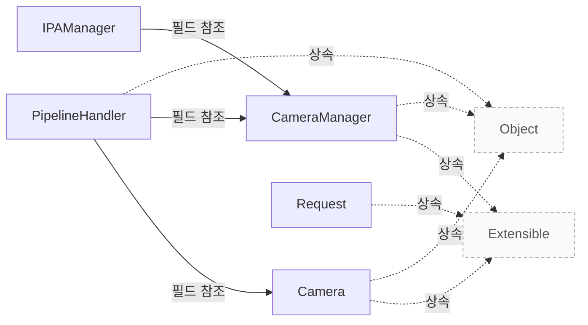

# 시스템 개요

**카메라 탐색, 요청 생성과 완료의 책임을 구분한 뒤 수정할 패키지를 찾으세요.**

| 지금 확인할 내용 | 이동할 절 |
|---|---|
| 수정할 패키지를 찾습니다. | [패키지별 역할](#패키지별-역할) |
| 패키지 사이의 의존 방향을 확인합니다. | [패키지 사이의 의존](#패키지-사이의-의존) |
| 요청 코드를 읽을 시작점을 찾습니다. | [코드를 처음 읽는 순서](#코드를-처음-읽는-순서) |
| 클래스 단위 책임을 확인합니다. | [카메라와 요청 모델](camera-model.md) |

## 설계 항목과 근거

아래 항목은 소스에 연결된 설명의 작성 범위를 나타냅니다. 설명의 의미와 실제 실행에 대한 승인은 별도 검토가 필요합니다.

| 설계 질문 | 설명 위치 | 확인 범위 |
|---|---|---|
| 카메라 탐색과 요청 생성은 누가 담당합니까? | [컴포넌트별 책임](#컴포넌트별-책임) | 코드 근거와 설명 연결 |
| 여러 파이프라인 구현은 어떻게 선택됩니까? | [탐색과 파이프라인 선택](#탐색과-파이프라인-선택) | 코드 근거와 설명 연결 |
| 캡처를 시작하고 끝내기 위한 API 계약은 무엇입니까? | [캡처 세션의 상태와 자원](#캡처-세션의-상태와-자원) | 코드 근거와 설명 연결 |
| 요청의 입력과 완료 통지는 어떤 경계를 통과합니까? | [요청 제출과 완료](#요청-제출과-완료) | 코드 근거와 설명 연결 |
| 코드에서 확인한 호출 경계와 실행 검증 범위는 무엇입니까? | [스레드 경계와 확인 범위](#스레드-경계와-확인-범위) | 코드 근거와 설명 연결 · 실행 확인 항목 별도 |

## 컴포넌트별 책임

`CameraManager`의 초기화는 `IPAManager`와 장치 열거기를 만들고 파이프라인 팩토리의 매칭을 시작합니다. `PipelineHandler::match()`는 필요한 미디어 장치를 확보하여 하나 이상의 `Camera`를 만들고 관리자에 등록하는 계약을 갖습니다. `src/libcamera/camera_manager.cpp:94`, `src/libcamera/pipeline_handler.cpp:50`

`Camera`는 단일 이미지 소스의 스트림 구성과 캡처를 제어하는 공개 객체입니다. 애플리케이션이 `Camera::createRequest()`를 호출하면 `Camera`가 `Request`를 생성하여 호출자에게 소유권을 넘기고, 파이프라인에는 `registerRequest()`로 등록합니다. `src/libcamera/camera.cpp:758`, `src/libcamera/camera.cpp:1243`

??? note "소스 근거: camera"
    `src/libcamera/camera.cpp:758`에서 시작하는 발췌입니다. 종료 줄은 769이며, 아래 원문을 설명과 대조할 수 있습니다.
    
    SHA-256: `e77cee469b7c57430e4bd4b0f08493289c46b57549873521c476df388d591dc2`
    
    ```text
    The Camera class models a camera capable of producing one or more image
     * streams from a single image source. It provides the main interface to
     * configuring and controlling the device, and capturing image streams. It is
     * the central object exposed by libcamera.
     *
     * To support the central nature of Camera objects, libcamera manages the
     * lifetime of camera instances with std::shared_ptr<>. Instances shall be
     * created with the create() function which returns a shared pointer. The
     * Camera constructors and destructor are private, to prevent instances from
     * being constructed and destroyed manually.
     *
     * \section camera_operation
    ```

??? note "소스 근거: discovery"
    `src/libcamera/camera_manager.cpp:94`에서 시작하는 발췌입니다. 종료 줄은 170이며, 아래 원문을 설명과 대조할 수 있습니다.
    
    SHA-256: `3e94e4e80c878774bd0a93076401d4ffb09e141dc8c87ae805eed5cc9349f938`
    
    ```text
    int CameraManager::Private::init()
    {
    	CameraManager *const o = LIBCAMERA_O_PTR();
    	ipaManager_ = std::make_unique<IPAManager>(*o);
    
    	enumerator_ = DeviceEnumerator::create();
    	if (!enumerator_ || enumerator_->enumerate())
    		return -ENODEV;
    
    	createPipelineHandlers();
    	enumerator_->devicesAdded.connect(this, &Private::createPipelineHandlers);
    
    	return 0;
    }
    
    void CameraManager::Private::createPipelineHandlers()
    {
    	/*
    	 * \todo Try to read handlers and order from configuration
    	 * file and only fallback on environment variable or all handlers, if
    	 * there is no configuration file.
    	 */
    	const auto pipesList =
    		configuration().listOption({ "pipelines_match_list" });
    	if (pipesList.has_value()) {
    		/*
    		 * When a list of preferred pipelines is defined, iterate
    		 * through the ordered list to match the enumerated devices.
    		 */
    		for (const auto &pipeName : pipesList.value()) {
    			const PipelineHandlerFactoryBase *factory;
    			factory = PipelineHandlerFactoryBase::getFactoryByName(pipeName);
    			if (!factory)
    				continue;
    
    			LOG(Camera, Debug)
    				<< "Found listed pipeline handler '"
    				<< pipeName << "'";
    			pipelineFactoryMatch(factory);
    		}
    
    		return;
    	}
    
    	const std::vector<PipelineHandlerFactoryBase *> &factories =
    		PipelineHandlerFactoryBase::factories();
    
    	/* Match all the registered pipeline handlers. */
    	for (const PipelineHandlerFactoryBase *factory : factories) {
    		LOG(Camera, Debug)
    			<< "Found registered pipeline handler '"
    			<< factory->name() << "'";
    		/*
    		 * Try each pipeline handler until it exhaust
    		 * all pipelines it can provide.
    		 */
    		pipelineFactoryMatch(factory);
    	}
    }
    
    void CameraManager::Private::pipelineFactoryMatch(const PipelineHandlerFactoryBase *factory)
    {
    	CameraManager *const o = LIBCAMERA_O_PTR();
    
    	/* Provide as many matching pipelines as possible. */
    	while (1) {
    		std::shared_ptr<PipelineHandler> pipe = factory->create(o);
    		if (!pipe->match(enumerator_.get()))
    			break;
    
    		LOG(Camera, Debug)
    			<< "Pipeline handler \"" << factory->name()
    			<< "\" matched";
    	}
    }
    
    void CameraManager::Private::cleanup()
    ```

??? note "소스 근거: handler"
    `src/libcamera/pipeline_handler.cpp:50`에서 시작하는 발췌입니다. 종료 줄은 119이며, 아래 원문을 설명과 대조할 수 있습니다.
    
    SHA-256: `e05278df0a06cb963fe79f772e62d4560b62df15c1411a6b49e32f7ca84d9e74`
    
    ```text
    \class PipelineHandler
     * \brief Create and manage cameras based on a set of media devices
     *
     * The PipelineHandler matches the media devices provided by a DeviceEnumerator
     * with the pipelines it supports and creates corresponding Camera devices.
     *
     * Pipeline handler instances are reference-counted through std::shared_ptr<>.
     * They implement std::enable_shared_from_this<> in order to create new
     * std::shared_ptr<> in code paths originating from member functions of the
     * PipelineHandler class where only the 'this' pointer is available.
     */
    
    /**
     * \brief Construct a PipelineHandler instance
     * \param[in] manager The camera manager
     * \param[in] maxQueuedRequestsDevice The maximum number of requests queued to
     * the device
     *
     * In order to honour the std::enable_shared_from_this<> contract,
     * PipelineHandler instances shall never be constructed manually, but always
     * through the PipelineHandlerFactoryBase::create() function.
     */
    PipelineHandler::PipelineHandler(CameraManager *manager,
    				 unsigned int maxQueuedRequestsDevice)
    	: manager_(manager), maxQueuedRequestsDevice_(maxQueuedRequestsDevice),
    	  useCount_(0)
    {
    }
    
    PipelineHandler::~PipelineHandler()
    {
    	for (std::shared_ptr<MediaDevice> &media : mediaDevices_)
    		media->release();
    }
    
    /**
     * \fn PipelineHandler::match(DeviceEnumerator *enumerator)
     * \brief Match media devices and create camera instances
     * \param[in] enumerator The enumerator providing all media devices found in the
     * system
     *
     * This function is the main entry point of the pipeline handler. It is called
     * by the camera manager with the \a enumerator passed as an argument. It shall
     * acquire from the \a enumerator all the media devices it needs for a single
     * pipeline, create one or multiple Camera instances and register them with the
     * camera manager.
     *
     * If all media devices needed by the pipeline handler are found, they must all
     * be acquired by a call to MediaDevice::acquire(). This function shall then
     * create the corresponding Camera instances, store them internally, and return
     * true. Otherwise it shall not acquire any media device (or shall release all
     * the media devices is has acquired by calling MediaDevice::release()) and
     * return false.
     *
     * If multiple instances of a pipeline are available in the system, the
     * PipelineHandler class will be instantiated once per instance, and its match()
     * function called for every instance. Each call shall acquire media devices for
     * one pipeline instance, until all compatible media devices are exhausted.
     *
     * If this function returns true, a new instance of the pipeline handler will
     * be created and its match() function called.
     *
     * \context This function is called from the CameraManager thread.
     *
     * \return true if media devices have been acquired and camera instances
     * created, or false otherwise
     */
    
    /**
     * \brief Search and acquire a MediaDevice
    ```

??? note "소스 근거: create"
    `src/libcamera/camera.cpp:1243`에서 시작하는 발췌입니다. 종료 줄은 1281이며, 아래 원문을 설명과 대조할 수 있습니다.
    
    SHA-256: `67f9f4155bfff91e13d4c04e35fb427f6f76615a4c9d2ce06b4fc6ad5ac33108`
    
    ```text
    \brief Create a request object for the camera
     * \param[in] cookie Opaque cookie for application use
     *
     * This function creates an empty request for the application to fill with
     * buffers and parameters, and queue for capture.
     *
     * The \a cookie is stored in the request and is accessible through the
     * Request::cookie() function at any time. It is typically used by applications
     * to map the request to an external resource in the request completion
     * handler, and is completely opaque to libcamera.
     *
     * The ownership of the returned request is passed to the caller, which is
     * responsible for deleting it. The request may be deleted in the completion
     * handler, or reused after resetting its state with Request::reuse().
     *
     * \context This function is \threadsafe. It may only be called when the camera
     * is in the Configured or Running state as defined in \ref camera_operation.
     *
     * \return A pointer to the newly created request, or nullptr on error
     */
    std::unique_ptr<Request> Camera::createRequest(uint64_t cookie)
    {
    	Private *const d = _d();
    
    	int ret = d->isAccessAllowed(Private::CameraConfigured,
    				     Private::CameraRunning);
    	if (ret < 0)
    		return nullptr;
    
    	std::unique_ptr<Request> request = std::make_unique<Request>(this, cookie);
    
    	/* Associate the request with the pipeline handler. */
    	d->pipe_->registerRequest(request.get());
    
    	return request;
    }
    
    /**
     * \brief Patch a control list
    ```

## 탐색과 파이프라인 선택

장치 열거기 생성 또는 열거가 실패하면 초기화는 `-ENODEV`를 반환합니다. 성공하면 설정의 `pipelines_match_list`가 있을 때 지정된 팩토리를 그 순서대로 시도하고, 없으면 등록된 팩토리를 순회합니다. `src/libcamera/camera_manager.cpp:94`

각 팩토리는 핸들러 인스턴스를 만들고 `match()`가 실패할 때까지 반복합니다. 성공한 인스턴스는 한 파이프라인에 필요한 장치를 확보합니다. 등록된 IPU3·RKISP1·UVC 구현이 하나의 캡처 요청에서 차례로 실행된다는 뜻은 아닙니다. `src/libcamera/camera_manager.cpp:94`, `src/libcamera/pipeline_handler.cpp:50`

??? note "소스 근거: discovery"
    `src/libcamera/camera_manager.cpp:94`에서 시작하는 발췌입니다. 종료 줄은 170이며, 아래 원문을 설명과 대조할 수 있습니다.
    
    SHA-256: `3e94e4e80c878774bd0a93076401d4ffb09e141dc8c87ae805eed5cc9349f938`
    
    ```text
    int CameraManager::Private::init()
    {
    	CameraManager *const o = LIBCAMERA_O_PTR();
    	ipaManager_ = std::make_unique<IPAManager>(*o);
    
    	enumerator_ = DeviceEnumerator::create();
    	if (!enumerator_ || enumerator_->enumerate())
    		return -ENODEV;
    
    	createPipelineHandlers();
    	enumerator_->devicesAdded.connect(this, &Private::createPipelineHandlers);
    
    	return 0;
    }
    
    void CameraManager::Private::createPipelineHandlers()
    {
    	/*
    	 * \todo Try to read handlers and order from configuration
    	 * file and only fallback on environment variable or all handlers, if
    	 * there is no configuration file.
    	 */
    	const auto pipesList =
    		configuration().listOption({ "pipelines_match_list" });
    	if (pipesList.has_value()) {
    		/*
    		 * When a list of preferred pipelines is defined, iterate
    		 * through the ordered list to match the enumerated devices.
    		 */
    		for (const auto &pipeName : pipesList.value()) {
    			const PipelineHandlerFactoryBase *factory;
    			factory = PipelineHandlerFactoryBase::getFactoryByName(pipeName);
    			if (!factory)
    				continue;
    
    			LOG(Camera, Debug)
    				<< "Found listed pipeline handler '"
    				<< pipeName << "'";
    			pipelineFactoryMatch(factory);
    		}
    
    		return;
    	}
    
    	const std::vector<PipelineHandlerFactoryBase *> &factories =
    		PipelineHandlerFactoryBase::factories();
    
    	/* Match all the registered pipeline handlers. */
    	for (const PipelineHandlerFactoryBase *factory : factories) {
    		LOG(Camera, Debug)
    			<< "Found registered pipeline handler '"
    			<< factory->name() << "'";
    		/*
    		 * Try each pipeline handler until it exhaust
    		 * all pipelines it can provide.
    		 */
    		pipelineFactoryMatch(factory);
    	}
    }
    
    void CameraManager::Private::pipelineFactoryMatch(const PipelineHandlerFactoryBase *factory)
    {
    	CameraManager *const o = LIBCAMERA_O_PTR();
    
    	/* Provide as many matching pipelines as possible. */
    	while (1) {
    		std::shared_ptr<PipelineHandler> pipe = factory->create(o);
    		if (!pipe->match(enumerator_.get()))
    			break;
    
    		LOG(Camera, Debug)
    			<< "Pipeline handler \"" << factory->name()
    			<< "\" matched";
    	}
    }
    
    void CameraManager::Private::cleanup()
    ```

??? note "소스 근거: handler"
    `src/libcamera/pipeline_handler.cpp:50`에서 시작하는 발췌입니다. 종료 줄은 119이며, 아래 원문을 설명과 대조할 수 있습니다.
    
    SHA-256: `e05278df0a06cb963fe79f772e62d4560b62df15c1411a6b49e32f7ca84d9e74`
    
    ```text
    \class PipelineHandler
     * \brief Create and manage cameras based on a set of media devices
     *
     * The PipelineHandler matches the media devices provided by a DeviceEnumerator
     * with the pipelines it supports and creates corresponding Camera devices.
     *
     * Pipeline handler instances are reference-counted through std::shared_ptr<>.
     * They implement std::enable_shared_from_this<> in order to create new
     * std::shared_ptr<> in code paths originating from member functions of the
     * PipelineHandler class where only the 'this' pointer is available.
     */
    
    /**
     * \brief Construct a PipelineHandler instance
     * \param[in] manager The camera manager
     * \param[in] maxQueuedRequestsDevice The maximum number of requests queued to
     * the device
     *
     * In order to honour the std::enable_shared_from_this<> contract,
     * PipelineHandler instances shall never be constructed manually, but always
     * through the PipelineHandlerFactoryBase::create() function.
     */
    PipelineHandler::PipelineHandler(CameraManager *manager,
    				 unsigned int maxQueuedRequestsDevice)
    	: manager_(manager), maxQueuedRequestsDevice_(maxQueuedRequestsDevice),
    	  useCount_(0)
    {
    }
    
    PipelineHandler::~PipelineHandler()
    {
    	for (std::shared_ptr<MediaDevice> &media : mediaDevices_)
    		media->release();
    }
    
    /**
     * \fn PipelineHandler::match(DeviceEnumerator *enumerator)
     * \brief Match media devices and create camera instances
     * \param[in] enumerator The enumerator providing all media devices found in the
     * system
     *
     * This function is the main entry point of the pipeline handler. It is called
     * by the camera manager with the \a enumerator passed as an argument. It shall
     * acquire from the \a enumerator all the media devices it needs for a single
     * pipeline, create one or multiple Camera instances and register them with the
     * camera manager.
     *
     * If all media devices needed by the pipeline handler are found, they must all
     * be acquired by a call to MediaDevice::acquire(). This function shall then
     * create the corresponding Camera instances, store them internally, and return
     * true. Otherwise it shall not acquire any media device (or shall release all
     * the media devices is has acquired by calling MediaDevice::release()) and
     * return false.
     *
     * If multiple instances of a pipeline are available in the system, the
     * PipelineHandler class will be instantiated once per instance, and its match()
     * function called for every instance. Each call shall acquire media devices for
     * one pipeline instance, until all compatible media devices are exhausted.
     *
     * If this function returns true, a new instance of the pipeline handler will
     * be created and its match() function called.
     *
     * \context This function is called from the CameraManager thread.
     *
     * \return true if media devices have been acquired and camera instances
     * created, or false otherwise
     */
    
    /**
     * \brief Search and acquire a MediaDevice
    ```

## 캡처 세션의 상태와 자원

애플리케이션은 카메라를 `acquire()`하고 `configure()`한 뒤 `start()`하여 요청을 제출합니다. `stop()`은 Running에서 Stopping을 거쳐 Configured로 돌아가는 경로이며, 사용을 마치면 `release()`합니다. 해제 전에는 재구성과 반복 시작·정지가 가능합니다. `src/libcamera/camera.cpp:769`

`createRequest()`는 Configured 또는 Running에서 허용됩니다. 반환된 요청은 호출자가 소유하며 완료 처리에서 삭제하거나 `Request::reuse()`로 초기화하여 다시 사용할 수 있습니다. 상태를 바꾸는 함수 사이의 동기화는 호출자가 담당합니다. `src/libcamera/camera.cpp:1243`, `src/libcamera/camera.cpp:769`

??? note "소스 근거: state"
    `src/libcamera/camera.cpp:769`에서 시작하는 발췌입니다. 종료 줄은 814이며, 아래 원문을 설명과 대조할 수 있습니다.
    
    SHA-256: `e85796df194551ecbd587ba1a7bb356a1409fa1d606762865e7eb989c92d2f72`
    
    ```text
    \section camera_operation Operating the Camera
     *
     * An application needs to perform a sequence of operations on a camera before
     * it is ready to process requests. The camera needs to be acquired and
     * configured to prepare the camera for capture. Once started the camera can
     * process requests until it is stopped. When an application is done with a
     * camera, the camera needs to be released.
     *
     * An application may start and stop a camera multiple times as long as it is
     * not released. The camera may also be reconfigured.
     *
     * Functions that affect the camera state as defined below are generally not
     * synchronized with each other by the Camera class. The caller is responsible
     * for ensuring their synchronization if necessary.
     *
     * \subsection Camera States
     *
     * To help manage the sequence of operations needed to control the camera a set
     * of states are defined. Each state describes which operations may be performed
     * on the camera. Performing an operation not allowed in the camera state
     * results in undefined behaviour. Operations not listed at all in the state
     * diagram are allowed in all states.
     *
     * \dot
     * digraph camera_state_machine {
     *   node [shape = doublecircle ]; Available;
     *   node [shape = circle ]; Acquired;
     *   node [shape = circle ]; Configured;
     *   node [shape = circle ]; Stopping;
     *   node [shape = circle ]; Running;
     *
     *   Available -> Available [label = "release()"];
     *   Available -> Acquired [label = "acquire()"];
     *
     *   Acquired -> Available [label = "release()"];
     *   Acquired -> Configured [label = "configure()"];
     *
     *   Configured -> Available [label = "release()"];
     *   Configured -> Configured [label = "configure(), createRequest()"];
     *   Configured -> Running [label = "start()"];
     *
     *   Running -> Stopping [label = "stop()"];
     *   Stopping -> Configured;
     *   Running -> Running [label = "createRequest(), queueRequest()"];
     * }
     * \enddot
    ```

??? note "소스 근거: create"
    `src/libcamera/camera.cpp:1243`에서 시작하는 발췌입니다. 종료 줄은 1281이며, 아래 원문을 설명과 대조할 수 있습니다.
    
    SHA-256: `67f9f4155bfff91e13d4c04e35fb427f6f76615a4c9d2ce06b4fc6ad5ac33108`
    
    ```text
    \brief Create a request object for the camera
     * \param[in] cookie Opaque cookie for application use
     *
     * This function creates an empty request for the application to fill with
     * buffers and parameters, and queue for capture.
     *
     * The \a cookie is stored in the request and is accessible through the
     * Request::cookie() function at any time. It is typically used by applications
     * to map the request to an external resource in the request completion
     * handler, and is completely opaque to libcamera.
     *
     * The ownership of the returned request is passed to the caller, which is
     * responsible for deleting it. The request may be deleted in the completion
     * handler, or reused after resetting its state with Request::reuse().
     *
     * \context This function is \threadsafe. It may only be called when the camera
     * is in the Configured or Running state as defined in \ref camera_operation.
     *
     * \return A pointer to the newly created request, or nullptr on error
     */
    std::unique_ptr<Request> Camera::createRequest(uint64_t cookie)
    {
    	Private *const d = _d();
    
    	int ret = d->isAccessAllowed(Private::CameraConfigured,
    				     Private::CameraRunning);
    	if (ret < 0)
    		return nullptr;
    
    	std::unique_ptr<Request> request = std::make_unique<Request>(this, cookie);
    
    	/* Associate the request with the pipeline handler. */
    	d->pipe_->registerRequest(request.get());
    
    	return request;
    }
    
    /**
     * \brief Patch a control list
    ```

## 요청 제출과 완료

애플리케이션은 요청에 버퍼와 컨트롤을 넣습니다. `Camera::queueRequest()`는 Running 상태, 요청이 속한 카메라, 요청 상태, 컨트롤 목록과 활성 스트림을 확인하고 빈 버퍼 요청을 거절합니다. 검사를 통과하면 `ConnectionTypeQueued`로 파이프라인에 전달하며, 반환값 0은 캡처 완료를 뜻하지 않습니다. `src/libcamera/camera.cpp:1308`

공통 파이프라인은 요청을 대기 큐에 넣어 준비한 후 장치 큐에 전달합니다. `completeBuffer()`는 버퍼 완료를 알리고, 요청 완료는 별도의 `completeRequest()`가 처리합니다. 완료된 요청은 제출 순서대로 `Camera::requestComplete()`에 전달됩니다. `src/libcamera/pipeline_handler.cpp:428`, `src/libcamera/pipeline_handler.cpp:547`

??? note "소스 근거: queue"
    `src/libcamera/camera.cpp:1308`에서 시작하는 발췌입니다. 종료 줄은 1383이며, 아래 원문을 설명과 대조할 수 있습니다.
    
    SHA-256: `96db61baeb32065c966b20942f97518ddbd3a43b36b64e8083eb29a90ecb7f4b`
    
    ```text
    \brief Queue a request to the camera
     * \param[in] request The request to queue to the camera
     *
     * This function queues a \a request to the camera for capture.
     *
     * After allocating the request with createRequest(), the application shall
     * fill it with at least one capture buffer before queuing it. Requests that
     * contain no buffers are invalid and are rejected without being queued.
     *
     * Once the request has been queued, the camera will notify its completion
     * through the \ref requestCompleted signal.
     *
     * \context This function is \threadsafe. It may only be called when the camera
     * is in the Running state as defined in \ref camera_operation.
     *
     * \return 0 on success or a negative error code otherwise
     * \retval -ENODEV The camera has been disconnected from the system
     * \retval -EACCES The camera is not running so requests can't be queued
     * \retval -EXDEV The request does not belong to this camera
     * \retval -EINVAL The request is invalid
     * \retval -ENOMEM No buffer memory was available to handle the request
     */
    int Camera::queueRequest(Request *request)
    {
    	Private *const d = _d();
    
    	int ret = d->isAccessAllowed(Private::CameraRunning);
    	if (ret < 0)
    		return ret;
    
    	/* Requests can only be queued to the camera that created them. */
    	if (request->_d()->camera() != this) {
    		LOG(Camera, Error) << "Request was not created by this camera";
    		return -EXDEV;
    	}
    
    	if (request->status() != Request::RequestPending) {
    		LOG(Camera, Error) << request->toString() << " is not valid";
    		return -EINVAL;
    	}
    
    	/* Make sure the Request has a valid control list. */
    	if (request->controls().infoMap() != &controls()) {
    		LOG(Camera, Error) << "Overwriting Request::controls() is not allowed";
    		return -EINVAL;
    	}
    
    	/*
    	 * The camera state may change until the end of the function. No locking
    	 * is however needed as PipelineHandler::queueRequest() will handle
    	 * this.
    	 */
    
    	if (request->buffers().empty()) {
    		LOG(Camera, Error) << "Request contains no buffers";
    		return -EINVAL;
    	}
    
    	for (const auto &[stream, buffer] : request->buffers()) {
    		if (d->activeStreams_.find(stream) == d->activeStreams_.end()) {
    			LOG(Camera, Error) << "Invalid request";
    			return -EINVAL;
    		}
    	}
    
    	/* Pre-process AeEnable. */
    	patchControlList(request->controls());
    
    	d->pipe_->invokeMethod(&PipelineHandler::queueRequest,
    			       ConnectionTypeQueued, request);
    
    	return 0;
    }
    
    /**
     * \brief Start capture from camera
    ```

??? note "소스 근거: pipeline-queue"
    `src/libcamera/pipeline_handler.cpp:428`에서 시작하는 발췌입니다. 종료 줄은 547이며, 아래 원문을 설명과 대조할 수 있습니다.
    
    SHA-256: `5a7a3397a6034a73fe348ae44eb1e2568d2823e95542fe43386e16359d627180`
    
    ```text
    \fn PipelineHandler::registerRequest()
     * \brief Register a request for use by the pipeline handler
     * \param[in] request The request to register
     *
     * This function is called when the request is created, and allows the pipeline
     * handler to perform any one-time initialization it requries for the request.
     */
    void PipelineHandler::registerRequest(Request *request)
    {
    	/*
    	 * Connect the request prepared signal to notify the pipeline handler
    	 * when a request is ready to be processed.
    	 */
    	request->_d()->prepared.connect(this, [this, request]() {
    		doQueueRequests(request->_d()->camera());
    	});
    }
    
    /**
     * \fn PipelineHandler::queueRequest()
     * \brief Queue a request
     * \param[in] request The request to queue
     *
     * This function queues a capture request to the pipeline handler for
     * processing. The request is first added to the internal list of waiting
     * requests which have to be prepared to make sure they are ready for being
     * queued to the pipeline handler.
     *
     * The queue of waiting requests is iterated and up to \a
     * maxQueuedRequestsDevice_ prepared requests are passed to the pipeline handler
     * in the same order they have been queued by calling this function.
     *
     * If a Request fails during the preparation phase or if the pipeline handler
     * fails in queuing the request to the hardware the request is cancelled.
     *
     * Keeping track of queued requests ensures automatic completion of all requests
     * when the pipeline handler is stopped with stop(). Request completion shall be
     * signalled by the pipeline handler using the completeRequest() function.
     *
     * \context This function is called from the CameraManager thread.
     */
    void PipelineHandler::queueRequest(Request *request)
    {
    	LIBCAMERA_TRACEPOINT(request_queue, request);
    
    	Camera *camera = request->_d()->camera();
    	Camera::Private *data = camera->_d();
    	data->waitingRequests_.push(request);
    
    	request->_d()->prepare(300ms);
    }
    
    /**
     * \brief Queue one requests to the device
     */
    void PipelineHandler::doQueueRequest(Request *request)
    {
    	LIBCAMERA_TRACEPOINT(request_device_queue, request);
    
    	Camera *camera = request->_d()->camera();
    	Camera::Private *data = camera->_d();
    	data->queuedRequests_.push_back(request);
    
    	request->_d()->sequence_ = data->requestSequence_++;
    
    	if (request->_d()->cancelled_) {
    		completeRequest(request);
    		return;
    	}
    
    	int ret = queueRequestDevice(camera, request);
    	if (ret)
    		cancelRequest(request);
    }
    
    /**
     * \brief Queue prepared requests to the device
     *
     * Iterate the list of waiting requests and queue them to the device one
     * by one if they have been prepared.
     */
    void PipelineHandler::doQueueRequests(Camera *camera)
    {
    	Camera::Private *data = camera->_d();
    	while (!data->waitingRequests_.empty()) {
    		if (data->queuedRequests_.size() == maxQueuedRequestsDevice_)
    			break;
    
    		Request *request = data->waitingRequests_.front();
    		if (!request->_d()->prepared_)
    			break;
    
    		/*
    		 * Pop the request first, in case doQueueRequests() is called
    		 * recursively from within doQueueRequest()
    		 */
    		data->waitingRequests_.pop();
    		doQueueRequest(request);
    	}
    }
    
    /**
     * \fn PipelineHandler::queueRequestDevice()
     * \brief Queue a request to the device
     * \param[in] camera The camera to queue the request to
     * \param[in] request The request to queue
     *
     * This function queues a capture request to the device for processing. The
     * request contains a set of buffers associated with streams and a set of
     * parameters. The pipeline handler shall program the device to ensure that the
     * parameters will be applied to the frames captured in the buffers provided in
     * the request.
     *
     * \context This function is called from the CameraManager thread.
     *
     * \return 0 on success or a negative error code otherwise
     */
    
    /**
     * \brief Complete a buffer for a request
    ```

??? note "소스 근거: completion"
    `src/libcamera/pipeline_handler.cpp:547`에서 시작하는 발췌입니다. 종료 줄은 620이며, 아래 원문을 설명과 대조할 수 있습니다.
    
    SHA-256: `514288cc958de9ff5fd19d46393cec3bb3088f4f08486528d4559071138638c9`
    
    ```text
    \brief Complete a buffer for a request
     * \param[in] request The request the buffer belongs to
     * \param[in] buffer The buffer that has completed
     *
     * This function shall be called by pipeline handlers to signal completion of
     * the \a buffer part of the \a request. It notifies applications of buffer
     * completion and updates the request's internal buffer tracking. The request
     * is not completed automatically when the last buffer completes to give
     * pipeline handlers a chance to perform any operation that may still be
     * needed. They shall complete requests explicitly with completeRequest().
     *
     * \context This function shall be called from the CameraManager thread.
     *
     * \return True if all buffers contained in the request have completed, false
     * otherwise
     */
    bool PipelineHandler::completeBuffer(Request *request, FrameBuffer *buffer)
    {
    	Camera *camera = request->_d()->camera();
    	camera->bufferCompleted.emit(request, buffer);
    	return request->_d()->completeBuffer(buffer);
    }
    
    /**
     * \brief Signal request completion
     * \param[in] request The request that has completed
     *
     * The pipeline handler shall call this function to notify the \a camera that
     * the request has completed. The request is no longer managed by the pipeline
     * handler and shall not be accessed once this function returns.
     *
     * This function ensures that requests will be returned to the application in
     * submission order, the pipeline handler may call it on any complete request
     * without any ordering constraint.
     *
     * \context This function shall be called from the CameraManager thread.
     */
    void PipelineHandler::completeRequest(Request *request)
    {
    	Camera *camera = request->_d()->camera();
    
    	request->_d()->complete();
    
    	Camera::Private *data = camera->_d();
    
    	while (!data->queuedRequests_.empty()) {
    		Request *req = data->queuedRequests_.front();
    		if (req->status() == Request::RequestPending)
    			break;
    
    		ASSERT(!req->hasPendingBuffers());
    		data->queuedRequests_.pop_front();
    		camera->requestComplete(req);
    	}
    
    	/* Allow any waiting requests to be queued to the pipeline. */
    	doQueueRequests(camera);
    }
    
    /**
     * \brief Cancel request and signal its completion
     * \param[in] request The request to cancel
     *
     * This function cancels and completes the request. The same rules as for
     * completeRequest() apply.
     */
    void PipelineHandler::cancelRequest(Request *request)
    {
    	request->_d()->cancel();
    	completeRequest(request);
    }
    
    /**
     * \brief Retrieve the absolute path to a platform configuration file
    ```

## 스레드 경계와 확인 범위

`Camera::queueRequest()`는 API 계약상 threadsafe이며 파이프라인 호출을 큐에 예약합니다. `PipelineHandler::completeRequest()`의 호출 문맥은 CameraManager 스레드로 명시되어 있습니다. 이 계약을 애플리케이션의 모든 콜백에 동일하게 적용해서는 안 됩니다. `src/libcamera/camera.cpp:1308`, `src/libcamera/pipeline_handler.cpp:547`

실행 확인 항목: 실제 신호 수신자의 연결 방식, 재진입, 센서별 지연과 하드웨어 오류 복구는 이 정적 문서로 검증되지 않습니다. 실행 구성과 수신자 코드를 확인하고 기기에서 관찰해야 합니다. `src/libcamera/camera.cpp:1308`, `src/libcamera/pipeline_handler.cpp:547`

??? note "소스 근거: queue"
    `src/libcamera/camera.cpp:1308`에서 시작하는 발췌입니다. 종료 줄은 1383이며, 아래 원문을 설명과 대조할 수 있습니다.
    
    SHA-256: `96db61baeb32065c966b20942f97518ddbd3a43b36b64e8083eb29a90ecb7f4b`
    
    ```text
    \brief Queue a request to the camera
     * \param[in] request The request to queue to the camera
     *
     * This function queues a \a request to the camera for capture.
     *
     * After allocating the request with createRequest(), the application shall
     * fill it with at least one capture buffer before queuing it. Requests that
     * contain no buffers are invalid and are rejected without being queued.
     *
     * Once the request has been queued, the camera will notify its completion
     * through the \ref requestCompleted signal.
     *
     * \context This function is \threadsafe. It may only be called when the camera
     * is in the Running state as defined in \ref camera_operation.
     *
     * \return 0 on success or a negative error code otherwise
     * \retval -ENODEV The camera has been disconnected from the system
     * \retval -EACCES The camera is not running so requests can't be queued
     * \retval -EXDEV The request does not belong to this camera
     * \retval -EINVAL The request is invalid
     * \retval -ENOMEM No buffer memory was available to handle the request
     */
    int Camera::queueRequest(Request *request)
    {
    	Private *const d = _d();
    
    	int ret = d->isAccessAllowed(Private::CameraRunning);
    	if (ret < 0)
    		return ret;
    
    	/* Requests can only be queued to the camera that created them. */
    	if (request->_d()->camera() != this) {
    		LOG(Camera, Error) << "Request was not created by this camera";
    		return -EXDEV;
    	}
    
    	if (request->status() != Request::RequestPending) {
    		LOG(Camera, Error) << request->toString() << " is not valid";
    		return -EINVAL;
    	}
    
    	/* Make sure the Request has a valid control list. */
    	if (request->controls().infoMap() != &controls()) {
    		LOG(Camera, Error) << "Overwriting Request::controls() is not allowed";
    		return -EINVAL;
    	}
    
    	/*
    	 * The camera state may change until the end of the function. No locking
    	 * is however needed as PipelineHandler::queueRequest() will handle
    	 * this.
    	 */
    
    	if (request->buffers().empty()) {
    		LOG(Camera, Error) << "Request contains no buffers";
    		return -EINVAL;
    	}
    
    	for (const auto &[stream, buffer] : request->buffers()) {
    		if (d->activeStreams_.find(stream) == d->activeStreams_.end()) {
    			LOG(Camera, Error) << "Invalid request";
    			return -EINVAL;
    		}
    	}
    
    	/* Pre-process AeEnable. */
    	patchControlList(request->controls());
    
    	d->pipe_->invokeMethod(&PipelineHandler::queueRequest,
    			       ConnectionTypeQueued, request);
    
    	return 0;
    }
    
    /**
     * \brief Start capture from camera
    ```

??? note "소스 근거: completion"
    `src/libcamera/pipeline_handler.cpp:547`에서 시작하는 발췌입니다. 종료 줄은 620이며, 아래 원문을 설명과 대조할 수 있습니다.
    
    SHA-256: `514288cc958de9ff5fd19d46393cec3bb3088f4f08486528d4559071138638c9`
    
    ```text
    \brief Complete a buffer for a request
     * \param[in] request The request the buffer belongs to
     * \param[in] buffer The buffer that has completed
     *
     * This function shall be called by pipeline handlers to signal completion of
     * the \a buffer part of the \a request. It notifies applications of buffer
     * completion and updates the request's internal buffer tracking. The request
     * is not completed automatically when the last buffer completes to give
     * pipeline handlers a chance to perform any operation that may still be
     * needed. They shall complete requests explicitly with completeRequest().
     *
     * \context This function shall be called from the CameraManager thread.
     *
     * \return True if all buffers contained in the request have completed, false
     * otherwise
     */
    bool PipelineHandler::completeBuffer(Request *request, FrameBuffer *buffer)
    {
    	Camera *camera = request->_d()->camera();
    	camera->bufferCompleted.emit(request, buffer);
    	return request->_d()->completeBuffer(buffer);
    }
    
    /**
     * \brief Signal request completion
     * \param[in] request The request that has completed
     *
     * The pipeline handler shall call this function to notify the \a camera that
     * the request has completed. The request is no longer managed by the pipeline
     * handler and shall not be accessed once this function returns.
     *
     * This function ensures that requests will be returned to the application in
     * submission order, the pipeline handler may call it on any complete request
     * without any ordering constraint.
     *
     * \context This function shall be called from the CameraManager thread.
     */
    void PipelineHandler::completeRequest(Request *request)
    {
    	Camera *camera = request->_d()->camera();
    
    	request->_d()->complete();
    
    	Camera::Private *data = camera->_d();
    
    	while (!data->queuedRequests_.empty()) {
    		Request *req = data->queuedRequests_.front();
    		if (req->status() == Request::RequestPending)
    			break;
    
    		ASSERT(!req->hasPendingBuffers());
    		data->queuedRequests_.pop_front();
    		camera->requestComplete(req);
    	}
    
    	/* Allow any waiting requests to be queued to the pipeline. */
    	doQueueRequests(camera);
    }
    
    /**
     * \brief Cancel request and signal its completion
     * \param[in] request The request to cancel
     *
     * This function cancels and completes the request. The same rules as for
     * completeRequest() apply.
     */
    void PipelineHandler::cancelRequest(Request *request)
    {
    	request->_d()->cancel();
    	completeRequest(request);
    }
    
    /**
     * \brief Retrieve the absolute path to a platform configuration file
    ```

??? note "소스 근거: state"
    `src/libcamera/camera.cpp:769`에서 시작하는 발췌입니다. 종료 줄은 814이며, 아래 원문을 설명과 대조할 수 있습니다.
    
    SHA-256: `e85796df194551ecbd587ba1a7bb356a1409fa1d606762865e7eb989c92d2f72`
    
    ```text
    \section camera_operation Operating the Camera
     *
     * An application needs to perform a sequence of operations on a camera before
     * it is ready to process requests. The camera needs to be acquired and
     * configured to prepare the camera for capture. Once started the camera can
     * process requests until it is stopped. When an application is done with a
     * camera, the camera needs to be released.
     *
     * An application may start and stop a camera multiple times as long as it is
     * not released. The camera may also be reconfigured.
     *
     * Functions that affect the camera state as defined below are generally not
     * synchronized with each other by the Camera class. The caller is responsible
     * for ensuring their synchronization if necessary.
     *
     * \subsection Camera States
     *
     * To help manage the sequence of operations needed to control the camera a set
     * of states are defined. Each state describes which operations may be performed
     * on the camera. Performing an operation not allowed in the camera state
     * results in undefined behaviour. Operations not listed at all in the state
     * diagram are allowed in all states.
     *
     * \dot
     * digraph camera_state_machine {
     *   node [shape = doublecircle ]; Available;
     *   node [shape = circle ]; Acquired;
     *   node [shape = circle ]; Configured;
     *   node [shape = circle ]; Stopping;
     *   node [shape = circle ]; Running;
     *
     *   Available -> Available [label = "release()"];
     *   Available -> Acquired [label = "acquire()"];
     *
     *   Acquired -> Available [label = "release()"];
     *   Acquired -> Configured [label = "configure()"];
     *
     *   Configured -> Available [label = "release()"];
     *   Configured -> Configured [label = "configure(), createRequest()"];
     *   Configured -> Running [label = "start()"];
     *
     *   Running -> Stopping [label = "stop()"];
     *   Stopping -> Configured;
     *   Running -> Running [label = "createRequest(), queueRequest()"];
     * }
     * \enddot
    ```


<!-- sdd:class-diagram -->
## 클래스 관계

화살표의 글자는 추출한 관계를 나타내며, 점선은 상속입니다. 화살표는 참조 대상 또는 기반 클래스를 향합니다. 호출 순서를 뜻하지 않습니다.


<!-- /sdd:class-diagram -->


## 패키지별 역할

| 패키지 | 클래스 수 | 대표 클래스 |
|---|---|---|
| `include/libcamera` | 46 | `libcamera::CameraManager`, `libcamera::LoggingTarget`, `libcamera::Point`, `libcamera::Size`, `libcamera::SizeRange` |
| `include/libcamera/base` | 54 | `libcamera::ConnectionType`, `libcamera::BoundMethodPackBase`, `libcamera::BoundMethodPack`, `libcamera::BoundMethodBase`, `libcamera::BoundMethodArgs` |
| `include/libcamera/internal` | 120 | `libcamera::ControlSerializer`, `libcamera::ControlSerializer::Role`, `libcamera::ValueNode`, `libcamera::ValueNode::Value`, `libcamera::ValueNode::Iterator` |
| `include/libcamera/ipa` | 7 | `libcamera::IPAInterface`, `libcamera::IPAModuleInfo`, `libcamera::ipa_controls_id_map_type`, `libcamera::ipa_controls_header`, `libcamera::ipa_control_value_entry` |
| `src/apps/common` | 14 | `Image`, `Image::MapMode`, `OptionArgument`, `OptionType`, `OptionsBase` |
| `src/gstreamer` | 25 | `GstLibcameraSrcClass`, `libcamera::GstCameraControls`, `GLibLocker`, `GLibRecLocker`, `GstLibcameraProviderClass` |
| `src/ipa/ipu3` | 21 | `libcamera::ipa::ipu3::IPASessionConfiguration`, `libcamera::ipa::ipu3::IPAActiveState`, `libcamera::ipa::ipu3::IPAFrameContext`, `libcamera::ipa::ipu3::IPAContext`, `libcamera::ipa::ipu3::IPAIPU3` |
| `src/ipa/libipa` | 112 | `libcamera::ipa::CameraSensorHelper`, `libcamera::ipa::CameraSensorHelper::AnalogueGainLinear`, `libcamera::ipa::CameraSensorHelper::AnalogueGainExp`, `libcamera::ipa::CameraSensorHelperFactoryBase`, `libcamera::ipa::CameraSensorHelperFactory` |
| `src/ipa/rkisp1` | 47 | `libcamera::ipa::rkisp1::IPAHwSettings`, `libcamera::ipa::rkisp1::RKISP1AwbSession`, `libcamera::ipa::rkisp1::IPASessionConfiguration`, `libcamera::ipa::rkisp1::IPASessionConfiguration::Agc`, `libcamera::ipa::rkisp1::IPAActiveState` |
| `src/libcamera` | 11 | `libcamera::BayerFormatComparator`, `libcamera::Formats`, `libcamera::DmaBufAllocatorInfo`, `libcamera::EnvironmentProcessor`, `libcamera::EnvironmentFixedProcessor` |
| `src/libcamera/base` | 6 | `libcamera::LogOutput`, `libcamera::Logger`, `libcamera::MessageQueue`, `libcamera::ThreadData`, `libcamera::ThreadMain` |
| `src/libcamera/pipeline` | 22 | `libcamera::CIO2Device`, `libcamera::IPU3Frames`, `libcamera::IPU3Frames::Info`, `libcamera::ImgUDevice`, `libcamera::ImgUDevice::PipeConfig` |
| `src/libcamera/sensor` | 4 | `libcamera::CameraSensorLegacy`, `libcamera::CameraSensorRaw`, `libcamera::CameraSensorRaw::Streams` |
| `src/v4l2` | 6 | `V4L2Camera`, `V4L2Camera::Buffer`, `V4L2CameraFile`, `V4L2CameraProxy`, `V4L2CompatManager` |

## 패키지 사이의 의존

| 방향 | 상속 | 필드 참조 |
|---|---|---|
| `include/libcamera/internal` → `include/libcamera/base` | 13 | 32 |
| `include/libcamera/internal` → `include/libcamera` | 1 | 41 |
| `src/libcamera/pipeline` → `include/libcamera` | 3 | 26 |
| `src/ipa/rkisp1` → `src/ipa/libipa` | 9 | 19 |
| `src/libcamera/pipeline` → `include/libcamera/internal` | 6 | 21 |
| `src/ipa/ipu3` → `src/ipa/libipa` | 3 | 18 |
| `src/gstreamer` → `include/libcamera` | 0 | 15 |
| `src/libcamera/sensor` → `include/libcamera/internal` | 2 | 11 |
| `include/libcamera` → `include/libcamera/base` | 6 | 5 |
| `src/libcamera/base` → `include/libcamera/base` | 1 | 9 |
| `src/libcamera/sensor` → `include/libcamera` | 0 | 10 |
| `src/ipa/libipa` → `include/libcamera/base` | 1 | 8 |
| `src/v4l2` → `include/libcamera` | 0 | 8 |
| `src/ipa/libipa` → `include/libcamera` | 0 | 6 |
| `src/ipa/ipu3` → `include/libcamera` | 0 | 4 |
| `src/ipa/ipu3` → `include/libcamera/internal` | 0 | 4 |
| `src/ipa/libipa` → `include/libcamera/internal` | 0 | 4 |
| `src/ipa/rkisp1` → `include/libcamera` | 0 | 4 |
| `src/ipa/rkisp1` → `include/libcamera/internal` | 0 | 3 |
| `src/libcamera/pipeline` → `include/libcamera/base` | 0 | 3 |

관계가 많은 순으로 20 개만 실었습니다. 나머지 8 개 방향은 `facts.json` 의 `relations` 에 있습니다.

## 코드를 처음 읽는 순서

1. `src/libcamera/camera.cpp` 에서 `isAccessAllowed()` 부분을 읽습니다.
2. `src/libcamera/request.cpp` 에서 `sequence()` 부분을 읽습니다.
3. `src/libcamera/controls.cpp` 에서 `find()` 부분을 읽습니다.

이 순서는 `요청 제출 (Camera::queueRequest)` 시나리오의 호출 경로에서 만들었습니다. 자세한 흐름은 시나리오 문서 [요청 제출 (Camera::queueRequest)](scenarios/queue_request.md) 에서 확인하세요.

로깅과 접근자 호출 51 개는 `hide` 규칙에 따라 이 순서에서 뺐습니다.

??? note "근거와 검토 정보"
    - 생성 방식: 소스 발췌에 연결한 설계 설명
    - 검증 범위: 설정에 작성된 설명을 발췌 해시와 대조합니다. 해시 일치는 설명의 의미를 승인하지 않습니다.
    - 근거 파일: `include/libcamera/base/backtrace.h`, `include/libcamera/base/bound_method.h`, `include/libcamera/base/class.h`, `include/libcamera/base/event_dispatcher.h`, `include/libcamera/base/event_dispatcher_poll.h`, `include/libcamera/base/event_notifier.h`, `include/libcamera/base/file.h`, `include/libcamera/base/flags.h`, `include/libcamera/base/log.h`, `include/libcamera/base/memfd.h`, `include/libcamera/base/message.h`, `include/libcamera/base/mutex.h`, `include/libcamera/base/object.h`, `include/libcamera/base/semaphore.h`, `include/libcamera/base/shared_fd.h`, `include/libcamera/base/signal.h`, `include/libcamera/base/thread.h`, `include/libcamera/base/timer.h`, `include/libcamera/base/unique_fd.h`, `include/libcamera/base/utils.h`, `include/libcamera/camera.h`, `include/libcamera/camera_manager.h`, `include/libcamera/color_space.h`, `include/libcamera/controls.h`, `include/libcamera/fence.h`, `include/libcamera/framebuffer.h`, `include/libcamera/framebuffer_allocator.h`, `include/libcamera/geometry.h`, `include/libcamera/internal/bayer_format.h`, `include/libcamera/internal/byte_stream_buffer.h`, `include/libcamera/internal/camera.h`, `include/libcamera/internal/camera_controls.h`, `include/libcamera/internal/camera_lens.h`, `include/libcamera/internal/camera_manager.h`, `include/libcamera/internal/camera_sensor.h`, `include/libcamera/internal/camera_sensor_properties.h`, `include/libcamera/internal/clock_recovery.h`, `include/libcamera/internal/control_serializer.h`, `include/libcamera/internal/control_validator.h`, `include/libcamera/internal/converter.h`, `include/libcamera/internal/converter/converter_dw100.h`, `include/libcamera/internal/converter/converter_dw100_vertexmap.h`, `include/libcamera/internal/converter/converter_v4l2_m2m.h`, `include/libcamera/internal/debug_controls.h`, `include/libcamera/internal/delayed_controls.h`, `include/libcamera/internal/device_enumerator.h`, `include/libcamera/internal/device_enumerator_sysfs.h`, `include/libcamera/internal/device_enumerator_udev.h`, `include/libcamera/internal/dma_buf_allocator.h`, `include/libcamera/internal/formats.h`, `include/libcamera/internal/framebuffer.h`, `include/libcamera/internal/global_configuration.h`, `include/libcamera/internal/ipa_data_serializer.h`, `include/libcamera/internal/ipa_manager.h`, `include/libcamera/internal/ipa_module.h`, `include/libcamera/internal/ipa_proxy.h`, `include/libcamera/internal/ipc_pipe.h`, `include/libcamera/internal/ipc_pipe_unixsocket.h`, `include/libcamera/internal/ipc_unixsocket.h`, `include/libcamera/internal/mapped_framebuffer.h`, `include/libcamera/internal/matrix.h`, `include/libcamera/internal/media_device.h`, `include/libcamera/internal/media_object.h`, `include/libcamera/internal/media_pipeline.h`, `include/libcamera/internal/pipeline_handler.h`, `include/libcamera/internal/process.h`, `include/libcamera/internal/pub_key.h`, `include/libcamera/internal/request.h`, `include/libcamera/internal/shared_mem_object.h`, `include/libcamera/internal/v4l2_device.h`, `include/libcamera/internal/v4l2_pixelformat.h`, `include/libcamera/internal/v4l2_request.h`, `include/libcamera/internal/v4l2_subdevice.h`, `include/libcamera/internal/v4l2_videodevice.h`, `include/libcamera/internal/value_node.h`, `include/libcamera/internal/vector.h`, `include/libcamera/internal/yaml_parser.h`, `include/libcamera/ipa/ipa_controls.h`, `include/libcamera/ipa/ipa_interface.h`, `include/libcamera/ipa/ipa_module_info.h`, `include/libcamera/logging.h`, `include/libcamera/orientation.h`, `include/libcamera/pixel_format.h`, `include/libcamera/request.h`, `include/libcamera/stream.h`, `include/libcamera/transform.h`, `src/apps/common/image.h`, `src/apps/common/options.cpp`, `src/apps/common/options.h`, `src/apps/common/ppm_writer.h`, `src/apps/common/stream_options.h`, `src/gstreamer/gstlibcamera-controls.h`, `src/gstreamer/gstlibcamera-utils.cpp`, `src/gstreamer/gstlibcamera-utils.h`, `src/gstreamer/gstlibcameraallocator.cpp`, `src/gstreamer/gstlibcameraallocator.h`, `src/gstreamer/gstlibcamerapad.cpp`, `src/gstreamer/gstlibcamerapad.h`, `src/gstreamer/gstlibcamerapool.cpp`, `src/gstreamer/gstlibcamerapool.h`, `src/gstreamer/gstlibcameraprovider.cpp`, `src/gstreamer/gstlibcameraprovider.h`, `src/gstreamer/gstlibcamerasrc.cpp`, `src/gstreamer/gstlibcamerasrc.h`, `src/ipa/ipu3/algorithms/af.h`, `src/ipa/ipu3/algorithms/agc.cpp`, `src/ipa/ipu3/algorithms/agc.h`, `src/ipa/ipu3/algorithms/awb.cpp`, `src/ipa/ipu3/algorithms/awb.h`, `src/ipa/ipu3/algorithms/blc.h`, `src/ipa/ipu3/algorithms/ccm.h`, `src/ipa/ipu3/algorithms/lsc.h`, `src/ipa/ipu3/algorithms/tone_mapping.h`, `src/ipa/ipu3/ipa_context.h`, `src/ipa/ipu3/ipu3.cpp`, `src/ipa/libipa/agc.h`, `src/ipa/libipa/agc_mean_luminance.h`, `src/ipa/libipa/agc_msv.h`, `src/ipa/libipa/algorithm.h`, `src/ipa/libipa/awb.h`, `src/ipa/libipa/awb_bayes.cpp`, `src/ipa/libipa/awb_bayes.h`, `src/ipa/libipa/awb_grey.h`, `src/ipa/libipa/camera_sensor_helper.cpp`, `src/ipa/libipa/camera_sensor_helper.h`, `src/ipa/libipa/ccm.h`, `src/ipa/libipa/exposure_mode_helper.h`, `src/ipa/libipa/fc_queue.h`, `src/ipa/libipa/fixedpoint.h`, `src/ipa/libipa/gamma.h`, `src/ipa/libipa/histogram.h`, `src/ipa/libipa/interpolator.h`, `src/ipa/libipa/lsc.h`, `src/ipa/libipa/lsc_base.h`, `src/ipa/libipa/lsc_polynomial.h`, `src/ipa/libipa/lsc_table.h`, `src/ipa/libipa/lux.h`, `src/ipa/libipa/module.h`, `src/ipa/libipa/pwl.h`, `src/ipa/libipa/quantized.h`, `src/ipa/libipa/v4l2_params.h`, `src/ipa/libipa/v4l2_stats.h`, `src/ipa/rkisp1/algorithms/agc.cpp`, `src/ipa/rkisp1/algorithms/agc.h`, `src/ipa/rkisp1/algorithms/algorithm.h`, `src/ipa/rkisp1/algorithms/awb.cpp`, `src/ipa/rkisp1/algorithms/awb.h`, `src/ipa/rkisp1/algorithms/blc.h`, `src/ipa/rkisp1/algorithms/ccm.h`, `src/ipa/rkisp1/algorithms/compress.h`, `src/ipa/rkisp1/algorithms/cproc.h`, `src/ipa/rkisp1/algorithms/dpcc.h`, `src/ipa/rkisp1/algorithms/dpf.h`, `src/ipa/rkisp1/algorithms/filter.h`, `src/ipa/rkisp1/algorithms/goc.h`, `src/ipa/rkisp1/algorithms/gsl.h`, `src/ipa/rkisp1/algorithms/lsc.h`, `src/ipa/rkisp1/algorithms/lux.h`, `src/ipa/rkisp1/algorithms/wdr.h`, `src/ipa/rkisp1/ipa_context.h`, `src/ipa/rkisp1/params.cpp`, `src/ipa/rkisp1/params.h`, `src/ipa/rkisp1/rkisp1.cpp`, `src/libcamera/base/log.cpp`, `src/libcamera/base/thread.cpp`, `src/libcamera/base/utils.cpp`, `src/libcamera/bayer_format.cpp`, `src/libcamera/camera.cpp`, `src/libcamera/camera_manager.cpp`, `src/libcamera/controls.cpp`, `src/libcamera/dma_buf_allocator.cpp`, `src/libcamera/global_configuration.cpp`, `src/libcamera/ipa_manager.cpp`, `src/libcamera/pipeline/ipu3/cio2.h`, `src/libcamera/pipeline/ipu3/frames.h`, `src/libcamera/pipeline/ipu3/imgu.cpp`, `src/libcamera/pipeline/ipu3/imgu.h`, `src/libcamera/pipeline/ipu3/ipu3.cpp`, `src/libcamera/pipeline/rkisp1/rkisp1.cpp`, `src/libcamera/pipeline/rkisp1/rkisp1_path.h`, `src/libcamera/pipeline/uvcvideo/uvcvideo.cpp`, `src/libcamera/pipeline_handler.cpp`, `src/libcamera/request.cpp`, `src/libcamera/sensor/camera_sensor_legacy.cpp`, `src/libcamera/sensor/camera_sensor_raw.cpp`, `src/libcamera/v4l2_subdevice.cpp`, `src/libcamera/yaml_parser.cpp`, `src/v4l2/v4l2_camera.h`, `src/v4l2/v4l2_camera_file.h`, `src/v4l2/v4l2_camera_proxy.h`, `src/v4l2/v4l2_compat_manager.h`
    - 근거 수준: 코드 확인 (정적 분석, simple_compdb 구성, commit `279d355ef8`)
    - 자동 검사 (인용·문장 및 설정된 구조 검사): 통과
    - 검토 상태 기록일: 2026-09-26 · 사람 검토 전

다음 단계: [핵심 시나리오](scenarios/index.md)
