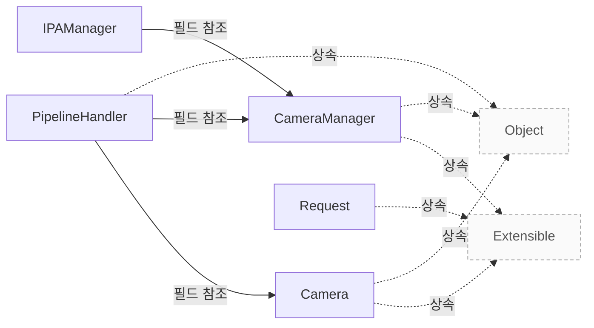

# 시스템 개요

**src/libcamera/camera_manager.cpp의 CameraManager에서 시작해 요청 제출과 완료를 따라가세요.**

| 지금 확인할 내용 | 이동할 절 |
|---|---|
| 처음 읽을 파일과 진입점을 찾습니다. | [탐색과 파이프라인 선택](#탐색과-파이프라인-선택) |
| 요청과 결과가 지나는 경계를 확인합니다. | [요청 제출과 완료](#요청-제출과-완료) |
| 완료가 오지 않는 요청을 조사합니다. | [요청 처리와 문제 진단](request-lifecycle.md) |
| 수정 전에 상태와 종료 순서를 확인합니다. | [캡처 세션의 상태와 자원](#캡처-세션의-상태와-자원) |
| 전체 클래스와 패키지를 찾습니다. | [구성 요소 색인](component-index.md) |

## 탐색과 파이프라인 선택

src/libcamera/camera_manager.cpp의 `CameraManager`부터 읽으세요. 이 객체는 장치를 탐색하고 응용 프로그램이 카메라에 접근하는 진입점입니다. 동시에 존재하는 인스턴스는 하나여야 합니다. 기존 인스턴스를 삭제하지 않고 두 번째를 만들면 동작이 정의되지 않습니다. `src/libcamera/camera_manager.cpp:283`

`CameraManager::start()`가 성공하면 시스템의 카메라에 접근할 수 있습니다. 성공은 0, 실패는 음수 오류 코드로 반환됩니다. 카메라 관리자가 정지하거나 장치 연결이 끊어지면 이 접근 조건이 유지되지 않습니다. `src/libcamera/camera_manager.cpp:329`

카메라 관리자가 실행 중일 때 `cameras()`로 목록을 얻거나 `get()`으로 ID에 해당하는 카메라를 찾습니다. `get()`은 찾지 못하면 null 포인터를 반환합니다. 카메라 관리자가 실행 중인지 보장하는 책임은 호출자에게 있습니다. `src/libcamera/camera_manager.cpp:368`

장치가 카메라로 등록되는 쪽은 src/libcamera/pipeline_handler.cpp의 `PipelineHandler::match()`입니다. 이 함수는 한 파이프라인에 필요한 장치를 확보하고 카메라 객체를 만들어 관리자에 등록합니다. 필요한 장치가 모두 발견되지 않으면 장치를 확보하지 않거나 이미 확보한 장치를 해제하고 false를 반환합니다. 구현 상세는 [Pipeline Handler](pipeline-handler.md#장치-매칭과-객체-수명)를 확인하세요. `src/libcamera/pipeline_handler.cpp:86`

근거 원문: [src/libcamera/camera_manager.cpp:283](#source-f75d22cf73f3402d) · [src/libcamera/camera_manager.cpp:329](#source-f58d94d893e03971) · [src/libcamera/camera_manager.cpp:368](#source-0c733673790ad84f) · [src/libcamera/pipeline_handler.cpp:86](#source-5bbd41c1e725138c)

## 컴포넌트별 책임

`Camera`는 영상 입력 하나에서 하나 이상의 영상 스트림을 만드는 카메라를 나타냅니다. 응용 프로그램은 이 객체를 통해 장치를 구성·제어하고 영상을 캡처합니다. `src/libcamera/camera.cpp:758`

카메라 객체는 `create()`로 만들며 `std::shared_ptr`로 수명을 관리합니다. 생성자와 소멸자가 비공개이므로 직접 만들거나 삭제하지 않습니다. 요청·버퍼와 다른 소유권 규칙은 [카메라와 요청 모델](camera-model.md#소유권과-재사용)에서 비교하세요. `src/libcamera/camera.cpp:758`

근거 원문: [src/libcamera/camera.cpp:758](#source-6c066281dcce33d6)

## 요청 생성과 소유권

`Camera::createRequest()`는 `Configured` 또는 `Running` 상태에서 호출할 수 있습니다. 빈 요청을 반환하며, 응용 프로그램이 여기에 버퍼와 파라미터를 연결합니다. 오류가 나면 null 포인터를 반환합니다. `src/libcamera/camera.cpp:1243`

반환된 요청의 소유권은 호출자에게 넘어갑니다. 호출자는 완료 핸들러에서 삭제하거나 `Request::reuse()`로 상태를 초기화한 뒤 다시 사용할 수 있습니다. `cookie`는 완료 처리에서 외부 자원과 요청을 연결하는 데 쓸 수 있는 호출자 값이며, libcamera는 그 의미를 해석하지 않습니다. `src/libcamera/camera.cpp:1243`

근거 원문: [src/libcamera/camera.cpp:1243](#source-d61960ed2545ba78)

## 캡처 세션의 상태와 자원

캡처 준비는 카메라 획득 → 구성 → 시작 순서입니다. 시작한 카메라는 정지할 때까지 요청을 처리할 수 있습니다. 사용을 마치면 카메라를 해제해야 합니다. `src/libcamera/camera.cpp:769`

카메라를 해제하기 전에는 시작과 정지를 반복하고 재구성할 수 있습니다. 정지와 최종 해제를 같은 단계로 취급하지 마세요. 상태별 API와 종료 계약은 [카메라와 요청 모델](camera-model.md)에서 확인합니다. `src/libcamera/camera.cpp:769`

근거 원문: [src/libcamera/camera.cpp:769](#source-04f354bc331ec5c1)

## 요청 제출과 완료

`Camera::queueRequest()`로 요청을 보내려면 카메라가 `Running` 상태여야 합니다. 요청에는 캡처 버퍼가 하나 이상 연결돼 있어야 합니다. 버퍼가 없는 요청은 큐에 들어가지 않고 거절됩니다. `src/libcamera/camera.cpp:1308`

`queueRequest()`의 0 반환은 제출 성공이고, 촬영 완료는 `requestCompleted` 신호로 따로 통지됩니다. 음수 반환과 제출 후 완료 누락은 확인할 위치가 다릅니다. [실패 위치별 확인 순서](request-lifecycle.md#실패-위치별-확인-순서)에서 관찰한 결과에 맞는 코드를 찾으세요. `src/libcamera/camera.cpp:1308`

근거 원문: [src/libcamera/camera.cpp:1308](#source-2f880c124115c9c4)

## 버퍼 완료와 요청 완료

`PipelineHandler::completeBuffer()`는 버퍼 완료를 알리고 요청 내부의 버퍼 추적 상태를 갱신합니다. 마지막 버퍼가 끝나도 요청이 자동으로 완료되지는 않습니다. 파이프라인은 `completeRequest()`를 명시적으로 호출해야 합니다. `src/libcamera/pipeline_handler.cpp:547`

완료가 오지 않는 요청을 조사할 때는 버퍼 완료와 요청 완료를 각각 확인하세요. 두 호출의 구현 계약은 [Pipeline Handler](pipeline-handler.md)에서 확인합니다. `src/libcamera/pipeline_handler.cpp:547`

근거 원문: [src/libcamera/pipeline_handler.cpp:547](#source-ca3f659653ce3f6a)

## 스레드 경계와 동기화

카메라 상태를 바꾸는 함수들은 일반적으로 `Camera`가 서로 동기화해 주지 않습니다. 필요한 동기화는 호출자가 보장해야 합니다. 상태 변경 경로를 수정할 때는 함수 하나뿐 아니라 함께 호출되는 상태 변경 함수도 확인하세요. `src/libcamera/camera.cpp:780`

`PipelineHandler::completeRequest()`는 `CameraManager` 스레드에서 호출해야 합니다. 반환 후에는 파이프라인이 해당 요청에 접근하면 안 됩니다. 이 스레드 계약을 모든 콜백에 확대해서 적용하지 마세요. `src/libcamera/pipeline_handler.cpp:571`

근거 원문: [src/libcamera/camera.cpp:780](#source-33ababe2a4780075) · [src/libcamera/pipeline_handler.cpp:571](#source-7ac40780a56ae3a9)

## 정적 근거의 확인 범위

캡처 시작 경로를 수정했다면 `Camera::start()`의 입력 상태와 호출자 동기화를 먼저 대조하세요. 이 함수는 `Configured` 상태에서만 호출할 수 있고, 다른 상태 변경 함수와의 동기화는 호출자 책임입니다. 실제 장치에서 이 조건을 만족하는지는 별도 실행 확인이 필요합니다. `src/libcamera/camera.cpp:1383`

실행 확인 항목: Camera 클래스 주석에는 시작 타이밍과 시작 시 파이프라인의 역할에 관한 문서화 TODO가 남아 있습니다. 이 발췌만으로 시작 지연이나 성능 예산을 확정할 수 없습니다. `src/libcamera/camera.cpp:755`

근거 원문: [src/libcamera/camera.cpp:1383](#source-9fe53bb2bee0d8b7) · [src/libcamera/camera.cpp:755](#source-6874d2b69bd02915)

??? note "설계 질문과 검증 범위"
    질문별 답변과 근거 연결을 검사했습니다. 의미와 실행 결과는 사람 검토가 필요합니다.
    
    | 설계 질문 | 설명 위치 | 확인 범위 |
    |---|---|---|
    | Camera는 어떤 공개 기능과 객체 수명 계약을 제공합니까? | [컴포넌트별 책임](#컴포넌트별-책임) | 코드 근거와 설명 연결 |
    | 어느 파일과 진입점부터 읽고, 장치 탐색과 카메라 접근은 어떤 순서로 이어집니까? | [탐색과 파이프라인 선택](#탐색과-파이프라인-선택) | 코드 근거와 설명 연결 |
    | 요청 생성의 조건과 소유권·재사용 계약은 무엇입니까? | [요청 생성과 소유권](#요청-생성과-소유권) | 코드 근거와 설명 연결 |
    | 캡처를 준비하고 반복하고 끝내는 순서는 무엇입니까? | [캡처 세션의 상태와 자원](#캡처-세션의-상태와-자원) | 코드 근거와 설명 연결 |
    | 요청을 어떤 조건으로 제출하고 완료를 어떻게 통지받습니까? | [요청 제출과 완료](#요청-제출과-완료) | 코드 근거와 설명 연결 |
    | 버퍼 완료와 요청 완료는 어떻게 구분합니까? | [버퍼 완료와 요청 완료](#버퍼-완료와-요청-완료) | 코드 근거와 설명 연결 |
    | 상태 변경의 동기화 책임과 요청 완료의 실행 스레드는 무엇입니까? | [스레드 경계와 동기화](#스레드-경계와-동기화) | 코드 근거와 설명 연결 |
    | 시작 API의 명시된 계약과 아직 문서화되지 않은 타이밍은 무엇입니까? | [정적 근거의 확인 범위](#정적-근거의-확인-범위) | 코드 근거와 설명 연결 · 실행 확인 항목 별도 |

## 소스 근거

같은 발췌는 한 번만 싣습니다. 필요한 원문을 펼쳐 설명과 대조하세요.

<a id="source-f75d22cf73f3402d"></a>

??? note "소스 근거: src/libcamera/camera_manager.cpp:283"
    `src/libcamera/camera_manager.cpp:283`에서 시작하는 발췌입니다. 종료 줄은 293이며, 아래 원문을 설명과 대조할 수 있습니다.
    
    SHA-256: `6c52c603a60f0faf8c931e6c1691d951484c4915ef9ab8ac67cc65d89acbb550`
    
    ```text
    The camera manager is the entry point to libcamera. It enumerates devices,
     * associates them with pipeline managers, and provides access to the cameras
     * in the system to applications. The manager owns all Camera objects and
     * handles hot-plugging and hot-unplugging to manage the lifetime of cameras.
     *
     * To interact with libcamera, an application starts by creating a camera
     * manager instance. Only a single instance of the camera manager may exist at
     * a time. Attempting to create a second instance without first deleting the
     * existing instance results in undefined behaviour.
     *
     * The manager is initially stopped,
    ```

<a id="source-f58d94d893e03971"></a>

??? note "소스 근거: src/libcamera/camera_manager.cpp:329"
    `src/libcamera/camera_manager.cpp:329`에서 시작하는 발췌입니다. 종료 줄은 338이며, 아래 원문을 설명과 대조할 수 있습니다.
    
    SHA-256: `5c647185035857e55de76a49cffad27bfac087260af8577a43cc2611196e3c17`
    
    ```text
    \brief Start the camera manager
     *
     * Start the camera manager and enumerate all devices in the system. Once
     * the start has been confirmed the user is free to list and otherwise
     * interact with cameras in the system until either the camera manager
     * is stopped or the camera is unplugged from the system.
     *
     * \return 0 on success or a negative error code otherwise
     */
    int CameraManager::start()
    ```

<a id="source-0c733673790ad84f"></a>

??? note "소스 근거: src/libcamera/camera_manager.cpp:368"
    `src/libcamera/camera_manager.cpp:368`에서 시작하는 발췌입니다. 종료 줄은 398이며, 아래 원문을 설명과 대조할 수 있습니다.
    
    SHA-256: `756e463ef09b825d17af3fc8b7d9912349d46cc84446a0e0c3e9c48fb22d56b6`
    
    ```text
    \fn CameraManager::cameras()
     * \brief Retrieve all available cameras
     *
     * Before calling this function the caller is responsible for ensuring that
     * the camera manager is running.
     *
     * \context This function is \threadsafe.
     *
     * \return List of all available cameras
     */
    std::vector<std::shared_ptr<Camera>> CameraManager::cameras() const
    {
    	const Private *const d = _d();
    
    	MutexLocker locker(d->mutex_);
    
    	return d->cameras_;
    }
    
    /**
     * \brief Get a camera based on ID
     * \param[in] id ID of camera to get
     *
     * Before calling this function the caller is responsible for ensuring that
     * the camera manager is running.
     *
     * \context This function is \threadsafe.
     *
     * \return Shared pointer to Camera object or nullptr if camera not found
     */
    std::shared_ptr<Camera> CameraManager::get(std::string_view id)
    ```

<a id="source-5bbd41c1e725138c"></a>

??? note "소스 근거: src/libcamera/pipeline_handler.cpp:86"
    `src/libcamera/pipeline_handler.cpp:86`에서 시작하는 발췌입니다. 종료 줄은 119이며, 아래 원문을 설명과 대조할 수 있습니다.
    
    SHA-256: `7dde6563cf6bda32f38f4c1fb3ef0443502432236a0222d4f811b3fa71f3fc05`
    
    ```text
    \fn PipelineHandler::match(DeviceEnumerator *enumerator)
     * \brief Match media devices and create camera instances
     * \param[in] enumerator The enumerator providing all media devices found in the
     * system
     *
     * This function is the main entry point of the pipeline handler. It is called
     * by the camera manager with the \a enumerator passed as an argument. It shall
     * acquire from the \a enumerator all the media devices it needs for a single
     * pipeline, create one or multiple Camera instances and register them with the
     * camera manager.
     *
     * If all media devices needed by the pipeline handler are found, they must all
     * be acquired by a call to MediaDevice::acquire(). This function shall then
     * create the corresponding Camera instances, store them internally, and return
     * true. Otherwise it shall not acquire any media device (or shall release all
     * the media devices is has acquired by calling MediaDevice::release()) and
     * return false.
     *
     * If multiple instances of a pipeline are available in the system, the
     * PipelineHandler class will be instantiated once per instance, and its match()
     * function called for every instance. Each call shall acquire media devices for
     * one pipeline instance, until all compatible media devices are exhausted.
     *
     * If this function returns true, a new instance of the pipeline handler will
     * be created and its match() function called.
     *
     * \context This function is called from the CameraManager thread.
     *
     * \return true if media devices have been acquired and camera instances
     * created, or false otherwise
     */
    
    /**
     * \brief Search and acquire a MediaDevice
    ```

<a id="source-6c066281dcce33d6"></a>

??? note "소스 근거: src/libcamera/camera.cpp:758"
    `src/libcamera/camera.cpp:758`에서 시작하는 발췌입니다. 종료 줄은 769이며, 아래 원문을 설명과 대조할 수 있습니다.
    
    SHA-256: `e77cee469b7c57430e4bd4b0f08493289c46b57549873521c476df388d591dc2`
    
    ```text
    The Camera class models a camera capable of producing one or more image
     * streams from a single image source. It provides the main interface to
     * configuring and controlling the device, and capturing image streams. It is
     * the central object exposed by libcamera.
     *
     * To support the central nature of Camera objects, libcamera manages the
     * lifetime of camera instances with std::shared_ptr<>. Instances shall be
     * created with the create() function which returns a shared pointer. The
     * Camera constructors and destructor are private, to prevent instances from
     * being constructed and destroyed manually.
     *
     * \section camera_operation
    ```

<a id="source-d61960ed2545ba78"></a>

??? note "소스 근거: src/libcamera/camera.cpp:1243"
    `src/libcamera/camera.cpp:1243`에서 시작하는 발췌입니다. 종료 줄은 1263이며, 아래 원문을 설명과 대조할 수 있습니다.
    
    SHA-256: `e71b8c0bea6263314881525ebf4714628591079745c9453624d3f4c3dffe31d0`
    
    ```text
    \brief Create a request object for the camera
     * \param[in] cookie Opaque cookie for application use
     *
     * This function creates an empty request for the application to fill with
     * buffers and parameters, and queue for capture.
     *
     * The \a cookie is stored in the request and is accessible through the
     * Request::cookie() function at any time. It is typically used by applications
     * to map the request to an external resource in the request completion
     * handler, and is completely opaque to libcamera.
     *
     * The ownership of the returned request is passed to the caller, which is
     * responsible for deleting it. The request may be deleted in the completion
     * handler, or reused after resetting its state with Request::reuse().
     *
     * \context This function is \threadsafe. It may only be called when the camera
     * is in the Configured or Running state as defined in \ref camera_operation.
     *
     * \return A pointer to the newly created request, or nullptr on error
     */
    std::unique_ptr<Request> Camera::createRequest
    ```

<a id="source-04f354bc331ec5c1"></a>

??? note "소스 근거: src/libcamera/camera.cpp:769"
    `src/libcamera/camera.cpp:769`에서 시작하는 발췌입니다. 종료 줄은 780이며, 아래 원문을 설명과 대조할 수 있습니다.
    
    SHA-256: `73164878543e86e16cf4e3197648ec4e79819beaad2f1c8754260715f65b8333`
    
    ```text
    \section camera_operation Operating the Camera
     *
     * An application needs to perform a sequence of operations on a camera before
     * it is ready to process requests. The camera needs to be acquired and
     * configured to prepare the camera for capture. Once started the camera can
     * process requests until it is stopped. When an application is done with a
     * camera, the camera needs to be released.
     *
     * An application may start and stop a camera multiple times as long as it is
     * not released. The camera may also be reconfigured.
     *
     * Functions that affect the camera state
    ```

<a id="source-2f880c124115c9c4"></a>

??? note "소스 근거: src/libcamera/camera.cpp:1308"
    `src/libcamera/camera.cpp:1308`에서 시작하는 발췌입니다. 종료 줄은 1330이며, 아래 원문을 설명과 대조할 수 있습니다.
    
    SHA-256: `b24af43d2f808f81b527cf4ee8915451be675f43f877bac5e6edfe69ff3739d6`
    
    ```text
    \brief Queue a request to the camera
     * \param[in] request The request to queue to the camera
     *
     * This function queues a \a request to the camera for capture.
     *
     * After allocating the request with createRequest(), the application shall
     * fill it with at least one capture buffer before queuing it. Requests that
     * contain no buffers are invalid and are rejected without being queued.
     *
     * Once the request has been queued, the camera will notify its completion
     * through the \ref requestCompleted signal.
     *
     * \context This function is \threadsafe. It may only be called when the camera
     * is in the Running state as defined in \ref camera_operation.
     *
     * \return 0 on success or a negative error code otherwise
     * \retval -ENODEV The camera has been disconnected from the system
     * \retval -EACCES The camera is not running so requests can't be queued
     * \retval -EXDEV The request does not belong to this camera
     * \retval -EINVAL The request is invalid
     * \retval -ENOMEM No buffer memory was available to handle the request
     */
    int Camera::queueRequest
    ```

<a id="source-ca3f659653ce3f6a"></a>

??? note "소스 근거: src/libcamera/pipeline_handler.cpp:547"
    `src/libcamera/pipeline_handler.cpp:547`에서 시작하는 발췌입니다. 종료 줄은 563이며, 아래 원문을 설명과 대조할 수 있습니다.
    
    SHA-256: `49b0139e3f0f620c0a3c044caf699179753dddf1b896d48de417c338bbae6a22`
    
    ```text
    \brief Complete a buffer for a request
     * \param[in] request The request the buffer belongs to
     * \param[in] buffer The buffer that has completed
     *
     * This function shall be called by pipeline handlers to signal completion of
     * the \a buffer part of the \a request. It notifies applications of buffer
     * completion and updates the request's internal buffer tracking. The request
     * is not completed automatically when the last buffer completes to give
     * pipeline handlers a chance to perform any operation that may still be
     * needed. They shall complete requests explicitly with completeRequest().
     *
     * \context This function shall be called from the CameraManager thread.
     *
     * \return True if all buffers contained in the request have completed, false
     * otherwise
     */
    bool PipelineHandler::completeBuffer
    ```

<a id="source-33ababe2a4780075"></a>

??? note "소스 근거: src/libcamera/camera.cpp:780"
    `src/libcamera/camera.cpp:780`에서 시작하는 발췌입니다. 종료 줄은 784이며, 아래 원문을 설명과 대조할 수 있습니다.
    
    SHA-256: `943831ed5cf08179455c41bd83a649d74d2a4a2d53f153cfa83dbeff179c2bf6`
    
    ```text
    Functions that affect the camera state as defined below are generally not
     * synchronized with each other by the Camera class. The caller is responsible
     * for ensuring their synchronization if necessary.
     *
     * \subsection Camera States
    ```

<a id="source-7ac40780a56ae3a9"></a>

??? note "소스 근거: src/libcamera/pipeline_handler.cpp:571"
    `src/libcamera/pipeline_handler.cpp:571`에서 시작하는 발췌입니다. 종료 줄은 584이며, 아래 원문을 설명과 대조할 수 있습니다.
    
    SHA-256: `25903b4c6a305017b96bfe9117fe2b7b917b51fbeb2fd21139700b1fbf6a4fe2`
    
    ```text
    \brief Signal request completion
     * \param[in] request The request that has completed
     *
     * The pipeline handler shall call this function to notify the \a camera that
     * the request has completed. The request is no longer managed by the pipeline
     * handler and shall not be accessed once this function returns.
     *
     * This function ensures that requests will be returned to the application in
     * submission order, the pipeline handler may call it on any complete request
     * without any ordering constraint.
     *
     * \context This function shall be called from the CameraManager thread.
     */
    void PipelineHandler::completeRequest
    ```

<a id="source-9fe53bb2bee0d8b7"></a>

??? note "소스 근거: src/libcamera/camera.cpp:1383"
    `src/libcamera/camera.cpp:1383`에서 시작하는 발췌입니다. 종료 줄은 1400이며, 아래 원문을 설명과 대조할 수 있습니다.
    
    SHA-256: `3b6dec3d3372dc891ac15cca8f5c578ab56f76a0321a113a64f10a25f830283d`
    
    ```text
    \brief Start capture from camera
     * \param[in] controls Controls to be applied before starting the Camera
     *
     * Start the camera capture session, optionally providing a list of controls to
     * apply before starting. Once the camera is started the application can queue
     * requests to the camera to process and return to the application until the
     * capture session is terminated with \a stop().
     *
     * \context This function may only be called when the camera is in the
     * Configured state as defined in \ref camera_operation, and shall be
     * synchronized by the caller with other functions that affect the camera
     * state.
     *
     * \return 0 on success or a negative error code otherwise
     * \retval -ENODEV The camera has been disconnected from the system
     * \retval -EACCES The camera is not in a state where it can be started
     */
    int Camera::start
    ```

<a id="source-6874d2b69bd02915"></a>

??? note "소스 근거: src/libcamera/camera.cpp:755"
    `src/libcamera/camera.cpp:755`에서 시작하는 발췌입니다. 종료 줄은 758이며, 아래 원문을 설명과 대조할 수 있습니다.
    
    SHA-256: `fe1cde84836279cf75402cca5392d528cc43c3eff36066e3beb4822b75329a46`
    
    ```text
    \todo Add documentation for camera start timings. What exactly does the
     * camera expect the pipeline handler to do when start() is called?
     *
     * The Camera class models a camera
    ```


<!-- sdd:class-diagram -->
## 클래스 관계

화살표의 글자는 추출한 관계를 나타내며, 점선은 상속입니다. 화살표는 참조 대상 또는 기반 클래스를 향합니다. 호출 순서를 뜻하지 않습니다.


```mermaid
flowchart LR
  c0["Camera"]
  c1["CameraManager"]
  c2["Extensible"]:::context
  c3["IPAManager"]
  c4["Object"]:::context
  c5["PipelineHandler"]
  c6["Request"]
  c0 -.->|상속| c2
  c0 -.->|상속| c4
  c1 -.->|상속| c2
  c1 -.->|상속| c4
  c3 -->|필드 참조| c1
  c5 -->|필드 참조| c0
  c5 -->|필드 참조| c1
  c5 -.->|상속| c4
  c6 -.->|상속| c2
  classDef context fill:#fafafa,stroke:#aaa,stroke-dasharray:4 3,color:#555
```
<!-- /sdd:class-diagram -->


## 코드를 처음 읽는 순서

1. 진입점 `Camera::queueRequest(Request *)`의 입력 검사와 반환 조건을 확인합니다.
2. [요청 제출 (Camera::queueRequest)](scenarios/queue_request.md)에서 주요 호출과 추적 경계를 확인합니다.
3. 예약된 호출과 완료 통지를 구분하고, 실행 스레드는 연결 코드와 대조합니다.

??? note "근거와 검토 정보"
    - 생성 방식: 소스 발췌에 연결한 설계 설명
    - 검증 범위: 설정에 작성된 설명을 발췌 해시와 대조합니다. 해시 일치는 설명의 의미를 승인하지 않습니다.
    - 근거 파일: `include/libcamera/camera.h`, `include/libcamera/camera_manager.h`, `include/libcamera/internal/ipa_manager.h`, `include/libcamera/internal/pipeline_handler.h`, `include/libcamera/request.h`, `src/libcamera/base/log.cpp`, `src/libcamera/camera.cpp`, `src/libcamera/camera_manager.cpp`, `src/libcamera/controls.cpp`, `src/libcamera/ipa_manager.cpp`, `src/libcamera/pipeline_handler.cpp`, `src/libcamera/request.cpp`
    - 근거 수준: 코드 확인 (정적 분석, simple_compdb 구성, commit `2c4b67c079`)
    - 자동 검사 (인용·문장 및 설정된 구조 검사): 통과
    - 검토 상태 기록일: 2026-10-24 · 사람 검토 전

다음 단계: [카메라와 요청 모델](camera-model.md)
