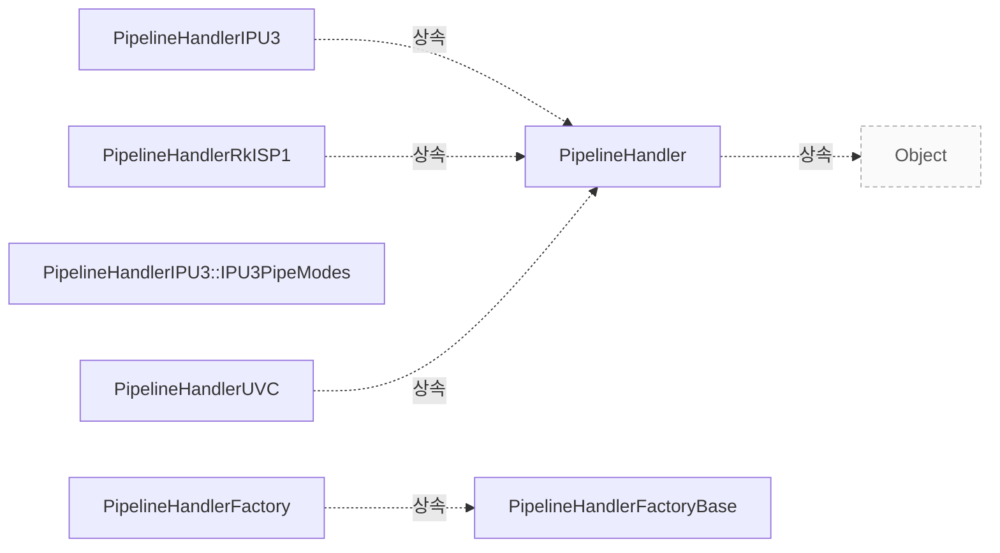

# Pipeline Handler

**공통 PipelineHandler와 빌드에 포함된 구현의 관계를 확인하세요.**

| 지금 확인할 내용 | 이동할 절 |
|---|---|
| 구조 설명 절을 확인합니다. | [구조 설명](#구조-설명) |
| 클래스 관계 절을 확인합니다. | [클래스 관계](#클래스-관계) |
| 관련 클래스 절을 확인합니다. | [관련 클래스](#관련-클래스) |

## 구조 설명

직접 상속 계층 구조는 `libcamera::PipelineHandler`가 `libcamera::Object`를 기반으로 하며, 하드웨어별 구현은 이를 직접 상속받습니다. `libcamera::PipelineHandlerIPU3`, `libcamera::PipelineHandlerRkISP1`, `libcamera::PipelineHandlerUVC`는 각각 `src/libcamera/pipeline/ipu3/ipu3.cpp:124`, `src/libcamera/pipeline/rkisp1/rkisp1.cpp:184`, `src/libcamera/pipeline/uvcvideo/uvcvideo.cpp:81`에서 `libcamera::PipelineHandler`를 직접 기반으로 합니다. 반면 `libcamera::PipelineHandlerFactory`는 `libcamera::PipelineHandlerFactoryBase`를 기반으로 하며, 이 기본 클래스는 별도의 기반 클래스가 없습니다.

설정과 요청 전달을 위한 주요 메서드는 `libcamera::PipelineHandler`의 정의를 먼저 확인합니다 `include/libcamera/internal/pipeline_handler.h:34`. `match()` 메서드는 `include/libcamera/internal/pipeline_handler.h:42`에서 정의되며, `acquireMediaDevice()`는 `src/libcamera/pipeline_handler.cpp:136`에서 매칭된 장치 패턴에 맞는 장치를 검색하고 획득합니다. `configure()`와 `generateConfiguration()`는 각각 `include/libcamera/internal/pipeline_handler.h:51`과 `include/libcamera/internal/pipeline_handler.h:49`에서 정의되며, 하드웨어별 구현에서는 `src/libcamera/pipeline/ipu3/ipu3.cpp:393`와 같은 위치에서 구체적인 설정 로직이 추가됩니다.

<!-- sdd:class-diagram -->
## 클래스 관계

화살표의 글자는 추출한 관계를 나타내며, 점선은 상속입니다. 화살표는 참조 대상 또는 기반 클래스를 향합니다. 호출 순서를 뜻하지 않습니다.

<!-- /sdd:class-diagram -->

## 관련 클래스

| 클래스 | 선언 위치 | 상속 | 책임 (주석) |
|---|---|---|---|
| `libcamera::PipelineHandler` | `include/libcamera/internal/pipeline_handler.h:34` | `libcamera::Object` | 확인 필요 |
| `libcamera::PipelineHandlerFactory` | `include/libcamera/internal/pipeline_handler.h:144` | `libcamera::PipelineHandlerFactoryBase` | 확인 필요 |
| `libcamera::PipelineHandlerFactoryBase` | `include/libcamera/internal/pipeline_handler.h:121` | – | 확인 필요 |
| `libcamera::PipelineHandlerIPU3` | `src/libcamera/pipeline/ipu3/ipu3.cpp:124` | `libcamera::PipelineHandler` | 확인 필요 |
| `libcamera::PipelineHandlerIPU3::IPU3PipeModes` | `src/libcamera/pipeline/ipu3/ipu3.cpp:130` | – | 확인 필요 |
| `libcamera::PipelineHandlerRkISP1` | `src/libcamera/pipeline/rkisp1/rkisp1.cpp:184` | `libcamera::PipelineHandler` | 확인 필요 |
| `libcamera::PipelineHandlerUVC` | `src/libcamera/pipeline/uvcvideo/uvcvideo.cpp:81` | `libcamera::PipelineHandler` | 확인 필요 |

??? note "근거와 검토 정보"
    - 근거 파일: `include/libcamera/internal/pipeline_handler.h`, `src/libcamera/pipeline/ipu3/ipu3.cpp`, `src/libcamera/pipeline/rkisp1/rkisp1.cpp`, `src/libcamera/pipeline/uvcvideo/uvcvideo.cpp`, `src/libcamera/pipeline_handler.cpp`
    - 근거 수준: 코드 확인 (정적 분석, simple_compdb 구성, commit `279d355ef8`)
    - 자동 검사 (인용·문장 및 설정된 구조 검사): 통과
    - 검토: 2026-09-21 · ollama/qwen3.5:4b · 사람 검토 전

다음 단계: [IPA 관련 클래스](ipa.md)
