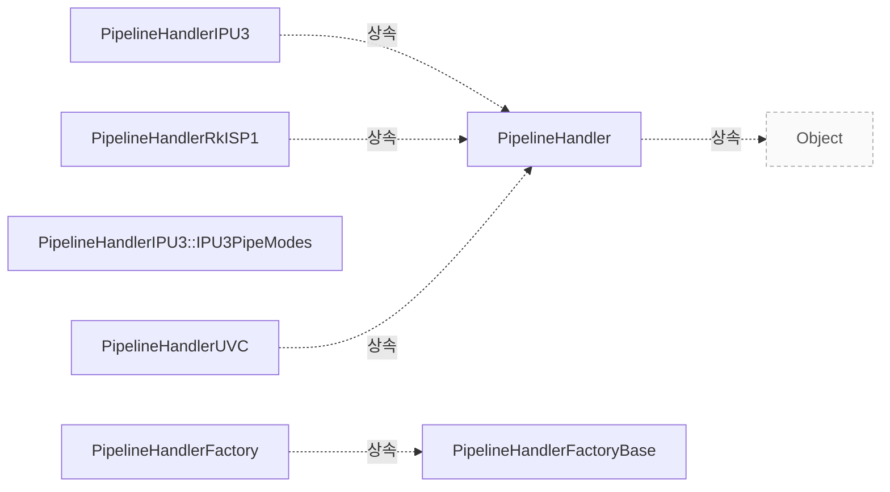

# Pipeline Handler

**파이프라인 구현이 지켜야 하는 구성·요청·완료·종료 계약을 확인하세요.**


## 설계 항목과 근거

아래 항목은 소스에 연결된 설명의 작성 범위를 나타냅니다. 설명의 의미와 실제 실행에 대한 승인은 별도 검토가 필요합니다.

| 설계 질문 | 설명 위치 | 확인 범위 |
|---|---|---|
| 핸들러는 어떤 객체와 장치를 만들고 관리합니까? | [장치 매칭과 객체 수명](#장치-매칭과-객체-수명) | 코드 근거와 설명 연결 |
| 기본 구성과 실제 구성에서 호출자와 구현의 책임은 무엇입니까? | [구성의 입력과 검증 책임](#구성의-입력과-검증-책임) | 코드 근거와 설명 연결 |
| 요청을 장치로 넘기는 조건과 실패 처리는 무엇입니까? | [요청 준비와 장치 큐](#요청-준비와-장치-큐) | 코드 근거와 설명 연결 |
| 버퍼 완료, 요청 완료와 접근 가능한 수명은 어떻게 구분됩니까? | [버퍼 완료와 요청 반환](#버퍼-완료와-요청-반환) | 코드 근거와 설명 연결 |
| 정지 중 재큐잉을 막고 대기 요청을 반환하는 방법은 무엇입니까? | [정지와 미완료 요청](#정지와-미완료-요청) | 코드 근거와 설명 연결 · 실행 확인 항목 별도 |

## 장치 매칭과 객체 수명

`PipelineHandler::match()`는 한 파이프라인의 미디어 장치를 확보하여 카메라를 만들고 등록합니다. 필요한 장치를 모두 얻지 못하면 확보한 장치를 해제하고 false를 반환해야 합니다. 핸들러 인스턴스는 `PipelineHandlerFactoryBase::create()`를 통해 생성하며 공유 포인터로 수명을 관리합니다. `src/libcamera/pipeline_handler.cpp:50`

`acquireMediaDevice()`로 얻은 장치는 핸들러에 보관되고 핸들러 소멸 시 해제되는 계약입니다. 카메라의 배타 접근을 위한 `acquire()`와 `release()`는 성공한 횟수가 대응해야 하며, 공유 자원은 모든 관련 카메라의 해제가 끝나기 전에 반납해서는 안 됩니다. `src/libcamera/pipeline_handler.cpp:119`

??? note "소스 근거: handler"
    `src/libcamera/pipeline_handler.cpp:50`에서 시작하는 발췌입니다. 종료 줄은 119이며, 아래 원문을 설명과 대조할 수 있습니다.
    
    SHA-256: `e05278df0a06cb963fe79f772e62d4560b62df15c1411a6b49e32f7ca84d9e74`
    
    ```text
    \class PipelineHandler
     * \brief Create and manage cameras based on a set of media devices
     *
     * The PipelineHandler matches the media devices provided by a DeviceEnumerator
     * with the pipelines it supports and creates corresponding Camera devices.
     *
     * Pipeline handler instances are reference-counted through std::shared_ptr<>.
     * They implement std::enable_shared_from_this<> in order to create new
     * std::shared_ptr<> in code paths originating from member functions of the
     * PipelineHandler class where only the 'this' pointer is available.
     */
    
    /**
     * \brief Construct a PipelineHandler instance
     * \param[in] manager The camera manager
     * \param[in] maxQueuedRequestsDevice The maximum number of requests queued to
     * the device
     *
     * In order to honour the std::enable_shared_from_this<> contract,
     * PipelineHandler instances shall never be constructed manually, but always
     * through the PipelineHandlerFactoryBase::create() function.
     */
    PipelineHandler::PipelineHandler(CameraManager *manager,
    				 unsigned int maxQueuedRequestsDevice)
    	: manager_(manager), maxQueuedRequestsDevice_(maxQueuedRequestsDevice),
    	  useCount_(0)
    {
    }
    
    PipelineHandler::~PipelineHandler()
    {
    	for (std::shared_ptr<MediaDevice> &media : mediaDevices_)
    		media->release();
    }
    
    /**
     * \fn PipelineHandler::match(DeviceEnumerator *enumerator)
     * \brief Match media devices and create camera instances
     * \param[in] enumerator The enumerator providing all media devices found in the
     * system
     *
     * This function is the main entry point of the pipeline handler. It is called
     * by the camera manager with the \a enumerator passed as an argument. It shall
     * acquire from the \a enumerator all the media devices it needs for a single
     * pipeline, create one or multiple Camera instances and register them with the
     * camera manager.
     *
     * If all media devices needed by the pipeline handler are found, they must all
     * be acquired by a call to MediaDevice::acquire(). This function shall then
     * create the corresponding Camera instances, store them internally, and return
     * true. Otherwise it shall not acquire any media device (or shall release all
     * the media devices is has acquired by calling MediaDevice::release()) and
     * return false.
     *
     * If multiple instances of a pipeline are available in the system, the
     * PipelineHandler class will be instantiated once per instance, and its match()
     * function called for every instance. Each call shall acquire media devices for
     * one pipeline instance, until all compatible media devices are exhausted.
     *
     * If this function returns true, a new instance of the pipeline handler will
     * be created and its match() function called.
     *
     * \context This function is called from the CameraManager thread.
     *
     * \return true if media devices have been acquired and camera instances
     * created, or false otherwise
     */
    
    /**
     * \brief Search and acquire a MediaDevice
    ```

??? note "소스 근거: acquisition"
    `src/libcamera/pipeline_handler.cpp:119`에서 시작하는 발췌입니다. 종료 줄은 271이며, 아래 원문을 설명과 대조할 수 있습니다.
    
    SHA-256: `379b17c52a1e97055bf78aaabd964595fb3ec506c568d112e552ed1c29235591`
    
    ```text
    \brief Search and acquire a MediaDevice matching a device pattern
     * \param[in] enumerator Enumerator containing all media devices in the system
     * \param[in] dm Device match pattern
     *
     * Search the device \a enumerator for an available media device matching the
     * device match pattern \a dm. Matching media device that have previously been
     * acquired by MediaDevice::acquire() are not considered. If a match is found,
     * the media device is acquired and returned. The caller shall not release the
     * device explicitly, it will be automatically released when the pipeline
     * handler is destroyed.
     *
     * \context This function shall be called from the CameraManager thread.
     *
     * \return A shared pointer to the matching MediaDevice, or nullptr if no match
     * is found
     */
    std::shared_ptr<MediaDevice>
    PipelineHandler::acquireMediaDevice(DeviceEnumerator *enumerator,
    				    const DeviceMatch &dm)
    {
    	std::shared_ptr<MediaDevice> media = enumerator->search(dm);
    	if (!media)
    		return nullptr;
    
    	if (!media->acquire())
    		return nullptr;
    
    	mediaDevices_.push_back(media);
    
    	return media;
    }
    
    /**
     * \brief Acquire exclusive access to the pipeline handler for the process
     *
     * This function locks all the media devices used by the pipeline to ensure
     * that no other process can access them concurrently.
     *
     * Access to a pipeline handler may be acquired recursively from within the
     * same process. Every successful acquire() call shall be matched with a
     * release() call. This allows concurrent access to the same pipeline handler
     * from different cameras within the same process.
     *
     * Pipeline handlers shall not call this function directly as the Camera class
     * handles access internally.
     *
     * \context This function is called from the CameraManager thread.
     *
     * \return True if the pipeline handler was acquired, false if another process
     * has already acquired it
     * \sa release()
     */
    bool PipelineHandler::acquire(Camera *camera)
    {
    	if (useCount_ == 0) {
    		for (std::shared_ptr<MediaDevice> &media : mediaDevices_) {
    			if (!media->lock()) {
    				unlockMediaDevices();
    				return false;
    			}
    		}
    	}
    
    	if (!acquireDevice(camera)) {
    		if (useCount_ == 0)
    			unlockMediaDevices();
    
    		return false;
    	}
    
    	++useCount_;
    	return true;
    }
    
    /**
     * \brief Release exclusive access to the pipeline handler
     * \param[in] camera The camera for which to release data
     *
     * This function releases access to the pipeline handler previously acquired by
     * a call to acquire(). Every release() call shall match a previous successful
     * acquire() call. Calling this function on a pipeline handler that hasn't been
     * acquired results in undefined behaviour.
     *
     * Pipeline handlers shall not call this function directly as the Camera class
     * handles access internally.
     *
     * \context This function is called from the CameraManager thread.
     *
     * \sa acquire()
     */
    void PipelineHandler::release(Camera *camera)
    {
    	ASSERT(useCount_);
    
    	releaseDevice(camera);
    
    	if (useCount_ == 1)
    		unlockMediaDevices();
    
    	--useCount_;
    }
    
    /**
     * \brief Acquire resources associated with this camera
     * \param[in] camera The camera for which to acquire resources
     *
     * Pipeline handlers may override this in order to get resources such as opening
     * devices and allocating buffers when a camera is acquired.
     *
     * This is used by the uvcvideo pipeline handler to delay opening /dev/video#
     * until the camera is acquired to avoid excess power consumption. The delayed
     * opening of /dev/video# is a special case because the kernel uvcvideo driver
     * powers on the USB device as soon as /dev/video# is opened. This behavior
     * should *not* be copied by other pipeline handlers.
     *
     * \context This function is called from the CameraManager thread.
     *
     * \return True on success, false on failure
     * \sa releaseDevice()
     */
    bool PipelineHandler::acquireDevice([[maybe_unused]] Camera *camera)
    {
    	return true;
    }
    
    /**
     * \brief Release resources associated with this camera
     * \param[in] camera The camera for which to release resources
     *
     * Pipeline handlers may override this in order to perform cleanup operations
     * when a camera is released, such as freeing memory.
     *
     * This is called once for every camera that is released. If there are resources
     * shared by multiple cameras then the pipeline handler must take care to not
     * release them until releaseDevice() has been called for all previously
     * acquired cameras.
     *
     * \context This function is called from the CameraManager thread.
     *
     * \sa acquireDevice()
     */
    void PipelineHandler::releaseDevice([[maybe_unused]] Camera *camera)
    {
    }
    
    void PipelineHandler::unlockMediaDevices()
    {
    	for (std::shared_ptr<MediaDevice> &media : mediaDevices_)
    		media->unlock();
    }
    
    /**
     * \fn PipelineHandler::generateConfiguration()
    ```

## 구성의 입력과 검증 책임

`generateConfiguration()`은 요청한 스트림 역할을 만족하는 기본 구성을 반환하고 불가능하면 null을 반환합니다. 어느 스레드에서 호출해도 안전해야 하며 파이프라인 안의 카메라 상태를 변경해서는 안 됩니다. `src/libcamera/pipeline_handler.cpp:271`

`configure()`의 입력은 이미 `CameraConfiguration::validate()`를 통과한 구성입니다. 구현은 각 `StreamConfiguration`에 `setStream()`으로 스트림을 연결해야 합니다. 호출 문맥은 CameraManager 스레드이며 성공 시 0, 실패 시 음수 오류 코드를 반환합니다. `src/libcamera/pipeline_handler.cpp:271`

??? note "소스 근거: configuration"
    `src/libcamera/pipeline_handler.cpp:271`에서 시작하는 발췌입니다. 종료 줄은 319이며, 아래 원문을 설명과 대조할 수 있습니다.
    
    SHA-256: `5284e6062c894a77328b372676c42c1c97a4a01f9b2dccc4d09c83b2578b0e20`
    
    ```text
    \fn PipelineHandler::generateConfiguration()
     * \brief Generate a camera configuration for a specified camera
     * \param[in] camera The camera to generate a default configuration for
     * \param[in] roles A list of stream roles
     *
     * Generate a default configuration for the \a camera for a specified list of
     * stream roles. The caller shall populate the \a roles with the use-cases it
     * wishes to fetch the default configuration for. The returned configuration
     * can then be examined by the caller to learn about the selected streams and
     * their default parameters.
     *
     * The intended companion to this is \a configure() which can be used to change
     * the group of streams parameters.
     *
     * \context This function may be called from any thread and shall be
     * \threadsafe. It shall not modify the state of the \a camera in the pipeline
     * handler.
     *
     * \return A valid CameraConfiguration if the requested roles can be satisfied,
     * or a null pointer otherwise.
     */
    
    /**
     * \fn PipelineHandler::configure()
     * \brief Configure a group of streams for capture
     * \param[in] camera The camera to configure
     * \param[in] config The camera configurations to setup
     *
     * Configure the specified group of streams for \a camera according to the
     * configuration specified in \a config. The intended caller of this interface
     * is the Camera class which will receive configuration to apply from the
     * application.
     *
     * The configuration is guaranteed to have been validated with
     * CameraConfiguration::validate(). The pipeline handler implementation shall
     * not perform further validation and may rely on any custom field stored in its
     * custom CameraConfiguration derived class.
     *
     * When configuring the camera the pipeline handler shall associate a Stream
     * instance to each StreamConfiguration entry in the CameraConfiguration using
     * the StreamConfiguration::setStream() function.
     *
     * \context This function is called from the CameraManager thread.
     *
     * \return 0 on success or a negative error code otherwise
     */
    
    /**
     * \fn PipelineHandler::exportFrameBuffers()
    ```

## 요청 준비와 장치 큐

`registerRequest()`는 준비 완료 신호를 `doQueueRequests()`에 연결합니다. `queueRequest()`는 요청을 대기 큐에 넣고 `prepare(300ms)`를 호출합니다. 대기 큐의 맨 앞 요청이 준비되지 않았거나 장치 큐가 `maxQueuedRequestsDevice_`에 도달하면 추가 전달을 멈춥니다. `src/libcamera/pipeline_handler.cpp:428`

전달할 요청은 대기 큐에서 먼저 제거하므로 재귀적으로 `doQueueRequests()`가 호출되어도 같은 요청을 다시 꺼내지 않습니다. `doQueueRequest()`는 장치 큐에 요청을 등록하고 시퀀스 번호를 부여합니다. 이미 취소된 요청은 완료 처리로 보내고, `queueRequestDevice()`가 오류를 반환하면 취소합니다. `src/libcamera/pipeline_handler.cpp:428`

`queueRequestDevice()`는 요청에 담긴 스트림별 버퍼와 파라미터를 하드웨어에 적용할 책임을 갖습니다. 호출 문맥은 CameraManager 스레드이며 성공 시 0, 실패 시 음수 오류 코드를 반환합니다. `src/libcamera/pipeline_handler.cpp:428`

??? note "소스 근거: queue"
    `src/libcamera/pipeline_handler.cpp:428`에서 시작하는 발췌입니다. 종료 줄은 547이며, 아래 원문을 설명과 대조할 수 있습니다.
    
    SHA-256: `5a7a3397a6034a73fe348ae44eb1e2568d2823e95542fe43386e16359d627180`
    
    ```text
    \fn PipelineHandler::registerRequest()
     * \brief Register a request for use by the pipeline handler
     * \param[in] request The request to register
     *
     * This function is called when the request is created, and allows the pipeline
     * handler to perform any one-time initialization it requries for the request.
     */
    void PipelineHandler::registerRequest(Request *request)
    {
    	/*
    	 * Connect the request prepared signal to notify the pipeline handler
    	 * when a request is ready to be processed.
    	 */
    	request->_d()->prepared.connect(this, [this, request]() {
    		doQueueRequests(request->_d()->camera());
    	});
    }
    
    /**
     * \fn PipelineHandler::queueRequest()
     * \brief Queue a request
     * \param[in] request The request to queue
     *
     * This function queues a capture request to the pipeline handler for
     * processing. The request is first added to the internal list of waiting
     * requests which have to be prepared to make sure they are ready for being
     * queued to the pipeline handler.
     *
     * The queue of waiting requests is iterated and up to \a
     * maxQueuedRequestsDevice_ prepared requests are passed to the pipeline handler
     * in the same order they have been queued by calling this function.
     *
     * If a Request fails during the preparation phase or if the pipeline handler
     * fails in queuing the request to the hardware the request is cancelled.
     *
     * Keeping track of queued requests ensures automatic completion of all requests
     * when the pipeline handler is stopped with stop(). Request completion shall be
     * signalled by the pipeline handler using the completeRequest() function.
     *
     * \context This function is called from the CameraManager thread.
     */
    void PipelineHandler::queueRequest(Request *request)
    {
    	LIBCAMERA_TRACEPOINT(request_queue, request);
    
    	Camera *camera = request->_d()->camera();
    	Camera::Private *data = camera->_d();
    	data->waitingRequests_.push(request);
    
    	request->_d()->prepare(300ms);
    }
    
    /**
     * \brief Queue one requests to the device
     */
    void PipelineHandler::doQueueRequest(Request *request)
    {
    	LIBCAMERA_TRACEPOINT(request_device_queue, request);
    
    	Camera *camera = request->_d()->camera();
    	Camera::Private *data = camera->_d();
    	data->queuedRequests_.push_back(request);
    
    	request->_d()->sequence_ = data->requestSequence_++;
    
    	if (request->_d()->cancelled_) {
    		completeRequest(request);
    		return;
    	}
    
    	int ret = queueRequestDevice(camera, request);
    	if (ret)
    		cancelRequest(request);
    }
    
    /**
     * \brief Queue prepared requests to the device
     *
     * Iterate the list of waiting requests and queue them to the device one
     * by one if they have been prepared.
     */
    void PipelineHandler::doQueueRequests(Camera *camera)
    {
    	Camera::Private *data = camera->_d();
    	while (!data->waitingRequests_.empty()) {
    		if (data->queuedRequests_.size() == maxQueuedRequestsDevice_)
    			break;
    
    		Request *request = data->waitingRequests_.front();
    		if (!request->_d()->prepared_)
    			break;
    
    		/*
    		 * Pop the request first, in case doQueueRequests() is called
    		 * recursively from within doQueueRequest()
    		 */
    		data->waitingRequests_.pop();
    		doQueueRequest(request);
    	}
    }
    
    /**
     * \fn PipelineHandler::queueRequestDevice()
     * \brief Queue a request to the device
     * \param[in] camera The camera to queue the request to
     * \param[in] request The request to queue
     *
     * This function queues a capture request to the device for processing. The
     * request contains a set of buffers associated with streams and a set of
     * parameters. The pipeline handler shall program the device to ensure that the
     * parameters will be applied to the frames captured in the buffers provided in
     * the request.
     *
     * \context This function is called from the CameraManager thread.
     *
     * \return 0 on success or a negative error code otherwise
     */
    
    /**
     * \brief Complete a buffer for a request
    ```

## 버퍼 완료와 요청 반환

`completeBuffer()`는 애플리케이션에 버퍼 완료를 알리고 요청 내부의 버퍼 추적 정보를 갱신합니다. 마지막 버퍼가 완료되어도 요청을 자동 완료하지 않으므로 파이프라인이 필요한 후처리 후 `completeRequest()`를 명시적으로 호출해야 합니다. `src/libcamera/pipeline_handler.cpp:547`

`completeRequest()`는 요청을 완료 상태로 바꾸고 장치 큐의 앞에서부터 Pending이 아닌 요청을 반환합니다. 장치가 완료하는 순서와 무관하게 애플리케이션에는 제출 순서로 돌아갑니다. 반환 가능한 요청을 처리한 뒤 대기 요청의 장치 전달을 재개합니다. `src/libcamera/pipeline_handler.cpp:547`

완료 통지 함수는 CameraManager 스레드에서 호출해야 합니다. `completeRequest()`가 돌아온 뒤에는 파이프라인이 해당 요청에 접근해서는 안 됩니다. `cancelRequest()`에도 같은 수명 규칙이 적용됩니다. `src/libcamera/pipeline_handler.cpp:547`

??? note "소스 근거: completion"
    `src/libcamera/pipeline_handler.cpp:547`에서 시작하는 발췌입니다. 종료 줄은 620이며, 아래 원문을 설명과 대조할 수 있습니다.
    
    SHA-256: `514288cc958de9ff5fd19d46393cec3bb3088f4f08486528d4559071138638c9`
    
    ```text
    \brief Complete a buffer for a request
     * \param[in] request The request the buffer belongs to
     * \param[in] buffer The buffer that has completed
     *
     * This function shall be called by pipeline handlers to signal completion of
     * the \a buffer part of the \a request. It notifies applications of buffer
     * completion and updates the request's internal buffer tracking. The request
     * is not completed automatically when the last buffer completes to give
     * pipeline handlers a chance to perform any operation that may still be
     * needed. They shall complete requests explicitly with completeRequest().
     *
     * \context This function shall be called from the CameraManager thread.
     *
     * \return True if all buffers contained in the request have completed, false
     * otherwise
     */
    bool PipelineHandler::completeBuffer(Request *request, FrameBuffer *buffer)
    {
    	Camera *camera = request->_d()->camera();
    	camera->bufferCompleted.emit(request, buffer);
    	return request->_d()->completeBuffer(buffer);
    }
    
    /**
     * \brief Signal request completion
     * \param[in] request The request that has completed
     *
     * The pipeline handler shall call this function to notify the \a camera that
     * the request has completed. The request is no longer managed by the pipeline
     * handler and shall not be accessed once this function returns.
     *
     * This function ensures that requests will be returned to the application in
     * submission order, the pipeline handler may call it on any complete request
     * without any ordering constraint.
     *
     * \context This function shall be called from the CameraManager thread.
     */
    void PipelineHandler::completeRequest(Request *request)
    {
    	Camera *camera = request->_d()->camera();
    
    	request->_d()->complete();
    
    	Camera::Private *data = camera->_d();
    
    	while (!data->queuedRequests_.empty()) {
    		Request *req = data->queuedRequests_.front();
    		if (req->status() == Request::RequestPending)
    			break;
    
    		ASSERT(!req->hasPendingBuffers());
    		data->queuedRequests_.pop_front();
    		camera->requestComplete(req);
    	}
    
    	/* Allow any waiting requests to be queued to the pipeline. */
    	doQueueRequests(camera);
    }
    
    /**
     * \brief Cancel request and signal its completion
     * \param[in] request The request to cancel
     *
     * This function cancels and completes the request. The same rules as for
     * completeRequest() apply.
     */
    void PipelineHandler::cancelRequest(Request *request)
    {
    	request->_d()->cancel();
    	completeRequest(request);
    }
    
    /**
     * \brief Retrieve the absolute path to a platform configuration file
    ```

## 정지와 미완료 요청

`stop()`은 대기 큐를 지역 변수로 옮긴 뒤 `stopDevice()`를 호출합니다. 따라서 장치 정지 중 `completeRequest()`가 호출되어도 기존 대기 요청을 장치에 다시 넣지 않습니다. `src/libcamera/pipeline_handler.cpp:359`

장치 정지 후 남은 대기 요청을 취소하고 `doQueueRequest()`로 시퀀스 번호와 완료 순서를 유지합니다. 끝에서는 장치 큐와 대기 큐가 비었음을 확인하고 요청 시퀀스를 0으로 초기화합니다. 하드웨어 구현의 `stopDevice()`는 미완료 요청을 오류 상태로 완료해야 하는 계약을 갖습니다. `src/libcamera/pipeline_handler.cpp:359`

실행 확인 항목: 개별 드라이버가 정지 계약을 지키는지, 완료 신호가 종료와 경합할 때 안전한지는 해당 구현과 기기에서 확인해야 합니다. 공통 클래스의 계약만으로 하드웨어 종료를 검증했다고 판단하지 않습니다. `src/libcamera/pipeline_handler.cpp:359`, `src/libcamera/pipeline_handler.cpp:547`

??? note "소스 근거: stop"
    `src/libcamera/pipeline_handler.cpp:359`에서 시작하는 발췌입니다. 종료 줄은 414이며, 아래 원문을 설명과 대조할 수 있습니다.
    
    SHA-256: `108b1bea5a8314ba57213d15c1e3ba01abe2b3f8a9e0e1e1281864b5492c7304`
    
    ```text
    \brief Stop capturing from all running streams and cancel pending requests
     * \param[in] camera The camera to stop
     *
     * This function stops capturing and processing requests immediately. All
     * pending requests are cancelled and complete immediately in an error state.
     *
     * \context This function is called from the CameraManager thread.
     */
    void PipelineHandler::stop(Camera *camera)
    {
    	/*
    	 * Take all waiting requests so that they are not requeued in response
    	 * to completeRequest() being called inside stopDevice(). Cancel them
    	 * after the device to keep them in order.
    	 */
    	Camera::Private *data = camera->_d();
    	std::queue<Request *> waitingRequests;
    	waitingRequests.swap(data->waitingRequests_);
    
    	/* Stop the pipeline handler and let the queued requests complete. */
    	stopDevice(camera);
    
    	/* Cancel and signal as complete all waiting requests. */
    	while (!waitingRequests.empty()) {
    		Request *request = waitingRequests.front();
    		waitingRequests.pop();
    
    		/*
    		 * Cancel all requests by marking them as cancelled and calling
    		 * doQueueRequest() instead of cancelRequest(). This ensures
    		 * that the requests get a sequence number and are temporarily
    		 * added to queuedRequests_ so they can be properly completed in
    		 * completeRequest().
    		 */
    		request->_d()->cancel();
    		doQueueRequest(request);
    	}
    
    	/* Make sure no requests are pending. */
    	ASSERT(data->queuedRequests_.empty());
    	ASSERT(data->waitingRequests_.empty());
    
    	data->requestSequence_ = 0;
    }
    
    /**
     * \fn PipelineHandler::stopDevice()
     * \brief Stop capturing from all running streams
     * \param[in] camera The camera to stop
     *
     * This function stops capturing and processing requests immediately. All
     * pending requests are cancelled and complete immediately in an error state.
     */
    
    /**
     * \brief Determine if the camera has any requests pending
    ```

??? note "소스 근거: completion"
    `src/libcamera/pipeline_handler.cpp:547`에서 시작하는 발췌입니다. 종료 줄은 620이며, 아래 원문을 설명과 대조할 수 있습니다.
    
    SHA-256: `514288cc958de9ff5fd19d46393cec3bb3088f4f08486528d4559071138638c9`
    
    ```text
    \brief Complete a buffer for a request
     * \param[in] request The request the buffer belongs to
     * \param[in] buffer The buffer that has completed
     *
     * This function shall be called by pipeline handlers to signal completion of
     * the \a buffer part of the \a request. It notifies applications of buffer
     * completion and updates the request's internal buffer tracking. The request
     * is not completed automatically when the last buffer completes to give
     * pipeline handlers a chance to perform any operation that may still be
     * needed. They shall complete requests explicitly with completeRequest().
     *
     * \context This function shall be called from the CameraManager thread.
     *
     * \return True if all buffers contained in the request have completed, false
     * otherwise
     */
    bool PipelineHandler::completeBuffer(Request *request, FrameBuffer *buffer)
    {
    	Camera *camera = request->_d()->camera();
    	camera->bufferCompleted.emit(request, buffer);
    	return request->_d()->completeBuffer(buffer);
    }
    
    /**
     * \brief Signal request completion
     * \param[in] request The request that has completed
     *
     * The pipeline handler shall call this function to notify the \a camera that
     * the request has completed. The request is no longer managed by the pipeline
     * handler and shall not be accessed once this function returns.
     *
     * This function ensures that requests will be returned to the application in
     * submission order, the pipeline handler may call it on any complete request
     * without any ordering constraint.
     *
     * \context This function shall be called from the CameraManager thread.
     */
    void PipelineHandler::completeRequest(Request *request)
    {
    	Camera *camera = request->_d()->camera();
    
    	request->_d()->complete();
    
    	Camera::Private *data = camera->_d();
    
    	while (!data->queuedRequests_.empty()) {
    		Request *req = data->queuedRequests_.front();
    		if (req->status() == Request::RequestPending)
    			break;
    
    		ASSERT(!req->hasPendingBuffers());
    		data->queuedRequests_.pop_front();
    		camera->requestComplete(req);
    	}
    
    	/* Allow any waiting requests to be queued to the pipeline. */
    	doQueueRequests(camera);
    }
    
    /**
     * \brief Cancel request and signal its completion
     * \param[in] request The request to cancel
     *
     * This function cancels and completes the request. The same rules as for
     * completeRequest() apply.
     */
    void PipelineHandler::cancelRequest(Request *request)
    {
    	request->_d()->cancel();
    	completeRequest(request);
    }
    
    /**
     * \brief Retrieve the absolute path to a platform configuration file
    ```


<!-- sdd:class-diagram -->
## 클래스 관계

화살표의 글자는 추출한 관계를 나타내며, 점선은 상속입니다. 화살표는 참조 대상 또는 기반 클래스를 향합니다. 호출 순서를 뜻하지 않습니다.


<!-- /sdd:class-diagram -->


## 관련 클래스

| 클래스 | 선언 위치 | 상속 | 책임 (주석) |
|---|---|---|---|
| `libcamera::PipelineHandler` | `include/libcamera/internal/pipeline_handler.h:34` | `libcamera::Object` | Create and manage cameras based on a set of media devices |
| `libcamera::PipelineHandlerFactory` | `include/libcamera/internal/pipeline_handler.h:144` | `libcamera::PipelineHandlerFactoryBase` | Registration of PipelineHandler classes and creation of instances |
| `libcamera::PipelineHandlerFactoryBase` | `include/libcamera/internal/pipeline_handler.h:121` | – | Base class for pipeline handler factories |
| `libcamera::PipelineHandlerIPU3` | `src/libcamera/pipeline/ipu3/ipu3.cpp:124` | `libcamera::PipelineHandler` | 확인 필요 |
| `libcamera::PipelineHandlerIPU3::IPU3PipeModes` | `src/libcamera/pipeline/ipu3/ipu3.cpp:130` | – | 확인 필요 |
| `libcamera::PipelineHandlerRkISP1` | `src/libcamera/pipeline/rkisp1/rkisp1.cpp:184` | `libcamera::PipelineHandler` | 확인 필요 |
| `libcamera::PipelineHandlerUVC` | `src/libcamera/pipeline/uvcvideo/uvcvideo.cpp:81` | `libcamera::PipelineHandler` | 확인 필요 |

??? note "근거와 검토 정보"
    - 생성 방식: 소스 발췌에 연결한 설계 설명
    - 검증 범위: 설정에 작성된 설명을 발췌 해시와 대조합니다. 해시 일치는 설명의 의미를 승인하지 않습니다.
    - 근거 파일: `include/libcamera/internal/pipeline_handler.h`, `src/libcamera/pipeline/ipu3/ipu3.cpp`, `src/libcamera/pipeline/rkisp1/rkisp1.cpp`, `src/libcamera/pipeline/uvcvideo/uvcvideo.cpp`, `src/libcamera/pipeline_handler.cpp`
    - 근거 수준: 코드 확인 (정적 분석, simple_compdb 구성, commit `279d355ef8`)
    - 자동 검사 (인용·문장 및 설정된 구조 검사): 통과
    - 검토 상태 기록일: 2026-09-26 · 사람 검토 전

다음 단계: [IPA 관련 클래스](ipa.md)
