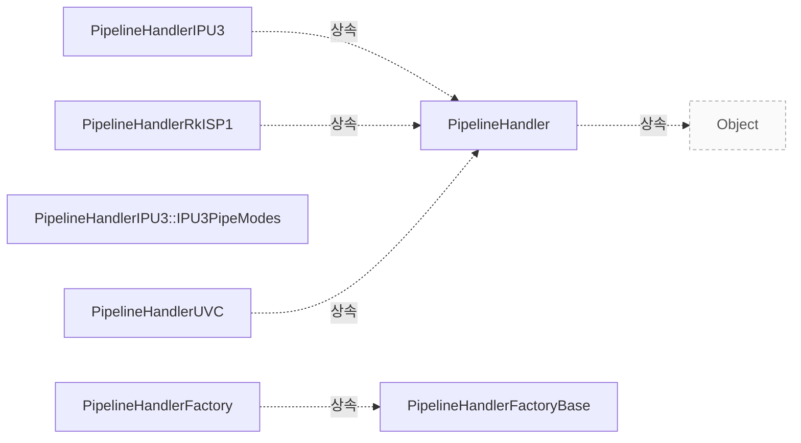

# Pipeline Handler

**공통 PipelineHandler와 빌드에 포함된 구현의 관계를 확인하세요.**

| 지금 확인할 내용 | 이동할 절 |
|---|---|
| 구조 설명 절을 확인합니다. | [구조 설명](#구조-설명) |
| 클래스 관계 절을 확인합니다. | [클래스 관계](#클래스-관계) |
| 관련 클래스 절을 확인합니다. | [관련 클래스](#관련-클래스) |

## 구조 설명

`libcamera::PipelineHandler`는 `libcamera::Object`를 직접 기반으로 하며, 하드웨어별 구현은 이를 상속받아 `libcamera::PipelineHandlerIPU3`, `libcamera::PipelineHandlerRkISP1`, `libcamera::PipelineHandlerUVC`와 같은 하위 클래스로 확장됩니다. 각 하위 클래스의 정의는 해당 소스 파일의 특정 줄에서 확인되며, 예를 들어 `libcamera::PipelineHandlerIPU3`는 `src/libcamera/pipeline/ipu3/ipu3.cpp:124`에서, `libcamera::PipelineHandlerRkISP1`은 `src/libcamera/pipeline/rkisp1/rkisp1.cpp:184`에서 정의됩니다.

설정과 요청 전달을 위한 주요 메서드는 공통 클래스와 하위 클래스에 걸쳐 존재하며, `match()`는 장치 패턴 매칭을 위해 `include/libcamera/internal/pipeline_handler.h:42`를 확인하고, `acquireMediaDevice()`는 `src/libcamera/pipeline_handler.cpp:136`에서 검색 및 획득 과정을 수행합니다. 또한 `generateConfiguration()`은 `include/libcamera/internal/pipeline_handler.h:49`에 정의되어 있으며, `configure()`와 `start()`는 각각 설정 적용과 스트림 시작을 담당합니다.

<!-- sdd:class-diagram -->
## 클래스 관계

화살표의 글자는 추출한 관계를 나타내며, 점선은 상속입니다. 화살표는 참조 대상 또는 기반 클래스를 향합니다. 호출 순서를 뜻하지 않습니다.

<!-- /sdd:class-diagram -->

## 관련 클래스

| 클래스 | 선언 위치 | 상속 | 책임 (주석) |
|---|---|---|---|
| `libcamera::PipelineHandler` | `include/libcamera/internal/pipeline_handler.h:34` | `libcamera::Object` | 확인 필요 |
| `libcamera::PipelineHandlerFactory` | `include/libcamera/internal/pipeline_handler.h:144` | `libcamera::PipelineHandlerFactoryBase` | 확인 필요 |
| `libcamera::PipelineHandlerFactoryBase` | `include/libcamera/internal/pipeline_handler.h:121` | – | 확인 필요 |
| `libcamera::PipelineHandlerIPU3` | `src/libcamera/pipeline/ipu3/ipu3.cpp:124` | `libcamera::PipelineHandler` | 확인 필요 |
| `libcamera::PipelineHandlerIPU3::IPU3PipeModes` | `src/libcamera/pipeline/ipu3/ipu3.cpp:130` | – | 확인 필요 |
| `libcamera::PipelineHandlerRkISP1` | `src/libcamera/pipeline/rkisp1/rkisp1.cpp:184` | `libcamera::PipelineHandler` | 확인 필요 |
| `libcamera::PipelineHandlerUVC` | `src/libcamera/pipeline/uvcvideo/uvcvideo.cpp:81` | `libcamera::PipelineHandler` | 확인 필요 |

??? note "근거와 검토 정보"
    - 근거 파일: `include/libcamera/internal/pipeline_handler.h`, `src/libcamera/pipeline/ipu3/ipu3.cpp`, `src/libcamera/pipeline/rkisp1/rkisp1.cpp`, `src/libcamera/pipeline/uvcvideo/uvcvideo.cpp`, `src/libcamera/pipeline_handler.cpp`
    - 근거 수준: 코드 확인 (정적 분석, simple_compdb 구성, commit `279d355ef8`)
    - 자동 검사 (인용·문장 및 설정된 구조 검사): 통과
    - 검토: 2026-09-24 · ollama/qwen3.5:4b · 사람 검토 전

다음 단계: [IPA 관련 클래스](ipa.md)
