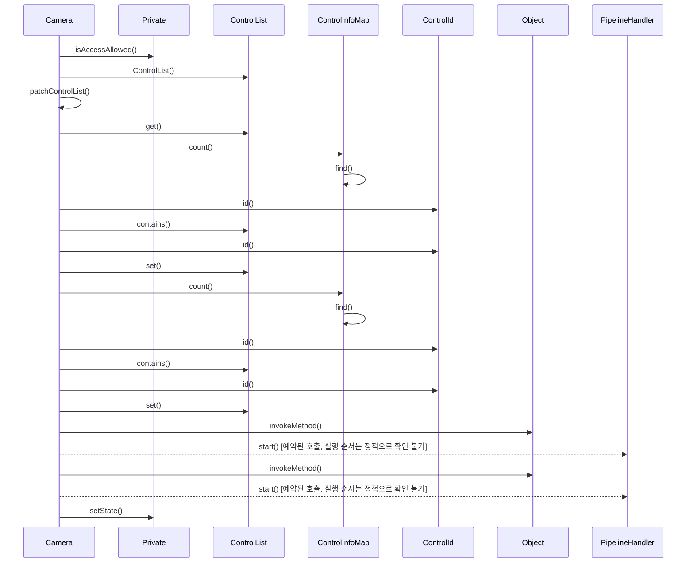

# 캡처 시작 (Camera::start)

**`Camera::start(const ControlList *)` 에서 시작하는 호출 순서를 아래 번호대로 따라가세요.**

## 호출 순서

1. `Camera` 가 `Private::isAccessAllowed()` 를 호출합니다. `src/libcamera/camera.cpp:1404`
2. `Camera` 가 `ControlList::ControlList()` 를 호출합니다. `src/libcamera/camera.cpp:1413`
3. `Camera` 가 `Camera::patchControlList()` 를 호출합니다. `src/libcamera/camera.cpp:1414`
4. `Camera` 가 `ControlList::get()` 를 호출합니다. `src/libcamera/camera.cpp:1289`
5. `Camera` 가 `ControlInfoMap::count()` 를 호출합니다. `src/libcamera/camera.cpp:1291`
6. `ControlInfoMap` 가 `ControlInfoMap::find()` 를 호출합니다. `src/libcamera/controls.cpp:864`
7. `Camera` 가 `ControlId::id()` 를 호출합니다. `src/libcamera/camera.cpp:1291`
8. `Camera` 가 `ControlList::contains()` 를 호출합니다. `src/libcamera/camera.cpp:1292`
9. `Camera` 가 `ControlId::id()` 를 호출합니다. `src/libcamera/camera.cpp:1292`
10. `Camera` 가 `ControlList::set()` 를 호출합니다. `src/libcamera/camera.cpp:1293`
11. `Camera` 가 `ControlInfoMap::count()` 를 호출합니다. `src/libcamera/camera.cpp:1298`
12. `ControlInfoMap` 가 `ControlInfoMap::find()` 를 호출합니다. `src/libcamera/controls.cpp:864`
13. `Camera` 가 `ControlId::id()` 를 호출합니다. `src/libcamera/camera.cpp:1298`
14. `Camera` 가 `ControlList::contains()` 를 호출합니다. `src/libcamera/camera.cpp:1299`
15. `Camera` 가 `ControlId::id()` 를 호출합니다. `src/libcamera/camera.cpp:1299`
16. `Camera` 가 `ControlList::set()` 를 호출합니다. `src/libcamera/camera.cpp:1300`
17. `Camera` 가 `Object::invokeMethod()` 를 호출합니다. `src/libcamera/camera.cpp:1415`
18. `Camera` 가 `PipelineHandler::start()` 를 호출합니다. (예약된 호출, 실행 순서는 정적으로 확인 불가) `src/libcamera/camera.cpp:1415`
19. `Camera` 가 `Object::invokeMethod()` 를 호출합니다. `src/libcamera/camera.cpp:1418`
20. `Camera` 가 `PipelineHandler::start()` 를 호출합니다. (예약된 호출, 실행 순서는 정적으로 확인 불가) `src/libcamera/camera.cpp:1418`
21. `Camera` 가 `Private::setState()` 를 호출합니다. `src/libcamera/camera.cpp:1425`

표시에서 뺀 호출이 27 개 있습니다. `config/scenarios.yaml` 의 `hide` 규칙에 걸린 로깅과 접근자 호출이며, `facts.json` 에는 그대로 남아 있습니다.

## 이 흐름에서 확인할 것

`Camera::start()` 진입점에서 `Private::isAccessAllowed()` 호출과 `ControlList` 초기화 과정을 확인합니다 `src/libcamera/camera.cpp:1404`, `src/libcamera/camera.cpp:1413`. 이후 `patchControlList()` 를 통해 제어 목록을 수정한 후, `get()`, `count()`, `find()` 및 `id()` 와 같은 내부 메서드를 반복 호출하여 각 제어 항목의 존재 여부를 검증합니다 `src/libcamera/camera.cpp:1289`~`1300`.

`Object::invokeMethod()` 를 통해 `PipelineHandler::start()` 가 예약된 두 번의 호출이 발생하며, 이 시점 이후 `Private::setState()` 로 상태 변경이 시도됩니다 `src/libcamera/camera.cpp:1415`, `src/libcamera/camera.cpp:1418`, `src/libcamera/camera.cpp:1425`. 그러나 `PipelineHandler::start()` 의 실제 실행 순서는 정적으로 확인 불가능하므로, 해당 메서드의 구현 위치를 직접 검증해야 합니다.

확인 필요: 메서드를 인자로 넘겨 예약한 호출이 2 개 있습니다. 위에서 `예약된 호출, 실행 순서는 정적으로 확인 불가` 로 표시한 단계가 그 자리입니다. 대상 메서드는 확인했지만, 실제 실행 시점과 스레드는 큐나 신호 구현이 정하므로 이 번호 목록은 그 지점 이후의 순서를 보장하지 않습니다. 이후 흐름은 예약을 받는 쪽의 구현에서 직접 확인해야 합니다.

??? note "근거와 검토 정보"
    - 근거 파일: `src/libcamera/camera.cpp`, `src/libcamera/controls.cpp`
    - 근거 수준: 코드 확인 (정적 분석, simple_compdb 구성, commit `279d355ef8`)
    - 자동 검사 (인용·문장 및 설정된 구조 검사): 통과
    - 검토: 2026-09-24 · ollama/qwen3.5:4b · 사람 검토 전

다음 단계: [요청 제출 (Camera::queueRequest)](queue_request.md)
