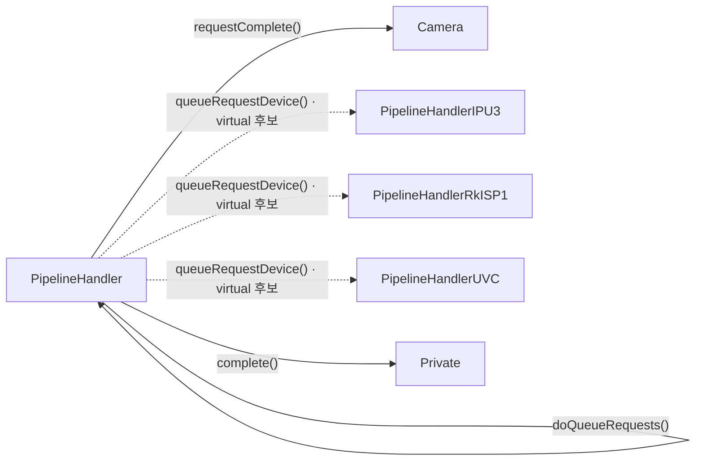

# 요청 완료 통지 (PipelineHandler::completeRequest)

**`PipelineHandler::completeRequest(Request *)` 의 주요 호출과 추적 경계를 확인한 뒤 필요한 상세 기록을 펼쳐 보세요.**

| 지금 확인할 내용 | 이동할 절 |
|---|---|
| 이 흐름에서 확인할 것 절을 확인합니다. | [이 흐름에서 확인할 것](#이-흐름에서-확인할-것) |
| 주요 확인 지점 절을 확인합니다. | [주요 확인 지점](#주요-확인-지점) |
| 주요 호출 관계 절을 확인합니다. | [주요 호출 관계](#주요-호출-관계) |
| 추적 범위와 경계 절을 확인합니다. | [추적 범위와 경계](#추적-범위와-경계) |
| 전체 추적 기록 절을 확인합니다. | [전체 추적 기록](#전체-추적-기록) |

## 이 흐름에서 확인할 것

`PipelineHandler::completeRequest(Request *)`에서 시작한 정적 탐색으로 호출 기록 105개를 수집했습니다. 주요 확인 지점 4개를 아래 표와 관계도에 표시합니다. 선택한 지점의 근거를 먼저 확인하고, 필요한 호출은 전체 추적 기록에서 찾아보세요.

가상 호출 후보·예약 대상 등 확인이 필요한 경계 기록이 9개 있습니다. 추적 범위와 경계 표에서 후보를 구분한 뒤 실제 객체와 연결 방식을 확인해야 합니다.

## 주요 확인 지점

아래 항목은 추출한 호출에서 고른 코드 탐색 지점입니다. 나열 순서는 실행 순서가 아닙니다.

| 확인할 내용 | 호출 측과 대상 | 구분 | 근거 |
|---|---|---|---|
| 완료 처리 | `PipelineHandler` → `Private::complete()` | 정적 호출 지점입니다. | `src/libcamera/pipeline_handler.cpp:588` |
| 완료 통지 | `PipelineHandler` → `Camera::requestComplete()` | 정적 호출 지점입니다. | `src/libcamera/pipeline_handler.cpp:599` |
| 대기 요청 처리 | `PipelineHandler` → `PipelineHandler::doQueueRequests()` | 정적 호출 지점입니다. | `src/libcamera/pipeline_handler.cpp:603` |
| 하드웨어별 큐잉 후보 | `PipelineHandler` → `PipelineHandlerIPU3::queueRequestDevice()` `PipelineHandler` → `PipelineHandlerRkISP1::queueRequestDevice()` `PipelineHandler` → `PipelineHandlerUVC::queueRequestDevice()` | 동적 디스패치 후보이며 실제 대상은 확인이 필요합니다. | `src/libcamera/pipeline_handler.cpp:498` |

## 주요 호출 관계

화살표는 호출 측과 대상을 연결합니다. 시간 순서나 모든 경로의 실행을 뜻하지 않습니다. 점선에는 가상 호출 후보·예약 대상 등 확인이 필요한 관계를 표시합니다.

## 추적 범위와 경계

facts에 기록된 호출은 105개이며, 요약의 hide 규칙에 해당하는 호출은 62개입니다. 전체 추적 기록에는 해당 호출도 모두 보존합니다. 기록 번호는 정적 탐색의 식별자이며 실행 순번이 아닙니다.

조건 분기, 반복 횟수와 실제 실행 스레드는 이 호출 목록만으로 확정할 수 없습니다. 가상 호출 후보는 실제 객체에 따라 선택되며, 예약 대상은 큐나 신호 구현에서 이어서 확인해야 합니다.

| 호출 지점 | 후보 또는 예약 대상 | 확인할 경계 | 근거 |
|---|---|---|---|
| `PipelineHandler` | `PipelineHandlerIPU3::queueRequestDevice()` `PipelineHandlerRkISP1::queueRequestDevice()` `PipelineHandlerUVC::queueRequestDevice()` | 동적 디스패치 후보이며 실제 대상은 확인이 필요합니다. | `src/libcamera/pipeline_handler.cpp:498` |
| `PipelineHandlerRkISP1` | `IPAProxyRkISP1Threaded::queueRequest()` `IPAProxyRkISP1Isolated::queueRequest()` `IPARkISP1::queueRequest()` | 동적 디스패치 후보이며 실제 대상은 확인이 필요합니다. | `src/libcamera/pipeline/rkisp1/rkisp1.cpp:1348` |
| `PipelineHandlerRkISP1` | `IPAProxyRkISP1Threaded::computeParams()` `IPAProxyRkISP1Isolated::computeParams()` `IPARkISP1::computeParams()` | 동적 디스패치 후보이며 실제 대상은 확인이 필요합니다. | `src/libcamera/pipeline/rkisp1/rkisp1.cpp:1356` |

## 전체 추적 기록

아래 구간을 펼치면 요약에서 제외된 호출까지 확인할 수 있습니다. 이 목록은 추출 깊이 안에서 수집한 기록이며, 소스의 모든 실행 경로를 포함한다는 뜻은 아닙니다.

??? note "추적 기록 1–25 / 105개"

    | 기록 | 호출 측 | 대상 | 구분 | 근거 |
    |---|---|---|---|---|
    | 1 | `PipelineHandler` | `Private::camera()` | 정적 호출 지점입니다. | `src/libcamera/pipeline_handler.cpp:586` |
    | 2 | `PipelineHandler` | `Request::_d()` | 정적 호출 지점입니다. | `src/libcamera/pipeline_handler.cpp:586` |
    | 3 | `PipelineHandler` | `Private::complete()` | 정적 호출 지점입니다. | `src/libcamera/pipeline_handler.cpp:588` |
    | 4 | `Private` | `Private::_o()` | 정적 호출 지점입니다. | `src/libcamera/request.cpp:127` |
    | 5 | `Private` | `Request::status()` | 정적 호출 지점입니다. | `src/libcamera/request.cpp:129` |
    | 6 | `Private` | `log::isLogSeverityEnabled()` | 정적 호출 지점입니다. | `src/libcamera/request.cpp:129` |
    | 7 | `Private` | `LogMessageAbortGuard::LogMessageAbortGuard()` | 정적 호출 지점입니다. | `src/libcamera/request.cpp:129` |
    | 8 | `Private` | `LogMessage::stream()` | 정적 호출 지점입니다. | `src/libcamera/request.cpp:129` |
    | 9 | `Private` | `log::_log()` | 정적 호출 지점입니다. | `src/libcamera/request.cpp:129` |
    | 10 | `log` | `LogMessage::LogMessage()` | 정적 호출 지점입니다. | `src/libcamera/base/log.cpp:990` |
    | 11 | `LogMessage` | `utils::basename()` | 정적 호출 지점입니다. | `src/libcamera/base/log.cpp:858` |
    | 12 | `Private` | `Private::hasPendingBuffers()` | 정적 호출 지점입니다. | `src/libcamera/request.cpp:130` |
    | 13 | `Private` | `log::isLogSeverityEnabled()` | 정적 호출 지점입니다. | `src/libcamera/request.cpp:130` |
    | 14 | `Private` | `LogMessageAbortGuard::LogMessageAbortGuard()` | 정적 호출 지점입니다. | `src/libcamera/request.cpp:130` |
    | 15 | `Private` | `LogMessage::stream()` | 정적 호출 지점입니다. | `src/libcamera/request.cpp:130` |
    | 16 | `Private` | `log::_log()` | 정적 호출 지점입니다. | `src/libcamera/request.cpp:130` |
    | 17 | `log` | `LogMessage::LogMessage()` | 정적 호출 지점입니다. | `src/libcamera/base/log.cpp:990` |
    | 18 | `LogMessage` | `utils::basename()` | 정적 호출 지점입니다. | `src/libcamera/base/log.cpp:858` |
    | 19 | `Private` | `log::isLogSeverityEnabled()` | 정적 호출 지점입니다. | `src/libcamera/request.cpp:134` |
    | 20 | `Private` | `LogMessageAbortGuard::LogMessageAbortGuard()` | 정적 호출 지점입니다. | `src/libcamera/request.cpp:134` |
    | 21 | `Private` | `LogMessage::stream()` | 정적 호출 지점입니다. | `src/libcamera/request.cpp:134` |
    | 22 | `Private` | `log::_log()` | 정적 호출 지점입니다. | `src/libcamera/request.cpp:134` |
    | 23 | `log` | `LogMessage::LogMessage()` | 정적 호출 지점입니다. | `src/libcamera/base/log.cpp:990` |
    | 24 | `LogMessage` | `utils::basename()` | 정적 호출 지점입니다. | `src/libcamera/base/log.cpp:858` |
    | 25 | `Private` | `Request::toString()` | 정적 호출 지점입니다. | `src/libcamera/request.cpp:134` |

??? note "추적 기록 26–50 / 105개"

    | 기록 | 호출 측 | 대상 | 구분 | 근거 |
    |---|---|---|---|---|
    | 26 | `Request` | `request::operator<<()` | 정적 호출 지점입니다. | `src/libcamera/request.cpp:592` |
    | 27 | `request` | `Request::sequence()` | 정적 호출 지점입니다. | `src/libcamera/request.cpp:609` |
    | 28 | `request` | `Request::status()` | 정적 호출 지점입니다. | `src/libcamera/request.cpp:609` |
    | 29 | `request` | `Request::_d()` | 정적 호출 지점입니다. | `src/libcamera/request.cpp:610` |
    | 30 | `request` | `Request::buffers()` | 정적 호출 지점입니다. | `src/libcamera/request.cpp:610` |
    | 31 | `request` | `Request::cookie()` | 정적 호출 지점입니다. | `src/libcamera/request.cpp:611` |
    | 32 | `Private` | `tracepoints::unused()` | 정적 호출 지점입니다. | `src/libcamera/request.cpp:136` |
    | 33 | `PipelineHandler` | `Request::_d()` | 정적 호출 지점입니다. | `src/libcamera/pipeline_handler.cpp:588` |
    | 34 | `PipelineHandler` | `Camera::_d()` | 정적 호출 지점입니다. | `src/libcamera/pipeline_handler.cpp:590` |
    | 35 | `PipelineHandler` | `Request::status()` | 정적 호출 지점입니다. | `src/libcamera/pipeline_handler.cpp:594` |
    | 36 | `PipelineHandler` | `Request::hasPendingBuffers()` | 정적 호출 지점입니다. | `src/libcamera/pipeline_handler.cpp:597` |
    | 37 | `Request` | `Private::hasPendingBuffers()` | 정적 호출 지점입니다. | `src/libcamera/request.cpp:578` |
    | 38 | `Request` | `Request::_d()` | 정적 호출 지점입니다. | `src/libcamera/request.cpp:578` |
    | 39 | `PipelineHandler` | `log::isLogSeverityEnabled()` | 정적 호출 지점입니다. | `src/libcamera/pipeline_handler.cpp:597` |
    | 40 | `PipelineHandler` | `LogMessageAbortGuard::LogMessageAbortGuard()` | 정적 호출 지점입니다. | `src/libcamera/pipeline_handler.cpp:597` |
    | 41 | `PipelineHandler` | `LogMessage::stream()` | 정적 호출 지점입니다. | `src/libcamera/pipeline_handler.cpp:597` |
    | 42 | `PipelineHandler` | `log::_log()` | 정적 호출 지점입니다. | `src/libcamera/pipeline_handler.cpp:597` |
    | 43 | `log` | `LogMessage::LogMessage()` | 정적 호출 지점입니다. | `src/libcamera/base/log.cpp:990` |
    | 44 | `LogMessage` | `utils::basename()` | 정적 호출 지점입니다. | `src/libcamera/base/log.cpp:858` |
    | 45 | `PipelineHandler` | `Camera::requestComplete()` | 정적 호출 지점입니다. | `src/libcamera/pipeline_handler.cpp:599` |
    | 46 | `Camera` | `Private::isAccessAllowed()` | 정적 호출 지점입니다. | `src/libcamera/camera.cpp:1484` |
    | 47 | `Private` | `log::isLogSeverityEnabled()` | 정적 호출 지점입니다. | `src/libcamera/camera.cpp:720` |
    | 48 | `Private` | `LogMessageAbortGuard::LogMessageAbortGuard()` | 정적 호출 지점입니다. | `src/libcamera/camera.cpp:720` |
    | 49 | `Private` | `LogMessage::stream()` | 정적 호출 지점입니다. | `src/libcamera/camera.cpp:720` |
    | 50 | `Private` | `log::_log()` | 정적 호출 지점입니다. | `src/libcamera/camera.cpp:720` |

??? note "추적 기록 51–75 / 105개"

    | 기록 | 호출 측 | 대상 | 구분 | 근거 |
    |---|---|---|---|---|
    | 51 | `log` | `LogMessage::LogMessage()` | 정적 호출 지점입니다. | `src/libcamera/base/log.cpp:990` |
    | 52 | `Private` | `log::isLogSeverityEnabled()` | 정적 호출 지점입니다. | `src/libcamera/camera.cpp:723` |
    | 53 | `Private` | `LogMessageAbortGuard::LogMessageAbortGuard()` | 정적 호출 지점입니다. | `src/libcamera/camera.cpp:723` |
    | 54 | `Private` | `LogMessage::stream()` | 정적 호출 지점입니다. | `src/libcamera/camera.cpp:723` |
    | 55 | `Private` | `log::_log()` | 정적 호출 지점입니다. | `src/libcamera/camera.cpp:723` |
    | 56 | `log` | `LogMessage::LogMessage()` | 정적 호출 지점입니다. | `src/libcamera/base/log.cpp:990` |
    | 57 | `Camera` | `Camera::_d()` | 정적 호출 지점입니다. | `src/libcamera/camera.cpp:1484` |
    | 58 | `Camera` | `log::isLogSeverityEnabled()` | 정적 호출 지점입니다. | `src/libcamera/camera.cpp:1486` |
    | 59 | `Camera` | `LogMessageAbortGuard::LogMessageAbortGuard()` | 정적 호출 지점입니다. | `src/libcamera/camera.cpp:1486` |
    | 60 | `Camera` | `LogMessage::stream()` | 정적 호출 지점입니다. | `src/libcamera/camera.cpp:1486` |
    | 61 | `Camera` | `log::_log()` | 정적 호출 지점입니다. | `src/libcamera/camera.cpp:1486` |
    | 62 | `log` | `LogMessage::LogMessage()` | 정적 호출 지점입니다. | `src/libcamera/base/log.cpp:990` |
    | 63 | `LogMessage` | `utils::basename()` | 정적 호출 지점입니다. | `src/libcamera/base/log.cpp:858` |
    | 64 | `Camera` | `Signal::emit()` | 정적 호출 지점입니다. | `src/libcamera/camera.cpp:1488` |
    | 65 | `PipelineHandler` | `PipelineHandler::doQueueRequests()` | 정적 호출 지점입니다. | `src/libcamera/pipeline_handler.cpp:603` |
    | 66 | `PipelineHandler` | `Camera::_d()` | 정적 호출 지점입니다. | `src/libcamera/pipeline_handler.cpp:511` |
    | 67 | `PipelineHandler` | `Request::_d()` | 정적 호출 지점입니다. | `src/libcamera/pipeline_handler.cpp:517` |
    | 68 | `PipelineHandler` | `PipelineHandler::doQueueRequest()` | 정적 호출 지점입니다. | `src/libcamera/pipeline_handler.cpp:525` |
    | 69 | `PipelineHandler` | `tracepoints::unused()` | 정적 호출 지점입니다. | `src/libcamera/pipeline_handler.cpp:485` |
    | 70 | `PipelineHandler` | `Private::camera()` | 정적 호출 지점입니다. | `src/libcamera/pipeline_handler.cpp:487` |
    | 71 | `PipelineHandler` | `Request::_d()` | 정적 호출 지점입니다. | `src/libcamera/pipeline_handler.cpp:487` |
    | 72 | `PipelineHandler` | `Camera::_d()` | 정적 호출 지점입니다. | `src/libcamera/pipeline_handler.cpp:488` |
    | 73 | `PipelineHandler` | `Request::_d()` | 정적 호출 지점입니다. | `src/libcamera/pipeline_handler.cpp:491` |
    | 74 | `PipelineHandler` | `Request::_d()` | 정적 호출 지점입니다. | `src/libcamera/pipeline_handler.cpp:493` |
    | 75 | `PipelineHandler` | `PipelineHandler::completeRequest()` | 정적 호출 지점입니다. | `src/libcamera/pipeline_handler.cpp:494` |

??? note "추적 기록 76–100 / 105개"

    | 기록 | 호출 측 | 대상 | 구분 | 근거 |
    |---|---|---|---|---|
    | 76 | `PipelineHandler` | `PipelineHandlerIPU3::queueRequestDevice()` | 동적 디스패치 후보이며 실제 대상은 확인이 필요합니다. | `src/libcamera/pipeline_handler.cpp:498` |
    | 77 | `PipelineHandlerIPU3` | `PipelineHandlerIPU3::cameraData()` | 정적 호출 지점입니다. | `src/libcamera/pipeline/ipu3/ipu3.cpp:840` |
    | 78 | `PipelineHandlerIPU3` | `IPU3CameraData::queuePendingRequests()` | 정적 호출 지점입니다. | `src/libcamera/pipeline/ipu3/ipu3.cpp:843` |
    | 79 | `PipelineHandler` | `PipelineHandlerRkISP1::queueRequestDevice()` | 동적 디스패치 후보이며 실제 대상은 확인이 필요합니다. | `src/libcamera/pipeline_handler.cpp:498` |
    | 80 | `PipelineHandlerRkISP1` | `PipelineHandlerRkISP1::cameraData()` | 정적 호출 지점입니다. | `src/libcamera/pipeline/rkisp1/rkisp1.cpp:1342` |
    | 81 | `PipelineHandlerRkISP1` | `RkISP1Frames::create()` | 정적 호출 지점입니다. | `src/libcamera/pipeline/rkisp1/rkisp1.cpp:1344` |
    | 82 | `PipelineHandlerRkISP1` | `IPAProxyRkISP1Threaded::queueRequest()` | 동적 디스패치 후보이며 실제 대상은 확인이 필요합니다. | `src/libcamera/pipeline/rkisp1/rkisp1.cpp:1348` |
    | 83 | `PipelineHandlerRkISP1` | `IPAProxyRkISP1Isolated::queueRequest()` | 동적 디스패치 후보이며 실제 대상은 확인이 필요합니다. | `src/libcamera/pipeline/rkisp1/rkisp1.cpp:1348` |
    | 84 | `PipelineHandlerRkISP1` | `IPARkISP1::queueRequest()` | 동적 디스패치 후보이며 실제 대상은 확인이 필요합니다. | `src/libcamera/pipeline/rkisp1/rkisp1.cpp:1348` |
    | 85 | `PipelineHandlerRkISP1` | `Request::controls()` | 정적 호출 지점입니다. | `src/libcamera/pipeline/rkisp1/rkisp1.cpp:1348` |
    | 86 | `PipelineHandlerRkISP1` | `RkISP1Path::queueBuffer()` | 정적 호출 지점입니다. | `src/libcamera/pipeline/rkisp1/rkisp1.cpp:1351` |
    | 87 | `PipelineHandlerRkISP1` | `RkISP1Path::queueBuffer()` | 정적 호출 지점입니다. | `src/libcamera/pipeline/rkisp1/rkisp1.cpp:1354` |
    | 88 | `PipelineHandlerRkISP1` | `IPAProxyRkISP1Threaded::computeParams()` | 동적 디스패치 후보이며 실제 대상은 확인이 필요합니다. | `src/libcamera/pipeline/rkisp1/rkisp1.cpp:1356` |
    | 89 | `PipelineHandlerRkISP1` | `IPAProxyRkISP1Isolated::computeParams()` | 동적 디스패치 후보이며 실제 대상은 확인이 필요합니다. | `src/libcamera/pipeline/rkisp1/rkisp1.cpp:1356` |
    | 90 | `PipelineHandlerRkISP1` | `IPARkISP1::computeParams()` | 동적 디스패치 후보이며 실제 대상은 확인이 필요합니다. | `src/libcamera/pipeline/rkisp1/rkisp1.cpp:1356` |
    | 91 | `PipelineHandlerRkISP1` | `FrameBuffer::cookie()` | 정적 호출 지점입니다. | `src/libcamera/pipeline/rkisp1/rkisp1.cpp:1357` |
    | 92 | `PipelineHandler` | `PipelineHandlerUVC::queueRequestDevice()` | 동적 디스패치 후보이며 실제 대상은 확인이 필요합니다. | `src/libcamera/pipeline_handler.cpp:498` |
    | 93 | `PipelineHandlerUVC` | `PipelineHandlerUVC::cameraData()` | 정적 호출 지점입니다. | `src/libcamera/pipeline/uvcvideo/uvcvideo.cpp:450` |
    | 94 | `PipelineHandlerUVC` | `Request::findBuffer()` | 정적 호출 지점입니다. | `src/libcamera/pipeline/uvcvideo/uvcvideo.cpp:451` |
    | 95 | `PipelineHandlerUVC` | `log::isLogSeverityEnabled()` | 정적 호출 지점입니다. | `src/libcamera/pipeline/uvcvideo/uvcvideo.cpp:453` |
    | 96 | `PipelineHandlerUVC` | `LogMessageAbortGuard::LogMessageAbortGuard()` | 정적 호출 지점입니다. | `src/libcamera/pipeline/uvcvideo/uvcvideo.cpp:453` |
    | 97 | `PipelineHandlerUVC` | `LogMessage::stream()` | 정적 호출 지점입니다. | `src/libcamera/pipeline/uvcvideo/uvcvideo.cpp:453` |
    | 98 | `PipelineHandlerUVC` | `log::_log()` | 정적 호출 지점입니다. | `src/libcamera/pipeline/uvcvideo/uvcvideo.cpp:453` |
    | 99 | `PipelineHandlerUVC` | `PipelineHandlerUVC::processControls()` | 정적 호출 지점입니다. | `src/libcamera/pipeline/uvcvideo/uvcvideo.cpp:459` |
    | 100 | `PipelineHandlerUVC` | `Request::controls()` | 정적 호출 지점입니다. | `src/libcamera/pipeline/uvcvideo/uvcvideo.cpp:459` |

??? note "추적 기록 101–105 / 105개"

    | 기록 | 호출 측 | 대상 | 구분 | 근거 |
    |---|---|---|---|---|
    | 101 | `PipelineHandlerUVC` | `V4L2VideoDevice::queueBuffer()` | 정적 호출 지점입니다. | `src/libcamera/pipeline/uvcvideo/uvcvideo.cpp:463` |
    | 102 | `PipelineHandler` | `PipelineHandler::cancelRequest()` | 정적 호출 지점입니다. | `src/libcamera/pipeline_handler.cpp:500` |
    | 103 | `PipelineHandler` | `Private::cancel()` | 정적 호출 지점입니다. | `src/libcamera/pipeline_handler.cpp:615` |
    | 104 | `PipelineHandler` | `Request::_d()` | 정적 호출 지점입니다. | `src/libcamera/pipeline_handler.cpp:615` |
    | 105 | `PipelineHandler` | `PipelineHandler::completeRequest()` | 정적 호출 지점입니다. | `src/libcamera/pipeline_handler.cpp:616` |

??? note "근거와 검토 정보"
    - 생성 방식: 추출 호출로 만든 시나리오
    - 검증 범위: 주요 호출과 경계를 facts에서 구성하고 전체 추적 기록을 보존합니다. 실행 순서를 추정하지 않습니다.
    - 근거 파일: `src/libcamera/base/log.cpp`, `src/libcamera/camera.cpp`, `src/libcamera/pipeline/ipu3/ipu3.cpp`, `src/libcamera/pipeline/rkisp1/rkisp1.cpp`, `src/libcamera/pipeline/uvcvideo/uvcvideo.cpp`, `src/libcamera/pipeline_handler.cpp`, `src/libcamera/request.cpp`
    - 근거 수준: 코드 확인 (정적 분석, simple_compdb 구성, commit `279d355ef8`)
    - 자동 검사 (인용·문장 및 설정된 구조 검사): 통과
    - 검토 상태 기록일: 2026-09-26 · 사람 검토 전

다음 단계: [핵심 시나리오 목록](index.md)
