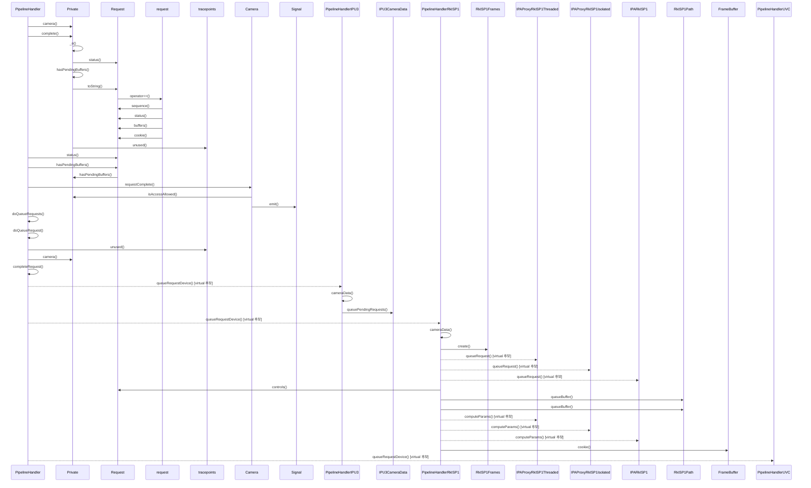

# 요청 완료 통지 (PipelineHandler::completeRequest)

**`PipelineHandler::completeRequest(Request *)` 에서 시작하는 호출 순서를 아래 번호대로 따라가세요.**

그림에는 앞의 40 개 호출만 그렸습니다. 나머지 8 개는 아래 호출 순서와 `facts.json` 에서 확인하세요.

## 호출 순서

1. `PipelineHandler` 가 `Private::camera()` 를 호출합니다. `src/libcamera/pipeline_handler.cpp:586`
2. `PipelineHandler` 가 `Private::complete()` 를 호출합니다. `src/libcamera/pipeline_handler.cpp:588`
3. `Private` 가 `Private::_o()` 를 호출합니다. `src/libcamera/request.cpp:127`
4. `Private` 가 `Request::status()` 를 호출합니다. `src/libcamera/request.cpp:129`
5. `Private` 가 `Private::hasPendingBuffers()` 를 호출합니다. `src/libcamera/request.cpp:130`
6. `Private` 가 `Request::toString()` 를 호출합니다. `src/libcamera/request.cpp:134`
7. `Request` 가 `request::operator<<()` 를 호출합니다. `src/libcamera/request.cpp:592`
8. `request` 가 `Request::sequence()` 를 호출합니다. `src/libcamera/request.cpp:609`
9. `request` 가 `Request::status()` 를 호출합니다. `src/libcamera/request.cpp:609`
10. `request` 가 `Request::buffers()` 를 호출합니다. `src/libcamera/request.cpp:610`
11. `request` 가 `Request::cookie()` 를 호출합니다. `src/libcamera/request.cpp:611`
12. `Private` 가 `tracepoints::unused()` 를 호출합니다. `src/libcamera/request.cpp:136`
13. `PipelineHandler` 가 `Request::status()` 를 호출합니다. `src/libcamera/pipeline_handler.cpp:594`
14. `PipelineHandler` 가 `Request::hasPendingBuffers()` 를 호출합니다. `src/libcamera/pipeline_handler.cpp:597`
15. `Request` 가 `Private::hasPendingBuffers()` 를 호출합니다. `src/libcamera/request.cpp:578`
16. `PipelineHandler` 가 `Camera::requestComplete()` 를 호출합니다. `src/libcamera/pipeline_handler.cpp:599`
17. `Camera` 가 `Private::isAccessAllowed()` 를 호출합니다. `src/libcamera/camera.cpp:1484`
18. `Camera` 가 `Signal::emit()` 를 호출합니다. `src/libcamera/camera.cpp:1488`
19. `PipelineHandler` 가 `PipelineHandler::doQueueRequests()` 를 호출합니다. `src/libcamera/pipeline_handler.cpp:603`
20. `PipelineHandler` 가 `PipelineHandler::doQueueRequest()` 를 호출합니다. `src/libcamera/pipeline_handler.cpp:525`
21. `PipelineHandler` 가 `tracepoints::unused()` 를 호출합니다. `src/libcamera/pipeline_handler.cpp:485`
22. `PipelineHandler` 가 `Private::camera()` 를 호출합니다. `src/libcamera/pipeline_handler.cpp:487`
23. `PipelineHandler` 가 `PipelineHandler::completeRequest()` 를 호출합니다. `src/libcamera/pipeline_handler.cpp:494`
24. `PipelineHandler` 가 `PipelineHandlerIPU3::queueRequestDevice()` 를 호출합니다. (virtual 후보) `src/libcamera/pipeline_handler.cpp:498`
25. `PipelineHandlerIPU3` 가 `PipelineHandlerIPU3::cameraData()` 를 호출합니다. `src/libcamera/pipeline/ipu3/ipu3.cpp:840`
26. `PipelineHandlerIPU3` 가 `IPU3CameraData::queuePendingRequests()` 를 호출합니다. `src/libcamera/pipeline/ipu3/ipu3.cpp:843`
27. `PipelineHandler` 가 `PipelineHandlerRkISP1::queueRequestDevice()` 를 호출합니다. (virtual 후보) `src/libcamera/pipeline_handler.cpp:498`
28. `PipelineHandlerRkISP1` 가 `PipelineHandlerRkISP1::cameraData()` 를 호출합니다. `src/libcamera/pipeline/rkisp1/rkisp1.cpp:1342`
29. `PipelineHandlerRkISP1` 가 `RkISP1Frames::create()` 를 호출합니다. `src/libcamera/pipeline/rkisp1/rkisp1.cpp:1344`
30. `PipelineHandlerRkISP1` 가 `IPAProxyRkISP1Threaded::queueRequest()` 를 호출합니다. (virtual 후보) `src/libcamera/pipeline/rkisp1/rkisp1.cpp:1348`

(이후 단계는 생략했습니다. 전체 흐름은 `facts.json` 의 `scenarios` 에 있습니다.)

표시에서 뺀 호출이 57 개 있습니다. `config/scenarios.yaml` 의 `hide` 규칙에 걸린 로깅과 접근자 호출이며, `facts.json` 에는 그대로 남아 있습니다.

## 이 흐름에서 확인할 것

`PipelineHandler::completeRequest()` 호출은 `Private::camera()` 를 거쳐 `Camera::requestComplete()` 콜백을 발생시키고, 이후 `doQueueRequests()` 로 이어집니다 `src/libcamera/pipeline_handler.cpp:586~603`. 이 경로는 `tracepoints::unused()` 와 같은 로그 호출이 스레드 경계나 콜백 순서를 명확히 하지 않으며, 가상 함수 분기점인 `queueRequestDevice()` 이후의 실행 흐름은 구체적인 구현에 따라 달라질 수 있습니다 `src/libcamera/pipeline_handler.cpp:498`.

`PipelineHandlerIPU3::queueRequestDevice()` 와 `PipelineHandlerRkISP1::queueRequestDevice()` 등 가상 함수 후보가 존재하지만, 실제 호출 대상과 내부 동작은 해당 클래스의 정의 위치를 확인해야 합니다 `src/libcamera/pipeline/ipu3/ipu3.cpp:840`, `src/libcamera/pipeline/rkisp1/rkisp1.cpp:1342`. 설계 의도가 부족하여 스레드 동기화나 실행 순서를 추측할 수 없으므로, 관련 메서드의 구현 코드를 직접 검토해야 합니다.

??? note "근거와 검토 정보"
    - 근거 파일: `src/libcamera/camera.cpp`, `src/libcamera/pipeline/ipu3/ipu3.cpp`, `src/libcamera/pipeline/rkisp1/rkisp1.cpp`, `src/libcamera/pipeline_handler.cpp`, `src/libcamera/request.cpp`
    - 근거 수준: 코드 확인 (정적 분석, simple_compdb 구성, commit `279d355ef8`)
    - 자동 검사 (인용·문장 및 설정된 구조 검사): 통과
    - 검토: 2026-09-24 · ollama/qwen3.5:4b · 사람 검토 전

다음 단계: [핵심 시나리오 목록](index.md)
