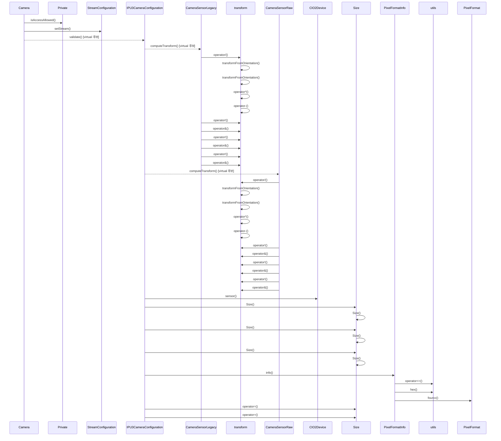

# 스트림 구성 (Camera::configure)

**`Camera::configure(CameraConfiguration *)` 에서 시작하는 호출 순서를 아래 번호대로 따라가세요.**

그림에는 앞의 40 개 호출만 그렸습니다. 나머지 89 개는 아래 호출 순서와 `facts.json` 에서 확인하세요.

## 호출 순서

1. `Camera` 가 `Private::isAccessAllowed()` 를 호출합니다. `src/libcamera/camera.cpp:1195`
2. `Camera` 가 `StreamConfiguration::setStream()` 를 호출합니다. `src/libcamera/camera.cpp:1201`
3. `Camera` 가 `IPU3CameraConfiguration::validate()` 를 호출합니다. (virtual 후보) `src/libcamera/camera.cpp:1203`
4. `IPU3CameraConfiguration` 가 `CameraSensorLegacy::computeTransform()` 를 호출합니다. (virtual 후보) `src/libcamera/pipeline/ipu3/ipu3.cpp:191`
5. `CameraSensorLegacy` 가 `transform::operator/()` 를 호출합니다. `src/libcamera/sensor/camera_sensor_legacy.cpp:961`
6. `transform` 가 `transform::transformFromOrientation()` 를 호출합니다. `src/libcamera/transform.cpp:349`
7. `transform` 가 `transform::operator*()` 를 호출합니다. `src/libcamera/transform.cpp:352`
8. `transform` 가 `transform::operator-()` 를 호출합니다. `src/libcamera/transform.cpp:352`
9. `CameraSensorLegacy` 가 `transform::operator!()` 를 호출합니다. `src/libcamera/sensor/camera_sensor_legacy.cpp:964`
10. `CameraSensorLegacy` 가 `transform::operator&()` 를 호출합니다. `src/libcamera/sensor/camera_sensor_legacy.cpp:964`
11. `CameraSensorLegacy` 가 `transform::operator!()` 를 호출합니다. `src/libcamera/sensor/camera_sensor_legacy.cpp:969`
12. `CameraSensorLegacy` 가 `transform::operator&()` 를 호출합니다. `src/libcamera/sensor/camera_sensor_legacy.cpp:969`
13. `CameraSensorLegacy` 가 `transform::operator!()` 를 호출합니다. `src/libcamera/sensor/camera_sensor_legacy.cpp:978`
14. `CameraSensorLegacy` 가 `transform::operator&()` 를 호출합니다. `src/libcamera/sensor/camera_sensor_legacy.cpp:978`
15. `IPU3CameraConfiguration` 가 `CameraSensorRaw::computeTransform()` 를 호출합니다. (virtual 후보) `src/libcamera/pipeline/ipu3/ipu3.cpp:191`
16. `CameraSensorRaw` 가 `transform::operator/()` 를 호출합니다. `src/libcamera/sensor/camera_sensor_raw.cpp:1073`
17. `transform` 가 `transform::transformFromOrientation()` 를 호출합니다. `src/libcamera/transform.cpp:349`
18. `transform` 가 `transform::operator*()` 를 호출합니다. `src/libcamera/transform.cpp:352`
19. `transform` 가 `transform::operator-()` 를 호출합니다. `src/libcamera/transform.cpp:352`
20. `CameraSensorRaw` 가 `transform::operator!()` 를 호출합니다. `src/libcamera/sensor/camera_sensor_raw.cpp:1076`
21. `CameraSensorRaw` 가 `transform::operator&()` 를 호출합니다. `src/libcamera/sensor/camera_sensor_raw.cpp:1076`
22. `CameraSensorRaw` 가 `transform::operator!()` 를 호출합니다. `src/libcamera/sensor/camera_sensor_raw.cpp:1081`
23. `CameraSensorRaw` 가 `transform::operator&()` 를 호출합니다. `src/libcamera/sensor/camera_sensor_raw.cpp:1081`
24. `CameraSensorRaw` 가 `transform::operator!()` 를 호출합니다. `src/libcamera/sensor/camera_sensor_raw.cpp:1090`
25. `CameraSensorRaw` 가 `transform::operator&()` 를 호출합니다. `src/libcamera/sensor/camera_sensor_raw.cpp:1090`
26. `IPU3CameraConfiguration` 가 `CIO2Device::sensor()` 를 호출합니다. `src/libcamera/pipeline/ipu3/ipu3.cpp:191`
27. `IPU3CameraConfiguration` 가 `Size::Size()` 를 호출합니다. `src/libcamera/pipeline/ipu3/ipu3.cpp:213`
28. `Size` 가 `Size::Size()` 를 호출합니다. `include/libcamera/geometry.h:54`
29. `IPU3CameraConfiguration` 가 `Size::Size()` 를 호출합니다. `src/libcamera/pipeline/ipu3/ipu3.cpp:214`
30. `Size` 가 `Size::Size()` 를 호출합니다. `include/libcamera/geometry.h:54`

(이후 단계는 생략했습니다. 전체 흐름은 `facts.json` 의 `scenarios` 에 있습니다.)

표시에서 뺀 호출이 79 개 있습니다. `config/scenarios.yaml` 의 `hide` 규칙에 걸린 로깅과 접근자 호출이며, `facts.json` 에는 그대로 남아 있습니다.

## 이 흐름에서 확인할 것

`Camera::configure()` 호출은 먼저 `Private::isAccessAllowed()` 를 통해 접근 권한을 검증한 후, `StreamConfiguration::setStream()` 과 `IPU3CameraConfiguration::validate()` 를 거쳐 시작됩니다 `src/libcamera/camera.cpp:1195`, `src/libcamera/camera.cpp:1201`, `src/libcamera/camera.cpp:1203`. 이 과정에서 `IPU3CameraConfiguration` 는 `CameraSensorLegacy::computeTransform()` 와 `CameraSensorRaw::computeTransform()` 를 순차적으로 호출하며, 각 센서 클래스는 `transform::operator/()`, `transform::transformFromOrientation()`, `transform::operator*()`, `transform::operator-()`, 그리고 논리 연산자 `!()` 와 `&()` 를 통해 회전 변환을 계산합니다 `src/libcamera/pipeline/ipu3/ipu3.cpp:191`, `src/libcamera/sensor/camera_sensor_legacy.cpp:961`, `src/libcamera/transform.cpp:349`, `src/libcamera/transform.cpp:352`, `src/libcamera/sensor/camera_sensor_raw.cpp:1073`.

`IPU3CameraConfiguration` 는 또한 `CIO2Device::sensor()` 를 호출하여 센서 정보를 가져오고, `Size::Size()` 를 통해 크기 객체를 생성합니다 `src/libcamera/pipeline/ipu3/ipu3.cpp:191`, `src/libcamera/pipeline/ipu3/ipu3.cpp:213`, `include/libcamera/geometry.h:54`. 호출 경로는 가상 함수를 통한 다형성으로 분기하며, 정적 추적이 끊기는 지점은 현재 문서에는 명시되지 않았습니다. 스레드 동기화나 콜백 전달 순서는 설계 근거가 부족하여 확인 필요: 확인할 항목입니다.

확인 필요: 메서드를 인자로 넘겨 예약한 호출이 1 개 있습니다. 위에서 `예약된 호출, 실행 순서는 정적으로 확인 불가` 로 표시한 단계가 그 자리입니다. 대상 메서드는 확인했지만, 실제 실행 시점과 스레드는 큐나 신호 구현이 정하므로 이 번호 목록은 그 지점 이후의 순서를 보장하지 않습니다. 이후 흐름은 예약을 받는 쪽의 구현에서 직접 확인해야 합니다.

??? note "근거와 검토 정보"
    - 근거 파일: `include/libcamera/geometry.h`, `src/libcamera/camera.cpp`, `src/libcamera/pipeline/ipu3/ipu3.cpp`, `src/libcamera/sensor/camera_sensor_legacy.cpp`, `src/libcamera/sensor/camera_sensor_raw.cpp`, `src/libcamera/transform.cpp`
    - 근거 수준: 코드 확인 (정적 분석, simple_compdb 구성, commit `279d355ef8`)
    - 자동 검사 (인용·문장 및 설정된 구조 검사): 통과
    - 검토: 2026-09-24 · ollama/qwen3.5:4b · 사람 검토 전

다음 단계: [캡처 시작 (Camera::start)](camera_start.md)
