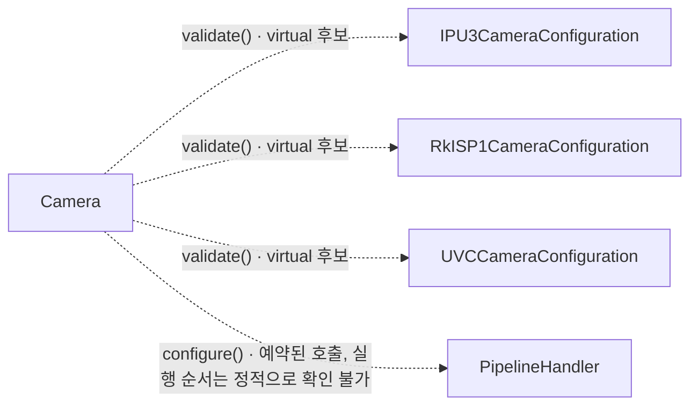

# 스트림 구성 (Camera::configure)

**`Camera::configure(CameraConfiguration *)` 의 주요 호출과 추적 경계를 확인한 뒤 필요한 상세 기록을 펼쳐 보세요.**

| 지금 확인할 내용 | 이동할 절 |
|---|---|
| 이 흐름에서 확인할 것 절을 확인합니다. | [이 흐름에서 확인할 것](#이-흐름에서-확인할-것) |
| 주요 확인 지점 절을 확인합니다. | [주요 확인 지점](#주요-확인-지점) |
| 주요 호출 관계 절을 확인합니다. | [주요 호출 관계](#주요-호출-관계) |
| 추적 범위와 경계 절을 확인합니다. | [추적 범위와 경계](#추적-범위와-경계) |
| 전체 추적 기록 절을 확인합니다. | [전체 추적 기록](#전체-추적-기록) |

## 이 흐름에서 확인할 것

`Camera::configure(CameraConfiguration *)`에서 시작한 정적 탐색으로 호출 기록 208개를 수집했습니다. 주요 확인 지점 2개를 아래 표와 관계도에 표시합니다. 선택한 지점의 근거를 먼저 확인하고, 필요한 호출은 전체 추적 기록에서 찾아보세요.

가상 호출 후보·예약 대상 등 확인이 필요한 경계 기록이 14개 있습니다. 추적 범위와 경계 표에서 후보를 구분한 뒤 실제 객체와 연결 방식을 확인해야 합니다.

## 주요 확인 지점

아래 항목은 추출한 호출에서 고른 코드 탐색 지점입니다. 나열 순서는 실행 순서가 아닙니다.

| 확인할 내용 | 호출 측과 대상 | 구분 | 근거 |
|---|---|---|---|
| 구성 검증 | `Camera` → `IPU3CameraConfiguration::validate()` `Camera` → `RkISP1CameraConfiguration::validate()` `Camera` → `UVCCameraConfiguration::validate()` | 동적 디스패치 후보이며 실제 대상은 확인이 필요합니다. | `src/libcamera/camera.cpp:1203` |
| 파이프라인 구성 대상 | `Camera` → `PipelineHandler::configure()` | 예약 대상이며 즉시 실행되는 호출이 아닙니다. | `src/libcamera/camera.cpp:1218` |

## 주요 호출 관계

화살표는 호출 측과 대상을 연결합니다. 시간 순서나 모든 경로의 실행을 뜻하지 않습니다. 점선에는 가상 호출 후보·예약 대상 등 확인이 필요한 관계를 표시합니다.

## 추적 범위와 경계

facts에 기록된 호출은 208개이며, 요약의 hide 규칙에 해당하는 호출은 87개입니다. 전체 추적 기록에는 해당 호출도 모두 보존합니다. 기록 번호는 정적 탐색의 식별자이며 실행 순번이 아닙니다.

조건 분기, 반복 횟수와 실제 실행 스레드는 이 호출 목록만으로 확정할 수 없습니다. 가상 호출 후보는 실제 객체에 따라 선택되며, 예약 대상은 큐나 신호 구현에서 이어서 확인해야 합니다.

| 호출 지점 | 후보 또는 예약 대상 | 확인할 경계 | 근거 |
|---|---|---|---|
| `Camera` | `IPU3CameraConfiguration::validate()` `RkISP1CameraConfiguration::validate()` `UVCCameraConfiguration::validate()` | 동적 디스패치 후보이며 실제 대상은 확인이 필요합니다. | `src/libcamera/camera.cpp:1203` |
| `IPU3CameraConfiguration` | `CameraSensorLegacy::computeTransform()` `CameraSensorRaw::computeTransform()` | 동적 디스패치 후보이며 실제 대상은 확인이 필요합니다. | `src/libcamera/pipeline/ipu3/ipu3.cpp:191` |
| `IPU3CameraConfiguration` | `CameraSensorLegacy::resolution()` `CameraSensorRaw::resolution()` | 동적 디스패치 후보이며 실제 대상은 확인이 필요합니다. | `src/libcamera/pipeline/ipu3/ipu3.cpp:265` |
| `CIO2Device` | `CameraSensorLegacy::resolution()` `CameraSensorRaw::resolution()` | 동적 디스패치 후보이며 실제 대상은 확인이 필요합니다. | `src/libcamera/pipeline/ipu3/cio2.cpp:227` |
| `CIO2Device` | `CameraSensorLegacy::resolution()` `CameraSensorRaw::resolution()` | 동적 디스패치 후보이며 실제 대상은 확인이 필요합니다. | `src/libcamera/pipeline/ipu3/cio2.cpp:281` |
| `CIO2Device` | `CameraSensorLegacy::sizes()` `CameraSensorRaw::sizes()` | 동적 디스패치 후보이며 실제 대상은 확인이 필요합니다. | `src/libcamera/pipeline/ipu3/cio2.cpp:289` |
| `Camera` | `PipelineHandler::configure()` | 예약 대상이며 즉시 실행되는 호출이 아닙니다. | `src/libcamera/camera.cpp:1218` |

추출 통계: 미해결 호출 0개, 예약된 호출 1개입니다.

## 전체 추적 기록

아래 구간을 펼치면 요약에서 제외된 호출까지 확인할 수 있습니다. 이 목록은 추출 깊이 안에서 수집한 기록이며, 소스의 모든 실행 경로를 포함한다는 뜻은 아닙니다.

??? note "추적 기록 1–25 / 208개"

    | 기록 | 호출 측 | 대상 | 구분 | 근거 |
    |---|---|---|---|---|
    | 1 | `Camera` | `Camera::_d()` | 정적 호출 지점입니다. | `src/libcamera/camera.cpp:1193` |
    | 2 | `Camera` | `Private::isAccessAllowed()` | 정적 호출 지점입니다. | `src/libcamera/camera.cpp:1195` |
    | 3 | `Private` | `log::isLogSeverityEnabled()` | 정적 호출 지점입니다. | `src/libcamera/camera.cpp:720` |
    | 4 | `Private` | `LogMessageAbortGuard::LogMessageAbortGuard()` | 정적 호출 지점입니다. | `src/libcamera/camera.cpp:720` |
    | 5 | `Private` | `LogMessage::stream()` | 정적 호출 지점입니다. | `src/libcamera/camera.cpp:720` |
    | 6 | `Private` | `log::_log()` | 정적 호출 지점입니다. | `src/libcamera/camera.cpp:720` |
    | 7 | `log` | `LogMessage::LogMessage()` | 정적 호출 지점입니다. | `src/libcamera/base/log.cpp:990` |
    | 8 | `LogMessage` | `utils::basename()` | 정적 호출 지점입니다. | `src/libcamera/base/log.cpp:858` |
    | 9 | `Private` | `log::isLogSeverityEnabled()` | 정적 호출 지점입니다. | `src/libcamera/camera.cpp:723` |
    | 10 | `Private` | `LogMessageAbortGuard::LogMessageAbortGuard()` | 정적 호출 지점입니다. | `src/libcamera/camera.cpp:723` |
    | 11 | `Private` | `LogMessage::stream()` | 정적 호출 지점입니다. | `src/libcamera/camera.cpp:723` |
    | 12 | `Private` | `log::_log()` | 정적 호출 지점입니다. | `src/libcamera/camera.cpp:723` |
    | 13 | `log` | `LogMessage::LogMessage()` | 정적 호출 지점입니다. | `src/libcamera/base/log.cpp:990` |
    | 14 | `LogMessage` | `utils::basename()` | 정적 호출 지점입니다. | `src/libcamera/base/log.cpp:858` |
    | 15 | `Camera` | `StreamConfiguration::setStream()` | 정적 호출 지점입니다. | `src/libcamera/camera.cpp:1201` |
    | 16 | `Camera` | `IPU3CameraConfiguration::validate()` | 동적 디스패치 후보이며 실제 대상은 확인이 필요합니다. | `src/libcamera/camera.cpp:1203` |
    | 17 | `IPU3CameraConfiguration` | `CameraSensorLegacy::computeTransform()` | 동적 디스패치 후보이며 실제 대상은 확인이 필요합니다. | `src/libcamera/pipeline/ipu3/ipu3.cpp:191` |
    | 18 | `CameraSensorLegacy` | `transform::operator/()` | 정적 호출 지점입니다. | `src/libcamera/sensor/camera_sensor_legacy.cpp:961` |
    | 19 | `transform` | `transform::transformFromOrientation()` | 정적 호출 지점입니다. | `src/libcamera/transform.cpp:349` |
    | 20 | `transform` | `transform::transformFromOrientation()` | 정적 호출 지점입니다. | `src/libcamera/transform.cpp:350` |
    | 21 | `transform` | `transform::operator*()` | 정적 호출 지점입니다. | `src/libcamera/transform.cpp:352` |
    | 22 | `transform` | `transform::operator-()` | 정적 호출 지점입니다. | `src/libcamera/transform.cpp:352` |
    | 23 | `CameraSensorLegacy` | `transform::operator!()` | 정적 호출 지점입니다. | `src/libcamera/sensor/camera_sensor_legacy.cpp:964` |
    | 24 | `CameraSensorLegacy` | `transform::operator&()` | 정적 호출 지점입니다. | `src/libcamera/sensor/camera_sensor_legacy.cpp:964` |
    | 25 | `CameraSensorLegacy` | `transform::operator!()` | 정적 호출 지점입니다. | `src/libcamera/sensor/camera_sensor_legacy.cpp:969` |

??? note "추적 기록 26–50 / 208개"

    | 기록 | 호출 측 | 대상 | 구분 | 근거 |
    |---|---|---|---|---|
    | 26 | `CameraSensorLegacy` | `transform::operator&()` | 정적 호출 지점입니다. | `src/libcamera/sensor/camera_sensor_legacy.cpp:969` |
    | 27 | `CameraSensorLegacy` | `transform::operator!()` | 정적 호출 지점입니다. | `src/libcamera/sensor/camera_sensor_legacy.cpp:978` |
    | 28 | `CameraSensorLegacy` | `transform::operator&()` | 정적 호출 지점입니다. | `src/libcamera/sensor/camera_sensor_legacy.cpp:978` |
    | 29 | `IPU3CameraConfiguration` | `CameraSensorRaw::computeTransform()` | 동적 디스패치 후보이며 실제 대상은 확인이 필요합니다. | `src/libcamera/pipeline/ipu3/ipu3.cpp:191` |
    | 30 | `CameraSensorRaw` | `transform::operator/()` | 정적 호출 지점입니다. | `src/libcamera/sensor/camera_sensor_raw.cpp:1073` |
    | 31 | `transform` | `transform::transformFromOrientation()` | 정적 호출 지점입니다. | `src/libcamera/transform.cpp:349` |
    | 32 | `transform` | `transform::transformFromOrientation()` | 정적 호출 지점입니다. | `src/libcamera/transform.cpp:350` |
    | 33 | `transform` | `transform::operator*()` | 정적 호출 지점입니다. | `src/libcamera/transform.cpp:352` |
    | 34 | `transform` | `transform::operator-()` | 정적 호출 지점입니다. | `src/libcamera/transform.cpp:352` |
    | 35 | `CameraSensorRaw` | `transform::operator!()` | 정적 호출 지점입니다. | `src/libcamera/sensor/camera_sensor_raw.cpp:1076` |
    | 36 | `CameraSensorRaw` | `transform::operator&()` | 정적 호출 지점입니다. | `src/libcamera/sensor/camera_sensor_raw.cpp:1076` |
    | 37 | `CameraSensorRaw` | `transform::operator!()` | 정적 호출 지점입니다. | `src/libcamera/sensor/camera_sensor_raw.cpp:1081` |
    | 38 | `CameraSensorRaw` | `transform::operator&()` | 정적 호출 지점입니다. | `src/libcamera/sensor/camera_sensor_raw.cpp:1081` |
    | 39 | `CameraSensorRaw` | `transform::operator!()` | 정적 호출 지점입니다. | `src/libcamera/sensor/camera_sensor_raw.cpp:1090` |
    | 40 | `CameraSensorRaw` | `transform::operator&()` | 정적 호출 지점입니다. | `src/libcamera/sensor/camera_sensor_raw.cpp:1090` |
    | 41 | `IPU3CameraConfiguration` | `CIO2Device::sensor()` | 정적 호출 지점입니다. | `src/libcamera/pipeline/ipu3/ipu3.cpp:191` |
    | 42 | `IPU3CameraConfiguration` | `Size::Size()` | 정적 호출 지점입니다. | `src/libcamera/pipeline/ipu3/ipu3.cpp:213` |
    | 43 | `Size` | `Size::Size()` | 정적 호출 지점입니다. | `include/libcamera/geometry.h:54` |
    | 44 | `IPU3CameraConfiguration` | `Size::Size()` | 정적 호출 지점입니다. | `src/libcamera/pipeline/ipu3/ipu3.cpp:214` |
    | 45 | `Size` | `Size::Size()` | 정적 호출 지점입니다. | `include/libcamera/geometry.h:54` |
    | 46 | `IPU3CameraConfiguration` | `Size::Size()` | 정적 호출 지점입니다. | `src/libcamera/pipeline/ipu3/ipu3.cpp:215` |
    | 47 | `Size` | `Size::Size()` | 정적 호출 지점입니다. | `include/libcamera/geometry.h:54` |
    | 48 | `IPU3CameraConfiguration` | `PixelFormatInfo::info()` | 정적 호출 지점입니다. | `src/libcamera/pipeline/ipu3/ipu3.cpp:218` |
    | 49 | `PixelFormatInfo` | `log::isLogSeverityEnabled()` | 정적 호출 지점입니다. | `src/libcamera/formats.cpp:1006` |
    | 50 | `PixelFormatInfo` | `utils::operator<<()` | 정적 호출 지점입니다. | `src/libcamera/formats.cpp:1006` |

??? note "추적 기록 51–75 / 208개"

    | 기록 | 호출 측 | 대상 | 구분 | 근거 |
    |---|---|---|---|---|
    | 51 | `PixelFormatInfo` | `LogMessageAbortGuard::LogMessageAbortGuard()` | 정적 호출 지점입니다. | `src/libcamera/formats.cpp:1006` |
    | 52 | `PixelFormatInfo` | `LogMessage::stream()` | 정적 호출 지점입니다. | `src/libcamera/formats.cpp:1006` |
    | 53 | `PixelFormatInfo` | `log::_log()` | 정적 호출 지점입니다. | `src/libcamera/formats.cpp:1006` |
    | 54 | `log` | `LogMessage::LogMessage()` | 정적 호출 지점입니다. | `src/libcamera/base/log.cpp:990` |
    | 55 | `PixelFormatInfo` | `utils::hex()` | 정적 호출 지점입니다. | `src/libcamera/formats.cpp:1008` |
    | 56 | `PixelFormatInfo` | `PixelFormat::fourcc()` | 정적 호출 지점입니다. | `src/libcamera/formats.cpp:1008` |
    | 57 | `IPU3CameraConfiguration` | `Size::operator=()` | 정적 호출 지점입니다. | `src/libcamera/pipeline/ipu3/ipu3.cpp:222` |
    | 58 | `IPU3CameraConfiguration` | `Size::operator=()` | 정적 호출 지점입니다. | `src/libcamera/pipeline/ipu3/ipu3.cpp:225` |
    | 59 | `IPU3CameraConfiguration` | `Size::expandTo()` | 정적 호출 지점입니다. | `src/libcamera/pipeline/ipu3/ipu3.cpp:226` |
    | 60 | `IPU3CameraConfiguration` | `log::isLogSeverityEnabled()` | 정적 호출 지점입니다. | `src/libcamera/pipeline/ipu3/ipu3.cpp:231` |
    | 61 | `IPU3CameraConfiguration` | `LogMessageAbortGuard::LogMessageAbortGuard()` | 정적 호출 지점입니다. | `src/libcamera/pipeline/ipu3/ipu3.cpp:231` |
    | 62 | `IPU3CameraConfiguration` | `LogMessage::stream()` | 정적 호출 지점입니다. | `src/libcamera/pipeline/ipu3/ipu3.cpp:231` |
    | 63 | `IPU3CameraConfiguration` | `log::_log()` | 정적 호출 지점입니다. | `src/libcamera/pipeline/ipu3/ipu3.cpp:231` |
    | 64 | `log` | `LogMessage::LogMessage()` | 정적 호출 지점입니다. | `src/libcamera/base/log.cpp:990` |
    | 65 | `LogMessage` | `utils::basename()` | 정적 호출 지점입니다. | `src/libcamera/base/log.cpp:858` |
    | 66 | `IPU3CameraConfiguration` | `log::isLogSeverityEnabled()` | 정적 호출 지점입니다. | `src/libcamera/pipeline/ipu3/ipu3.cpp:244` |
    | 67 | `IPU3CameraConfiguration` | `LogMessageAbortGuard::LogMessageAbortGuard()` | 정적 호출 지점입니다. | `src/libcamera/pipeline/ipu3/ipu3.cpp:244` |
    | 68 | `IPU3CameraConfiguration` | `LogMessage::stream()` | 정적 호출 지점입니다. | `src/libcamera/pipeline/ipu3/ipu3.cpp:244` |
    | 69 | `IPU3CameraConfiguration` | `log::_log()` | 정적 호출 지점입니다. | `src/libcamera/pipeline/ipu3/ipu3.cpp:244` |
    | 70 | `log` | `LogMessage::LogMessage()` | 정적 호출 지점입니다. | `src/libcamera/base/log.cpp:990` |
    | 71 | `LogMessage` | `utils::basename()` | 정적 호출 지점입니다. | `src/libcamera/base/log.cpp:858` |
    | 72 | `IPU3CameraConfiguration` | `Size::isNull()` | 정적 호출 지점입니다. | `src/libcamera/pipeline/ipu3/ipu3.cpp:260` |
    | 73 | `IPU3CameraConfiguration` | `Size::operator=()` | 정적 호출 지점입니다. | `src/libcamera/pipeline/ipu3/ipu3.cpp:261` |
    | 74 | `IPU3CameraConfiguration` | `Size::boundedTo()` | 정적 호출 지점입니다. | `src/libcamera/pipeline/ipu3/ipu3.cpp:261` |
    | 75 | `Size` | `Size::Size()` | 정적 호출 지점입니다. | `include/libcamera/geometry.h:137` |

??? note "추적 기록 76–100 / 208개"

    | 기록 | 호출 측 | 대상 | 구분 | 근거 |
    |---|---|---|---|---|
    | 76 | `IPU3CameraConfiguration` | `Size::grownBy()` | 정적 호출 지점입니다. | `src/libcamera/pipeline/ipu3/ipu3.cpp:261` |
    | 77 | `Size` | `Size::Size()` | 정적 호출 지점입니다. | `include/libcamera/geometry.h:153` |
    | 78 | `IPU3CameraConfiguration` | `Size::expandedTo()` | 정적 호출 지점입니다. | `src/libcamera/pipeline/ipu3/ipu3.cpp:261` |
    | 79 | `Size` | `Size::Size()` | 정적 호출 지점입니다. | `include/libcamera/geometry.h:145` |
    | 80 | `IPU3CameraConfiguration` | `Size::Size()` | 정적 호출 지점입니다. | `src/libcamera/pipeline/ipu3/ipu3.cpp:261` |
    | 81 | `IPU3CameraConfiguration` | `Size::Size()` | 정적 호출 지점입니다. | `src/libcamera/pipeline/ipu3/ipu3.cpp:263` |
    | 82 | `IPU3CameraConfiguration` | `CameraSensorLegacy::resolution()` | 동적 디스패치 후보이며 실제 대상은 확인이 필요합니다. | `src/libcamera/pipeline/ipu3/ipu3.cpp:265` |
    | 83 | `CameraSensorLegacy` | `Size::Size()` | 정적 호출 지점입니다. | `src/libcamera/sensor/camera_sensor_legacy.cpp:706` |
    | 84 | `CameraSensorLegacy` | `Rectangle::size()` | 정적 호출 지점입니다. | `src/libcamera/sensor/camera_sensor_legacy.cpp:706` |
    | 85 | `Rectangle` | `Size::Size()` | 정적 호출 지점입니다. | `include/libcamera/geometry.h:290` |
    | 86 | `IPU3CameraConfiguration` | `CameraSensorRaw::resolution()` | 동적 디스패치 후보이며 실제 대상은 확인이 필요합니다. | `src/libcamera/pipeline/ipu3/ipu3.cpp:265` |
    | 87 | `CameraSensorRaw` | `Size::Size()` | 정적 호출 지점입니다. | `src/libcamera/sensor/camera_sensor_raw.cpp:766` |
    | 88 | `CameraSensorRaw` | `Rectangle::size()` | 정적 호출 지점입니다. | `src/libcamera/sensor/camera_sensor_raw.cpp:766` |
    | 89 | `Rectangle` | `Size::Size()` | 정적 호출 지점입니다. | `include/libcamera/geometry.h:290` |
    | 90 | `IPU3CameraConfiguration` | `CIO2Device::sensor()` | 정적 호출 지점입니다. | `src/libcamera/pipeline/ipu3/ipu3.cpp:265` |
    | 91 | `IPU3CameraConfiguration` | `StreamConfiguration::operator=()` | 정적 호출 지점입니다. | `src/libcamera/pipeline/ipu3/ipu3.cpp:267` |
    | 92 | `IPU3CameraConfiguration` | `CIO2Device::generateConfiguration()` | 정적 호출 지점입니다. | `src/libcamera/pipeline/ipu3/ipu3.cpp:267` |
    | 93 | `CIO2Device` | `StreamConfiguration::StreamConfiguration()` | 정적 호출 지점입니다. | `src/libcamera/pipeline/ipu3/cio2.cpp:223` |
    | 94 | `StreamConfiguration` | `PixelFormat::PixelFormat()` | 정적 호출 지점입니다. | `src/libcamera/stream.cpp:283` |
    | 95 | `CIO2Device` | `Size::isNull()` | 정적 호출 지점입니다. | `src/libcamera/pipeline/ipu3/cio2.cpp:226` |
    | 96 | `CIO2Device` | `Size::operator=()` | 정적 호출 지점입니다. | `src/libcamera/pipeline/ipu3/cio2.cpp:227` |
    | 97 | `CIO2Device` | `CameraSensorLegacy::resolution()` | 동적 디스패치 후보이며 실제 대상은 확인이 필요합니다. | `src/libcamera/pipeline/ipu3/cio2.cpp:227` |
    | 98 | `CameraSensorLegacy` | `Size::Size()` | 정적 호출 지점입니다. | `src/libcamera/sensor/camera_sensor_legacy.cpp:706` |
    | 99 | `CameraSensorLegacy` | `Rectangle::size()` | 정적 호출 지점입니다. | `src/libcamera/sensor/camera_sensor_legacy.cpp:706` |
    | 100 | `CIO2Device` | `CameraSensorRaw::resolution()` | 동적 디스패치 후보이며 실제 대상은 확인이 필요합니다. | `src/libcamera/pipeline/ipu3/cio2.cpp:227` |

??? note "추적 기록 101–125 / 208개"

    | 기록 | 호출 측 | 대상 | 구분 | 근거 |
    |---|---|---|---|---|
    | 101 | `CameraSensorRaw` | `Size::Size()` | 정적 호출 지점입니다. | `src/libcamera/sensor/camera_sensor_raw.cpp:766` |
    | 102 | `CameraSensorRaw` | `Rectangle::size()` | 정적 호출 지점입니다. | `src/libcamera/sensor/camera_sensor_raw.cpp:766` |
    | 103 | `CIO2Device` | `utils::map_keys()` | 정적 호출 지점입니다. | `src/libcamera/pipeline/ipu3/cio2.cpp:230` |
    | 104 | `CIO2Device` | `CIO2Device::getSensorFormat()` | 정적 호출 지점입니다. | `src/libcamera/pipeline/ipu3/cio2.cpp:231` |
    | 105 | `CIO2Device` | `CameraSensorLegacy::resolution()` | 동적 디스패치 후보이며 실제 대상은 확인이 필요합니다. | `src/libcamera/pipeline/ipu3/cio2.cpp:281` |
    | 106 | `CIO2Device` | `CameraSensorRaw::resolution()` | 동적 디스패치 후보이며 실제 대상은 확인이 필요합니다. | `src/libcamera/pipeline/ipu3/cio2.cpp:281` |
    | 107 | `CIO2Device` | `Size::Size()` | 정적 호출 지점입니다. | `src/libcamera/pipeline/ipu3/cio2.cpp:285` |
    | 108 | `CIO2Device` | `CameraSensorLegacy::sizes()` | 동적 디스패치 후보이며 실제 대상은 확인이 필요합니다. | `src/libcamera/pipeline/ipu3/cio2.cpp:289` |
    | 109 | `CIO2Device` | `CameraSensorRaw::sizes()` | 동적 디스패치 후보이며 실제 대상은 확인이 필요합니다. | `src/libcamera/pipeline/ipu3/cio2.cpp:289` |
    | 110 | `CIO2Device` | `Size::operator=()` | 정적 호출 지점입니다. | `src/libcamera/pipeline/ipu3/cio2.cpp:316` |
    | 111 | `CIO2Device` | `Size::isNull()` | 정적 호출 지점입니다. | `src/libcamera/pipeline/ipu3/cio2.cpp:322` |
    | 112 | `CIO2Device` | `log::isLogSeverityEnabled()` | 정적 호출 지점입니다. | `src/libcamera/pipeline/ipu3/cio2.cpp:323` |
    | 113 | `CIO2Device` | `LogMessageAbortGuard::LogMessageAbortGuard()` | 정적 호출 지점입니다. | `src/libcamera/pipeline/ipu3/cio2.cpp:323` |
    | 114 | `CIO2Device` | `LogMessage::stream()` | 정적 호출 지점입니다. | `src/libcamera/pipeline/ipu3/cio2.cpp:323` |
    | 115 | `CIO2Device` | `log::_log()` | 정적 호출 지점입니다. | `src/libcamera/pipeline/ipu3/cio2.cpp:323` |
    | 116 | `CIO2Device` | `Size::operator=()` | 정적 호출 지점입니다. | `src/libcamera/pipeline/ipu3/cio2.cpp:329` |
    | 117 | `CIO2Device` | `V4L2SubdeviceFormat::V4L2SubdeviceFormat()` | 정적 호출 지점입니다. | `src/libcamera/pipeline/ipu3/cio2.cpp:331` |
    | 118 | `CIO2Device` | `log::isLogSeverityEnabled()` | 정적 호출 지점입니다. | `src/libcamera/pipeline/ipu3/cio2.cpp:233` |
    | 119 | `CIO2Device` | `LogMessageAbortGuard::LogMessageAbortGuard()` | 정적 호출 지점입니다. | `src/libcamera/pipeline/ipu3/cio2.cpp:233` |
    | 120 | `CIO2Device` | `LogMessage::stream()` | 정적 호출 지점입니다. | `src/libcamera/pipeline/ipu3/cio2.cpp:233` |
    | 121 | `CIO2Device` | `log::_log()` | 정적 호출 지점입니다. | `src/libcamera/pipeline/ipu3/cio2.cpp:233` |
    | 122 | `CIO2Device` | `StreamConfiguration::StreamConfiguration()` | 정적 호출 지점입니다. | `src/libcamera/pipeline/ipu3/cio2.cpp:234` |
    | 123 | `CIO2Device` | `Size::operator=()` | 정적 호출 지점입니다. | `src/libcamera/pipeline/ipu3/cio2.cpp:237` |
    | 124 | `CIO2Device` | `PixelFormat::operator=()` | 정적 호출 지점입니다. | `src/libcamera/pipeline/ipu3/cio2.cpp:238` |
    | 125 | `CIO2Device` | `StreamConfiguration::StreamConfiguration()` | 정적 호출 지점입니다. | `src/libcamera/pipeline/ipu3/cio2.cpp:241` |

??? note "추적 기록 126–150 / 208개"

    | 기록 | 호출 측 | 대상 | 구분 | 근거 |
    |---|---|---|---|---|
    | 126 | `IPU3CameraConfiguration` | `Size::Size()` | 정적 호출 지점입니다. | `src/libcamera/pipeline/ipu3/ipu3.cpp:267` |
    | 127 | `IPU3CameraConfiguration` | `PixelFormat::isValid()` | 정적 호출 지점입니다. | `src/libcamera/pipeline/ipu3/ipu3.cpp:268` |
    | 128 | `IPU3CameraConfiguration` | `log::isLogSeverityEnabled()` | 정적 호출 지점입니다. | `src/libcamera/pipeline/ipu3/ipu3.cpp:271` |
    | 129 | `IPU3CameraConfiguration` | `LogMessageAbortGuard::LogMessageAbortGuard()` | 정적 호출 지점입니다. | `src/libcamera/pipeline/ipu3/ipu3.cpp:271` |
    | 130 | `IPU3CameraConfiguration` | `LogMessage::stream()` | 정적 호출 지점입니다. | `src/libcamera/pipeline/ipu3/ipu3.cpp:271` |
    | 131 | `IPU3CameraConfiguration` | `log::_log()` | 정적 호출 지점입니다. | `src/libcamera/pipeline/ipu3/ipu3.cpp:271` |
    | 132 | `IPU3CameraConfiguration` | `StreamConfiguration::toString()` | 정적 호출 지점입니다. | `src/libcamera/pipeline/ipu3/ipu3.cpp:271` |
    | 133 | `IPU3CameraConfiguration` | `Size::operator=()` | 정적 호출 지점입니다. | `src/libcamera/pipeline/ipu3/ipu3.cpp:274` |
    | 134 | `IPU3CameraConfiguration` | `PixelFormatInfo::info()` | 정적 호출 지점입니다. | `src/libcamera/pipeline/ipu3/ipu3.cpp:282` |
    | 135 | `IPU3CameraConfiguration` | `StreamConfiguration::StreamConfiguration()` | 정적 호출 지점입니다. | `src/libcamera/pipeline/ipu3/ipu3.cpp:283` |
    | 136 | `IPU3CameraConfiguration` | `log::isLogSeverityEnabled()` | 정적 호출 지점입니다. | `src/libcamera/pipeline/ipu3/ipu3.cpp:286` |
    | 137 | `IPU3CameraConfiguration` | `LogMessageAbortGuard::LogMessageAbortGuard()` | 정적 호출 지점입니다. | `src/libcamera/pipeline/ipu3/ipu3.cpp:286` |
    | 138 | `IPU3CameraConfiguration` | `LogMessage::stream()` | 정적 호출 지점입니다. | `src/libcamera/pipeline/ipu3/ipu3.cpp:286` |
    | 139 | `IPU3CameraConfiguration` | `log::_log()` | 정적 호출 지점입니다. | `src/libcamera/pipeline/ipu3/ipu3.cpp:286` |
    | 140 | `IPU3CameraConfiguration` | `StreamConfiguration::toString()` | 정적 호출 지점입니다. | `src/libcamera/pipeline/ipu3/ipu3.cpp:286` |
    | 141 | `IPU3CameraConfiguration` | `Size::operator=()` | 정적 호출 지점입니다. | `src/libcamera/pipeline/ipu3/ipu3.cpp:290` |
    | 142 | `IPU3CameraConfiguration` | `PixelFormat::operator=()` | 정적 호출 지점입니다. | `src/libcamera/pipeline/ipu3/ipu3.cpp:291` |
    | 143 | `IPU3CameraConfiguration` | `PixelFormatInfo::stride()` | 정적 호출 지점입니다. | `src/libcamera/pipeline/ipu3/ipu3.cpp:293` |
    | 144 | `IPU3CameraConfiguration` | `PixelFormatInfo::frameSize()` | 정적 호출 지점입니다. | `src/libcamera/pipeline/ipu3/ipu3.cpp:294` |
    | 145 | `IPU3CameraConfiguration` | `StreamConfiguration::setStream()` | 정적 호출 지점입니다. | `src/libcamera/pipeline/ipu3/ipu3.cpp:295` |
    | 146 | `IPU3CameraConfiguration` | `log::isLogSeverityEnabled()` | 정적 호출 지점입니다. | `src/libcamera/pipeline/ipu3/ipu3.cpp:297` |
    | 147 | `IPU3CameraConfiguration` | `LogMessageAbortGuard::LogMessageAbortGuard()` | 정적 호출 지점입니다. | `src/libcamera/pipeline/ipu3/ipu3.cpp:297` |
    | 148 | `IPU3CameraConfiguration` | `LogMessage::stream()` | 정적 호출 지점입니다. | `src/libcamera/pipeline/ipu3/ipu3.cpp:297` |
    | 149 | `IPU3CameraConfiguration` | `log::_log()` | 정적 호출 지점입니다. | `src/libcamera/pipeline/ipu3/ipu3.cpp:297` |
    | 150 | `IPU3CameraConfiguration` | `StreamConfiguration::toString()` | 정적 호출 지점입니다. | `src/libcamera/pipeline/ipu3/ipu3.cpp:297` |

??? note "추적 기록 151–175 / 208개"

    | 기록 | 호출 측 | 대상 | 구분 | 근거 |
    |---|---|---|---|---|
    | 151 | `IPU3CameraConfiguration` | `utils::alignDown()` | 정적 호출 지점입니다. | `src/libcamera/pipeline/ipu3/ipu3.cpp:320` |
    | 152 | `IPU3CameraConfiguration` | `utils::alignDown()` | 정적 호출 지점입니다. | `src/libcamera/pipeline/ipu3/ipu3.cpp:326` |
    | 153 | `IPU3CameraConfiguration` | `Size::alignDownTo()` | 정적 호출 지점입니다. | `src/libcamera/pipeline/ipu3/ipu3.cpp:332` |
    | 154 | `IPU3CameraConfiguration` | `PixelFormat::operator=()` | 정적 호출 지점입니다. | `src/libcamera/pipeline/ipu3/ipu3.cpp:335` |
    | 155 | `IPU3CameraConfiguration` | `PixelFormatInfo::stride()` | 정적 호출 지점입니다. | `src/libcamera/pipeline/ipu3/ipu3.cpp:337` |
    | 156 | `IPU3CameraConfiguration` | `PixelFormatInfo::frameSize()` | 정적 호출 지점입니다. | `src/libcamera/pipeline/ipu3/ipu3.cpp:338` |
    | 157 | `IPU3CameraConfiguration` | `geometry::operator==()` | 정적 호출 지점입니다. | `src/libcamera/pipeline/ipu3/ipu3.cpp:346` |
    | 158 | `IPU3CameraConfiguration` | `StreamConfiguration::setStream()` | 정적 호출 지점입니다. | `src/libcamera/pipeline/ipu3/ipu3.cpp:347` |
    | 159 | `IPU3CameraConfiguration` | `Size::operator=()` | 정적 호출 지점입니다. | `src/libcamera/pipeline/ipu3/ipu3.cpp:350` |
    | 160 | `IPU3CameraConfiguration` | `Size::operator=()` | 정적 호출 지점입니다. | `src/libcamera/pipeline/ipu3/ipu3.cpp:352` |
    | 161 | `IPU3CameraConfiguration` | `log::isLogSeverityEnabled()` | 정적 호출 지점입니다. | `src/libcamera/pipeline/ipu3/ipu3.cpp:354` |
    | 162 | `IPU3CameraConfiguration` | `LogMessageAbortGuard::LogMessageAbortGuard()` | 정적 호출 지점입니다. | `src/libcamera/pipeline/ipu3/ipu3.cpp:354` |
    | 163 | `IPU3CameraConfiguration` | `LogMessage::stream()` | 정적 호출 지점입니다. | `src/libcamera/pipeline/ipu3/ipu3.cpp:354` |
    | 164 | `IPU3CameraConfiguration` | `log::_log()` | 정적 호출 지점입니다. | `src/libcamera/pipeline/ipu3/ipu3.cpp:354` |
    | 165 | `IPU3CameraConfiguration` | `StreamConfiguration::toString()` | 정적 호출 지점입니다. | `src/libcamera/pipeline/ipu3/ipu3.cpp:354` |
    | 166 | `IPU3CameraConfiguration` | `StreamConfiguration::setStream()` | 정적 호출 지점입니다. | `src/libcamera/pipeline/ipu3/ipu3.cpp:357` |
    | 167 | `IPU3CameraConfiguration` | `Size::operator=()` | 정적 호출 지점입니다. | `src/libcamera/pipeline/ipu3/ipu3.cpp:358` |
    | 168 | `IPU3CameraConfiguration` | `log::isLogSeverityEnabled()` | 정적 호출 지점입니다. | `src/libcamera/pipeline/ipu3/ipu3.cpp:360` |
    | 169 | `IPU3CameraConfiguration` | `LogMessageAbortGuard::LogMessageAbortGuard()` | 정적 호출 지점입니다. | `src/libcamera/pipeline/ipu3/ipu3.cpp:360` |
    | 170 | `IPU3CameraConfiguration` | `LogMessage::stream()` | 정적 호출 지점입니다. | `src/libcamera/pipeline/ipu3/ipu3.cpp:360` |
    | 171 | `IPU3CameraConfiguration` | `log::_log()` | 정적 호출 지점입니다. | `src/libcamera/pipeline/ipu3/ipu3.cpp:360` |
    | 172 | `IPU3CameraConfiguration` | `StreamConfiguration::toString()` | 정적 호출 지점입니다. | `src/libcamera/pipeline/ipu3/ipu3.cpp:360` |
    | 173 | `IPU3CameraConfiguration` | `PixelFormat::operator!=()` | 정적 호출 지점입니다. | `src/libcamera/pipeline/ipu3/ipu3.cpp:365` |
    | 174 | `IPU3CameraConfiguration` | `geometry::operator!=()` | 정적 호출 지점입니다. | `src/libcamera/pipeline/ipu3/ipu3.cpp:366` |
    | 175 | `IPU3CameraConfiguration` | `log::isLogSeverityEnabled()` | 정적 호출 지점입니다. | `src/libcamera/pipeline/ipu3/ipu3.cpp:367` |

??? note "추적 기록 176–200 / 208개"

    | 기록 | 호출 측 | 대상 | 구분 | 근거 |
    |---|---|---|---|---|
    | 176 | `IPU3CameraConfiguration` | `LogMessageAbortGuard::LogMessageAbortGuard()` | 정적 호출 지점입니다. | `src/libcamera/pipeline/ipu3/ipu3.cpp:367` |
    | 177 | `IPU3CameraConfiguration` | `LogMessage::stream()` | 정적 호출 지점입니다. | `src/libcamera/pipeline/ipu3/ipu3.cpp:367` |
    | 178 | `IPU3CameraConfiguration` | `log::_log()` | 정적 호출 지점입니다. | `src/libcamera/pipeline/ipu3/ipu3.cpp:367` |
    | 179 | `IPU3CameraConfiguration` | `StreamConfiguration::toString()` | 정적 호출 지점입니다. | `src/libcamera/pipeline/ipu3/ipu3.cpp:369` |
    | 180 | `IPU3CameraConfiguration` | `PipeConfig::operator=()` | 정적 호출 지점입니다. | `src/libcamera/pipeline/ipu3/ipu3.cpp:376` |
    | 181 | `IPU3CameraConfiguration` | `ImgUDevice::calculatePipeConfig()` | 정적 호출 지점입니다. | `src/libcamera/pipeline/ipu3/ipu3.cpp:376` |
    | 182 | `IPU3CameraConfiguration` | `PipeConfig::isNull()` | 정적 호출 지점입니다. | `src/libcamera/pipeline/ipu3/ipu3.cpp:377` |
    | 183 | `IPU3CameraConfiguration` | `log::isLogSeverityEnabled()` | 정적 호출 지점입니다. | `src/libcamera/pipeline/ipu3/ipu3.cpp:378` |
    | 184 | `IPU3CameraConfiguration` | `LogMessageAbortGuard::LogMessageAbortGuard()` | 정적 호출 지점입니다. | `src/libcamera/pipeline/ipu3/ipu3.cpp:378` |
    | 185 | `IPU3CameraConfiguration` | `LogMessage::stream()` | 정적 호출 지점입니다. | `src/libcamera/pipeline/ipu3/ipu3.cpp:378` |
    | 186 | `IPU3CameraConfiguration` | `log::_log()` | 정적 호출 지점입니다. | `src/libcamera/pipeline/ipu3/ipu3.cpp:378` |
    | 187 | `Camera` | `RkISP1CameraConfiguration::validate()` | 동적 디스패치 후보이며 실제 대상은 확인이 필요합니다. | `src/libcamera/camera.cpp:1203` |
    | 188 | `Camera` | `UVCCameraConfiguration::validate()` | 동적 디스패치 후보이며 실제 대상은 확인이 필요합니다. | `src/libcamera/camera.cpp:1203` |
    | 189 | `Camera` | `log::isLogSeverityEnabled()` | 정적 호출 지점입니다. | `src/libcamera/camera.cpp:1204` |
    | 190 | `Camera` | `LogMessageAbortGuard::LogMessageAbortGuard()` | 정적 호출 지점입니다. | `src/libcamera/camera.cpp:1204` |
    | 191 | `Camera` | `LogMessage::stream()` | 정적 호출 지점입니다. | `src/libcamera/camera.cpp:1204` |
    | 192 | `Camera` | `log::_log()` | 정적 호출 지점입니다. | `src/libcamera/camera.cpp:1204` |
    | 193 | `Camera` | `CameraConfiguration::size()` | 정적 호출 지점입니다. | `src/libcamera/camera.cpp:1211` |
    | 194 | `Camera` | `CameraConfiguration::at()` | 정적 호출 지점입니다. | `src/libcamera/camera.cpp:1212` |
    | 195 | `Camera` | `StreamConfiguration::toString()` | 정적 호출 지점입니다. | `src/libcamera/camera.cpp:1213` |
    | 196 | `Camera` | `log::isLogSeverityEnabled()` | 정적 호출 지점입니다. | `src/libcamera/camera.cpp:1216` |
    | 197 | `Camera` | `LogMessageAbortGuard::LogMessageAbortGuard()` | 정적 호출 지점입니다. | `src/libcamera/camera.cpp:1216` |
    | 198 | `Camera` | `LogMessage::stream()` | 정적 호출 지점입니다. | `src/libcamera/camera.cpp:1216` |
    | 199 | `Camera` | `log::_log()` | 정적 호출 지점입니다. | `src/libcamera/camera.cpp:1216` |
    | 200 | `Camera` | `Object::invokeMethod()` | 정적 호출 지점입니다. | `src/libcamera/camera.cpp:1218` |

??? note "추적 기록 201–208 / 208개"

    | 기록 | 호출 측 | 대상 | 구분 | 근거 |
    |---|---|---|---|---|
    | 201 | `Camera` | `PipelineHandler::configure()` | 예약 대상이며 즉시 실행되는 호출이 아닙니다. | `src/libcamera/camera.cpp:1218` |
    | 202 | `Camera` | `StreamConfiguration::stream()` | 정적 호출 지점입니다. | `src/libcamera/camera.cpp:1225` |
    | 203 | `Camera` | `log::isLogSeverityEnabled()` | 정적 호출 지점입니다. | `src/libcamera/camera.cpp:1227` |
    | 204 | `Camera` | `LogMessageAbortGuard::LogMessageAbortGuard()` | 정적 호출 지점입니다. | `src/libcamera/camera.cpp:1227` |
    | 205 | `Camera` | `LogMessage::stream()` | 정적 호출 지점입니다. | `src/libcamera/camera.cpp:1227` |
    | 206 | `Camera` | `log::_log()` | 정적 호출 지점입니다. | `src/libcamera/camera.cpp:1227` |
    | 207 | `Camera` | `StreamConfiguration::operator=()` | 정적 호출 지점입니다. | `src/libcamera/camera.cpp:1233` |
    | 208 | `Camera` | `Private::setState()` | 정적 호출 지점입니다. | `src/libcamera/camera.cpp:1237` |

??? note "근거와 검토 정보"
    - 생성 방식: 추출 호출로 만든 시나리오
    - 검증 범위: 주요 호출과 경계를 facts에서 구성하고 전체 추적 기록을 보존합니다. 실행 순서를 추정하지 않습니다.
    - 근거 파일: `include/libcamera/geometry.h`, `src/libcamera/base/log.cpp`, `src/libcamera/camera.cpp`, `src/libcamera/formats.cpp`, `src/libcamera/pipeline/ipu3/cio2.cpp`, `src/libcamera/pipeline/ipu3/ipu3.cpp`, `src/libcamera/sensor/camera_sensor_legacy.cpp`, `src/libcamera/sensor/camera_sensor_raw.cpp`, `src/libcamera/stream.cpp`, `src/libcamera/transform.cpp`
    - 근거 수준: 코드 확인 (정적 분석, simple_compdb 구성, commit `279d355ef8`)
    - 자동 검사 (인용·문장 및 설정된 구조 검사): 통과
    - 검토 상태 기록일: 2026-09-26 · 사람 검토 전

다음 단계: [캡처 시작 (Camera::start)](camera_start.md)
