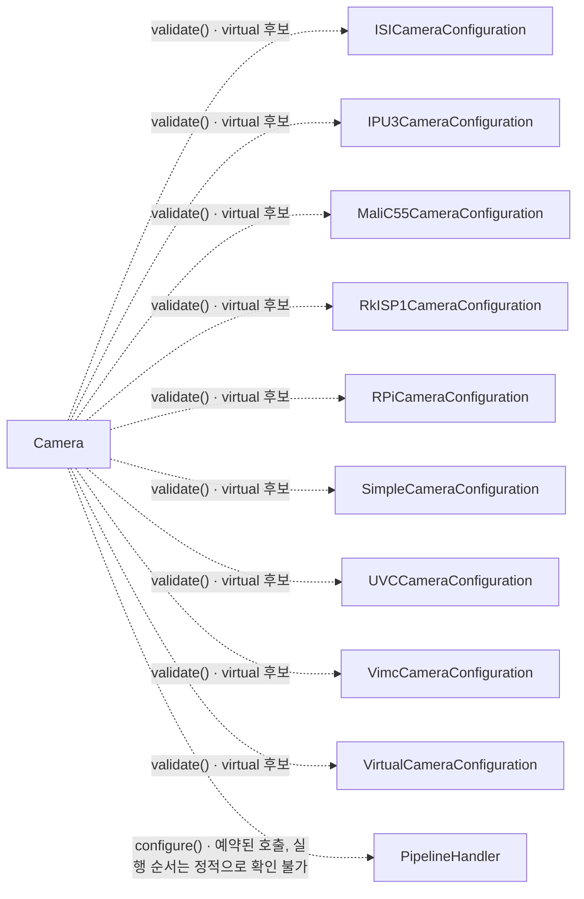

# 스트림 구성

**캡처 전에 유효한 스트림 구성을 적용하고 실패 조건과 연결된 Stream을 확인하세요.**

| 지금 확인할 내용 | 이동할 절 |
|---|---|
| <a id="이-흐름에서-확인할-것"></a>캡처 전에 유효한 스트림 구성을 적용하고 실패 조건과 연결된 Stream을 확인하세요. | [캡처 전에 준비할 스트림 구성](#캡처-전에-준비할-스트림-구성) |

## 캡처 전에 준비할 스트림 구성

`Camera::configure()`는 캡처를 시작하기 전에 캡처에 참여할 스트림 묶음과 각 스트림의 구성을 고르는 함수입니다. 호출자는 `config`에 참여시킬 스트림과 구성을 채워 지정하며, 이 구성은 `generateConfiguration()`으로 만들고 호출자가 `CameraConfiguration::validate()`로 조정합니다. 이 함수는 완전히 유효한 구성만 받아들입니다. `src/libcamera/camera.cpp:1163`

`configure()`를 호출하기 전에 호출자는 `acquire()`를 호출해 카메라의 배타 접근을 확보해야 합니다. 이 함수는 카메라가 Acquired 또는 Configured 상태일 때만 호출할 수 있으며, 호출자는 카메라 상태를 바꾸는 다른 함수와 이 호출을 동기화해야 합니다. 배타 접근을 확보하지 않으면 `-EACCES` 오류가 반환되고, 카메라가 구성할 수 있는 상태가 아니어도 `-EACCES`가 반환됩니다. 카메라가 시스템에서 연결 해제된 경우 `configure()`는 `-ENODEV`를 반환합니다. `src/libcamera/camera.cpp:1163`

근거 원문: [src/libcamera/camera.cpp:1163](#source-72be07b9f03d4034)

## 구성 적용과 성공 상태를 확인할 위치

`Camera::configure()`는 먼저 `d->isAccessAllowed(Private::CameraAcquired, Private::CameraConfigured)`의 반환값이 0보다 작으면 그 값을 그대로 반환합니다. 이어서 `for` 루프에서 모든 `cfg.setStream(nullptr)`를 호출해 이전 `Stream` 연결을 비웁니다. 그다음 `config->validate()`가 `CameraConfiguration::Valid`가 아니면 `LOG(Camera, Error)`로 "Can't configure camera with invalid configuration"을 출력하고 `-EINVAL`을 반환합니다. 따라서 검증에 실패해도 `Stream` 연결 비우기는 이미 끝난 뒤입니다. `src/libcamera/camera.cpp:1191`

`Camera::configure()`는 검증을 통과하면 `d->pipe_->invokeMethod(&PipelineHandler::configure, ConnectionTypeBlocking, this, config)`로 파이프라인 핸들러의 `configure`를 호출합니다. 호출 결과 `ret`이 0이 아니면 `return ret;`으로 그 값을 그대로 반환하며, 이 경우 이후의 `Stream` 연결 갱신 코드는 실행되지 않습니다. `src/libcamera/camera.cpp:1191`

`invokeMethod`가 0을 반환한 뒤 루프의 `cfg.stream()`이 `nullptr`인 항목이 있으면 `LOG(Camera, Fatal)`로 "Pipeline handler failed to update stream configuration"을 출력하는 경로에 들어갑니다. API 문서는 반환 시 `config`의 `StreamConfiguration` 항목이 `StreamConfiguration::stream()`으로 조회되는 `Stream`과 연결된다고 설명하며, 코드는 이 연결이 빠진 항목을 Fatal 경로로 검사합니다. 문서상 Fatal은 메시지 출력 뒤 실행을 중단하므로 `d->activeStreams_.clear()`와 `return -EINVAL;`은 실행되지 않으며, 검사 순서상 앞선 항목은 이미 `configuration_` 저장과 `activeStreams_` 삽입이 끝난 상태입니다. `src/libcamera/camera.cpp:1191`, `src/libcamera/base/log.cpp:1022`, `src/libcamera/camera.cpp:1183`

`invokeMethod`가 0을 반환하고 각 항목의 `cfg.stream()`이 모두 `nullptr`이 아니면, 루프 전에 `d->activeStreams_.clear()`로 목록을 비운 뒤 각 항목마다 `stream->configuration_ = cfg;`를 저장하고 `d->activeStreams_.insert(stream);`을 호출합니다. 루프가 끝나면 `d->setState(Private::CameraConfigured);`로 상태를 `CameraConfigured`로 바꾸고 `return 0;`으로 성공을 반환합니다. `src/libcamera/camera.cpp:1191`

근거 원문: [src/libcamera/camera.cpp:1191](#source-603af0dd7fa357d0) · [src/libcamera/base/log.cpp:1022](#source-47a6ef3943a7b53c) · [src/libcamera/camera.cpp:1183](#source-5296d50aed1a3be0)

??? note "설계 질문과 검증 범위"
    질문별 답변과 근거 연결을 검사했습니다. 의미와 실행 결과는 사람 검토가 필요합니다.
    
    | 설계 질문 | 설명 위치 | 확인 범위 |
    |---|---|---|
    | Camera::configure()의 캡처 전 스트림 구성 목적과 호출자가 config를 채우고 generateConfiguration·validate로 준비하는 일을 설명하세요. 완전히 유효한 구성이 필요하다는 전제는 짧게 쓰고 validate 실패의 코드 분기·반환값은 다음 절에서 설명합니다. acquire로 확보할 배타 접근과 Acquired/Configured 상태, 상태 변경 함수와 호출자의 동기화 의무 및 -EACCES 조건을 관련된 한 문단으로 묶으세요. 연결 해제의 -ENODEV는 한 번만 설명하세요. 오류 목록이나 성공/실패 반환값 요약을 마지막에 다시 나열하지 마세요. 세 문단 이내로 작성하세요. | [캡처 전에 준비할 스트림 구성](#캡처-전에-준비할-스트림-구성) | 코드 근거와 설명 연결 |
    | Camera::configure()가 이전 stream 연결을 비운 뒤 validate()==Valid를 검사하고 유효하지 않으면 -EINVAL을 반환하는 순서를 설명하세요. PipelineHandler::configure를 ConnectionTypeBlocking으로 호출하고 오류면 그대로 반환하는 경로를 설명하세요. 이 호출이 성공한 뒤에도 cfg.stream이 없으면 Fatal 로그 경로에 들어간다는 조건을 구체적으로 서술하세요. API의 Stream 연계 계약과 코드의 성공 뒤 누락 검사를 함께 읽되, 소스가 특정 설계 용어를 명시하는지를 평가하는 문장은 쓰지 마세요. LOG의 문서 계약에 따라 Fatal이 실행을 중단하므로 뒤의 clear/return 코드를 복구 경로로 서술하지 마세요. 모든 stream이 있으면 configuration_·activeStreams_·CameraConfigured를 갱신하고 0을 반환하는 성공 경로를 설명하세요. 네 문단 이내로 작성하세요. ConnectionTypeBlocking은 호출 설명에 한 번만 포함하고 같은 호출 유형을 별도 문장으로 다시 풀이하지 마세요. | [구성 적용과 성공 상태를 확인할 위치](#구성-적용과-성공-상태를-확인할-위치) | 코드 근거와 설명 연결 |

## 소스 근거

같은 발췌는 한 번만 싣습니다. 필요한 원문을 펼쳐 설명과 대조하세요.

<a id="source-72be07b9f03d4034"></a>

??? note "소스 근거: src/libcamera/camera.cpp:1163"
    `src/libcamera/camera.cpp:1163`에서 시작하는 발췌입니다. 종료 줄은 1190이며, 아래 원문을 설명과 대조할 수 있습니다.
    
    SHA-256: `df8c93cd701c8dd65d498d666f63dd166c4470902f254be8a251bf3f6b8f761d`
    
    ```text
    \brief Configure the camera prior to capture
     * \param[in] config The camera configurations to setup
     *
     * Prior to starting capture, the camera must be configured to select a
     * group of streams to be involved in the capture and their configuration.
     * The caller specifies which streams are to be involved and their configuration
     * by populating \a config.
     *
     * The configuration is created by generateConfiguration(), and adjusted by the
     * caller with CameraConfiguration::validate(). This function only accepts fully
     * valid configurations and returns an error if \a config is not valid.
     *
     * Exclusive access to the camera shall be ensured by a call to acquire() prior
     * to calling this function, otherwise an -EACCES error will be returned.
     *
     * \context This function may only be called when the camera is in the Acquired
     * or Configured state as defined in \ref camera_operation, and shall be
     * synchronized by the caller with other functions that affect the camera
     * state.
     *
     * Upon return the StreamConfiguration entries in \a config are associated with
     * Stream instances which can be retrieved with StreamConfiguration::stream().
     *
     * \return 0 on success or a negative error code otherwise
     * \retval -ENODEV The camera has been disconnected from the system
     * \retval -EACCES The camera is not in a state where it can be configured
     * \retval -EINVAL The configuration is not valid
     */
    ```

<a id="source-603af0dd7fa357d0"></a>

??? note "소스 근거: src/libcamera/camera.cpp:1191"
    `src/libcamera/camera.cpp:1191`에서 시작하는 발췌입니다. 종료 줄은 1240이며, 아래 원문을 설명과 대조할 수 있습니다.
    
    SHA-256: `ff6ceda14768503bdfe753d462853457743d5b46a80e0808a97375632403cd36`
    
    ```text
    int Camera::configure(CameraConfiguration *config)
    {
    	Private *const d = _d();
    
    	int ret = d->isAccessAllowed(Private::CameraAcquired,
    				     Private::CameraConfigured);
    	if (ret < 0)
    		return ret;
    
    	for (auto &cfg : *config)
    		cfg.setStream(nullptr);
    
    	if (config->validate() != CameraConfiguration::Valid) {
    		LOG(Camera, Error)
    			<< "Can't configure camera with invalid configuration";
    		return -EINVAL;
    	}
    
    	std::ostringstream msg("configuring streams:", std::ios_base::ate);
    
    	for (unsigned int index = 0; index < config->size(); ++index) {
    		StreamConfiguration &cfg = config->at(index);
    		msg << " (" << index << ") " << cfg.toString();
    	}
    
    	LOG(Camera, Info) << msg.str();
    
    	ret = d->pipe_->invokeMethod(&PipelineHandler::configure,
    				     ConnectionTypeBlocking, this, config);
    	if (ret)
    		return ret;
    
    	d->activeStreams_.clear();
    	for (const StreamConfiguration &cfg : *config) {
    		Stream *stream = cfg.stream();
    		if (!stream) {
    			LOG(Camera, Fatal)
    				<< "Pipeline handler failed to update stream configuration";
    			d->activeStreams_.clear();
    			return -EINVAL;
    		}
    
    		stream->configuration_ = cfg;
    		d->activeStreams_.insert(stream);
    	}
    
    	d->setState(Private::CameraConfigured);
    
    	return 0;
    }
    ```

<a id="source-47a6ef3943a7b53c"></a>

??? note "소스 근거: src/libcamera/base/log.cpp:1022"
    `src/libcamera/base/log.cpp:1022`에서 시작하는 발췌입니다. 종료 줄은 1060이며, 아래 원문을 설명과 대조할 수 있습니다.
    
    SHA-256: `52e64d292f59786541e66fe48f5bae65256bdced60c803aa76bf3637083b47b0`
    
    ```text
    \def LOG(category, severity)
     * \hideinitializer
     * \brief Log a message
     * \param[in] category Category (optional)
     * \param[in] severity Severity
     *
     * Return an std::ostream reference to which a message can be logged using the
     * iostream API. The \a category, if specified, sets the message category. When
     * absent the default category is used. The  \a severity controls whether the
     * message is printed or discarded, depending on the log level for the category.
     *
     * If the severity is set to Fatal, execution is aborted and the program
     * terminates immediately after printing the message.
     *
     * \warning Logging from the destructor of a global object, either directly or
     * indirectly, results in undefined behaviour.
     *
     * \todo Allow logging from destructors of global objects to the largest
     * possible extent
     */
    
    /**
     * \def ASSERT(condition)
     * \hideinitializer
     * \brief Abort program execution if assertion fails
     *
     * If \a condition is false, ASSERT() logs an error message with the Fatal log
     * level and aborts program execution.
     *
     * If the macro NDEBUG is defined before including log.h, ASSERT() generates no
     * code.
     *
     * Using conditions that have side effects with ASSERT() is not recommended, as
     * these effects would depend on whether NDEBUG is defined or not. Similarly,
     * ASSERT() should not be used to check for errors that can occur under normal
     * conditions as those checks would then be removed when compiling with NDEBUG.
     */
    
    } /* namespace libcamera */
    ```

<a id="source-5296d50aed1a3be0"></a>

??? note "소스 근거: src/libcamera/camera.cpp:1183"
    `src/libcamera/camera.cpp:1183`에서 시작하는 발췌입니다. 종료 줄은 1184이며, 아래 원문을 설명과 대조할 수 있습니다.
    
    SHA-256: `7c6d3ef93e52639d7dc41b838e17c708fa6861da3e50c7593d803beb3f7c49d1`
    
    ```text
     * Upon return the StreamConfiguration entries in \a config are associated with
     * Stream instances which can be retrieved with StreamConfiguration::stream().
    ```

## 주요 확인 지점

아래 항목은 추출한 호출에서 고른 코드 탐색 지점입니다. 나열 순서는 실행 순서가 아닙니다.

| 확인할 내용 | 호출 측과 대상 | 구분 | 근거 |
|---|---|---|---|
| 구성 검증 | `Camera` → `ISICameraConfiguration::validate()`<br>`Camera` → `IPU3CameraConfiguration::validate()`<br>`Camera` → `MaliC55CameraConfiguration::validate()`<br>`Camera` → `RkISP1CameraConfiguration::validate()`<br>`Camera` → `RPiCameraConfiguration::validate()`<br>`Camera` → `SimpleCameraConfiguration::validate()`<br>`Camera` → `UVCCameraConfiguration::validate()`<br>`Camera` → `VimcCameraConfiguration::validate()`<br>`Camera` → `VirtualCameraConfiguration::validate()` | 동적 디스패치 후보이며 실제 대상은 확인이 필요합니다. | `src/libcamera/camera.cpp:1203` |
| 파이프라인 구성 대상 | `Camera` → `PipelineHandler::configure()` | 메서드 전달 대상이며 동기·비동기 여부는 호출부에서 확인해야 합니다. | `src/libcamera/camera.cpp:1218` |

## 주요 호출 관계

화살표는 호출 측과 대상을 연결합니다. 시간 순서나 모든 경로의 실행을 뜻하지 않습니다. 점선에는 가상 호출 후보·예약 대상 등 확인이 필요한 관계를 표시합니다.


```mermaid
flowchart LR
  p0["Camera"]
  p1["IPU3CameraConfiguration"]
  p2["ISICameraConfiguration"]
  p3["MaliC55CameraConfiguration"]
  p4["PipelineHandler"]
  p5["RPiCameraConfiguration"]
  p6["RkISP1CameraConfiguration"]
  p7["SimpleCameraConfiguration"]
  p8["UVCCameraConfiguration"]
  p9["VimcCameraConfiguration"]
  p10["VirtualCameraConfiguration"]
  p0 -.->|"validate() · virtual 후보"| p2
  p0 -.->|"validate() · virtual 후보"| p1
  p0 -.->|"validate() · virtual 후보"| p3
  p0 -.->|"validate() · virtual 후보"| p6
  p0 -.->|"validate() · virtual 후보"| p5
  p0 -.->|"validate() · virtual 후보"| p7
  p0 -.->|"validate() · virtual 후보"| p8
  p0 -.->|"validate() · virtual 후보"| p9
  p0 -.->|"validate() · virtual 후보"| p10
  p0 -.->|"configure() · 예약된 호출, 실행 순서는 정적으로 확인 불가"| p4
```

## 추적 범위와 경계

요약의 hide 규칙에 해당하는 호출은 107개입니다. 전체 추적 기록에는 해당 호출도 모두 보존합니다. 기록 번호는 정적 탐색의 식별자이며 실행 순번이 아닙니다.

조건 분기, 반복 횟수와 실제 실행 스레드는 이 호출 목록만으로 확정할 수 없습니다. 가상 호출 후보는 실제 객체에 따라 선택됩니다. 예약 표시는 인자로 전달한 메서드 대상을 뜻하며, 비동기 실행을 보증하지 않습니다. 호출부의 연결 방식과 동기화 계약을 확인해야 합니다.

| 호출 지점 | 후보 또는 예약 대상 | 확인할 경계 | 근거 |
|---|---|---|---|
| `Camera` | `ISICameraConfiguration::validate()`<br>`IPU3CameraConfiguration::validate()`<br>`MaliC55CameraConfiguration::validate()`<br>`RkISP1CameraConfiguration::validate()`<br>`RPiCameraConfiguration::validate()`<br>`SimpleCameraConfiguration::validate()`<br>`UVCCameraConfiguration::validate()`<br>`VimcCameraConfiguration::validate()`<br>`VirtualCameraConfiguration::validate()` | 동적 디스패치 후보이며 실제 대상은 확인이 필요합니다. | `src/libcamera/camera.cpp:1203` |
| `ISICameraConfiguration` | `CameraSensorLegacy::resolution()`<br>`CameraSensorRaw::resolution()` | 동적 디스패치 후보이며 실제 대상은 확인이 필요합니다. | `src/libcamera/pipeline/imx8-isi/imx8-isi.cpp:523` |
| `ISICameraData` | `CameraSensorLegacy::mbusCodes()`<br>`CameraSensorRaw::mbusCodes()` | 동적 디스패치 후보이며 실제 대상은 확인이 필요합니다. | `src/libcamera/pipeline/imx8-isi/imx8-isi.cpp:185` |
| `ISICameraData` | `?::rawFormat()` | 정적 추적 불가 | `src/libcamera/pipeline/imx8-isi/imx8-isi.cpp:237` |
| `ISICameraConfiguration` | `CameraSensorLegacy::sizes()`<br>`CameraSensorRaw::sizes()` | 동적 디스패치 후보이며 실제 대상은 확인이 필요합니다. | `src/libcamera/pipeline/imx8-isi/imx8-isi.cpp:575` |
| `Camera` | `PipelineHandler::configure()` | 메서드 전달 대상이며 동기·비동기 여부는 호출부에서 확인해야 합니다. | `src/libcamera/camera.cpp:1218` |

추출 통계: 미해결 호출 1개, 예약된 호출 1개입니다.

## 전체 추적 기록

아래 구간을 펼치면 요약에서 제외된 호출까지 확인할 수 있습니다. 이 목록은 추출 깊이 안에서 수집한 기록이며, 소스의 모든 실행 경로를 포함한다는 뜻은 아닙니다.

??? note "추적 기록 1–25 / 185개"

    | 기록 | 호출 측 | 대상 | 구분 | 근거 |
    |---|---|---|---|---|
    | 1 | `Camera` | `Camera::_d()` | 정적 호출 지점입니다. | `src/libcamera/camera.cpp:1193` |
    | 2 | `Camera` | `Private::isAccessAllowed()` | 정적 호출 지점입니다. | `src/libcamera/camera.cpp:1195` |
    | 3 | `Private` | `log::isLogSeverityEnabled()` | 정적 호출 지점입니다. | `src/libcamera/camera.cpp:720` |
    | 4 | `Private` | `LogMessageAbortGuard::LogMessageAbortGuard()` | 정적 호출 지점입니다. | `src/libcamera/camera.cpp:720` |
    | 5 | `Private` | `LogMessage::stream()` | 정적 호출 지점입니다. | `src/libcamera/camera.cpp:720` |
    | 6 | `Private` | `log::_log()` | 정적 호출 지점입니다. | `src/libcamera/camera.cpp:720` |
    | 7 | `log` | `LogMessage::LogMessage()` | 정적 호출 지점입니다. | `src/libcamera/base/log.cpp:990` |
    | 8 | `LogMessage` | `utils::basename()` | 정적 호출 지점입니다. | `src/libcamera/base/log.cpp:858` |
    | 9 | `Private` | `log::isLogSeverityEnabled()` | 정적 호출 지점입니다. | `src/libcamera/camera.cpp:723` |
    | 10 | `Private` | `LogMessageAbortGuard::LogMessageAbortGuard()` | 정적 호출 지점입니다. | `src/libcamera/camera.cpp:723` |
    | 11 | `Private` | `LogMessage::stream()` | 정적 호출 지점입니다. | `src/libcamera/camera.cpp:723` |
    | 12 | `Private` | `log::_log()` | 정적 호출 지점입니다. | `src/libcamera/camera.cpp:723` |
    | 13 | `log` | `LogMessage::LogMessage()` | 정적 호출 지점입니다. | `src/libcamera/base/log.cpp:990` |
    | 14 | `LogMessage` | `utils::basename()` | 정적 호출 지점입니다. | `src/libcamera/base/log.cpp:858` |
    | 15 | `Camera` | `StreamConfiguration::setStream()` | 정적 호출 지점입니다. | `src/libcamera/camera.cpp:1201` |
    | 16 | `Camera` | `ISICameraConfiguration::validate()` | 동적 디스패치 후보이며 실제 대상은 확인이 필요합니다. | `src/libcamera/camera.cpp:1203` |
    | 17 | `ISICameraConfiguration` | `CameraSensorLegacy::resolution()` | 동적 디스패치 후보이며 실제 대상은 확인이 필요합니다. | `src/libcamera/pipeline/imx8-isi/imx8-isi.cpp:523` |
    | 18 | `CameraSensorLegacy` | `Size::Size()` | 정적 호출 지점입니다. | `src/libcamera/sensor/camera_sensor_legacy.cpp:715` |
    | 19 | `CameraSensorLegacy` | `Rectangle::size()` | 정적 호출 지점입니다. | `src/libcamera/sensor/camera_sensor_legacy.cpp:715` |
    | 20 | `Rectangle` | `Size::Size()` | 정적 호출 지점입니다. | `include/libcamera/geometry.h:290` |
    | 21 | `ISICameraConfiguration` | `CameraSensorRaw::resolution()` | 동적 디스패치 후보이며 실제 대상은 확인이 필요합니다. | `src/libcamera/pipeline/imx8-isi/imx8-isi.cpp:523` |
    | 22 | `CameraSensorRaw` | `Size::Size()` | 정적 호출 지점입니다. | `src/libcamera/sensor/camera_sensor_raw.cpp:777` |
    | 23 | `CameraSensorRaw` | `Rectangle::size()` | 정적 호출 지점입니다. | `src/libcamera/sensor/camera_sensor_raw.cpp:777` |
    | 24 | `Rectangle` | `Size::Size()` | 정적 호출 지점입니다. | `include/libcamera/geometry.h:290` |
    | 25 | `ISICameraConfiguration` | `PixelFormatInfo::PixelFormatInfo()` | 정적 호출 지점입니다. | `src/libcamera/pipeline/imx8-isi/imx8-isi.cpp:528` |

??? note "추적 기록 26–50 / 185개"

    | 기록 | 호출 측 | 대상 | 구분 | 근거 |
    |---|---|---|---|---|
    | 26 | `ISICameraConfiguration` | `PixelFormatInfo::info()` | 정적 호출 지점입니다. | `src/libcamera/pipeline/imx8-isi/imx8-isi.cpp:528` |
    | 27 | `PixelFormatInfo` | `log::isLogSeverityEnabled()` | 정적 호출 지점입니다. | `src/libcamera/formats.cpp:1006` |
    | 28 | `PixelFormatInfo` | `utils::operator<<()` | 정적 호출 지점입니다. | `src/libcamera/formats.cpp:1006` |
    | 29 | `PixelFormatInfo` | `LogMessageAbortGuard::LogMessageAbortGuard()` | 정적 호출 지점입니다. | `src/libcamera/formats.cpp:1006` |
    | 30 | `PixelFormatInfo` | `LogMessage::stream()` | 정적 호출 지점입니다. | `src/libcamera/formats.cpp:1006` |
    | 31 | `PixelFormatInfo` | `log::_log()` | 정적 호출 지점입니다. | `src/libcamera/formats.cpp:1006` |
    | 32 | `log` | `LogMessage::LogMessage()` | 정적 호출 지점입니다. | `src/libcamera/base/log.cpp:990` |
    | 33 | `PixelFormatInfo` | `utils::hex()` | 정적 호출 지점입니다. | `src/libcamera/formats.cpp:1008` |
    | 34 | `PixelFormatInfo` | `PixelFormat::fourcc()` | 정적 호출 지점입니다. | `src/libcamera/formats.cpp:1008` |
    | 35 | `ISICameraConfiguration` | `ISICameraConfiguration::validateRaw()` | 정적 호출 지점입니다. | `src/libcamera/pipeline/imx8-isi/imx8-isi.cpp:532` |
    | 36 | `ISICameraConfiguration` | `PixelFormat::PixelFormat()` | 정적 호출 지점입니다. | `src/libcamera/pipeline/imx8-isi/imx8-isi.cpp:375` |
    | 37 | `ISICameraConfiguration` | `ISICameraData::getRawMediaBusFormat()` | 정적 호출 지점입니다. | `src/libcamera/pipeline/imx8-isi/imx8-isi.cpp:377` |
    | 38 | `ISICameraData` | `CameraSensorLegacy::mbusCodes()` | 동적 디스패치 후보이며 실제 대상은 확인이 필요합니다. | `src/libcamera/pipeline/imx8-isi/imx8-isi.cpp:185` |
    | 39 | `ISICameraData` | `CameraSensorRaw::mbusCodes()` | 동적 디스패치 후보이며 실제 대상은 확인이 필요합니다. | `src/libcamera/pipeline/imx8-isi/imx8-isi.cpp:185` |
    | 40 | `ISICameraData` | `log::isLogSeverityEnabled()` | 정적 호출 지점입니다. | `src/libcamera/pipeline/imx8-isi/imx8-isi.cpp:216` |
    | 41 | `ISICameraData` | `LogMessageAbortGuard::LogMessageAbortGuard()` | 정적 호출 지점입니다. | `src/libcamera/pipeline/imx8-isi/imx8-isi.cpp:216` |
    | 42 | `ISICameraData` | `LogMessage::stream()` | 정적 호출 지점입니다. | `src/libcamera/pipeline/imx8-isi/imx8-isi.cpp:216` |
    | 43 | `ISICameraData` | `log::_log()` | 정적 호출 지점입니다. | `src/libcamera/pipeline/imx8-isi/imx8-isi.cpp:216` |
    | 44 | `ISICameraData` | `PixelFormat::operator=()` | 정적 호출 지점입니다. | `src/libcamera/pipeline/imx8-isi/imx8-isi.cpp:226` |
    | 45 | `ISICameraData` | `PixelFormat::PixelFormat()` | 정적 호출 지점입니다. | `src/libcamera/pipeline/imx8-isi/imx8-isi.cpp:226` |
    | 46 | `ISICameraData` | `BayerFormat::fromMbusCode()` | 정적 호출 지점입니다. | `src/libcamera/pipeline/imx8-isi/imx8-isi.cpp:230` |
    | 47 | `ISICameraData` | `BayerFormat::isValid()` | 정적 호출 지점입니다. | `src/libcamera/pipeline/imx8-isi/imx8-isi.cpp:231` |
    | 48 | `ISICameraData` | `?::rawFormat()` | 정적 추적 불가 | `src/libcamera/pipeline/imx8-isi/imx8-isi.cpp:237` |
    | 49 | `ISICameraData` | `log::isLogSeverityEnabled()` | 정적 호출 지점입니다. | `src/libcamera/pipeline/imx8-isi/imx8-isi.cpp:241` |
    | 50 | `ISICameraData` | `bayer_format::operator<<()` | 정적 호출 지점입니다. | `src/libcamera/pipeline/imx8-isi/imx8-isi.cpp:241` |

??? note "추적 기록 51–75 / 185개"

    | 기록 | 호출 측 | 대상 | 구분 | 근거 |
    |---|---|---|---|---|
    | 51 | `ISICameraData` | `LogMessageAbortGuard::LogMessageAbortGuard()` | 정적 호출 지점입니다. | `src/libcamera/pipeline/imx8-isi/imx8-isi.cpp:241` |
    | 52 | `ISICameraData` | `LogMessage::stream()` | 정적 호출 지점입니다. | `src/libcamera/pipeline/imx8-isi/imx8-isi.cpp:241` |
    | 53 | `ISICameraData` | `log::_log()` | 정적 호출 지점입니다. | `src/libcamera/pipeline/imx8-isi/imx8-isi.cpp:241` |
    | 54 | `ISICameraData` | `PixelFormat::operator=()` | 정적 호출 지점입니다. | `src/libcamera/pipeline/imx8-isi/imx8-isi.cpp:249` |
    | 55 | `ISICameraData` | `PixelFormat::isValid()` | 정적 호출 지점입니다. | `src/libcamera/pipeline/imx8-isi/imx8-isi.cpp:254` |
    | 56 | `ISICameraData` | `log::isLogSeverityEnabled()` | 정적 호출 지점입니다. | `src/libcamera/pipeline/imx8-isi/imx8-isi.cpp:255` |
    | 57 | `ISICameraData` | `LogMessageAbortGuard::LogMessageAbortGuard()` | 정적 호출 지점입니다. | `src/libcamera/pipeline/imx8-isi/imx8-isi.cpp:255` |
    | 58 | `ISICameraData` | `LogMessage::stream()` | 정적 호출 지점입니다. | `src/libcamera/pipeline/imx8-isi/imx8-isi.cpp:255` |
    | 59 | `ISICameraData` | `log::_log()` | 정적 호출 지점입니다. | `src/libcamera/pipeline/imx8-isi/imx8-isi.cpp:255` |
    | 60 | `ISICameraConfiguration` | `log::isLogSeverityEnabled()` | 정적 호출 지점입니다. | `src/libcamera/pipeline/imx8-isi/imx8-isi.cpp:379` |
    | 61 | `ISICameraConfiguration` | `pixel_format::operator<<()` | 정적 호출 지점입니다. | `src/libcamera/pipeline/imx8-isi/imx8-isi.cpp:379` |
    | 62 | `pixel_format` | `PixelFormat::toString()` | 정적 호출 지점입니다. | `src/libcamera/pixel_format.cpp:151` |
    | 63 | `ISICameraConfiguration` | `LogMessageAbortGuard::LogMessageAbortGuard()` | 정적 호출 지점입니다. | `src/libcamera/pipeline/imx8-isi/imx8-isi.cpp:379` |
    | 64 | `ISICameraConfiguration` | `LogMessage::stream()` | 정적 호출 지점입니다. | `src/libcamera/pipeline/imx8-isi/imx8-isi.cpp:379` |
    | 65 | `ISICameraConfiguration` | `log::_log()` | 정적 호출 지점입니다. | `src/libcamera/pipeline/imx8-isi/imx8-isi.cpp:379` |
    | 66 | `log` | `LogMessage::LogMessage()` | 정적 호출 지점입니다. | `src/libcamera/base/log.cpp:990` |
    | 67 | `ISICameraConfiguration` | `PixelFormat::operator!=()` | 정적 호출 지점입니다. | `src/libcamera/pipeline/imx8-isi/imx8-isi.cpp:384` |
    | 68 | `PixelFormat` | `PixelFormat::operator==()` | 정적 호출 지점입니다. | `include/libcamera/pixel_format.h:30` |
    | 69 | `ISICameraConfiguration` | `log::isLogSeverityEnabled()` | 정적 호출 지점입니다. | `src/libcamera/pipeline/imx8-isi/imx8-isi.cpp:385` |
    | 70 | `ISICameraConfiguration` | `pixel_format::operator<<()` | 정적 호출 지점입니다. | `src/libcamera/pipeline/imx8-isi/imx8-isi.cpp:385` |
    | 71 | `pixel_format` | `PixelFormat::toString()` | 정적 호출 지점입니다. | `src/libcamera/pixel_format.cpp:151` |
    | 72 | `ISICameraConfiguration` | `LogMessageAbortGuard::LogMessageAbortGuard()` | 정적 호출 지점입니다. | `src/libcamera/pipeline/imx8-isi/imx8-isi.cpp:385` |
    | 73 | `ISICameraConfiguration` | `LogMessage::stream()` | 정적 호출 지점입니다. | `src/libcamera/pipeline/imx8-isi/imx8-isi.cpp:385` |
    | 74 | `ISICameraConfiguration` | `log::_log()` | 정적 호출 지점입니다. | `src/libcamera/pipeline/imx8-isi/imx8-isi.cpp:385` |
    | 75 | `log` | `LogMessage::LogMessage()` | 정적 호출 지점입니다. | `src/libcamera/base/log.cpp:990` |

??? note "추적 기록 76–100 / 185개"

    | 기록 | 호출 측 | 대상 | 구분 | 근거 |
    |---|---|---|---|---|
    | 76 | `ISICameraConfiguration` | `PixelFormat::operator=()` | 정적 호출 지점입니다. | `src/libcamera/pipeline/imx8-isi/imx8-isi.cpp:387` |
    | 77 | `ISICameraConfiguration` | `Size::Size()` | 정적 호출 지점입니다. | `src/libcamera/pipeline/imx8-isi/imx8-isi.cpp:392` |
    | 78 | `ISICameraConfiguration` | `Size::boundTo()` | 정적 호출 지점입니다. | `src/libcamera/pipeline/imx8-isi/imx8-isi.cpp:393` |
    | 79 | `ISICameraConfiguration` | `geometry::operator!=()` | 정적 호출 지점입니다. | `src/libcamera/pipeline/imx8-isi/imx8-isi.cpp:394` |
    | 80 | `geometry` | `geometry::operator==()` | 정적 호출 지점입니다. | `include/libcamera/geometry.h:184` |
    | 81 | `ISICameraConfiguration` | `log::isLogSeverityEnabled()` | 정적 호출 지점입니다. | `src/libcamera/pipeline/imx8-isi/imx8-isi.cpp:395` |
    | 82 | `ISICameraConfiguration` | `geometry::operator<<()` | 정적 호출 지점입니다. | `src/libcamera/pipeline/imx8-isi/imx8-isi.cpp:395` |
    | 83 | `ISICameraConfiguration` | `LogMessageAbortGuard::LogMessageAbortGuard()` | 정적 호출 지점입니다. | `src/libcamera/pipeline/imx8-isi/imx8-isi.cpp:395` |
    | 84 | `ISICameraConfiguration` | `LogMessage::stream()` | 정적 호출 지점입니다. | `src/libcamera/pipeline/imx8-isi/imx8-isi.cpp:395` |
    | 85 | `ISICameraConfiguration` | `log::_log()` | 정적 호출 지점입니다. | `src/libcamera/pipeline/imx8-isi/imx8-isi.cpp:395` |
    | 86 | `log` | `LogMessage::LogMessage()` | 정적 호출 지점입니다. | `src/libcamera/base/log.cpp:990` |
    | 87 | `ISICameraConfiguration` | `enumerate_iterator::operator*()` | 정적 호출 지점입니다. | `src/libcamera/pipeline/imx8-isi/imx8-isi.cpp:401` |
    | 88 | `ISICameraConfiguration` | `utils::enumerate()` | 정적 호출 지점입니다. | `src/libcamera/pipeline/imx8-isi/imx8-isi.cpp:401` |
    | 89 | `ISICameraConfiguration` | `log::isLogSeverityEnabled()` | 정적 호출 지점입니다. | `src/libcamera/pipeline/imx8-isi/imx8-isi.cpp:403` |
    | 90 | `ISICameraConfiguration` | `LogMessageAbortGuard::LogMessageAbortGuard()` | 정적 호출 지점입니다. | `src/libcamera/pipeline/imx8-isi/imx8-isi.cpp:403` |
    | 91 | `ISICameraConfiguration` | `LogMessage::stream()` | 정적 호출 지점입니다. | `src/libcamera/pipeline/imx8-isi/imx8-isi.cpp:403` |
    | 92 | `ISICameraConfiguration` | `log::_log()` | 정적 호출 지점입니다. | `src/libcamera/pipeline/imx8-isi/imx8-isi.cpp:403` |
    | 93 | `log` | `LogMessage::LogMessage()` | 정적 호출 지점입니다. | `src/libcamera/base/log.cpp:990` |
    | 94 | `ISICameraConfiguration` | `StreamConfiguration::toString()` | 정적 호출 지점입니다. | `src/libcamera/pipeline/imx8-isi/imx8-isi.cpp:403` |
    | 95 | `StreamConfiguration` | `stream::operator<<()` | 정적 호출 지점입니다. | `src/libcamera/stream.cpp:396` |
    | 96 | `ISICameraConfiguration` | `PixelFormat::PixelFormat()` | 정적 호출 지점입니다. | `src/libcamera/pipeline/imx8-isi/imx8-isi.cpp:404` |
    | 97 | `ISICameraConfiguration` | `Size::Size()` | 정적 호출 지점입니다. | `src/libcamera/pipeline/imx8-isi/imx8-isi.cpp:405` |
    | 98 | `ISICameraConfiguration` | `PixelFormat::operator=()` | 정적 호출 지점입니다. | `src/libcamera/pipeline/imx8-isi/imx8-isi.cpp:407` |
    | 99 | `ISICameraConfiguration` | `Size::operator=()` | 정적 호출 지점입니다. | `src/libcamera/pipeline/imx8-isi/imx8-isi.cpp:408` |
    | 100 | `ISICameraConfiguration` | `PixelFormat::operator!=()` | 정적 호출 지점입니다. | `src/libcamera/pipeline/imx8-isi/imx8-isi.cpp:410` |

??? note "추적 기록 101–125 / 185개"

    | 기록 | 호출 측 | 대상 | 구분 | 근거 |
    |---|---|---|---|---|
    | 101 | `PixelFormat` | `PixelFormat::operator==()` | 정적 호출 지점입니다. | `include/libcamera/pixel_format.h:30` |
    | 102 | `ISICameraConfiguration` | `geometry::operator!=()` | 정적 호출 지점입니다. | `src/libcamera/pipeline/imx8-isi/imx8-isi.cpp:410` |
    | 103 | `geometry` | `geometry::operator==()` | 정적 호출 지점입니다. | `include/libcamera/geometry.h:184` |
    | 104 | `ISICameraConfiguration` | `log::isLogSeverityEnabled()` | 정적 호출 지점입니다. | `src/libcamera/pipeline/imx8-isi/imx8-isi.cpp:411` |
    | 105 | `ISICameraConfiguration` | `LogMessageAbortGuard::LogMessageAbortGuard()` | 정적 호출 지점입니다. | `src/libcamera/pipeline/imx8-isi/imx8-isi.cpp:411` |
    | 106 | `ISICameraConfiguration` | `LogMessage::stream()` | 정적 호출 지점입니다. | `src/libcamera/pipeline/imx8-isi/imx8-isi.cpp:411` |
    | 107 | `ISICameraConfiguration` | `log::_log()` | 정적 호출 지점입니다. | `src/libcamera/pipeline/imx8-isi/imx8-isi.cpp:411` |
    | 108 | `log` | `LogMessage::LogMessage()` | 정적 호출 지점입니다. | `src/libcamera/base/log.cpp:990` |
    | 109 | `ISICameraConfiguration` | `StreamConfiguration::toString()` | 정적 호출 지점입니다. | `src/libcamera/pipeline/imx8-isi/imx8-isi.cpp:412` |
    | 110 | `StreamConfiguration` | `stream::operator<<()` | 정적 호출 지점입니다. | `src/libcamera/stream.cpp:396` |
    | 111 | `ISICameraConfiguration` | `PixelFormatInfo::info()` | 정적 호출 지점입니다. | `src/libcamera/pipeline/imx8-isi/imx8-isi.cpp:416` |
    | 112 | `PixelFormatInfo` | `log::isLogSeverityEnabled()` | 정적 호출 지점입니다. | `src/libcamera/formats.cpp:1006` |
    | 113 | `PixelFormatInfo` | `utils::operator<<()` | 정적 호출 지점입니다. | `src/libcamera/formats.cpp:1006` |
    | 114 | `PixelFormatInfo` | `LogMessageAbortGuard::LogMessageAbortGuard()` | 정적 호출 지점입니다. | `src/libcamera/formats.cpp:1006` |
    | 115 | `PixelFormatInfo` | `LogMessage::stream()` | 정적 호출 지점입니다. | `src/libcamera/formats.cpp:1006` |
    | 116 | `PixelFormatInfo` | `log::_log()` | 정적 호출 지점입니다. | `src/libcamera/formats.cpp:1006` |
    | 117 | `PixelFormatInfo` | `utils::hex()` | 정적 호출 지점입니다. | `src/libcamera/formats.cpp:1008` |
    | 118 | `PixelFormatInfo` | `PixelFormat::fourcc()` | 정적 호출 지점입니다. | `src/libcamera/formats.cpp:1008` |
    | 119 | `ISICameraConfiguration` | `PixelFormatInfo::stride()` | 정적 호출 지점입니다. | `src/libcamera/pipeline/imx8-isi/imx8-isi.cpp:417` |
    | 120 | `PixelFormatInfo` | `PixelFormatInfo::isValid()` | 정적 호출 지점입니다. | `src/libcamera/formats.cpp:1073` |
    | 121 | `PixelFormatInfo` | `log::isLogSeverityEnabled()` | 정적 호출 지점입니다. | `src/libcamera/formats.cpp:1074` |
    | 122 | `PixelFormatInfo` | `LogMessageAbortGuard::LogMessageAbortGuard()` | 정적 호출 지점입니다. | `src/libcamera/formats.cpp:1074` |
    | 123 | `PixelFormatInfo` | `LogMessage::stream()` | 정적 호출 지점입니다. | `src/libcamera/formats.cpp:1074` |
    | 124 | `PixelFormatInfo` | `log::_log()` | 정적 호출 지점입니다. | `src/libcamera/formats.cpp:1074` |
    | 125 | `PixelFormatInfo` | `log::isLogSeverityEnabled()` | 정적 호출 지점입니다. | `src/libcamera/formats.cpp:1079` |

??? note "추적 기록 126–150 / 185개"

    | 기록 | 호출 측 | 대상 | 구분 | 근거 |
    |---|---|---|---|---|
    | 126 | `PixelFormatInfo` | `LogMessageAbortGuard::LogMessageAbortGuard()` | 정적 호출 지점입니다. | `src/libcamera/formats.cpp:1079` |
    | 127 | `PixelFormatInfo` | `LogMessage::stream()` | 정적 호출 지점입니다. | `src/libcamera/formats.cpp:1079` |
    | 128 | `PixelFormatInfo` | `log::_log()` | 정적 호출 지점입니다. | `src/libcamera/formats.cpp:1079` |
    | 129 | `ISICameraConfiguration` | `PixelFormatInfo::frameSize()` | 정적 호출 지점입니다. | `src/libcamera/pipeline/imx8-isi/imx8-isi.cpp:418` |
    | 130 | `ISICameraConfiguration` | `StreamConfiguration::setStream()` | 정적 호출 지점입니다. | `src/libcamera/pipeline/imx8-isi/imx8-isi.cpp:422` |
    | 131 | `ISICameraConfiguration` | `ISICameraConfiguration::validateYuv()` | 정적 호출 지점입니다. | `src/libcamera/pipeline/imx8-isi/imx8-isi.cpp:534` |
    | 132 | `ISICameraConfiguration` | `Size::Size()` | 정적 호출 지점입니다. | `src/libcamera/pipeline/imx8-isi/imx8-isi.cpp:551` |
    | 133 | `ISICameraConfiguration` | `geometry::operator>()` | 정적 호출 지점입니다. | `src/libcamera/pipeline/imx8-isi/imx8-isi.cpp:553` |
    | 134 | `ISICameraConfiguration` | `Size::operator=()` | 정적 호출 지점입니다. | `src/libcamera/pipeline/imx8-isi/imx8-isi.cpp:554` |
    | 135 | `ISICameraConfiguration` | `PixelFormat::PixelFormat()` | 정적 호출 지점입니다. | `src/libcamera/pipeline/imx8-isi/imx8-isi.cpp:557` |
    | 136 | `ISICameraConfiguration` | `ISICameraData::getMediaBusFormat()` | 정적 호출 지점입니다. | `src/libcamera/pipeline/imx8-isi/imx8-isi.cpp:560` |
    | 137 | `ISICameraConfiguration` | `Size::operator=()` | 정적 호출 지점입니다. | `src/libcamera/pipeline/imx8-isi/imx8-isi.cpp:561` |
    | 138 | `ISICameraConfiguration` | `log::isLogSeverityEnabled()` | 정적 호출 지점입니다. | `src/libcamera/pipeline/imx8-isi/imx8-isi.cpp:563` |
    | 139 | `ISICameraConfiguration` | `v4l2_subdevice::operator<<()` | 정적 호출 지점입니다. | `src/libcamera/pipeline/imx8-isi/imx8-isi.cpp:563` |
    | 140 | `ISICameraConfiguration` | `LogMessageAbortGuard::LogMessageAbortGuard()` | 정적 호출 지점입니다. | `src/libcamera/pipeline/imx8-isi/imx8-isi.cpp:563` |
    | 141 | `ISICameraConfiguration` | `LogMessage::stream()` | 정적 호출 지점입니다. | `src/libcamera/pipeline/imx8-isi/imx8-isi.cpp:563` |
    | 142 | `ISICameraConfiguration` | `log::_log()` | 정적 호출 지점입니다. | `src/libcamera/pipeline/imx8-isi/imx8-isi.cpp:563` |
    | 143 | `ISICameraConfiguration` | `CameraSensorLegacy::sizes()` | 동적 디스패치 후보이며 실제 대상은 확인이 필요합니다. | `src/libcamera/pipeline/imx8-isi/imx8-isi.cpp:575` |
    | 144 | `ISICameraConfiguration` | `CameraSensorRaw::sizes()` | 동적 디스패치 후보이며 실제 대상은 확인이 필요합니다. | `src/libcamera/pipeline/imx8-isi/imx8-isi.cpp:575` |
    | 145 | `ISICameraConfiguration` | `Size::Size()` | 정적 호출 지점입니다. | `src/libcamera/pipeline/imx8-isi/imx8-isi.cpp:576` |
    | 146 | `ISICameraConfiguration` | `Size::operator=()` | 정적 호출 지점입니다. | `src/libcamera/pipeline/imx8-isi/imx8-isi.cpp:588` |
    | 147 | `ISICameraConfiguration` | `Size::isNull()` | 정적 호출 지점입니다. | `src/libcamera/pipeline/imx8-isi/imx8-isi.cpp:596` |
    | 148 | `ISICameraConfiguration` | `log::isLogSeverityEnabled()` | 정적 호출 지점입니다. | `src/libcamera/pipeline/imx8-isi/imx8-isi.cpp:597` |
    | 149 | `ISICameraConfiguration` | `LogMessageAbortGuard::LogMessageAbortGuard()` | 정적 호출 지점입니다. | `src/libcamera/pipeline/imx8-isi/imx8-isi.cpp:597` |
    | 150 | `ISICameraConfiguration` | `LogMessage::stream()` | 정적 호출 지점입니다. | `src/libcamera/pipeline/imx8-isi/imx8-isi.cpp:597` |

??? note "추적 기록 151–175 / 185개"

    | 기록 | 호출 측 | 대상 | 구분 | 근거 |
    |---|---|---|---|---|
    | 151 | `ISICameraConfiguration` | `log::_log()` | 정적 호출 지점입니다. | `src/libcamera/pipeline/imx8-isi/imx8-isi.cpp:597` |
    | 152 | `ISICameraConfiguration` | `Size::operator=()` | 정적 호출 지점입니다. | `src/libcamera/pipeline/imx8-isi/imx8-isi.cpp:602` |
    | 153 | `ISICameraConfiguration` | `log::isLogSeverityEnabled()` | 정적 호출 지점입니다. | `src/libcamera/pipeline/imx8-isi/imx8-isi.cpp:604` |
    | 154 | `ISICameraConfiguration` | `v4l2_subdevice::operator<<()` | 정적 호출 지점입니다. | `src/libcamera/pipeline/imx8-isi/imx8-isi.cpp:604` |
    | 155 | `ISICameraConfiguration` | `LogMessageAbortGuard::LogMessageAbortGuard()` | 정적 호출 지점입니다. | `src/libcamera/pipeline/imx8-isi/imx8-isi.cpp:604` |
    | 156 | `ISICameraConfiguration` | `LogMessage::stream()` | 정적 호출 지점입니다. | `src/libcamera/pipeline/imx8-isi/imx8-isi.cpp:604` |
    | 157 | `ISICameraConfiguration` | `log::_log()` | 정적 호출 지점입니다. | `src/libcamera/pipeline/imx8-isi/imx8-isi.cpp:604` |
    | 158 | `Camera` | `IPU3CameraConfiguration::validate()` | 동적 디스패치 후보이며 실제 대상은 확인이 필요합니다. | `src/libcamera/camera.cpp:1203` |
    | 159 | `Camera` | `MaliC55CameraConfiguration::validate()` | 동적 디스패치 후보이며 실제 대상은 확인이 필요합니다. | `src/libcamera/camera.cpp:1203` |
    | 160 | `Camera` | `RkISP1CameraConfiguration::validate()` | 동적 디스패치 후보이며 실제 대상은 확인이 필요합니다. | `src/libcamera/camera.cpp:1203` |
    | 161 | `Camera` | `RPiCameraConfiguration::validate()` | 동적 디스패치 후보이며 실제 대상은 확인이 필요합니다. | `src/libcamera/camera.cpp:1203` |
    | 162 | `Camera` | `SimpleCameraConfiguration::validate()` | 동적 디스패치 후보이며 실제 대상은 확인이 필요합니다. | `src/libcamera/camera.cpp:1203` |
    | 163 | `Camera` | `UVCCameraConfiguration::validate()` | 동적 디스패치 후보이며 실제 대상은 확인이 필요합니다. | `src/libcamera/camera.cpp:1203` |
    | 164 | `Camera` | `VimcCameraConfiguration::validate()` | 동적 디스패치 후보이며 실제 대상은 확인이 필요합니다. | `src/libcamera/camera.cpp:1203` |
    | 165 | `Camera` | `VirtualCameraConfiguration::validate()` | 동적 디스패치 후보이며 실제 대상은 확인이 필요합니다. | `src/libcamera/camera.cpp:1203` |
    | 166 | `Camera` | `log::isLogSeverityEnabled()` | 정적 호출 지점입니다. | `src/libcamera/camera.cpp:1204` |
    | 167 | `Camera` | `LogMessageAbortGuard::LogMessageAbortGuard()` | 정적 호출 지점입니다. | `src/libcamera/camera.cpp:1204` |
    | 168 | `Camera` | `LogMessage::stream()` | 정적 호출 지점입니다. | `src/libcamera/camera.cpp:1204` |
    | 169 | `Camera` | `log::_log()` | 정적 호출 지점입니다. | `src/libcamera/camera.cpp:1204` |
    | 170 | `Camera` | `CameraConfiguration::size()` | 정적 호출 지점입니다. | `src/libcamera/camera.cpp:1211` |
    | 171 | `Camera` | `CameraConfiguration::at()` | 정적 호출 지점입니다. | `src/libcamera/camera.cpp:1212` |
    | 172 | `Camera` | `StreamConfiguration::toString()` | 정적 호출 지점입니다. | `src/libcamera/camera.cpp:1213` |
    | 173 | `Camera` | `log::isLogSeverityEnabled()` | 정적 호출 지점입니다. | `src/libcamera/camera.cpp:1216` |
    | 174 | `Camera` | `LogMessageAbortGuard::LogMessageAbortGuard()` | 정적 호출 지점입니다. | `src/libcamera/camera.cpp:1216` |
    | 175 | `Camera` | `LogMessage::stream()` | 정적 호출 지점입니다. | `src/libcamera/camera.cpp:1216` |

??? note "추적 기록 176–185 / 185개"

    | 기록 | 호출 측 | 대상 | 구분 | 근거 |
    |---|---|---|---|---|
    | 176 | `Camera` | `log::_log()` | 정적 호출 지점입니다. | `src/libcamera/camera.cpp:1216` |
    | 177 | `Camera` | `Object::invokeMethod()` | 정적 호출 지점입니다. | `src/libcamera/camera.cpp:1218` |
    | 178 | `Camera` | `PipelineHandler::configure()` | 메서드 전달 대상이며 동기·비동기 여부는 호출부에서 확인해야 합니다. | `src/libcamera/camera.cpp:1218` |
    | 179 | `Camera` | `StreamConfiguration::stream()` | 정적 호출 지점입니다. | `src/libcamera/camera.cpp:1225` |
    | 180 | `Camera` | `log::isLogSeverityEnabled()` | 정적 호출 지점입니다. | `src/libcamera/camera.cpp:1227` |
    | 181 | `Camera` | `LogMessageAbortGuard::LogMessageAbortGuard()` | 정적 호출 지점입니다. | `src/libcamera/camera.cpp:1227` |
    | 182 | `Camera` | `LogMessage::stream()` | 정적 호출 지점입니다. | `src/libcamera/camera.cpp:1227` |
    | 183 | `Camera` | `log::_log()` | 정적 호출 지점입니다. | `src/libcamera/camera.cpp:1227` |
    | 184 | `Camera` | `StreamConfiguration::operator=()` | 정적 호출 지점입니다. | `src/libcamera/camera.cpp:1233` |
    | 185 | `Camera` | `Private::setState()` | 정적 호출 지점입니다. | `src/libcamera/camera.cpp:1237` |

??? note "근거와 검토 정보"
    - 생성 방식: 추출 사실과 LLM 설명
    - 검증 범위: 표·그림은 facts로 만들고 설명은 LLM이 작성합니다. 인용·문장 및 설정된 구조 검사를 적용합니다.
    - 근거 파일: `include/libcamera/geometry.h`, `include/libcamera/pixel_format.h`, `src/libcamera/base/log.cpp`, `src/libcamera/camera.cpp`, `src/libcamera/formats.cpp`, `src/libcamera/pipeline/imx8-isi/imx8-isi.cpp`, `src/libcamera/pixel_format.cpp`, `src/libcamera/sensor/camera_sensor_legacy.cpp`, `src/libcamera/sensor/camera_sensor_raw.cpp`, `src/libcamera/stream.cpp`
    - 근거 수준: 코드 확인 (정적 분석, simple_compdb 구성, commit `212c689fcf`)
    - 자동 검사 (인용·문장 및 설정된 구조 검사): 통과
    - 검토 상태 기록일: 2026-10-31 · 사람 검토 전

다음 단계: [캡처 시작](camera_start.md)
