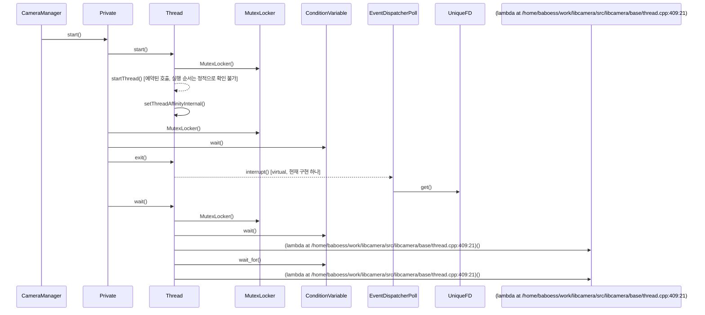

# 카메라 탐색 (CameraManager::start)

**`CameraManager::start()` 에서 시작하는 호출 순서를 아래 번호대로 따라가세요.**

## 호출 순서

1. `CameraManager` 가 `Private::start()` 를 호출합니다. `src/libcamera/camera_manager.cpp:342`
2. `Private` 가 `Thread::start()` 를 호출합니다. `src/libcamera/camera_manager.cpp:51`
3. `Thread` 가 `MutexLocker::MutexLocker()` 를 호출합니다. `src/libcamera/base/thread.cpp:255`
4. `Thread` 가 `Thread::startThread()` 를 호출합니다. (예약된 호출, 실행 순서는 정적으로 확인 불가) `src/libcamera/base/thread.cpp:264`
5. `Thread` 가 `Thread::setThreadAffinityInternal()` 를 호출합니다. `src/libcamera/base/thread.cpp:266`
6. `Private` 가 `MutexLocker::MutexLocker()` 를 호출합니다. `src/libcamera/camera_manager.cpp:54`
7. `Private` 가 `ConditionVariable::wait()` 를 호출합니다. `src/libcamera/camera_manager.cpp:55`
8. `Private` 가 `Thread::exit()` 를 호출합니다. `src/libcamera/camera_manager.cpp:63`
9. `Thread` 가 `EventDispatcherPoll::interrupt()` 를 호출합니다. (virtual, 현재 구현 하나) `src/libcamera/base/thread.cpp:386`
10. `EventDispatcherPoll` 가 `UniqueFD::get()` 를 호출합니다. `src/libcamera/base/event_dispatcher_poll.cpp:177`
11. `Private` 가 `Thread::wait()` 를 호출합니다. `src/libcamera/camera_manager.cpp:64`
12. `Thread` 가 `MutexLocker::MutexLocker()` 를 호출합니다. `src/libcamera/base/thread.cpp:407`
13. `Thread` 가 `ConditionVariable::wait()` 를 호출합니다. `src/libcamera/base/thread.cpp:414`
14. `Thread` 가 `(lambda at /home/baboess/work/libcamera/src/libcamera/base/thread.cpp:409:21)::(lambda at /home/baboess/work/libcamera/src/libcamera/base/thread.cpp:409:21)()` 를 호출합니다. `src/libcamera/base/thread.cpp:414`
15. `Thread` 가 `ConditionVariable::wait_for()` 를 호출합니다. `src/libcamera/base/thread.cpp:416`
16. `Thread` 가 `(lambda at /home/baboess/work/libcamera/src/libcamera/base/thread.cpp:409:21)::(lambda at /home/baboess/work/libcamera/src/libcamera/base/thread.cpp:409:21)()` 를 호출합니다. `src/libcamera/base/thread.cpp:417`

표시에서 뺀 호출이 17 개 있습니다. `config/scenarios.yaml` 의 `hide` 규칙에 걸린 로깅과 접근자 호출이며, `facts.json` 에는 그대로 남아 있습니다.

## 이 흐름에서 확인할 것

`CameraManager::start()` 진입점에서 스레드 생성과 동기화 로직이 순차적으로 실행됩니다 `src/libcamera/camera_manager.cpp:342`. 초기 스레드 시작 시 `Thread::setThreadAffinityInternal()` 를 호출하여 CPU 아핀리티를 설정합니다 `src/libcamera/base/thread.cpp:266` 이후 `Private` 클래스가 다시 `MutexLocker` 와 `ConditionVariable` 을 사용하여 대기 상태를 관리하며 `src/libcamera/camera_manager.cpp:54`. 스레드 내부에서 `Thread::wait()` 가 호출될 때 `ConditionVariable::wait_for()` 를 통해 신호를 기다립니다 `src/libcamera/base/thread.cpp:416`.

분기점은 `EventDispatcherPoll::interrupt()` 를 통한 가상 메서드 호출로 발생하며 `src/libcamera/base/thread.cpp:386` 에서 `UniqueFD::get()` 을 거쳐 외부 이벤트 소스를 확인합니다 `src/libcamera/base/event_dispatcher_poll.cpp:177`. 스레드 종료 시 `Thread::exit()` 가 호출되어 `EventDispatcherPoll` 를 중단시키지만, 실제 실행 순서는 정적 분석으로 확인되지 않습니다. 설계 의도에 따른 콜백 전달과 스레드 동기화 메커니즘은 현재 사실 목록에 명확한 근거가 부족합니다.

확인 필요: 메서드를 인자로 넘겨 예약한 호출이 1 개 있습니다. 위에서 `예약된 호출, 실행 순서는 정적으로 확인 불가` 로 표시한 단계가 그 자리입니다. 대상 메서드는 확인했지만, 실제 실행 시점과 스레드는 큐나 신호 구현이 정하므로 이 번호 목록은 그 지점 이후의 순서를 보장하지 않습니다. 이후 흐름은 예약을 받는 쪽의 구현에서 직접 확인해야 합니다.

??? note "근거와 검토 정보"
    - 근거 파일: `src/libcamera/base/event_dispatcher_poll.cpp`, `src/libcamera/base/thread.cpp`, `src/libcamera/camera_manager.cpp`
    - 근거 수준: 코드 확인 (정적 분석, simple_compdb 구성, commit `279d355ef8`)
    - 자동 검사 (인용·문장 및 설정된 구조 검사): 통과
    - 검토: 2026-09-24 · ollama/qwen3.5:4b · 사람 검토 전

다음 단계: [스트림 구성 (Camera::configure)](configure.md)
