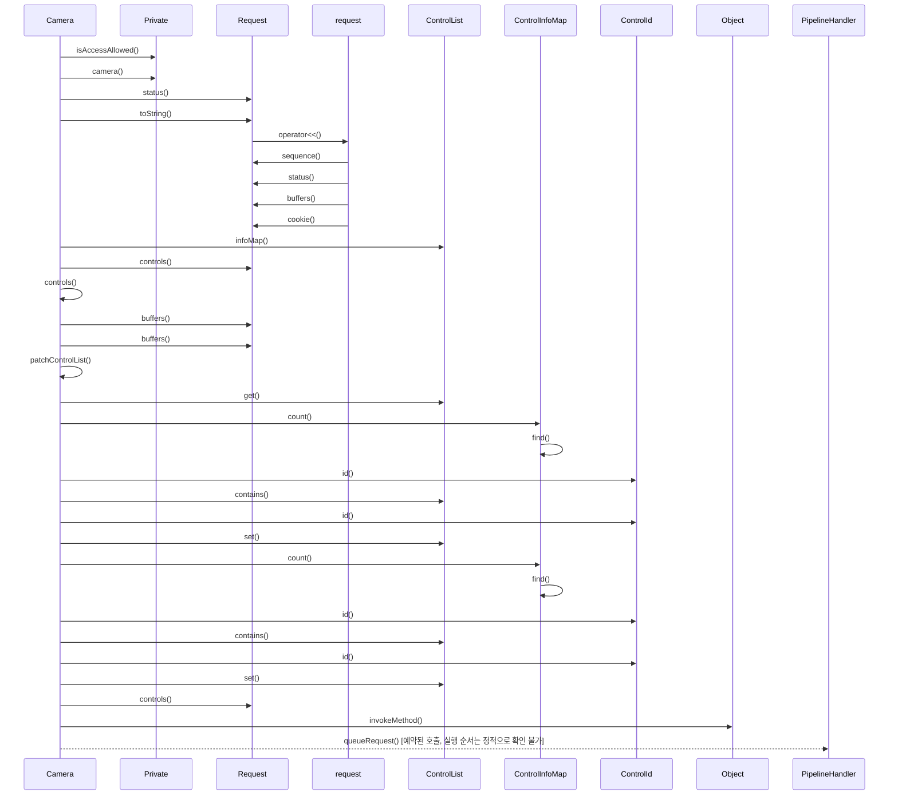

# 요청 제출 (Camera::queueRequest)

**`Camera::queueRequest(Request *)` 에서 시작하는 호출 순서를 아래 번호대로 따라가세요.**

## 호출 순서

1. `Camera` 가 `Private::isAccessAllowed()` 를 호출합니다. `src/libcamera/camera.cpp:1334`
2. `Camera` 가 `Private::camera()` 를 호출합니다. `src/libcamera/camera.cpp:1339`
3. `Camera` 가 `Request::status()` 를 호출합니다. `src/libcamera/camera.cpp:1344`
4. `Camera` 가 `Request::toString()` 를 호출합니다. `src/libcamera/camera.cpp:1345`
5. `Request` 가 `request::operator<<()` 를 호출합니다. `src/libcamera/request.cpp:592`
6. `request` 가 `Request::sequence()` 를 호출합니다. `src/libcamera/request.cpp:609`
7. `request` 가 `Request::status()` 를 호출합니다. `src/libcamera/request.cpp:609`
8. `request` 가 `Request::buffers()` 를 호출합니다. `src/libcamera/request.cpp:610`
9. `request` 가 `Request::cookie()` 를 호출합니다. `src/libcamera/request.cpp:611`
10. `Camera` 가 `ControlList::infoMap()` 를 호출합니다. `src/libcamera/camera.cpp:1350`
11. `Camera` 가 `Request::controls()` 를 호출합니다. `src/libcamera/camera.cpp:1350`
12. `Camera` 가 `Camera::controls()` 를 호출합니다. `src/libcamera/camera.cpp:1350`
13. `Camera` 가 `Request::buffers()` 를 호출합니다. `src/libcamera/camera.cpp:1361`
14. `Camera` 가 `Camera::patchControlList()` 를 호출합니다. `src/libcamera/camera.cpp:1374`
15. `Camera` 가 `ControlList::get()` 를 호출합니다. `src/libcamera/camera.cpp:1289`
16. `Camera` 가 `ControlInfoMap::count()` 를 호출합니다. `src/libcamera/camera.cpp:1291`
17. `ControlInfoMap` 가 `ControlInfoMap::find()` 를 호출합니다. `src/libcamera/controls.cpp:864`
18. `Camera` 가 `ControlId::id()` 를 호출합니다. `src/libcamera/camera.cpp:1291`
19. `Camera` 가 `ControlList::contains()` 를 호출합니다. `src/libcamera/camera.cpp:1292`
20. `Camera` 가 `ControlId::id()` 를 호출합니다. `src/libcamera/camera.cpp:1292`
21. `Camera` 가 `ControlList::set()` 를 호출합니다. `src/libcamera/camera.cpp:1293`
22. `Camera` 가 `ControlInfoMap::count()` 를 호출합니다. `src/libcamera/camera.cpp:1298`
23. `ControlInfoMap` 가 `ControlInfoMap::find()` 를 호출합니다. `src/libcamera/controls.cpp:864`
24. `Camera` 가 `ControlId::id()` 를 호출합니다. `src/libcamera/camera.cpp:1298`
25. `Camera` 가 `ControlList::contains()` 를 호출합니다. `src/libcamera/camera.cpp:1299`
26. `Camera` 가 `ControlId::id()` 를 호출합니다. `src/libcamera/camera.cpp:1299`
27. `Camera` 가 `ControlList::set()` 를 호출합니다. `src/libcamera/camera.cpp:1300`
28. `Camera` 가 `Request::controls()` 를 호출합니다. `src/libcamera/camera.cpp:1374`
29. `Camera` 가 `Object::invokeMethod()` 를 호출합니다. `src/libcamera/camera.cpp:1376`
30. `Camera` 가 `PipelineHandler::queueRequest()` 를 호출합니다. (예약된 호출, 실행 순서는 정적으로 확인 불가) `src/libcamera/camera.cpp:1376`

표시에서 뺀 호출이 49 개 있습니다. `config/scenarios.yaml` 의 `hide` 규칙에 걸린 로깅과 접근자 호출이며, `facts.json` 에는 그대로 남아 있습니다.

## 이 흐름에서 확인할 것

`Camera::queueRequest()` 호출은 먼저 `Private::isAccessAllowed()` 를 검증한 후, 요청 상태와 제어 정보를 수집하며 `PipelineHandler::queueRequest()` 로 전달됩니다 `src/libcamera/camera.cpp:1334`~`src/libcamera/camera.cpp:1376`. 각 단계는 구체적인 파일과 줄을 확인하여 호출 경로를 추적할 수 있습니다.

분기는 요청 정보 출력 시 발생하며, 정적 추적이 끊기는 지점은 `PipelineHandler::queueRequest()` 의 예약된 호출로 인해 실행 순서를 확인할 수 없습니다 `src/libcamera/camera.cpp:1376`. 추가적인 스레드 동기화나 콜백 전달 메커니즘에 대한 근거는 현재 사실 목록에서 확인되지 않았습니다.

확인 필요: 메서드를 인자로 넘겨 예약한 호출이 1 개 있습니다. 위에서 `예약된 호출, 실행 순서는 정적으로 확인 불가` 로 표시한 단계가 그 자리입니다. 대상 메서드는 확인했지만, 실제 실행 시점과 스레드는 큐나 신호 구현이 정하므로 이 번호 목록은 그 지점 이후의 순서를 보장하지 않습니다. 이후 흐름은 예약을 받는 쪽의 구현에서 직접 확인해야 합니다.

??? note "근거와 검토 정보"
    - 근거 파일: `src/libcamera/camera.cpp`, `src/libcamera/controls.cpp`, `src/libcamera/request.cpp`
    - 근거 수준: 코드 확인 (정적 분석, simple_compdb 구성, commit `279d355ef8`)
    - 자동 검사 (인용·문장 및 설정된 구조 검사): 통과
    - 검토: 2026-09-24 · ollama/qwen3.5:4b · 사람 검토 전

다음 단계: [요청 완료 통지 (PipelineHandler::completeRequest)](complete_request.md)
